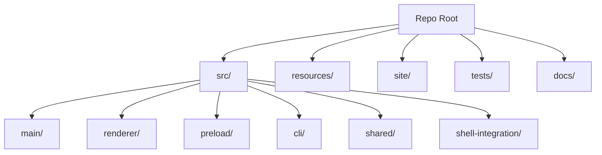

<!-- PAGE_ID: pandamux_01_overview -->
<details>
<summary>Relevant source files</summary>

The following files were used as evidence for this page:

- [README.md:1-8](https://github.com/BoardPandas/Pandamux/blob/0ab9e6463a9017a7b8ea98f10b3f847507658ac4/README.md#L1-L8)
- [README.md:20-31](https://github.com/BoardPandas/Pandamux/blob/0ab9e6463a9017a7b8ea98f10b3f847507658ac4/README.md#L20-L31)
- [README.md:162-172](https://github.com/BoardPandas/Pandamux/blob/0ab9e6463a9017a7b8ea98f10b3f847507658ac4/README.md#L162-L172)
- [README.md:401-418](https://github.com/BoardPandas/Pandamux/blob/0ab9e6463a9017a7b8ea98f10b3f847507658ac4/README.md#L401-L418)
- [package.json:1-23](https://github.com/BoardPandas/Pandamux/blob/0ab9e6463a9017a7b8ea98f10b3f847507658ac4/package.json#L1-L23)
- [package.json:24-41](https://github.com/BoardPandas/Pandamux/blob/0ab9e6463a9017a7b8ea98f10b3f847507658ac4/package.json#L24-L41)
- [package.json:42-60](https://github.com/BoardPandas/Pandamux/blob/0ab9e6463a9017a7b8ea98f10b3f847507658ac4/package.json#L42-L60)
- [CLAUDE.md:1-11](https://github.com/BoardPandas/Pandamux/blob/0ab9e6463a9017a7b8ea98f10b3f847507658ac4/CLAUDE.md#L1-L11)
- [CLAUDE.md:44-58](https://github.com/BoardPandas/Pandamux/blob/0ab9e6463a9017a7b8ea98f10b3f847507658ac4/CLAUDE.md#L44-L58)
- [index.ts:79-89](https://github.com/BoardPandas/Pandamux/blob/0ab9e6463a9017a7b8ea98f10b3f847507658ac4/src/main/index.ts#L79-L89)
- [App.tsx:1-26](https://github.com/BoardPandas/Pandamux/blob/0ab9e6463a9017a7b8ea98f10b3f847507658ac4/src/renderer/App.tsx#L1-L26)

</details>

# PandaMUX Everywhere -- Overview

> **Related Pages**: [Getting Started](GETTING_STARTED.md), [Architecture](core/ARCHITECTURE.md)

---

<!-- BEGIN:AUTOGEN pandamux_01_overview_introduction -->
## Introduction

PandaMUX Everywhere is a Windows terminal multiplexer built as a visibility layer for AI coding agents, most notably Claude Code, running in ConPTY-backed panes with a browser panel alongside them ([README.md:1-8](https://github.com/BoardPandas/Pandamux/blob/0ab9e6463a9017a7b8ea98f10b3f847507658ac4/README.md#L1-L8)). The `package.json` manifest names the distributable `pandamux` and describes it as "PandaMUX Everywhere: Windows terminal multiplexer for AI agents", currently at version `0.15.12` and licensed MIT ([package.json:1-23](https://github.com/BoardPandas/Pandamux/blob/0ab9e6463a9017a7b8ea98f10b3f847507658ac4/package.json#L1-L23)).

The current shipping build is Electron plus xterm.js, and its socket protocol lineage traces to [cmux](https://github.com/manaflow-ai/cmux), a macOS multitasking terminal, which keeps the two wire-compatible ([README.md:1-8](https://github.com/BoardPandas/Pandamux/blob/0ab9e6463a9017a7b8ea98f10b3f847507658ac4/README.md#L1-L8)). This means anything the pandamux CLI or a Claude Code hook can do over the named pipe (`\\.\pipe\pandamux`), a cmux-aware tool can also speak.

Sources: [README.md:1-8](https://github.com/BoardPandas/Pandamux/blob/0ab9e6463a9017a7b8ea98f10b3f847507658ac4/README.md#L1-L8), [package.json:1-23](https://github.com/BoardPandas/Pandamux/blob/0ab9e6463a9017a7b8ea98f10b3f847507658ac4/package.json#L1-L23)
<!-- END:AUTOGEN pandamux_01_overview_introduction -->

---

<!-- BEGIN:AUTOGEN pandamux_01_overview_purpose -->
## Purpose and Direction

PandaMUX Everywhere's core purpose is to make parallel Claude Code sessions on Windows observable without changing how Claude Code itself behaves: sidebar activity dots, git branch/dirty state, open ports, and PR status update from shell-integration hooks over the named pipe, and notifications fire when a command finishes or an agent needs attention ([README.md:162-172](https://github.com/BoardPandas/Pandamux/blob/0ab9e6463a9017a7b8ea98f10b3f847507658ac4/README.md#L162-L172)).

The project is mid-transition. This Electron/TypeScript codebase is frozen to bug fixes while a fully native, GPU-rendered Rust rewrite (Iced + alacritty_terminal + portable-pty) is developed under `tasks/plan-repo.md`, and the CDP-driven browser panel documented in this repo is present in the current build but is being retired in that rewrite in favor of Claude Code's own browser tooling ([README.md:20-31](https://github.com/BoardPandas/Pandamux/blob/0ab9e6463a9017a7b8ea98f10b3f847507658ac4/README.md#L20-L31)). `CLAUDE.md` restates the same direction for contributors working in the repo day to day: the Electron app has completed its npm-to-pnpm migration, remains bug-fix-only, and its named-pipe API will stay wire-compatible with the eventual Rust app ([CLAUDE.md:1-11](https://github.com/BoardPandas/Pandamux/blob/0ab9e6463a9017a7b8ea98f10b3f847507658ac4/CLAUDE.md#L1-L11)).

- Passive observation, not control: hooks report activity to the sidebar, they do not intercept or alter Claude Code's own behavior ([README.md:162-172](https://github.com/BoardPandas/Pandamux/blob/0ab9e6463a9017a7b8ea98f10b3f847507658ac4/README.md#L162-L172)).
- Workspaces, splits, tabs, notifications, the orchestrator plugin, shell integration, and the named-pipe API all carry over into the native rewrite ([README.md:20-31](https://github.com/BoardPandas/Pandamux/blob/0ab9e6463a9017a7b8ea98f10b3f847507658ac4/README.md#L20-L31)).
- Only the CDP browser panel is dropped in the rewrite, replaced by Claude Code's own browser tooling ([README.md:20-31](https://github.com/BoardPandas/Pandamux/blob/0ab9e6463a9017a7b8ea98f10b3f847507658ac4/README.md#L20-L31)).

Sources: [README.md:20-31](https://github.com/BoardPandas/Pandamux/blob/0ab9e6463a9017a7b8ea98f10b3f847507658ac4/README.md#L20-L31), [README.md:162-172](https://github.com/BoardPandas/Pandamux/blob/0ab9e6463a9017a7b8ea98f10b3f847507658ac4/README.md#L162-L172), [CLAUDE.md:1-11](https://github.com/BoardPandas/Pandamux/blob/0ab9e6463a9017a7b8ea98f10b3f847507658ac4/CLAUDE.md#L1-L11)
<!-- END:AUTOGEN pandamux_01_overview_purpose -->

---

<!-- BEGIN:AUTOGEN pandamux_01_overview_stack -->
## Technology Stack

PandaMUX Everywhere is a single TypeScript codebase split across an Electron main process and a React renderer, with a pinned pnpm/Node toolchain enforced through `engines` and `packageManager` ([package.json:1-23](https://github.com/BoardPandas/Pandamux/blob/0ab9e6463a9017a7b8ea98f10b3f847507658ac4/package.json#L1-L23)).

| Layer | Technology | Version | Source |
|---|---|---|---|
| Language | TypeScript | `^6.0.3` | ([package.json:42-60](https://github.com/BoardPandas/Pandamux/blob/0ab9e6463a9017a7b8ea98f10b3f847507658ac4/package.json#L42-L60)) |
| Package manager / runtime | pnpm / Node.js | `pnpm@11.10.0`, Node `>=24.18.0` | ([package.json:1-23](https://github.com/BoardPandas/Pandamux/blob/0ab9e6463a9017a7b8ea98f10b3f847507658ac4/package.json#L1-L23)) |
| Desktop shell | Electron | `^43.0.0` | ([package.json:42-60](https://github.com/BoardPandas/Pandamux/blob/0ab9e6463a9017a7b8ea98f10b3f847507658ac4/package.json#L42-L60)) |
| UI framework | React / React DOM | `^19.2.7` | ([package.json:24-41](https://github.com/BoardPandas/Pandamux/blob/0ab9e6463a9017a7b8ea98f10b3f847507658ac4/package.json#L24-L41)) |
| State management | Zustand | `^5.0.14` | ([package.json:24-41](https://github.com/BoardPandas/Pandamux/blob/0ab9e6463a9017a7b8ea98f10b3f847507658ac4/package.json#L24-L41)) |
| Terminal rendering | `@xterm/xterm` + addons (fit, image, search, serialize, unicode11, web-links, webgl) | `^6.0.0` / addon range | ([package.json:24-41](https://github.com/BoardPandas/Pandamux/blob/0ab9e6463a9017a7b8ea98f10b3f847507658ac4/package.json#L24-L41)) |
| PTY backend | node-pty (ConPTY) | `^1.0.0` | ([package.json:24-41](https://github.com/BoardPandas/Pandamux/blob/0ab9e6463a9017a7b8ea98f10b3f847507658ac4/package.json#L24-L41)) |
| Build tool | Vite | `^8.1.3` | ([package.json:42-60](https://github.com/BoardPandas/Pandamux/blob/0ab9e6463a9017a7b8ea98f10b3f847507658ac4/package.json#L42-L60)) |
| Test runner | Vitest | `^4.1.9` | ([package.json:42-60](https://github.com/BoardPandas/Pandamux/blob/0ab9e6463a9017a7b8ea98f10b3f847507658ac4/package.json#L42-L60)) |
| Lint | ESLint | `^10.6.0` | ([package.json:42-60](https://github.com/BoardPandas/Pandamux/blob/0ab9e6463a9017a7b8ea98f10b3f847507658ac4/package.json#L42-L60)) |
| Packaging | electron-builder, rcedit | `^26.15.3`, `^5.0.2` | ([package.json:42-60](https://github.com/BoardPandas/Pandamux/blob/0ab9e6463a9017a7b8ea98f10b3f847507658ac4/package.json#L42-L60)) |
| Auto-update | electron-updater | `^6.8.9` | ([package.json:24-41](https://github.com/BoardPandas/Pandamux/blob/0ab9e6463a9017a7b8ea98f10b3f847507658ac4/package.json#L24-L41)) |

`CLAUDE.md` summarizes the same stack in prose for contributors: "Electron-based Windows terminal multiplexer for AI agents. TypeScript, React 19, Zustand, xterm.js, node-pty" ([CLAUDE.md:1-11](https://github.com/BoardPandas/Pandamux/blob/0ab9e6463a9017a7b8ea98f10b3f847507658ac4/CLAUDE.md#L1-L11)).

Sources: [package.json:1-23](https://github.com/BoardPandas/Pandamux/blob/0ab9e6463a9017a7b8ea98f10b3f847507658ac4/package.json#L1-L23), [package.json:24-41](https://github.com/BoardPandas/Pandamux/blob/0ab9e6463a9017a7b8ea98f10b3f847507658ac4/package.json#L24-L41), [package.json:42-60](https://github.com/BoardPandas/Pandamux/blob/0ab9e6463a9017a7b8ea98f10b3f847507658ac4/package.json#L42-L60), [CLAUDE.md:1-11](https://github.com/BoardPandas/Pandamux/blob/0ab9e6463a9017a7b8ea98f10b3f847507658ac4/CLAUDE.md#L1-L11)
<!-- END:AUTOGEN pandamux_01_overview_stack -->

---

<!-- BEGIN:AUTOGEN pandamux_01_overview_layout -->
## Repository Layout

The repo is organized around the Electron process boundary (`main` vs. `renderer`) with a shared `shared/` package for types both sides import, plus non-code runtime assets under `resources/` ([CLAUDE.md:44-58](https://github.com/BoardPandas/Pandamux/blob/0ab9e6463a9017a7b8ea98f10b3f847507658ac4/CLAUDE.md#L44-L58)). The README's architecture section describes the same split as "Main process manages PTY spawning (node-pty/ConPTY), named pipe server, CDP browser bridge, port scanning, git/PR polling, notifications, Claude Code context injection, session persistence, and multi-window lifecycle. Renderer process runs React/Zustand with xterm.js (WebGL), recursive split pane layout, and the sidebar" ([README.md:401-418](https://github.com/BoardPandas/Pandamux/blob/0ab9e6463a9017a7b8ea98f10b3f847507658ac4/README.md#L401-L418)).

| Directory | Purpose |
|---|---|
| `src/main/` | Electron main process ([CLAUDE.md:44-58](https://github.com/BoardPandas/Pandamux/blob/0ab9e6463a9017a7b8ea98f10b3f847507658ac4/CLAUDE.md#L44-L58)) |
| `src/renderer/` | React UI built with Vite ([CLAUDE.md:44-58](https://github.com/BoardPandas/Pandamux/blob/0ab9e6463a9017a7b8ea98f10b3f847507658ac4/CLAUDE.md#L44-L58)) |
| `src/preload/` | `contextBridge` exposing `window.pandamux` to the renderer ([CLAUDE.md:44-58](https://github.com/BoardPandas/Pandamux/blob/0ab9e6463a9017a7b8ea98f10b3f847507658ac4/CLAUDE.md#L44-L58)) |
| `src/cli/` | The `pandamux` CLI, talks to the named pipe ([CLAUDE.md:44-58](https://github.com/BoardPandas/Pandamux/blob/0ab9e6463a9017a7b8ea98f10b3f847507658ac4/CLAUDE.md#L44-L58)) |
| `src/shared/` | Types shared between main and renderer (IPC channels, branded IDs) ([CLAUDE.md:44-58](https://github.com/BoardPandas/Pandamux/blob/0ab9e6463a9017a7b8ea98f10b3f847507658ac4/CLAUDE.md#L44-L58)) |
| `src/shell-integration/` | PowerShell, CMD, and Bash/Zsh shell hook scripts ([CLAUDE.md:44-58](https://github.com/BoardPandas/Pandamux/blob/0ab9e6463a9017a7b8ea98f10b3f847507658ac4/CLAUDE.md#L44-L58)) |
| `resources/` | Runtime assets: icons, themes, sounds, shell-integration, CLI, the bundled `pandamux-orchestrator` plugin ([CLAUDE.md:44-58](https://github.com/BoardPandas/Pandamux/blob/0ab9e6463a9017a7b8ea98f10b3f847507658ac4/CLAUDE.md#L44-L58)) |
| `site/` | Landing page, static HTML deployed to Netlify ([CLAUDE.md:44-58](https://github.com/BoardPandas/Pandamux/blob/0ab9e6463a9017a7b8ea98f10b3f847507658ac4/CLAUDE.md#L44-L58)) |
| `tests/` | Unit and e2e tests (Vitest) ([CLAUDE.md:44-58](https://github.com/BoardPandas/Pandamux/blob/0ab9e6463a9017a7b8ea98f10b3f847507658ac4/CLAUDE.md#L44-L58)) |
| `docs/` | Planning and generated documentation ([CLAUDE.md:44-58](https://github.com/BoardPandas/Pandamux/blob/0ab9e6463a9017a7b8ea98f10b3f847507658ac4/CLAUDE.md#L44-L58)) |



Sources: [CLAUDE.md:44-58](https://github.com/BoardPandas/Pandamux/blob/0ab9e6463a9017a7b8ea98f10b3f847507658ac4/CLAUDE.md#L44-L58), [README.md:401-418](https://github.com/BoardPandas/Pandamux/blob/0ab9e6463a9017a7b8ea98f10b3f847507658ac4/README.md#L401-L418)
<!-- END:AUTOGEN pandamux_01_overview_layout -->

---

<!-- BEGIN:AUTOGEN pandamux_01_overview_entry-points -->
## Entry Points

The compiled output ships three runnable entry points, all produced by the `build:main` / `build:renderer` scripts before packaging ([package.json:1-23](https://github.com/BoardPandas/Pandamux/blob/0ab9e6463a9017a7b8ea98f10b3f847507658ac4/package.json#L1-L23)):

| Entry point | Manifest field | Purpose |
|---|---|---|
| Electron main process | `"main": "dist/main/index.js"` | Boots the app; compiled from [src/main/index.ts](https://github.com/BoardPandas/Pandamux/blob/0ab9e6463a9017a7b8ea98f10b3f847507658ac4/src/main/index.ts) ([package.json:1-23](https://github.com/BoardPandas/Pandamux/blob/0ab9e6463a9017a7b8ea98f10b3f847507658ac4/package.json#L1-L23)) |
| `pandamux` CLI | `"bin": { "pandamux": "dist/cli/pandamux.js" }` | Talks to the named pipe from a shell ([package.json:1-23](https://github.com/BoardPandas/Pandamux/blob/0ab9e6463a9017a7b8ea98f10b3f847507658ac4/package.json#L1-L23)) |
| Renderer UI | Loaded by the main-process `BrowserWindow` | React tree rooted at [src/renderer/App.tsx](https://github.com/BoardPandas/Pandamux/blob/0ab9e6463a9017a7b8ea98f10b3f847507658ac4/src/renderer/App.tsx) |

At module load, `src/main/index.ts` constructs the singletons that back the rest of the app: a `WindowManager`, a per-instance pipe token, the `PipeServer` bound to `\\.\pipe\pandamux`, and the `PortScanner`, `GitPoller`, `PrPoller`, and `CDPProxy` pollers/bridges ([index.ts:79-89](https://github.com/BoardPandas/Pandamux/blob/0ab9e6463a9017a7b8ea98f10b3f847507658ac4/src/main/index.ts#L79-L89)):

```typescript
const windowManager = new WindowManager();
// Per-instance secret that authenticates privileged (V2) pipe requests.
// Generated/persisted once per APPDATA dir and injected into spawned shells
// as PANDAMUX_PIPE_TOKEN so the CLI and hooks can authenticate.
const pipeToken = ensurePipeToken();
process.env.PANDAMUX_PIPE_TOKEN = pipeToken;
const pipeServer = new PipeServer(getPipePath(), pipeToken);
const portScanner = new PortScanner();
const gitPoller = new GitPoller();
const prPoller = new PrPoller();
const cdpProxy = new CDPProxy();
```

On the renderer side, `App.tsx` imports the Zustand store, the recursive `SplitContainer`, `Sidebar`, `Titlebar`, keyboard-shortcut hook, settings window, command palette, browser pane, and the pipe bridge that exposes store operations to the main process ([App.tsx:1-26](https://github.com/BoardPandas/Pandamux/blob/0ab9e6463a9017a7b8ea98f10b3f847507658ac4/src/renderer/App.tsx#L1-L26)).

The `scripts` block in `package.json` is the primary developer-facing entry surface (`dev`, `build`, `build:main`, `build:renderer`, `test`, `test:watch`, `lint`), and is covered in full on [Getting Started](GETTING_STARTED.md) ([package.json:1-23](https://github.com/BoardPandas/Pandamux/blob/0ab9e6463a9017a7b8ea98f10b3f847507658ac4/package.json#L1-L23)).

Sources: [package.json:1-23](https://github.com/BoardPandas/Pandamux/blob/0ab9e6463a9017a7b8ea98f10b3f847507658ac4/package.json#L1-L23), [index.ts:79-89](https://github.com/BoardPandas/Pandamux/blob/0ab9e6463a9017a7b8ea98f10b3f847507658ac4/src/main/index.ts#L79-L89), [App.tsx:1-26](https://github.com/BoardPandas/Pandamux/blob/0ab9e6463a9017a7b8ea98f10b3f847507658ac4/src/renderer/App.tsx#L1-L26)
<!-- END:AUTOGEN pandamux_01_overview_entry-points -->

---

<!-- BEGIN:AUTOGEN pandamux_01_overview_navigate -->
## Where to Start

| Goal | Start Here |
|---|---|
| Run it locally | [Getting Started](GETTING_STARTED.md) |
| Understand the process model, IPC, and split-tree design | [Architecture](core/ARCHITECTURE.md) |
| Look up main-process modules (PTY, windows, IPC handlers) | Main Process Modules (`core/MAIN_PROCESS.md`) |
| Look up every `pandamux` CLI command | CLI Reference (`api/CLI_REFERENCE.md`) |
| Understand the named-pipe V1/V2 protocol | Named Pipe Control Plane (`features/NAMED_PIPE_IPC.md`) |
| Ship a release | Release and Packaging (`operations/RELEASE.md`) |

Sources: navigation curated by doc-sync
<!-- END:AUTOGEN pandamux_01_overview_navigate -->

---
