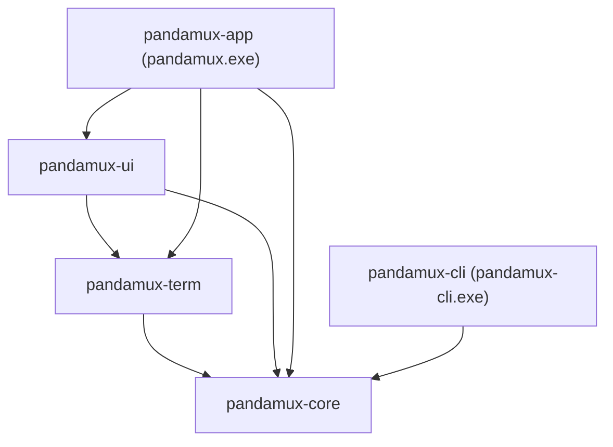

<!-- PAGE_ID: pandamux_01_overview -->
<details>
<summary>Relevant source files</summary>

The following files were used as evidence for this page:

- [README.md:1-8](README.md#L1-L8)
- [README.md:16-22](README.md#L16-L22)
- [README.md:139-155](README.md#L139-L155)
- [CLAUDE.md:1-11](CLAUDE.md#L1-L11)
- [CLAUDE.md:15-27](CLAUDE.md#L15-L27)
- [Cargo.toml:1-23](Cargo.toml#L1-L23)
- [CHANGELOG.md:8-18](CHANGELOG.md#L8-L18)
- [main.rs:1-66](crates/pandamux-app/src/main.rs#L1-L66)
- [main.rs:1-20](crates/pandamux-cli/src/main.rs#L1-L20)
- [lib.rs:1-16](crates/pandamux-core/src/lib.rs#L1-L16)
- [lib.rs:1-9](crates/pandamux-term/src/lib.rs#L1-L9)
- [lib.rs:1-26](crates/pandamux-ui/src/lib.rs#L1-L26)
- [Cargo.toml:1-72](crates/pandamux-app/Cargo.toml#L1-L72)
- [Cargo.toml:1-18](crates/pandamux-term/Cargo.toml#L1-L18)

</details>

# Overview

> **Related Pages**: [Getting Started](GETTING_STARTED.md), [Architecture](core/ARCHITECTURE.md)

---

<!-- BEGIN:AUTOGEN pandamux_01_overview_introduction -->
## Introduction

PandaMUX is a native, GPU-rendered Windows terminal multiplexer built in Rust (Iced + alacritty_terminal + portable-pty + russh), whose named-pipe protocol lineage traces to [cmux](https://github.com/manaflow-ai/cmux) ([README.md:1-8](README.md#L1-L8)). It is built for running many Claude Code (and other CLI) agents in parallel, each in its own visible pane ([README.md:16-22](README.md#L16-L22)).

It passively observes Claude Code without changing how it works: auto-configured hooks report agent and tool activity to a sidebar, so a developer can see at a glance which sessions are working, done, or waiting for input ([README.md:16-22](README.md#L16-L22)). The app has no web view; the terminal grid is GPU-rendered, and the whole app (GUI, CLI, shell integration, and the bundled orchestrator plugin) is coordinated through a single named-pipe API ([README.md:16-22](README.md#L16-L22)). `CLAUDE.md` states the same summary for contributors: "Native Windows terminal multiplexer for AI agents. Rust workspace: Iced (GPU UI) + alacritty_terminal (grid) + portable-pty (local PTY) + russh (remote PTY/SFTP)" ([CLAUDE.md:1-11](CLAUDE.md#L1-L11)).

Sources: [README.md:1-8](README.md#L1-L8), [README.md:16-22](README.md#L16-L22), [CLAUDE.md:1-11](CLAUDE.md#L1-L11)
<!-- END:AUTOGEN pandamux_01_overview_introduction -->

---

<!-- BEGIN:AUTOGEN pandamux_01_overview_purpose -->
## Purpose and History

PandaMUX began as an Electron/TypeScript prototype and was rewritten into a fully native Rust workspace; the Electron build was a never-shipped fork pull and has since been deleted from the repo ([CLAUDE.md:1-11](CLAUDE.md#L1-L11)). The rewrite plan lives in `tasks/plan-repo.md`, and the in-app CDP browser pane from the prototype was intentionally dropped: agents now use Claude Code's own browser tooling instead ([README.md:16-22](README.md#L16-L22)).

- **Phases 1-6** are complete: native terminal engine, the Iced shell, pipe/CLI parity, peripheral UI, and SSH remote surfaces (OSC 52 clipboard + SFTP image paste) ([CLAUDE.md:1-11](CLAUDE.md#L1-L11)).
- **Phase 7** ("ship": signed installer + release CI) is landing now; the `.claude/` folder is the source of truth for how the repo runs commits, changelog updates, knowledge-base checks, and agents ([CLAUDE.md:1-11](CLAUDE.md#L1-L11)).
- The current `[Unreleased]` changelog entries are Phase 7 work in progress: a Settings "Check for updates" button with one-click install, and an update banner shown on launch when a newer signed release is available ([CHANGELOG.md:8-18](CHANGELOG.md#L8-L18)).

Sources: [CLAUDE.md:1-11](CLAUDE.md#L1-L11), [README.md:16-22](README.md#L16-L22), [CHANGELOG.md:8-18](CHANGELOG.md#L8-L18)
<!-- END:AUTOGEN pandamux_01_overview_purpose -->

---

<!-- BEGIN:AUTOGEN pandamux_01_overview_stack -->
## Technology Stack

PandaMUX is a Rust workspace (edition 2024, `rust-version = "1.88"`) split across five crates, with core dependencies pinned to exact versions at the workspace level so the whole tree upgrades deliberately ([Cargo.toml:1-23](Cargo.toml#L1-L23)).

| Layer | Technology | Version | Source |
|---|---|---|---|
| GUI framework | Iced (GPU UI: canvas viewport, cosmic-text/glyphon, wgpu) | `=0.14.0` | ([Cargo.toml:9-11](crates/pandamux-ui/Cargo.toml#L9-L11)) |
| Terminal grid | alacritty_terminal | `=0.26.0` | ([Cargo.toml:9-11](crates/pandamux-term/Cargo.toml#L9-L11)) |
| Local PTY | portable-pty | `=0.9.0` | ([Cargo.toml:9-11](crates/pandamux-term/Cargo.toml#L9-L11)) |
| Remote PTY / SSH | russh (`ring` crypto backend) | `=0.62.2` | ([Cargo.toml:14-16](crates/pandamux-term/Cargo.toml#L14-L16)) |
| Remote SFTP (image paste) | russh-sftp | `=2.3.0` | ([Cargo.toml:17](crates/pandamux-term/Cargo.toml#L17)) |
| Async runtime | tokio (`io-util`, `macros`, `net`, `rt-multi-thread`, `sync`, plus per-crate features) | `=1.52.3` | ([Cargo.toml:22](Cargo.toml#L22)) |
| Serialization | serde / serde_json | `=1.0.228` / `=1.0.150` | ([Cargo.toml:20-21](Cargo.toml#L20-L21)) |
| IDs | uuid (`v4`) | `=1.23.4` | ([Cargo.toml:23](Cargo.toml#L23)) |
| OS clipboard | arboard | `=3.6.1` | ([Cargo.toml:17](crates/pandamux-app/Cargo.toml#L17)) |
| In-app update check (Phase 7) | reqwest (`default-tls`, feature-gated behind `iced-runtime`) | `=0.13.4` | ([Cargo.toml:26-28](crates/pandamux-app/Cargo.toml#L26-L28)) |
| Windows resource embedding | winresource (build-dependency, Windows only) | `=0.1.31` | ([Cargo.toml:42](crates/pandamux-app/Cargo.toml#L42)) |

All native dependencies are pinned with `=x.y.z` exact-version requirements rather than caret ranges, a deliberate convention documented in `CLAUDE.md` so a dependency refresh is always an explicit, reviewed bump ([CLAUDE.md:1-11](CLAUDE.md#L1-L11)).

Sources: [Cargo.toml:1-23](Cargo.toml#L1-L23), [Cargo.toml:1-72](crates/pandamux-app/Cargo.toml#L1-L72), [Cargo.toml:1-18](crates/pandamux-term/Cargo.toml#L1-L18)
<!-- END:AUTOGEN pandamux_01_overview_stack -->

---

<!-- BEGIN:AUTOGEN pandamux_01_overview_layout -->
## Workspace Layout

The Cargo workspace declares five member crates, each with a single, hard-enforced responsibility: `pandamux-core` and `pandamux-term` never import Iced, and `pandamux-ui` is the only crate that does, an invariant CI enforces via `scripts/check-rust-boundaries.ps1` ([Cargo.toml:1-8](Cargo.toml#L1-L8)).

| Crate | Purpose |
|---|---|
| `pandamux-core` | Shared domain types: split tree, session/agent/notification/sidebar/ssh models, keymap, settings, protocol types. Zero Iced dependency ([lib.rs:1-16](crates/pandamux-core/src/lib.rs#L1-L16)). |
| `pandamux-term` | Terminal engine: alacritty_terminal grid, portable-pty local PTY, russh remote PTY + SFTP, clipboard policy, search/link detection, shell lifecycle ([lib.rs:1-9](crates/pandamux-term/src/lib.rs#L1-L9)). |
| `pandamux-ui` | The Iced app: canvas terminal viewport, chrome, panes/splits/tabs, session panel, command palette, settings, theming. The only crate importing Iced ([lib.rs:1-26](crates/pandamux-ui/src/lib.rs#L1-L26)). |
| `pandamux-app` | Binary `pandamux.exe`: composition root + tokio runtime, canonical mutable state, named-pipe server, pollers, persistence, updater ([Cargo.toml:1-15](crates/pandamux-app/Cargo.toml#L1-L15)). |
| `pandamux-cli` | Binary `pandamux-cli.exe`: the `pandamux` CLI, a pipe client wire-compatible with the V2 JSON-RPC protocol ([main.rs:1-20](crates/pandamux-cli/src/main.rs#L1-L20)). |

Non-crate top-level directories referenced from the README's architecture section: `resources/` (runtime assets: themes, sounds, shell-integration, icons, the pandamux-orchestrator plugin), `site/` (the Netlify-deployed landing page), and `tasks/plan-repo.md` (the master rewrite plan) ([README.md:139-155](README.md#L139-L155)).



Sources: [Cargo.toml:1-8](Cargo.toml#L1-L8), [lib.rs:1-16](crates/pandamux-core/src/lib.rs#L1-L16), [lib.rs:1-9](crates/pandamux-term/src/lib.rs#L1-L9), [lib.rs:1-26](crates/pandamux-ui/src/lib.rs#L1-L26), [README.md:139-155](README.md#L139-L155)
<!-- END:AUTOGEN pandamux_01_overview_layout -->

---

<!-- BEGIN:AUTOGEN pandamux_01_overview_binaries -->
## Binaries and Entry Points

The workspace produces two executables. `pandamux-app`'s package declares `[[bin]] name = "pandamux"` so the release artifact is `target/release/pandamux.exe`, while the cargo package itself stays `pandamux-app` (so `-p pandamux-app` invocations and CI smokes are unchanged) ([Cargo.toml:12-14](crates/pandamux-app/Cargo.toml#L12-L14)).

`pandamux.exe`'s `main()` checks command-line flags in a fixed order before falling through to the default GUI path ([main.rs:28-64](crates/pandamux-app/src/main.rs#L28-L64)):

```rust
// Noninteractive CI smoke: build the shell view once and exit. Must be
// checked before the default-GUI launch below.
#[cfg(feature = "iced-runtime")]
if has_flag("--iced-shell-smoke") {
    iced_runtime::run_iced_shell_smoke()?;
    return Ok(());
}
...
// In the GUI build, open the window by DEFAULT. The installed Start Menu
// shortcut runs `pandamux.exe` with no arguments (cargo-packager's NSIS
// config cannot pass shortcut args), so the argument-less path must be the
// GUI, not the headless pipe server. `--iced-shell` is kept for backward
// compatibility; `--headless`/`--pipe-server` forces the standalone server.
#[cfg(feature = "iced-runtime")]
if !has_flag("--headless") && !has_flag("--pipe-server") {
    iced_runtime::run_iced_shell()?;
    return Ok(());
}
```

| Flag / condition | Requires `iced-runtime` | Effect |
|---|---|---|
| (no args, default) | yes | Opens the Iced GUI window ([main.rs:48-57](crates/pandamux-app/src/main.rs#L48-L57)) |
| `--iced-shell` | yes | Same as no args; kept for back-compat ([main.rs:48-57](crates/pandamux-app/src/main.rs#L48-L57)) |
| `--iced-shell-smoke` | yes | Builds the shell view once and exits, for CI ([main.rs:35-39](crates/pandamux-app/src/main.rs#L35-L39)) |
| `--headless` / `--pipe-server` | no (forces it in a GUI build) | Runs only the tokio-backed named-pipe server, no window ([main.rs:53-65](crates/pandamux-app/src/main.rs#L53-L65)) |
| `--ssh-smoke` | no | Opt-in live SSH validation against a real host via `RemoteSessionManager`, never run in CI ([main.rs:41-46](crates/pandamux-app/src/main.rs#L41-L46)) |
| (no `iced-runtime` feature at all) | n/a | Binary is headless by construction: only the pipe server path compiles ([main.rs:59-65](crates/pandamux-app/src/main.rs#L59-L65)) |

Without the `iced-runtime` feature, the headless build binds `\\.\pipe\pandamux` (or `$PANDAMUX_PIPE`) and blocks on a multi-thread tokio runtime running `pipe_server::run` ([main.rs:59-65](crates/pandamux-app/src/main.rs#L59-L65)). The GUI build is compiled with `windows_subsystem = "windows"` so double-clicking the exe never pops a console, while the headless build stays a console app so stdout/stderr keep working for pipe/CLI-style invocations ([main.rs:1-6](crates/pandamux-app/src/main.rs#L1-L6)).

`pandamux-cli.exe` is a plain `#[tokio::main]` binary: it reads `std::env::args()`, dispatches on the first argument (e.g. `ping`, `identify`, `new-workspace`, `split`, `send`), and either sends a V1 text line or a V2 JSON-RPC request over the pipe ([main.rs:1-20](crates/pandamux-cli/src/main.rs#L1-L20)).

Sources: [main.rs:1-66](crates/pandamux-app/src/main.rs#L1-L66), [main.rs:1-20](crates/pandamux-cli/src/main.rs#L1-L20), [Cargo.toml:1-15](crates/pandamux-app/Cargo.toml#L1-L15)
<!-- END:AUTOGEN pandamux_01_overview_binaries -->

---

<!-- BEGIN:AUTOGEN pandamux_01_overview_navigate -->
## Where to Start

| Goal | Start Here |
|---|---|
| Run it locally, build the GUI/CLI, run tests | [Getting Started](GETTING_STARTED.md) |
| Understand the crate-isolation invariant, state ownership, and split tree | [Architecture](core/ARCHITECTURE.md) |
| Look up every `pandamux` CLI command | [CLI Reference](api/CLI_REFERENCE.md) |
| Understand the named-pipe V1/V2 protocol | [Named Pipe IPC](features/NAMED_PIPE_IPC.md) |
| Learn the shell-integration hooks (cwd, git branch, shell state) | [Shell Integration](features/SHELL_INTEGRATION.md) |
| Learn the pandamux-orchestrator plugin | [Agent Orchestration](features/AGENT_ORCHESTRATION.md) |

Sources: navigation curated by doc-sync
<!-- END:AUTOGEN pandamux_01_overview_navigate -->

---
