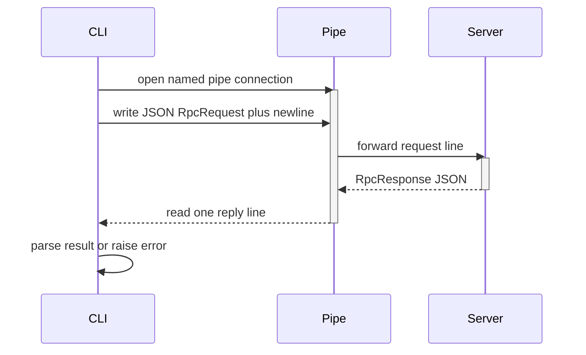

<!-- PAGE_ID: pandamux_09_cli-reference -->
<details>
<summary>Relevant source files</summary>

The following files were used as evidence for this page:

- [main.rs:1-19](crates/pandamux-cli/src/main.rs#L1-L19)
- [main.rs:20-292](crates/pandamux-cli/src/main.rs#L20-L292)
- [main.rs:298-353](crates/pandamux-cli/src/main.rs#L298-L353)
- [main.rs:402-488](crates/pandamux-cli/src/main.rs#L402-L488)
- [main.rs:545-659](crates/pandamux-cli/src/main.rs#L545-L659)
- [main.rs:722-824](crates/pandamux-cli/src/main.rs#L722-L824)
- [main.rs:866-916](crates/pandamux-cli/src/main.rs#L866-L916)
- [main.rs:923-1005](crates/pandamux-cli/src/main.rs#L923-L1005)
- [main.rs:1065-1126](crates/pandamux-cli/src/main.rs#L1065-L1126)
- [protocol.rs:1-49](crates/pandamux-core/src/protocol.rs#L1-L49)

</details>

# CLI Reference

> **Related Pages**: [Named Pipe Control Plane](../features/NAMED_PIPE_IPC.md), [Agent Orchestration](../features/AGENT_ORCHESTRATION.md)

---

<!-- BEGIN:AUTOGEN pandamux_09_cli-reference_overview -->
## Invocation and Transport

The `pandamux-cli` binary is invoked as `pandamux <command> [args...]`; every command opens a fresh client connection to a Windows named pipe, sends either a raw V1 text line or a V2 JSON-RPC request, and reads exactly one reply line before the process exits (main.rs:13-18, main.rs:1065-1107).

The pipe path defaults to `\\.\pipe\pandamux` but is overridable through the `PANDAMUX_PIPE` environment variable, which lets a CLI invocation spawned inside one pandamux instance's pane talk back to that same instance (main.rs:1094-1095). On non-Windows targets `send_line` is stubbed to return an error immediately, since named pipes are Windows-only (main.rs:1104-1107).

| Transport | Function | Wire format | Used by | Source |
|---|---|---|---|---|
| V1 | `send_v1` | Raw text line, response trimmed on read | `ping` only | (main.rs:21-23, main.rs:1065-1068) |
| V2 | `send_v2` | JSON `{method, params, id, token}` request; one JSON reply line, `error` field rejects with the pipe's message | every other command | (main.rs:1070-1088) |

Every V2 request line is authenticated with a token read from `PANDAMUX_PIPE_TOKEN` (trimmed, empty string if unset), attached to the request under the `token` field (main.rs:1109-1113).

```rust
async fn send_v2(method: &str, params: Value) -> Result<Value, Box<dyn Error>> {
    let request = json!({
        "method": method,
        "params": params,
        "id": 1,
        "token": read_pipe_token(),
    });
    let reply = send_line(&(serde_json::to_string(&request)? + "\n")).await?;
    let response: Value = serde_json::from_str(reply.trim())?;
    if let Some(error) = response.get("error") {
        return Err(error
            .get("message")
            .and_then(Value::as_str)
            .unwrap_or("pipe request failed")
            .to_string()
            .into());
    }
    Ok(response.get("result").cloned().unwrap_or(Value::Null))
}
```

(main.rs:1070-1088)

The request/response envelope is defined once in `pandamux-core` and shared by both the CLI client and the pipe server: `RpcRequest { method, params, id, token }` (protocol.rs:4-13), `RpcResponse { result, error, id }` (protocol.rs:15-22), and `RpcError { code, message }` (protocol.rs:24-28). `RpcResponse::result` and `RpcResponse::error` are the two constructors the server side uses to build a reply (protocol.rs:30-48).



Any failure surfaced from `run()` is caught centrally in `main()`, printed as `Error: {error}` to stderr, and the process exits with status 1 (main.rs:5-11). An unrecognized top-level command prints the usage banner and returns an "unknown command" error (main.rs:289-292); `print_usage` (main.rs:1122-1126) is the single source of truth for the full command summary printed with no arguments.

Sources: [main.rs:1-18](crates/pandamux-cli/src/main.rs#L1-L18), [main.rs:289-292](crates/pandamux-cli/src/main.rs#L289-L292), [main.rs:1065-1126](crates/pandamux-cli/src/main.rs#L1065-L1126), [protocol.rs:1-49](crates/pandamux-core/src/protocol.rs#L1-L49)
<!-- END:AUTOGEN pandamux_09_cli-reference_overview -->

---

<!-- BEGIN:AUTOGEN pandamux_09_cli-reference_system-workspace -->
## System and Workspace Commands

System commands query identity, capabilities, and the full pane/surface tree with no arguments; workspace and project commands create and manage the top-level session containers.

| Command | Args | Description | Pipe Method |
|---|---|---|---|
| `ping` | none | Sends the raw V1 text `ping` and prints the trimmed reply verbatim ([main.rs:21-23](crates/pandamux-cli/src/main.rs#L21-L23)) | V1 raw text |
| `identify` | none | ([main.rs:24](crates/pandamux-cli/src/main.rs#L24)) | `system.identify` |
| `capabilities` | none | ([main.rs:25](crates/pandamux-cli/src/main.rs#L25)) | `system.capabilities` |
| `tree` | none | Returns the full workspace/pane/surface tree ([main.rs:26](crates/pandamux-cli/src/main.rs#L26)) | `system.tree` |

| Command | Args | Description | Pipe Method |
|---|---|---|---|
| `new-workspace` | `[--title T] [--shell S]` | Parsed by `workspace_create_params`; both flags optional ([main.rs:298-322](crates/pandamux-cli/src/main.rs#L298-L322)) | `workspace.create` ([main.rs:27-29](crates/pandamux-cli/src/main.rs#L27-L29)) |
| `list-workspaces` | none | ([main.rs:30](crates/pandamux-cli/src/main.rs#L30)) | `workspace.list` |
| `select-workspace` | `<id>` | `id_param` ([main.rs:324-327](crates/pandamux-cli/src/main.rs#L324-L327)) | `workspace.select` ([main.rs:31](crates/pandamux-cli/src/main.rs#L31)) |
| `rename-workspace` | `<id> <title>` | `rename_workspace_params` ([main.rs:329-333](crates/pandamux-cli/src/main.rs#L329-L333)) | `workspace.rename` ([main.rs:32-34](crates/pandamux-cli/src/main.rs#L32-L34)) |
| `close-workspace` | `<id>` | `id_param` | `workspace.close` ([main.rs:35](crates/pandamux-cli/src/main.rs#L35)) |

The `project` subcommand group manages per-workspace project/session state rather than the workspace container itself:

| Command | Args | Description | Pipe Method |
|---|---|---|---|
| `project list` | none | ([main.rs:37](crates/pandamux-cli/src/main.rs#L37)) | `project.list` |
| `project create-local` | `<folder>` | Builds a local session location, shell hardcoded to `pwsh.exe` ([main.rs:38-49](crates/pandamux-cli/src/main.rs#L38-L49)) | `project.create` |
| `project add-session` | `<workspaceId>` | ([main.rs:50-61](crates/pandamux-cli/src/main.rs#L50-L61)) | `project.add_session` |

An unrecognized `project` subcommand returns a usage error listing the three valid forms rather than falling through to the top-level unknown-command handler (main.rs:62-65).

Sources: [main.rs:20-66](crates/pandamux-cli/src/main.rs#L20-L66), [main.rs:298-333](crates/pandamux-cli/src/main.rs#L298-L333)
<!-- END:AUTOGEN pandamux_09_cli-reference_system-workspace -->

---

<!-- BEGIN:AUTOGEN pandamux_09_cli-reference_pane-surface -->
## Pane and Surface Commands

Panes are the split-tree leaves; surfaces are the terminal/markdown/diff content hosted inside a pane. Split and create commands default `direction` to `right` and `type` to `terminal` when the caller omits them (main.rs:443-448, main.rs:483-486).

| Command | Args | Description | Pipe Method |
|---|---|---|---|
| `split` | `[--down] [--type T] [--pane P] [--surface S] [--workspace W]` | `split_params`; `--down` selects `direction: down`, otherwise `right`; `type` defaults `terminal` ([main.rs:402-451](crates/pandamux-cli/src/main.rs#L402-L451)) | `pane.split` ([main.rs:67](crates/pandamux-cli/src/main.rs#L67)) |
| `close-pane` | `<id> [--workspace W]` | `id_with_optional_workspace_param` ([main.rs:335-353](crates/pandamux-cli/src/main.rs#L335-L353)) | `pane.close` ([main.rs:68-70](crates/pandamux-cli/src/main.rs#L68-L70)) |
| `focus-pane` | `<id> [--workspace W]` | Same helper | `pane.focus` ([main.rs:71-73](crates/pandamux-cli/src/main.rs#L71-L73)) |
| `zoom-pane` | `[id] [--pane P] [--workspace W]` | `optional_pane_param`; a bare positional arg is treated as `id` ([main.rs:373-400](crates/pandamux-cli/src/main.rs#L373-L400)) | `pane.zoom` ([main.rs:74](crates/pandamux-cli/src/main.rs#L74)) |
| `list-panes` | `[--workspace W]` | `optional_workspace_param` ([main.rs:355-371](crates/pandamux-cli/src/main.rs#L355-L371)) | `pane.list` ([main.rs:92-94](crates/pandamux-cli/src/main.rs#L92-L94)) |
| `new-surface` | `[--type T] [--pane P] [--workspace W]` | `surface_create_params`; `type` defaults `terminal` ([main.rs:453-488](crates/pandamux-cli/src/main.rs#L453-L488)) | `surface.create` ([main.rs:75-77](crates/pandamux-cli/src/main.rs#L75-L77)) |
| `focus-surface` | `<id> [--workspace W]` | `id_with_optional_workspace_param` | `surface.focus` ([main.rs:78-84](crates/pandamux-cli/src/main.rs#L78-L84)) |
| `close-surface` | `<id> [--workspace W]` | Same helper | `surface.close` ([main.rs:85-91](crates/pandamux-cli/src/main.rs#L85-L91)) |
| `list-surfaces` | `[--workspace W] [--pane P]` | `list_surfaces_params` ([main.rs:490-514](crates/pandamux-cli/src/main.rs#L490-L514)) | `surface.list` ([main.rs:95-97](crates/pandamux-cli/src/main.rs#L95-L97)) |
| `layout grid` | `--count N [--type T] [--anchor-pane P] [--anchor-surface S] [--workspace W]` | `layout_grid_params`; `--count` is required (error otherwise), `type` defaults `terminal` ([main.rs:661-720](crates/pandamux-cli/src/main.rs#L661-L720)) | `layout.grid` ([main.rs:115-117](crates/pandamux-cli/src/main.rs#L115-L117)) |

```bash
pandamux split --down --type markdown
pandamux layout grid --count 4 --type terminal
```

Sources: [main.rs:67-117](crates/pandamux-cli/src/main.rs#L67-L117), [main.rs:335-514](crates/pandamux-cli/src/main.rs#L335-L514), [main.rs:661-720](crates/pandamux-cli/src/main.rs#L661-L720)
<!-- END:AUTOGEN pandamux_09_cli-reference_pane-surface -->

---

<!-- BEGIN:AUTOGEN pandamux_09_cli-reference_io -->
## Terminal I/O and Content Commands

These commands write into or read from a terminal surface's PTY, or push content into a markdown/diff surface. Most accept an optional `--surface`/positional surface id and an optional `--workspace` scope.

| Command | Args | Description | Pipe Method |
|---|---|---|---|
| `send` | `<text...> [--surface S] [--workspace W]` | `send_text_params`; non-flag args are rejoined with spaces into `text` ([main.rs:545-578](crates/pandamux-cli/src/main.rs#L545-L578)) | `surface.send_text` ([main.rs:98](crates/pandamux-cli/src/main.rs#L98)) |
| `send-key` | `<key> [--ctrl] [--shift] [--alt] [--surface S] [--workspace W]` | `send_key_params` ([main.rs:580-625](crates/pandamux-cli/src/main.rs#L580-L625)) | `surface.send_key` ([main.rs:99](crates/pandamux-cli/src/main.rs#L99)) |
| `read-screen` | `[--lines N] [--surface S] [--workspace W]` | `read_screen_params`; `lines` defaults to 50 ([main.rs:627-659](crates/pandamux-cli/src/main.rs#L627-L659)) | `surface.read_text` ([main.rs:100-102](crates/pandamux-cli/src/main.rs#L100-L102)) |
| `trigger-flash` | `[surfaceId] [--surface S] [--workspace W]` | `optional_surface_param` ([main.rs:516-543](crates/pandamux-cli/src/main.rs#L516-L543)) | `surface.trigger_flash` ([main.rs:103-105](crates/pandamux-cli/src/main.rs#L103-L105)) |
| `set-color-scheme` | `<surfaceId> <scheme>` | `color_scheme_params` ([main.rs:900-906](crates/pandamux-cli/src/main.rs#L900-L906)) | `surface.set_color_scheme` ([main.rs:171-173](crates/pandamux-cli/src/main.rs#L171-L173)) |
| `clear-color-scheme` | `<surfaceId>` | `surface_only_param` ([main.rs:908-911](crates/pandamux-cli/src/main.rs#L908-L911)) | `surface.clear_color_scheme` ([main.rs:174-180](crates/pandamux-cli/src/main.rs#L174-L180)) |
| `paste` | `<text...> [--surface S]` | `paste_params` ([main.rs:1007-1028](crates/pandamux-cli/src/main.rs#L1007-L1028)) | `surface.paste` ([main.rs:279](crates/pandamux-cli/src/main.rs#L279)) |
| `paste-image` | `<path> [--surface S]` | `paste_image_params` ([main.rs:1030-1055](crates/pandamux-cli/src/main.rs#L1030-L1055)) | `surface.paste_image` ([main.rs:280-282](crates/pandamux-cli/src/main.rs#L280-L282)) |
| `markdown set` | `<surfaceId> [--file P] [--content T]` | `content_set_params` ([main.rs:866-893](crates/pandamux-cli/src/main.rs#L866-L893)) | `markdown.set_content` ([main.rs:141-152](crates/pandamux-cli/src/main.rs#L141-L152)) |
| `diff set` \| `diff refresh` | `<surfaceId> [--file P] [--content T]` | `content_set_params`; both spellings map to the same request | `diff.refresh` ([main.rs:153-164](crates/pandamux-cli/src/main.rs#L153-L164)) |

`content_set_params` is shared by `markdown set` and `diff set`: it requires a surface id, then reads `--content` inline or reads `--file <path>` from disk client-side, so the pipe server itself never touches the filesystem (main.rs:866-868).

```rust
fn content_set_params(args: &[String]) -> Result<Value, Box<dyn Error>> {
    let id = args.first().ok_or("set requires <surfaceId>")?.clone();
    let mut content: Option<String> = None;
    let mut index = 1;
    while index < args.len() {
        match args[index].as_str() {
            "--content" => {
                content = Some(
                    args.get(index + 1)
                        .ok_or("--content requires a value")?
                        .clone(),
                );
                index += 2;
            }
            "--file" => {
                let path = args.get(index + 1).ok_or("--file requires a value")?;
                content = Some(std::fs::read_to_string(path)?);
                index += 2;
            }
            unknown => return Err(format!("unknown set option: {unknown}").into()),
        }
    }
    let content = content.ok_or("set requires --file <path> or --content <text>")?;
    Ok(json!({ "id": id, "content": content }))
}
```

(main.rs:869-893)

`pandamux browser` is not a real command: the top-level match returns a hard error directing the caller to Claude Code's own browser tooling instead of forwarding anything over the pipe, so no `browser.*` pipe method exists (main.rs:283-288).

Sources: [main.rs:98-105](crates/pandamux-cli/src/main.rs#L98-L105), [main.rs:141-180](crates/pandamux-cli/src/main.rs#L141-L180), [main.rs:279-288](crates/pandamux-cli/src/main.rs#L279-L288), [main.rs:866-916](crates/pandamux-cli/src/main.rs#L866-L916), [main.rs:1007-1055](crates/pandamux-cli/src/main.rs#L1007-L1055)
<!-- END:AUTOGEN pandamux_09_cli-reference_io -->

---

<!-- BEGIN:AUTOGEN pandamux_09_cli-reference_agent-ssh -->
## Agent, SSH, and Peripheral Commands

This group covers spawning and managing agent PTYs, remote SSH surfaces, desktop notifications, sidebar status widgets, clipboard policy, window listing, config, and themes.

**Agent** ([main.rs:118-132](crates/pandamux-cli/src/main.rs#L118-L132)):

| Command | Args | Description | Pipe Method |
|---|---|---|---|
| `agent spawn` | `--cmd C [--label L] [--cwd D] [--pane P]` | `agent_spawn_params`; `--cmd` is required ([main.rs:756-796](crates/pandamux-cli/src/main.rs#L756-L796)) | `agent.spawn` ([main.rs:119-121](crates/pandamux-cli/src/main.rs#L119-L121)) |
| `agent spawn-batch` | `--json '[...]' [--strategy S]` | `agent_batch_params`; `--json` is required ([main.rs:798-824](crates/pandamux-cli/src/main.rs#L798-L824)) | `agent.spawn_batch` ([main.rs:122-124](crates/pandamux-cli/src/main.rs#L122-L124)) |
| `agent status` | `<id>` | `id_param` | `agent.status` ([main.rs:125](crates/pandamux-cli/src/main.rs#L125)) |
| `agent list` | none | | `agent.list` ([main.rs:126](crates/pandamux-cli/src/main.rs#L126)) |
| `agent kill` | `<id>` | `id_param` | `agent.kill` ([main.rs:127](crates/pandamux-cli/src/main.rs#L127)) |

**Notification and sidebar** ([main.rs:106-140](crates/pandamux-cli/src/main.rs#L106-L140)):

| Command | Args | Description | Pipe Method |
|---|---|---|---|
| `notify` | `<message...> [--body B] [--source S]` | `notify_params` ([main.rs:722-754](crates/pandamux-cli/src/main.rs#L722-L754)) | `notification.raise` ([main.rs:106](crates/pandamux-cli/src/main.rs#L106)) |
| `list-notifications` | none | | `notification.list` ([main.rs:107](crates/pandamux-cli/src/main.rs#L107)) |
| `clear-notifications` | `[id]` | `clear_notifications_params` ([main.rs:1057-1063](crates/pandamux-cli/src/main.rs#L1057-L1063)) | `notification.clear` ([main.rs:108-114](crates/pandamux-cli/src/main.rs#L108-L114)) |
| `set-status` | `<key> <value>` | `set_status_params` ([main.rs:826-830](crates/pandamux-cli/src/main.rs#L826-L830)) | `sidebar.set_status` ([main.rs:133-135](crates/pandamux-cli/src/main.rs#L133-L135)) |
| `set-progress` | `<value> [--label L]` | `set_progress_params` ([main.rs:832-855](crates/pandamux-cli/src/main.rs#L832-L855)) | `sidebar.set_progress` ([main.rs:136-138](crates/pandamux-cli/src/main.rs#L136-L138)) |
| `log` | `<level> <message...>` | `log_params` ([main.rs:857-864](crates/pandamux-cli/src/main.rs#L857-L864)) | `sidebar.log` ([main.rs:139](crates/pandamux-cli/src/main.rs#L139)) |
| `sidebar-state` | none | | `sidebar.get_state` ([main.rs:140](crates/pandamux-cli/src/main.rs#L140)) |

**SSH** ([main.rs:219-264](crates/pandamux-cli/src/main.rs#L219-L264)):

| Command | Args | Description | Pipe Method |
|---|---|---|---|
| `ssh connect` | `--host H --user U [--port P] [--auth A] [--key-path P] [--password P] [--passphrase P] [--name N] [--jump J] [--pane P] [--pipe-path P]` | `ssh_connect_params`; `host` and `user` are required ([main.rs:923-959](crates/pandamux-cli/src/main.rs#L923-L959)) | `ssh.connect` ([main.rs:220-222](crates/pandamux-cli/src/main.rs#L220-L222)) |
| `ssh disconnect` | `<surfaceId>` | `ssh_surface_param` ([main.rs:961-964](crates/pandamux-cli/src/main.rs#L961-L964)) | `ssh.disconnect` ([main.rs:223-225](crates/pandamux-cli/src/main.rs#L223-L225)) |
| `ssh list` | none | | `ssh.list` ([main.rs:226](crates/pandamux-cli/src/main.rs#L226)) |
| `ssh profiles` | none | | `ssh.profiles` ([main.rs:227](crates/pandamux-cli/src/main.rs#L227)) |
| `ssh profile-list` | none | | `ssh.profile.list` ([main.rs:228](crates/pandamux-cli/src/main.rs#L228)) |
| `ssh save-profile` | Same flags as `ssh connect` | `ssh_connect_params` | `ssh.save_profile` ([main.rs:229-231](crates/pandamux-cli/src/main.rs#L229-L231)) |
| `ssh import` | `[file]` | Defaults to `~/.ssh/config` via `default_ssh_config_path`, read client-side ([main.rs:966-971](crates/pandamux-cli/src/main.rs#L966-L971)) | `ssh.import_config` ([main.rs:232-237](crates/pandamux-cli/src/main.rs#L232-L237)) |
| `ssh profile-remove` | `<profileId>` | ([main.rs:238-243](crates/pandamux-cli/src/main.rs#L238-L243)) | `ssh.profile.remove` |
| `ssh folder-list` | `<profileId> [path]` | `path` defaults to `/` ([main.rs:244-256](crates/pandamux-cli/src/main.rs#L244-L256)) | `ssh.folder.list` |

**Clipboard, window, config, theme, locale** ([main.rs:165-278](crates/pandamux-cli/src/main.rs#L165-L278)):

| Command | Args | Description | Pipe Method |
|---|---|---|---|
| `clipboard copy` | `<text...>` | Joins remaining args with spaces ([main.rs:266-269](crates/pandamux-cli/src/main.rs#L266-L269)) | `clipboard.copy` |
| `clipboard get` | none | ([main.rs:270](crates/pandamux-cli/src/main.rs#L270)) | `clipboard.get` |
| `clipboard policy` | `[--max-store-bytes N] [--host H] [--allow-load\|--deny-load]` | `clipboard_policy_params` ([main.rs:973-1005](crates/pandamux-cli/src/main.rs#L973-L1005)) | `clipboard.policy` ([main.rs:271-273](crates/pandamux-cli/src/main.rs#L271-L273)) |
| `list-windows` \| `windows` | none | ([main.rs:169](crates/pandamux-cli/src/main.rs#L169)) | `window.list` |
| `focus-window` | `<id>` | `id_param` | `window.focus` ([main.rs:170](crates/pandamux-cli/src/main.rs#L170)) |
| `config show` | none | ([main.rs:182](crates/pandamux-cli/src/main.rs#L182)) | `config.show` |
| `config path` | none | ([main.rs:183](crates/pandamux-cli/src/main.rs#L183)) | `config.path` |
| `config reload` \| `reload-config` | none | ([main.rs:167](crates/pandamux-cli/src/main.rs#L167), [main.rs:184](crates/pandamux-cli/src/main.rs#L184)) | `config.reload` |
| `config import-windows-terminal` | `<file>` | File read client-side via `read_file_arg` ([main.rs:918-921](crates/pandamux-cli/src/main.rs#L918-L921)) | `config.import_windows_terminal` ([main.rs:185-194](crates/pandamux-cli/src/main.rs#L185-L194)) |
| `config import-ghostty` | `<name> <file>` | File read client-side ([main.rs:195-210](crates/pandamux-cli/src/main.rs#L195-L210)) | `config.import_ghostty` |
| `list-themes` \| `themes` | none | ([main.rs:165](crates/pandamux-cli/src/main.rs#L165)) | `theme.list` |
| `select-theme` | `<name>` | `name_param` ([main.rs:895-898](crates/pandamux-cli/src/main.rs#L895-L898)) | `theme.select` ([main.rs:166](crates/pandamux-cli/src/main.rs#L166)) |
| `set-locale` | `<en\|fr\|ar\|ja>` | `locale_param` ([main.rs:913-916](crates/pandamux-cli/src/main.rs#L913-L916)) | `i18n.set_locale` ([main.rs:168](crates/pandamux-cli/src/main.rs#L168)) |

```bash
pandamux agent spawn --cmd "cargo test --workspace" --label build
pandamux ssh connect --host 10.55.88.48 --user chaz --auth agent
pandamux clipboard policy --host galahad --allow-load
```

Sources: [main.rs:106-140](crates/pandamux-cli/src/main.rs#L106-L140), [main.rs:165-278](crates/pandamux-cli/src/main.rs#L165-L278), [main.rs:756-1005](crates/pandamux-cli/src/main.rs#L756-L1005)
<!-- END:AUTOGEN pandamux_09_cli-reference_agent-ssh -->

---
