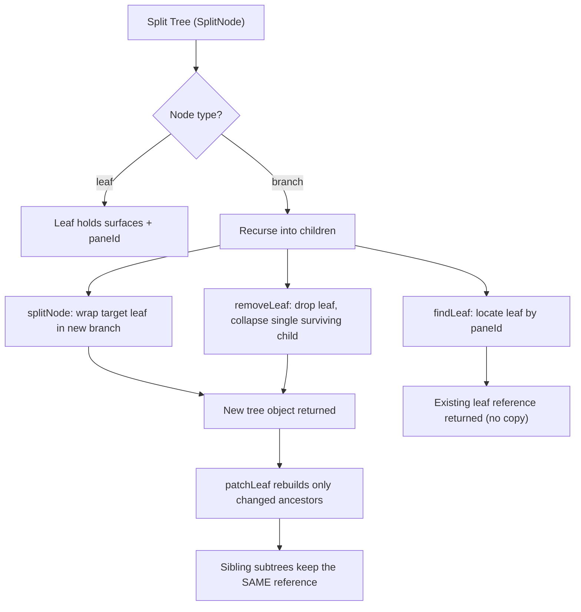

<!-- PAGE_ID: pandamux_05_renderer-and-state -->
<details>
<summary>Relevant source files</summary>

The following files were used as evidence for this page:

- [App.tsx:1-999](https://github.com/BoardPandas/Pandamux/blob/0ab9e6463a9017a7b8ea98f10b3f847507658ac4/src/renderer/App.tsx#L1-L999)
- [index.tsx:1-11](https://github.com/BoardPandas/Pandamux/blob/0ab9e6463a9017a7b8ea98f10b3f847507658ac4/src/renderer/index.tsx#L1-L11)
- [useTerminal.ts:1-913](https://github.com/BoardPandas/Pandamux/blob/0ab9e6463a9017a7b8ea98f10b3f847507658ac4/src/renderer/hooks/useTerminal.ts#L1-L913)
- [useKeyboardShortcuts.ts:1-418](https://github.com/BoardPandas/Pandamux/blob/0ab9e6463a9017a7b8ea98f10b3f847507658ac4/src/renderer/hooks/useKeyboardShortcuts.ts#L1-L418)
- [index.ts:1-18](https://github.com/BoardPandas/Pandamux/blob/0ab9e6463a9017a7b8ea98f10b3f847507658ac4/src/renderer/store/index.ts#L1-L18)
- [workspace-slice.ts:1-150](https://github.com/BoardPandas/Pandamux/blob/0ab9e6463a9017a7b8ea98f10b3f847507658ac4/src/renderer/store/workspace-slice.ts#L1-L150)
- [surface-slice.ts:1-437](https://github.com/BoardPandas/Pandamux/blob/0ab9e6463a9017a7b8ea98f10b3f847507658ac4/src/renderer/store/surface-slice.ts#L1-L437)
- [settings-slice.ts:1-508](https://github.com/BoardPandas/Pandamux/blob/0ab9e6463a9017a7b8ea98f10b3f847507658ac4/src/renderer/store/settings-slice.ts#L1-L508)
- [agent-slice.ts:1-37](https://github.com/BoardPandas/Pandamux/blob/0ab9e6463a9017a7b8ea98f10b3f847507658ac4/src/renderer/store/agent-slice.ts#L1-L37)
- [notification-slice.ts:1-140](https://github.com/BoardPandas/Pandamux/blob/0ab9e6463a9017a7b8ea98f10b3f847507658ac4/src/renderer/store/notification-slice.ts#L1-L140)
- [orchestration-slice.ts:1-18](https://github.com/BoardPandas/Pandamux/blob/0ab9e6463a9017a7b8ea98f10b3f847507658ac4/src/renderer/store/orchestration-slice.ts#L1-L18)
- [pty-teardown.ts:1-43](https://github.com/BoardPandas/Pandamux/blob/0ab9e6463a9017a7b8ea98f10b3f847507658ac4/src/renderer/store/pty-teardown.ts#L1-L43)
- [split-utils.ts:1-279](https://github.com/BoardPandas/Pandamux/blob/0ab9e6463a9017a7b8ea98f10b3f847507658ac4/src/renderer/store/split-utils.ts#L1-L279)
- [split-preview-utils.ts:1-187](https://github.com/BoardPandas/Pandamux/blob/0ab9e6463a9017a7b8ea98f10b3f847507658ac4/src/renderer/store/split-preview-utils.ts#L1-L187)
- [TerminalPane.tsx:1-105](https://github.com/BoardPandas/Pandamux/blob/0ab9e6463a9017a7b8ea98f10b3f847507658ac4/src/renderer/components/Terminal/TerminalPane.tsx#L1-L105)
- [SplitContainer.tsx:1-131](https://github.com/BoardPandas/Pandamux/blob/0ab9e6463a9017a7b8ea98f10b3f847507658ac4/src/renderer/components/SplitPane/SplitContainer.tsx#L1-L131)
- [Sidebar.tsx:1-350](https://github.com/BoardPandas/Pandamux/blob/0ab9e6463a9017a7b8ea98f10b3f847507658ac4/src/renderer/components/Sidebar/Sidebar.tsx#L1-L350)

</details>

# Renderer and State

> **Related Pages**: [Architecture](ARCHITECTURE.md), [Configuration](CONFIGURATION.md)

---

<!-- BEGIN:AUTOGEN pandamux_05_renderer-and-state_app -->
## React Application Shell

The renderer bootstraps a single React 19 tree rooted at `#root` and mounts one always-present `App` component that owns every workspace, pane, and panel for the life of the window.

`index.tsx` is intentionally thin: it wires the notification sound system, imports the global stylesheets, then hands off to `App` inside `React.StrictMode` (double-invoking effects in dev, which is why `useTerminal` and other effects guard against a disposed-then-recreated instance) ([index.tsx:1-11](https://github.com/BoardPandas/Pandamux/blob/0ab9e6463a9017a7b8ea98f10b3f847507658ac4/src/renderer/index.tsx#L1-L11)).

```tsx
import React from 'react';
import { createRoot } from 'react-dom/client';
import App from './App';
import './styles/theme-vars.css';
import './styles/global.css';
import { initNotificationSound } from './notification-sound';

initNotificationSound();

const root = createRoot(document.getElementById('root')!);
root.render(<React.StrictMode><App /></React.StrictMode>);
```

`App.tsx` (999 lines) is the composition root. On mount it restores state in priority order: the rolling auto-save pushed by main every 30 seconds, then the most recent named session, then a fresh default workspace built by `buildDefaultSplitTree()` (a 3-pane layout: two terminals stacked on the left, one on the right) ([App.tsx:330-366](https://github.com/BoardPandas/Pandamux/blob/0ab9e6463a9017a7b8ea98f10b3f847507658ac4/src/renderer/App.tsx#L330-L366)). It then wires seven distinct `window.pandamux` event streams into the Zustand store and local component state: agent spawn events, shell-integration metadata (`cwd`/git/PR/ports/shell-state), Claude Code hook events (auto-opening a diff tab on `Edit`/`Write`), Claude activity parsed from terminal output, and the main-process auto-save request ([App.tsx:409-549](https://github.com/BoardPandas/Pandamux/blob/0ab9e6463a9017a7b8ea98f10b3f847507658ac4/src/renderer/App.tsx#L409-L549)).

Layout is a fixed three-column flex shell: a collapsible `Sidebar`, a middle region that renders every workspace's `SplitContainer` simultaneously (see Keep-Alive Tabs), and an optional right-hand `BrowserPane` panel with a drag-to-resize divider ([App.tsx:791-981](https://github.com/BoardPandas/Pandamux/blob/0ab9e6463a9017a7b8ea98f10b3f847507658ac4/src/renderer/App.tsx#L791-L981)). Surface drag-and-drop between panes is tracked with a payload/preview pair (`surfaceDrag`, `surfaceDragPreview`) whose preview is computed off the animation-frame loop via `buildSurfaceDragPreview` so dragging over many candidate panes doesn't thrash React state on every `mousemove` ([App.tsx:717-742](https://github.com/BoardPandas/Pandamux/blob/0ab9e6463a9017a7b8ea98f10b3f847507658ac4/src/renderer/App.tsx#L717-L742)).

| Top-level element | Rendered when | Source |
|---|---|---|
| `Tutorial` | First launch, unless `workspacePrefs.showWelcomeScreen` is false | ([App.tsx:793](https://github.com/BoardPandas/Pandamux/blob/0ab9e6463a9017a7b8ea98f10b3f847507658ac4/src/renderer/App.tsx#L793)) |
| `SettingsWindow` | `settingsOpen` state true | ([App.tsx:794](https://github.com/BoardPandas/Pandamux/blob/0ab9e6463a9017a7b8ea98f10b3f847507658ac4/src/renderer/App.tsx#L794)) |
| `Titlebar` | Always | ([App.tsx:795-806](https://github.com/BoardPandas/Pandamux/blob/0ab9e6463a9017a7b8ea98f10b3f847507658ac4/src/renderer/App.tsx#L795-L806)) |
| `Sidebar` / expand strip | `sidebarVisible` toggled via Ctrl+B | ([App.tsx:809-855](https://github.com/BoardPandas/Pandamux/blob/0ab9e6463a9017a7b8ea98f10b3f847507658ac4/src/renderer/App.tsx#L809-L855)) |
| `SplitContainer` (one per workspace) | Always, only the active one is visible | ([App.tsx:860-897](https://github.com/BoardPandas/Pandamux/blob/0ab9e6463a9017a7b8ea98f10b3f847507658ac4/src/renderer/App.tsx#L860-L897)) |
| `BrowserPane` (one per workspace) | `browserOpen` state true | ([App.tsx:900-980](https://github.com/BoardPandas/Pandamux/blob/0ab9e6463a9017a7b8ea98f10b3f847507658ac4/src/renderer/App.tsx#L900-L980)) |
| `CommandPalette` | Ctrl+Shift+P | ([App.tsx:983-988](https://github.com/BoardPandas/Pandamux/blob/0ab9e6463a9017a7b8ea98f10b3f847507658ac4/src/renderer/App.tsx#L983-L988)) |
| `ShortcutCheatSheet` | F1 | ([App.tsx:990](https://github.com/BoardPandas/Pandamux/blob/0ab9e6463a9017a7b8ea98f10b3f847507658ac4/src/renderer/App.tsx#L990)) |

Sources: [App.tsx:1-999](https://github.com/BoardPandas/Pandamux/blob/0ab9e6463a9017a7b8ea98f10b3f847507658ac4/src/renderer/App.tsx#L1-L999), [index.tsx:1-11](https://github.com/BoardPandas/Pandamux/blob/0ab9e6463a9017a7b8ea98f10b3f847507658ac4/src/renderer/index.tsx#L1-L11)
<!-- END:AUTOGEN pandamux_05_renderer-and-state_app -->

---

<!-- BEGIN:AUTOGEN pandamux_05_renderer-and-state_components -->
## Component Inventory

Components live under `src/renderer/components/`, one folder per feature area, each with its own CSS file in `src/renderer/styles/` following the `.component-name__part` class convention. The table below groups every `.tsx` file found under `src/renderer/components/**/*.tsx`; folders exercised in detail elsewhere on this page (SplitPane, Terminal) get a one-line role summary from the files actually read, the rest are listed by responsibility inferred from their folder and file name.

| Folder | Files | Role |
|---|---|---|
| `SplitPane/` | `SplitContainer.tsx`, `PaneWrapper.tsx`, `SplitDivider.tsx`, `SplitPreviewOverlay.tsx`, `SurfaceTabBar.tsx`, `icons.tsx` | Recursive binary-tree renderer for the split layout, per-pane tab bar, drag-to-resize dividers, and the ghost overlay shown while dragging a surface to a new pane (see Split Tree Utilities) |
| `Terminal/` | `TerminalPane.tsx`, `FindBar.tsx`, `CopyMode.tsx`, `NotificationRing.tsx` | xterm.js host component, in-pane find UI, keyboard copy-mode overlay, and the flashing ring shown on notification (see Terminal Rendering) |
| `Browser/` | `BrowserPane.tsx`, `AddressBar.tsx` | CDP-driven `<webview>` panel and its URL/navigation bar, one instance kept mounted per workspace |
| `Sidebar/` | `Sidebar.tsx`, `WorkspaceRow.tsx`, `WorkspaceContextMenu.tsx`, `SessionMenu.tsx`, `SessionMenu.tsx`, `SidebarResizeHandle.tsx`, `UnreadBadge.tsx`, `PrStatusIcon.tsx`, `OrchestrationPanel.tsx` | Workspace list with drag-to-reorder, per-workspace right-click menu, save/load session menu, resize handle, and the live orchestration-run panel pushed from `pandamux-orchestrator` |
| `Titlebar/` | `Titlebar.tsx`, `NotificationBell.tsx`, `NotificationPanel.tsx`, `UpdateBadge.tsx` | Window titlebar, notification bell + dropdown panel, and the auto-update availability badge |
| `Settings/` | `SettingsWindow.tsx`, `GeneralSettings.tsx`, `TerminalSettings.tsx`, `KeyboardSettings.tsx`, `NotificationSettings.tsx`, `BrowserSettings.tsx`, `SidebarSettings.tsx`, `WorkspaceSettings.tsx`, `QuickLaunchSettings.tsx`, `ShortcutRecorder.tsx`, `HelpSettings.tsx` | Tabbed settings modal, one panel component per `SettingsSlice` preference group, plus a shortcut-recording input widget |
| `CommandPalette/` | `CommandPalette.tsx` | Ctrl+Shift+P fuzzy command launcher |
| `CheatSheet/` | `ShortcutCheatSheet.tsx` | F1 overlay listing all current keyboard shortcuts |
| `Markdown/` | `MarkdownPane.tsx` | Renders `markdown.set_content` / `markdown.load_file` pipe-server payloads inside a surface |
| `Diff/` | `DiffPane.tsx` | Auto-opened tab showing the working-tree diff after Claude Code `Edit`/`Write` tool calls |
| `Tutorial/` | `Tutorial.tsx` | First-launch welcome walkthrough, gated by `localStorage['pandamux-tutorial-seen']` |

Every workspace's tree is mounted for the life of the app (only the active one is `visibility: visible`), so components under `Terminal/` and `Browser/` never remount on workspace switch; see Keep-Alive Tabs in [Architecture](ARCHITECTURE.md) ([App.tsx:857-897](https://github.com/BoardPandas/Pandamux/blob/0ab9e6463a9017a7b8ea98f10b3f847507658ac4/src/renderer/App.tsx#L857-L897)).

Sources: [App.tsx:857-980](https://github.com/BoardPandas/Pandamux/blob/0ab9e6463a9017a7b8ea98f10b3f847507658ac4/src/renderer/App.tsx#L857-L980), [SplitContainer.tsx:1-131](https://github.com/BoardPandas/Pandamux/blob/0ab9e6463a9017a7b8ea98f10b3f847507658ac4/src/renderer/components/SplitPane/SplitContainer.tsx#L1-L131), [Sidebar.tsx:1-350](https://github.com/BoardPandas/Pandamux/blob/0ab9e6463a9017a7b8ea98f10b3f847507658ac4/src/renderer/components/Sidebar/Sidebar.tsx#L1-L350)
<!-- END:AUTOGEN pandamux_05_renderer-and-state_components -->

---

<!-- BEGIN:AUTOGEN pandamux_05_renderer-and-state_terminal -->
## Terminal Rendering

`TerminalPane.tsx` is a thin presentational wrapper: it delegates almost everything to the `useTerminal` hook and only owns the find-bar/copy-mode overlay state and the global F3/Shift+F3 search-cycle listener ([TerminalPane.tsx:1-105](https://github.com/BoardPandas/Pandamux/blob/0ab9e6463a9017a7b8ea98f10b3f847507658ac4/src/renderer/components/Terminal/TerminalPane.tsx#L1-L105)).

`useTerminal.ts` (913 lines) is where the real xterm.js lifecycle lives. On mount it creates one `Terminal` instance and loads six addons (`FitAddon`, `WebLinksAddon`, `SearchAddon`, `Unicode11Addon`, `ImageAddon`, and `SerializeAddon`), then patches xterm's CSI/OSC handling for PandaMUX-specific behavior: it suppresses xterm's own Primary Device Attributes reply (the main process answers DA1 instead), and registers OSC 9/99/777 handlers so iTerm2-, kitty-, and rxvt-style notifications from in-pane programs surface as PandaMUX notifications ([useTerminal.ts:329-513](https://github.com/BoardPandas/Pandamux/blob/0ab9e6463a9017a7b8ea98f10b3f847507658ac4/src/renderer/hooks/useTerminal.ts#L329-L513)).

| Addon | Purpose |
|---|---|
| `FitAddon` | Measures the DOM container and proposes `cols`/`rows` for the PTY, retried via `requestAnimationFrame` until layout settles ([useTerminal.ts:214-230](https://github.com/BoardPandas/Pandamux/blob/0ab9e6463a9017a7b8ea98f10b3f847507658ac4/src/renderer/hooks/useTerminal.ts#L214-L230)) |
| `WebLinksAddon` | Opens clicked URLs through `openInPandaMUXBrowser`, forcing an external browser on Ctrl/Cmd-click ([useTerminal.ts:331-334](https://github.com/BoardPandas/Pandamux/blob/0ab9e6463a9017a7b8ea98f10b3f847507658ac4/src/renderer/hooks/useTerminal.ts#L331-L334)) |
| `SearchAddon` | Backs the in-pane find bar and F3/Shift+F3 cycling |
| `Unicode11Addon` | Correct cell-width handling for wide/CJK characters |
| `ImageAddon` | Sixel/iTerm2 inline image rendering |
| `SerializeAddon` | Snapshots the normal buffer on unmount so a split-tree remount can replay scrollback instead of losing it (issue #49) ([useTerminal.ts:116-121](https://github.com/BoardPandas/Pandamux/blob/0ab9e6463a9017a7b8ea98f10b3f847507658ac4/src/renderer/hooks/useTerminal.ts#L116-L121)) |

PTY attachment is dual-path: if a PTY already exists for the given `surfaceId` (agent-spawned, or a remount) the hook attaches to it via `pty.has`/`attachToPty`; otherwise it calls `pty.create` with the already-measured `cols`/`rows` so the shell never starts at the 80x24 default and re-flows its prompt ([useTerminal.ts:692-720](https://github.com/BoardPandas/Pandamux/blob/0ab9e6463a9017a7b8ea98f10b3f847507658ac4/src/renderer/hooks/useTerminal.ts#L692-L720)). A capture-phase wheel handler always takes ownership of scrolling: plain shells scroll PandaMUX's own scrollback, while alt-buffer or mouse-tracking programs (tmux, vim, less) get SGR wheel reports or arrow keys forwarded to the PTY, decided by a module-level `surfaceMouseEnabled` map that survives the React remounts a split-tree restructure causes ([useTerminal.ts:177-208](https://github.com/BoardPandas/Pandamux/blob/0ab9e6463a9017a7b8ea98f10b3f847507658ac4/src/renderer/hooks/useTerminal.ts#L177-L208)).

Per-pane color schemes are resolved and merged with the bundled theme on every relevant prefs/prop change:

```typescript
// src/renderer/hooks/useTerminal.ts:85-107
function buildXtermTheme(base: ThemeConfig, override?: UserColorScheme): ITheme {
  const fg = override?.foreground || base.foreground;
  const bg = override?.background || base.background;
  const cursor = override?.cursor || base.cursor || fg;
  const palette = [...base.palette];
  if (override?.palette) {
    for (let i = 0; i < override.palette.length && i < 16; i++) {
      if (override.palette[i]) palette[i] = override.palette[i];
    }
  }
  return {
    background: bg,
    foreground: fg,
    cursor,
    cursorAccent: override?.cursorText || base.cursorText || bg,
    selectionBackground: override?.selectionBackground || base.selectionBackground,
    selectionForeground: override?.selectionForeground || base.selectionForeground,
    black: palette[0], red: palette[1], green: palette[2], yellow: palette[3],
    blue: palette[4], magenta: palette[5], cyan: palette[6], white: palette[7],
    brightBlack: palette[8], brightRed: palette[9], brightGreen: palette[10], brightYellow: palette[11],
    brightBlue: palette[12], brightMagenta: palette[13], brightCyan: palette[14], brightWhite: palette[15],
  };
}
```

The GPU renderer (WebGL preferred, via `attachVisibleRenderer`) is only attached while a terminal is actually visible, and released back to Chromium's WebGL context budget when hidden; hidden keep-alive tabs stay on xterm's default DOM renderer ([useTerminal.ts:876-905](https://github.com/BoardPandas/Pandamux/blob/0ab9e6463a9017a7b8ea98f10b3f847507658ac4/src/renderer/hooks/useTerminal.ts#L876-L905)).

Sources: [TerminalPane.tsx:1-105](https://github.com/BoardPandas/Pandamux/blob/0ab9e6463a9017a7b8ea98f10b3f847507658ac4/src/renderer/components/Terminal/TerminalPane.tsx#L1-L105), [useTerminal.ts:1-913](https://github.com/BoardPandas/Pandamux/blob/0ab9e6463a9017a7b8ea98f10b3f847507658ac4/src/renderer/hooks/useTerminal.ts#L1-L913)
<!-- END:AUTOGEN pandamux_05_renderer-and-state_terminal -->

---

<!-- BEGIN:AUTOGEN pandamux_05_renderer-and-state_shortcuts -->
## Keyboard Shortcuts

`useKeyboardShortcuts` installs a single document-level `keydown` listener that matches the pressed combo against the user's current `shortcuts` map (from `SettingsSlice`) and dispatches through a flat lookup table, replacing what the code comments describe as a previous 35-case `switch` ([useKeyboardShortcuts.ts:129-354](https://github.com/BoardPandas/Pandamux/blob/0ab9e6463a9017a7b8ea98f10b3f847507658ac4/src/renderer/hooks/useKeyboardShortcuts.ts#L129-L354)).

Before matching, `isSafeToIntercept` decides whether a combo should ever reach the app instead of the focused terminal: any non-Ctrl combo, any Ctrl+Shift/Ctrl+Alt combo, `Ctrl+PageUp/PageDown`, `Ctrl+F2`, `Ctrl+F12`, `Ctrl+=/-/0`, and a fixed whitelist (`SAFE_CTRL_KEYS = {b, d, n, t, w, f, ,}`) are interceptable; every other bare-Ctrl key falls through to the terminal so shell shortcuts like Ctrl+R keep working ([useKeyboardShortcuts.ts:27-51](https://github.com/BoardPandas/Pandamux/blob/0ab9e6463a9017a7b8ea98f10b3f847507658ac4/src/renderer/hooks/useKeyboardShortcuts.ts#L27-L51)).

```typescript
// src/renderer/hooks/useKeyboardShortcuts.ts:281-333 (excerpt)
const handlers: Partial<Record<ShortcutAction, () => void>> = {
  newWorkspace: () => createWorkspace(),
  splitRight: () => doSplit('terminal', 'horizontal'),
  splitDown: () => doSplit('terminal', 'vertical'),
  toggleZoom: () => onToggleZoom?.(),
  focusLeft: () => doFocus('left'),
  closeSurfaceOrPane: closeFocusedSurfaceOrPane,
  jumpToUnread,
  broadcastInput: () => useStore.getState().toggleBroadcastInput(),
  resizePaneLeft: () => doResize('horizontal', -0.05),
  toggleShortcutCheatSheet: () => fire('pandamux:toggle-cheatsheet'),
  // ...45 total actions
};
```

Spatial pane focus (`focusLeft/Right/Up/Down`) is computed geometrically: `computePaneRects` walks the split tree once to produce fractional `{x, y, w, h}` rectangles for every pane, then `findAdjacentPane` filters candidates on the correct side of the current pane's center and picks the closest by Euclidean center-to-center distance ([useKeyboardShortcuts.ts:63-125](https://github.com/BoardPandas/Pandamux/blob/0ab9e6463a9017a7b8ea98f10b3f847507658ac4/src/renderer/hooks/useKeyboardShortcuts.ts#L63-L125)). Two further effects outside the main dispatch table handle digit shortcuts directly: `Ctrl+1`-`Ctrl+9` selects a workspace by index, and `Ctrl+Alt+1`-`Ctrl+Alt+9` selects a tab within the focused pane ([useKeyboardShortcuts.ts:381-418](https://github.com/BoardPandas/Pandamux/blob/0ab9e6463a9017a7b8ea98f10b3f847507658ac4/src/renderer/hooks/useKeyboardShortcuts.ts#L381-L418)).

| Category | Example actions | Notes |
|---|---|---|
| Workspace | `newWorkspace`, `closeWorkspace`, `nextWorkspace`/`prevWorkspace`, `togglePinWorkspace` | `cycleWorkspace` wraps around the workspace list ([useKeyboardShortcuts.ts:183-188](https://github.com/BoardPandas/Pandamux/blob/0ab9e6463a9017a7b8ea98f10b3f847507658ac4/src/renderer/hooks/useKeyboardShortcuts.ts#L183-L188)) |
| Split / focus | `splitRight`, `splitDown`, `splitBrowserRight`, `focusLeft/Right/Up/Down` | All go through `split-utils.ts` (`splitNode`, `adjustPaneRatio`) |
| Surface (tab) | `newSurface`, `nextSurface`/`prevSurface`, `closeSurfaceOrPane`, `reopenClosedSurface` | `reopenClosedSurface` pops the module-level closed-surface undo stack in `surface-slice.ts` |
| Font / clipboard | `fontSizeIncrease/Decrease/Reset`, `copy`, `paste` | `paste` dispatches a `pandamux:paste-terminal` DOM event consumed by the focused `useTerminal` instance rather than reading the clipboard directly (avoids garbled non-UTF-8 Windows formats) ([useKeyboardShortcuts.ts:230-241](https://github.com/BoardPandas/Pandamux/blob/0ab9e6463a9017a7b8ea98f10b3f847507658ac4/src/renderer/hooks/useKeyboardShortcuts.ts#L230-L241)) |
| Issue #64 additions | `broadcastInput`, `resizePaneLeft/Right/Up/Down`, `markWorkspaceRead`, `toggleShortcutCheatSheet` | Keyboard-driven pane resize and tmux-style synchronize-panes input broadcast |

Sources: [useKeyboardShortcuts.ts:1-418](https://github.com/BoardPandas/Pandamux/blob/0ab9e6463a9017a7b8ea98f10b3f847507658ac4/src/renderer/hooks/useKeyboardShortcuts.ts#L1-L418)
<!-- END:AUTOGEN pandamux_05_renderer-and-state_shortcuts -->

---

<!-- BEGIN:AUTOGEN pandamux_05_renderer-and-state_store -->
## Zustand Store

The store is a single `create<PandaMUXStore>()` call that spreads six independently-testable slice creators into one flat state object; each slice module owns its own state fields, actions, and (where needed) its own persistence ([index.ts:1-18](https://github.com/BoardPandas/Pandamux/blob/0ab9e6463a9017a7b8ea98f10b3f847507658ac4/src/renderer/store/index.ts#L1-L18)).

```typescript
// src/renderer/store/index.ts:1-18
export type PandaMUXStore = WorkspaceSlice & SettingsSlice & NotificationSlice & SurfaceSlice & AgentSlice & OrchestrationSlice;

export const useStore = create<PandaMUXStore>()((...args) => ({
  ...createWorkspaceSlice(...args),
  ...createSettingsSlice(...args),
  ...createNotificationSlice(...args),
  ...createSurfaceSlice(...args),
  ...createAgentSlice(...args),
  ...createOrchestrationSlice(...args),
}));
```

| Slice | State it owns | Key actions | Source |
|---|---|---|---|
| `WorkspaceSlice` | `workspaces`, `activeWorkspaceId` | `createWorkspace`, `closeWorkspace` (reaps every PTY in the tree first), `updateSplitTree`, `replaceAllWorkspaces` (session restore) | ([workspace-slice.ts:1-150](https://github.com/BoardPandas/Pandamux/blob/0ab9e6463a9017a7b8ea98f10b3f847507658ac4/src/renderer/store/workspace-slice.ts#L1-L150)) |
| `SurfaceSlice` | (derived: surfaces live inside each workspace's `splitTree`) | `addSurface`, `closeSurface` (kills the surface's PTY, removes the pane if it was the last tab), `moveSurface`, `splitAndMoveSurface`, `reopenClosedSurface` | ([surface-slice.ts:1-437](https://github.com/BoardPandas/Pandamux/blob/0ab9e6463a9017a7b8ea98f10b3f847507658ac4/src/renderer/store/surface-slice.ts#L1-L437)) |
| `SettingsSlice` | `shortcuts`, `sidebarPrefs`, `workspacePrefs`, `terminalPrefs`, `notificationPrefs`, `browserPrefs`, `appearancePrefs`, `quickLaunchProfiles`, `language`, `broadcastInputActive` | One `set*Prefs` setter per preference group, each merging and persisting through `window.pandamux.settings` (falls back to `localStorage`) | ([settings-slice.ts:1-508](https://github.com/BoardPandas/Pandamux/blob/0ab9e6463a9017a7b8ea98f10b3f847507658ac4/src/renderer/store/settings-slice.ts#L1-L508)) |
| `NotificationSlice` | `notifications` (capped at 200, evicting read entries first) | `addNotification` (also increments the owning workspace's `unreadCount`), `markRead`, `markAllRead`, `jumpToUnread` | ([notification-slice.ts:1-140](https://github.com/BoardPandas/Pandamux/blob/0ab9e6463a9017a7b8ea98f10b3f847507658ac4/src/renderer/store/notification-slice.ts#L1-L140)) |
| `AgentSlice` | `agentMeta: Map<SurfaceId, AgentMeta>` | `setAgentMeta`, `removeAgentMeta`, `getAgentMeta` | ([agent-slice.ts:1-37](https://github.com/BoardPandas/Pandamux/blob/0ab9e6463a9017a7b8ea98f10b3f847507658ac4/src/renderer/store/agent-slice.ts#L1-L37)) |
| `OrchestrationSlice` | `currentOrchestration: OrchestrationState \| null` | `setOrchestration`, `clearOrchestration`; mirrors `pandamux-orchestrator`'s state.json pushed via IPC | ([orchestration-slice.ts:1-18](https://github.com/BoardPandas/Pandamux/blob/0ab9e6463a9017a7b8ea98f10b3f847507658ac4/src/renderer/store/orchestration-slice.ts#L1-L18)) |

`SettingsSlice` is the only slice with file-backed persistence: at module load it synchronously reads `window.pandamux.settings.getAllSync()` (populated from `%APPDATA%\pandamux\settings.json` by the main process) as the source of truth, migrating any pre-existing `localStorage` values forward for users upgrading from versions that only had browser storage; necessary because PandaMUX ships as a portable zip and each version extracts to a new folder, so the `file://` origin (and therefore `localStorage` bucket) changes on every update ([settings-slice.ts:5-79](https://github.com/BoardPandas/Pandamux/blob/0ab9e6463a9017a7b8ea98f10b3f847507658ac4/src/renderer/store/settings-slice.ts#L5-L79)).

`pty-teardown.ts` is a small shared helper used by both `WorkspaceSlice.closeWorkspace` and `SurfaceSlice.closeSurface` so every UI/CLI close path (Ctrl+W, sidebar ×, `pandamux close-surface`/`close-workspace`) reaps the underlying PTY at the state-transition chokepoint instead of relying on individual button handlers, which previously leaked wrapper shells (issue #65):

```typescript
// src/renderer/store/pty-teardown.ts:20-32
export function killSurfacePty(surface: Pick<SurfaceRef, 'id' | 'type'>): void {
  if (surface.type !== 'terminal') return;
  try {
    (globalThis as { window?: { pandamux?: { pty?: { kill?: (id: string) => void } } } }).window
      ?.pandamux?.pty?.kill?.(surface.id);
  } catch {
    /* preload/window unavailable (tests) — nothing to reap */
  }
}
```

Sources: [index.ts:1-18](https://github.com/BoardPandas/Pandamux/blob/0ab9e6463a9017a7b8ea98f10b3f847507658ac4/src/renderer/store/index.ts#L1-L18), [workspace-slice.ts:1-150](https://github.com/BoardPandas/Pandamux/blob/0ab9e6463a9017a7b8ea98f10b3f847507658ac4/src/renderer/store/workspace-slice.ts#L1-L150), [surface-slice.ts:1-437](https://github.com/BoardPandas/Pandamux/blob/0ab9e6463a9017a7b8ea98f10b3f847507658ac4/src/renderer/store/surface-slice.ts#L1-L437), [settings-slice.ts:1-508](https://github.com/BoardPandas/Pandamux/blob/0ab9e6463a9017a7b8ea98f10b3f847507658ac4/src/renderer/store/settings-slice.ts#L1-L508), [notification-slice.ts:1-140](https://github.com/BoardPandas/Pandamux/blob/0ab9e6463a9017a7b8ea98f10b3f847507658ac4/src/renderer/store/notification-slice.ts#L1-L140), [agent-slice.ts:1-37](https://github.com/BoardPandas/Pandamux/blob/0ab9e6463a9017a7b8ea98f10b3f847507658ac4/src/renderer/store/agent-slice.ts#L1-L37), [orchestration-slice.ts:1-18](https://github.com/BoardPandas/Pandamux/blob/0ab9e6463a9017a7b8ea98f10b3f847507658ac4/src/renderer/store/orchestration-slice.ts#L1-L18), [pty-teardown.ts:1-43](https://github.com/BoardPandas/Pandamux/blob/0ab9e6463a9017a7b8ea98f10b3f847507658ac4/src/renderer/store/pty-teardown.ts#L1-L43)
<!-- END:AUTOGEN pandamux_05_renderer-and-state_store -->

---

<!-- BEGIN:AUTOGEN pandamux_05_renderer-and-state_split-utils -->
## Split Tree Utilities

`split-utils.ts` and `split-preview-utils.ts` implement the pane layout as an immutable binary tree (`SplitNode`, either a `leaf` holding a pane's surfaces or a `branch` with a `direction`, `ratio`, and two children). Every mutation function returns a new tree, sharing unchanged subtrees by reference so callers can rely on `!==` to detect whether anything actually changed ([split-utils.ts:1-279](https://github.com/BoardPandas/Pandamux/blob/0ab9e6463a9017a7b8ea98f10b3f847507658ac4/src/renderer/store/split-utils.ts#L1-L279)).

- `splitNode(tree, targetPaneId, newPaneId, surfaceType, direction)` walks to the target leaf and replaces it with a new `branch` whose children are `[originalLeaf, newLeaf]`; branches with no matching descendant are returned unchanged by reference ([split-utils.ts:22-47](https://github.com/BoardPandas/Pandamux/blob/0ab9e6463a9017a7b8ea98f10b3f847507658ac4/src/renderer/store/split-utils.ts#L22-L47)).
- `removeLeaf(tree, paneId)` returns `null` for the removed leaf itself; a parent branch collapses to whichever child survived, so removing a pane never leaves a single-child branch in the tree ([split-utils.ts:51-69](https://github.com/BoardPandas/Pandamux/blob/0ab9e6463a9017a7b8ea98f10b3f847507658ac4/src/renderer/store/split-utils.ts#L51-L69)).
- `findLeaf(tree, paneId)` is a plain recursive short-circuit search, used throughout the surface slice and both keyboard-shortcut and drag-preview code paths to resolve a pane before mutating it ([split-utils.ts:73-81](https://github.com/BoardPandas/Pandamux/blob/0ab9e6463a9017a7b8ea98f10b3f847507658ac4/src/renderer/store/split-utils.ts#L73-L81)).
- `patchLeaf` (defined separately in `surface-slice.ts` and `split-preview-utils.ts`) rebuilds only the ancestor chain from the root to the target leaf; every other branch keeps its original object reference, which is what lets `updateSplitTree` calls avoid re-rendering panes that didn't change ([surface-slice.ts:399-415](https://github.com/BoardPandas/Pandamux/blob/0ab9e6463a9017a7b8ea98f10b3f847507658ac4/src/renderer/store/surface-slice.ts#L399-L415)).
- `buildGridLayout(tree, anchorPaneId, count)` is the orchestrator's entry point for taking over a workspace: it absorbs every other pane's surfaces as extra tabs on the anchor pane (so no running process is lost), then replaces the *entire* tree with a balanced `ceil(sqrt(count))`-column grid ([split-utils.ts:203-279](https://github.com/BoardPandas/Pandamux/blob/0ab9e6463a9017a7b8ea98f10b3f847507658ac4/src/renderer/store/split-utils.ts#L203-L279)).

`split-preview-utils.ts` reuses the same immutability pattern to compute a *preview* tree for drag-and-drop, without touching the real store: `previewSplitAndMoveSurface` removes the dragged surface, then splits the target leaf around a synthetic `pane-preview-*` id so `SplitPreviewOverlay` can render the ghost layout before the drop commits ([split-preview-utils.ts:20-57](https://github.com/BoardPandas/Pandamux/blob/0ab9e6463a9017a7b8ea98f10b3f847507658ac4/src/renderer/store/split-preview-utils.ts#L20-L57)).



Because unchanged subtrees are returned by reference, React's `key`-based reconciliation in `SplitContainer` (keyed by `getTreeKey`, a concatenation of all descendant pane IDs) skips re-mounting panes that a sibling split/close didn't touch, which is what keeps their `useTerminal` PTY connections alive across restructures ([SplitContainer.tsx:8-17](https://github.com/BoardPandas/Pandamux/blob/0ab9e6463a9017a7b8ea98f10b3f847507658ac4/src/renderer/components/SplitPane/SplitContainer.tsx#L8-L17)).

Sources: [split-utils.ts:1-279](https://github.com/BoardPandas/Pandamux/blob/0ab9e6463a9017a7b8ea98f10b3f847507658ac4/src/renderer/store/split-utils.ts#L1-L279), [split-preview-utils.ts:1-187](https://github.com/BoardPandas/Pandamux/blob/0ab9e6463a9017a7b8ea98f10b3f847507658ac4/src/renderer/store/split-preview-utils.ts#L1-L187), [surface-slice.ts:399-437](https://github.com/BoardPandas/Pandamux/blob/0ab9e6463a9017a7b8ea98f10b3f847507658ac4/src/renderer/store/surface-slice.ts#L399-L437), [SplitContainer.tsx:1-131](https://github.com/BoardPandas/Pandamux/blob/0ab9e6463a9017a7b8ea98f10b3f847507658ac4/src/renderer/components/SplitPane/SplitContainer.tsx#L1-L131)
<!-- END:AUTOGEN pandamux_05_renderer-and-state_split-utils -->

---
