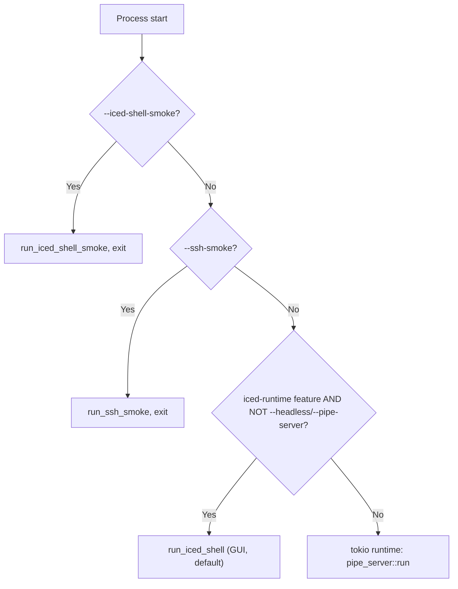

<!-- PAGE_ID: pandamux_07_app-runtime -->
<details>
<summary>Relevant source files</summary>

The following files were used as evidence for this page:

- [main.rs:1-66](crates/pandamux-app/src/main.rs#L1-L66)
- [iced_runtime.rs:1-166](crates/pandamux-app/src/iced_runtime.rs#L1-L166)
- [iced_runtime.rs:3795-3984](crates/pandamux-app/src/iced_runtime.rs#L3795-L3984)
- [backend.rs:1-336](crates/pandamux-app/src/backend.rs#L1-L336)
- [persistence.rs:1-11](crates/pandamux-app/src/persistence.rs#L1-L11)
- [persistence.rs:391-531](crates/pandamux-app/src/persistence.rs#L391-L531)
- [pollers.rs:1-79](crates/pandamux-app/src/pollers.rs#L1-L79)
- [project_launcher.rs:1-133](crates/pandamux-app/src/project_launcher.rs#L1-L133)
- [project_launcher.rs:203-302](crates/pandamux-app/src/project_launcher.rs#L203-L302)
- [updater.rs:1-262](crates/pandamux-app/src/updater.rs#L1-L262)
- [pipe_server.rs:1-59](crates/pandamux-app/src/pipe_server.rs#L1-L59)
- [latency.rs:1-72](crates/pandamux-app/src/latency.rs#L1-L72)
- [clipboard_os.rs:1-24](crates/pandamux-app/src/clipboard_os.rs#L1-L24)

</details>

# Application Runtime

> **Related Pages**: [Architecture](ARCHITECTURE.md), [Named Pipe Control Plane](../features/NAMED_PIPE_IPC.md), [Release and Packaging](../operations/RELEASE.md)

---

<!-- BEGIN:AUTOGEN pandamux_07_app-runtime_entry -->
## Entry Point and Modes

`pandamux-app` is the composition root: it is the single binary that owns canonical mutable state, and `main.rs` decides at startup which of three run modes the process takes (GUI shell, noninteractive smoke, or headless pipe server) (([main.rs:28-66](crates/pandamux-app/src/main.rs#L28-L66))).

The GUI build ships as a Windows GUI-subsystem binary specifically so the Start Menu shortcut (which cannot pass shortcut arguments) opens straight into the window; the headless (no `iced-runtime` feature) build stays a console app so the pipe server and CLI-style invocations keep stdout/stderr (([main.rs:1-5](crates/pandamux-app/src/main.rs#L1-L5))). Module wiring gates several modules behind the `iced-runtime` feature (`iced_runtime`, `pollers`) and marks others as intentionally idle scaffolding (`persistence`'s named-session API, `updater`'s decision logic) (([main.rs:7-26](crates/pandamux-app/src/main.rs#L7-L26))).

Mode selection checks flags in a fixed order: `--iced-shell-smoke` is checked first (must precede the default-GUI branch), then the always-available `--ssh-smoke` live-SSH validation path, then the default GUI launch (unless `--headless`/`--pipe-server` is passed), and only then does the process fall through to the standalone tokio runtime driving the headless pipe server (([main.rs:33-65](crates/pandamux-app/src/main.rs#L33-L65))). `--iced-shell` is accepted but is a no-op relative to the argument-less default, kept only for backward compatibility (([main.rs:48-57](crates/pandamux-app/src/main.rs#L48-L57))).



The headless fallback resolves the pipe name from `PANDAMUX_PIPE` (default `\\.\pipe\pandamux`), builds a multi-thread tokio runtime, and blocks on `pipe_server::run` (([main.rs:59-65](crates/pandamux-app/src/main.rs#L59-L65))). A separate opt-in path, `--ssh-smoke`, drives `RemoteSessionManager` directly against a real host for manual end-to-end SSH validation and never runs in CI (([main.rs:68-142](crates/pandamux-app/src/main.rs#L68-L142))).

Sources: [main.rs:1-162](crates/pandamux-app/src/main.rs#L1-L162)
<!-- END:AUTOGEN pandamux_07_app-runtime_entry -->

---

<!-- BEGIN:AUTOGEN pandamux_07_app-runtime_iced -->
## Iced Runtime and Subscriptions

`iced_runtime.rs` (6253 lines) hosts `NativeShellRuntime`, the struct that owns every piece of live application state: the split-tree `AppState`, the local `PtySessionManager`, SSH `RemoteSessionManager`, notifications, agents, sidebar, themes, settings, launcher preferences, the update-banner state, and the pipe-request registry, among many others (([iced_runtime.rs:52-166](crates/pandamux-app/src/iced_runtime.rs#L52-L166))).

`run_iced_shell` wires the Iced `application` builder with the runtime's `update`/`view` functions, a fixed window (1280x800, undecorated, transparent, 760x480 minimum), and a `subscription` function, then blocks on `.run()` (([iced_runtime.rs:3795-3813](crates/pandamux-app/src/iced_runtime.rs#L3795-L3813))). `run_iced_shell_smoke` builds a headless `NativeShellRuntime::default()`, renders one view, and asserts panes/terminals exist before printing `PANDAMUX_ICED_SHELL_SMOKE_OK`, giving CI a noninteractive check that the shell still constructs (([iced_runtime.rs:3815-3833](crates/pandamux-app/src/iced_runtime.rs#L3815-L3833))).

`subscription_iced_shell` always registers a 100ms tick and a global keyboard listener; only the live app (`state.live_ptys`) additionally registers the embedded pipe-server subscription, a 5-second git/port poll, and a periodic (6-hour) `UpdateCheckRequested` timer, so headless smoke/tests never bind a pipe or hit the network (([iced_runtime.rs:3843-3871](crates/pandamux-app/src/iced_runtime.rs#L3843-L3871))):

```rust
fn subscription_iced_shell(state: &NativeShellRuntime) -> Subscription<ShellMessage> {
    let mut subscriptions = vec![
        time::every(Duration::from_millis(100)).map(|_| ShellMessage::Tick),
        keyboard::listen().map(map_key_event),
    ];
    if state.live_ptys {
        subscriptions.push(Subscription::run_with(
            PipeServerConfig { .. },
            pipe_subscription,
        ));
        subscriptions
            .push(time::every(Duration::from_secs(5)).map(|_| ShellMessage::PollRequested));
        subscriptions.push(
            time::every(Duration::from_secs(UPDATE_CHECK_INTERVAL_SECS))
                .map(|_| ShellMessage::UpdateCheckRequested),
        );
    }
    Subscription::batch(subscriptions)
}
```

Sources: [iced_runtime.rs:3843-3871](crates/pandamux-app/src/iced_runtime.rs#L3843-L3871)

The pipe server itself runs *as* that subscription: `pipe_subscription` spawns `run_embedded_pipe_server`, which accepts named-pipe connections on Windows and, per connection, reads one line, forwards it into the Iced message loop as `ShellMessage::PipeRequest { id, payload }`, and awaits a one-shot reply routed back through a shared `PipeRegistry` (`Arc<Mutex<HashMap<u64, oneshot::Sender<String>>>>`) (([iced_runtime.rs:3895-3984](crates/pandamux-app/src/iced_runtime.rs#L3895-L3984))). Only `pipe_name` participates in the subscription's identity hash, so the `Arc` handles (registry, sequence counter) are captured once and the server is spawned exactly once across view rebuilds (([iced_runtime.rs:3873-3893](crates/pandamux-app/src/iced_runtime.rs#L3873-L3893))). On the non-Windows target the loop is a no-op (([iced_runtime.rs:3941-3944](crates/pandamux-app/src/iced_runtime.rs#L3941-L3944))).

When `update` receives `ShellMessage::PipeRequest`, it builds a `backend::DispatchCtx` borrowing every relevant field of `NativeShellRuntime` by mutable reference and calls `crate::backend::handle_line`, which is the same dispatcher the standalone `pipe_server` uses; this is what makes a CLI-driven and a UI-driven mutation indistinguishable at the state layer (([iced_runtime.rs:2509-2534](crates/pandamux-app/src/iced_runtime.rs#L2509-L2534))). After dispatch, the runtime inspects the parsed method to trigger side effects the dispatcher itself does not own: persisting SSH profile changes, live-applying + debounce-saving `config.set` settings, and saving the session on `project.create`/`project.add_session` (([iced_runtime.rs:2535-2559](crates/pandamux-app/src/iced_runtime.rs#L2535-L2559))).

Sources: [iced_runtime.rs:52-166](crates/pandamux-app/src/iced_runtime.rs#L52-L166), [iced_runtime.rs:2509-2559](crates/pandamux-app/src/iced_runtime.rs#L2509-L2559), [iced_runtime.rs:3795-3984](crates/pandamux-app/src/iced_runtime.rs#L3795-L3984)
<!-- END:AUTOGEN pandamux_07_app-runtime_iced -->

---

<!-- BEGIN:AUTOGEN pandamux_07_app-runtime_backend -->
## Intent Dispatcher

`backend.rs` (3106 lines) is documented as "the single backend dispatch code path shared by both clients of canonical state"; `handle_line` is synchronous, never awaits, and borrows `AppState`, `PtySessionManager`, and `Notifications` (plus agents/sidebar/contents/themes/localizer/remotes/ssh profiles/clipboard/settings) by mutable reference through `DispatchCtx` (([backend.rs:1-63](crates/pandamux-app/src/backend.rs#L1-L63))). The pipe server calls it through `Backend::handle_line` under an async mutex; the Iced runtime calls the free `handle_line` function directly inside `update` (([backend.rs:112-133](crates/pandamux-app/src/backend.rs#L112-L133))).

`handle_line` first handles two non-JSON-RPC lines: the literal `ping` (replies `pong`) and the V1 shell-integration `report_pwd <surfaceId> <path>` line, which updates a PTY's tracked cwd directly and returns an empty reply (no write-back) (([backend.rs:192-206](crates/pandamux-app/src/backend.rs#L192-L206))). Anything not starting with `{` is dropped; otherwise the line is parsed as an `RpcRequest` and handed to `dispatch`, whose `Ok`/`Err` becomes a serialized `RpcResponse` (([backend.rs:208-228](crates/pandamux-app/src/backend.rs#L208-L228))).

`dispatch` routes by trying a chain of sub-dispatchers keyed on `request.method` prefixes, falling through to a generic `AppIntent` path for everything else:

| Method prefix / literal | Sub-dispatcher | Notes |
|---|---|---|
| `notification.*` | `dispatch_notifications` | raise/list/clear ([backend.rs:342-386](crates/pandamux-app/src/backend.rs#L342-L386)) |
| `sidebar.*` | `dispatch_sidebar` | status/progress/log for the session rail |
| `config.*` (settings-shaped) | `dispatch_settings` | |
| `config.*` (theme/locale) | `dispatch_config` | |
| `window.*` | `dispatch_window` | |
| surface color-scheme methods | `dispatch_surface_scheme` | |
| `agent.*` | `dispatch_agents` | spawns/tracks agent PTYs |
| `project.*` | `dispatch_projects` | local + SSH project launch |
| `ssh.*` | `dispatch_ssh` | profiles, connect |
| `clipboard.*` | `dispatch_clipboard` | OS clipboard bridge |
| `surface.send_text` / `send_key` / `paste` / `paste_image` | `dispatch_terminal_io` | PTY/SSH write targets ([backend.rs:1412-1451](crates/pandamux-app/src/backend.rs#L1412-L1451)) |
| `markdown.*` / `diff.*` | `dispatch_surface_content` | |
| `browser.*` / `cdp` | rejected inline | native build has no browser automation |
| everything else | `intent_for_request` -> `app.apply` | generic `AppIntent` -> `AppDelta` path |

(([backend.rs:230-336](crates/pandamux-app/src/backend.rs#L230-L336)))

The fallback path parses an `AppIntent` from the request, applies it to `AppState` (returning an `AppDelta`), then reconciles side state: `sync_terminal_sessions` (spawn/kill local PTYs to match the tree), pruning `contents`/`surface_schemes` for surfaces the mutation closed, and `sync_remote_sessions` to kill orphaned SSH sessions (([backend.rs:326-335](crates/pandamux-app/src/backend.rs#L326-L335))). Browser/CDP methods are rejected with an explicit `-32601` message telling the caller to use Claude Code's own browser tooling instead, rather than a generic "method not found" (([backend.rs:316-324](crates/pandamux-app/src/backend.rs#L316-L324))).

Sources: [backend.rs:1-336](crates/pandamux-app/src/backend.rs#L1-L336)
<!-- END:AUTOGEN pandamux_07_app-runtime_backend -->

---

<!-- BEGIN:AUTOGEN pandamux_07_app-runtime_persistence -->
## Session Persistence

`persistence.rs` (805 lines) is a direct port of the Electron `session-persistence.ts` and centers on `SessionStore`, which is constructed with a base directory by value (so it is unit-testable against a temp dir) while `SessionStore::default_dir` resolves the real per-user location: `%APPDATA%/pandamux` on Windows, falling back to `~/.pandamux`, then the OS temp dir (([persistence.rs:391-405](crates/pandamux-app/src/persistence.rs#L391-L405))).

| File | Purpose |
|---|---|
| `sessions/session.json` | Auto-restored layout; atomically overwritten on every autosave, cleared only via the version-change backup flow (([persistence.rs:1-8](crates/pandamux-app/src/persistence.rs#L1-L8))) |
| `sessions/saved/<name>.json` | Explicitly named sessions the user chose to keep; survive version changes (([persistence.rs:440-454](crates/pandamux-app/src/persistence.rs#L440-L454))) |
| `sessions/last-session.txt` | Pointer to the most recently saved named session (([persistence.rs:479-488](crates/pandamux-app/src/persistence.rs#L479-L488))) |
| `app-version.txt` | The version that last wrote `session.json` (([persistence.rs:416-417](crates/pandamux-app/src/persistence.rs#L416-L417))) |
| `config/settings.json` | `UserSettings` behind the Settings UI and `config.get`/`config.set` (([persistence.rs:327-347](crates/pandamux-app/src/persistence.rs#L327-L347))) |
| `config/launcher.json` | Pinned favorites + recents (`LauncherPrefsConfig`), per-machine v1 (([persistence.rs:253-291](crates/pandamux-app/src/persistence.rs#L253-L291))) |
| `config/` (SSH profiles) | Secretless `SshProfileConfig` (host profiles, no credential fields) (([persistence.rs:44-57](crates/pandamux-app/src/persistence.rs#L44-L57))) |

`save_session`/`load_session` are the auto-restore pair: saving is an atomic write (temp file + rename) and loading returns `None` on missing/corrupt data rather than erroring (([persistence.rs:427-437](crates/pandamux-app/src/persistence.rs#L427-L437))). On startup, `handle_version_change` compares the stored `app-version.txt` against the running `CARGO_PKG_VERSION`; on a change it backs up the existing `session.json` to `session.v<old-version>.bak.json` (sanitizing the old version string into a safe filename tag) rather than deleting it, since the session schema is forward-compatible via serde defaults (([persistence.rs:490-525](crates/pandamux-app/src/persistence.rs#L490-L525))).

`SettingsStore` and `SshProfileStore` share the same migration policy: a version field gates a load, a newer-than-supported version is a hard error (`UnsupportedVersion`), an older version is migrated with a version-stamped backup written before the original is replaced, and invalid JSON is left completely untouched so a corrupt file is never silently clobbered (([persistence.rs:358-388](crates/pandamux-app/src/persistence.rs#L358-L388))). `LauncherPrefsStore` is looser by design: favorites/recents are convenience data, so a missing, corrupt, or too-new file just falls back to defaults in memory without ever overwriting the file on disk until the next explicit save (([persistence.rs:280-291](crates/pandamux-app/src/persistence.rs#L280-L291))).

Sources: [persistence.rs:1-11](crates/pandamux-app/src/persistence.rs#L1-L11), [persistence.rs:253-347](crates/pandamux-app/src/persistence.rs#L253-L347), [persistence.rs:391-531](crates/pandamux-app/src/persistence.rs#L391-L531)
<!-- END:AUTOGEN pandamux_07_app-runtime_persistence -->

---

<!-- BEGIN:AUTOGEN pandamux_07_app-runtime_pollers -->
## Pollers and Project Launcher

`pollers.rs` feeds the status bar with git branch/ahead-count and listening dev ports, running both concurrently off the Iced 5-second timer via `tokio::join!`, using only async `tokio` I/O (never blocking `std::fs`/process calls on the runtime thread) (([pollers.rs:1-39](crates/pandamux-app/src/pollers.rs#L1-L39))). `poll_git` shells out to `git rev-parse --abbrev-ref HEAD` and, if on a real branch, `git rev-list --count @{u}..HEAD` for the ahead count, suppressing the console window Windows would otherwise pop for each console-subsystem child via `CREATE_NO_WINDOW` (`0x0800_0000`), since `pandamux.exe` itself has no inherited console (([pollers.rs:41-68](crates/pandamux-app/src/pollers.rs#L41-L68))). `poll_ports` probes a fixed candidate list of common dev-server ports (3000, 3001, 4000, 4200, 5000, 5173, 5199, 8000, 8080, 8081, 9000) on localhost with a 120ms connect timeout each (([pollers.rs:24-26](crates/pandamux-app/src/pollers.rs#L24-L26), [pollers.rs:70-79](crates/pandamux-app/src/pollers.rs#L70-L79))).

`project_launcher.rs` (571 lines) coordinates Project launch across both local and SSH targets. `prepare_launch` resolves a `ProjectLocation` to a `LaunchTarget`: if an existing workspace already matches the location's `ProjectKey`, it reuses that workspace's focused (or first) pane; otherwise it allocates a brand-new workspace/pane/surface id trio (([project_launcher.rs:98-133](crates/pandamux-app/src/project_launcher.rs#L98-L133))). `spawn_spec` builds the actual `PtyCommand` per `SessionType`: `Terminal`/`PowerShell` run the shell directly, while `Claude`/`Codex`/`Gemini`/`Custom` are wrapped so the tool runs *inside* the shell (`pwsh -NoExit -Command` / `cmd /K` / `sh -c "...; exec $shell"`), so PATH shims (npm `.cmd` wrappers) resolve and the pane drops back to a prompt when the tool exits (([project_launcher.rs:50-82](crates/pandamux-app/src/project_launcher.rs#L50-L82))).

`launch_local` resolves a PowerShell binary (7 or Windows PowerShell, erroring with `ProjectErrorCategory::PtyStart` if neither exists), builds the launch target, optionally spawns the PTY, and rolls the PTY back with `ptys.kill` if committing the target into `AppState` fails afterward (([project_launcher.rs:203-245](crates/pandamux-app/src/project_launcher.rs#L203-L245))). `launch_remote_blocking` is the SSH equivalent: it builds an `SshConfig`, calls `remotes.connect_ready` with a 30-second timeout, types the session type's initial tool command into the now-ready remote shell for non-`Terminal` types, and likewise kills the remote session on a failed commit (([project_launcher.rs:247-302](crates/pandamux-app/src/project_launcher.rs#L247-L302))).

Sources: [pollers.rs:1-79](crates/pandamux-app/src/pollers.rs#L1-L79), [project_launcher.rs:1-133](crates/pandamux-app/src/project_launcher.rs#L1-L133), [project_launcher.rs:203-302](crates/pandamux-app/src/project_launcher.rs#L203-L302)
<!-- END:AUTOGEN pandamux_07_app-runtime_pollers -->

---

<!-- BEGIN:AUTOGEN pandamux_07_app-runtime_updater -->
## In-App Updater

`updater.rs` (344 lines) keeps its decision logic (API parsing, semver comparison, quarantine gating) pure and hermetically unit-tested; only the network fetch, installer download, and launching the installer are side effects, and those are gated behind the `iced-runtime` feature so the headless build and unit tests never touch the network (([updater.rs:1-13](crates/pandamux-app/src/updater.rs#L1-L13))). Because the app discovers its own updates, the GitHub Release only needs to carry a single signed `Setup.exe` asset, discovered via `RELEASES_LATEST_URL` (`https://api.github.com/repos/BoardPandas/Pandamux/releases/latest`) (([updater.rs:17-19](crates/pandamux-app/src/updater.rs#L17-L19))).

`parse_latest_release` rejects drafts and prereleases outright and picks the first asset whose name ends in `.exe` (case-insensitively) as the installer URL (([updater.rs:65-82](crates/pandamux-app/src/updater.rs#L65-L82))). `is_newer`/`semver_key` do a pure numeric `(major, minor, patch)` comparison, ignoring pre-release/build suffixes and treating missing/non-numeric segments as `0` (([updater.rs:88-104](crates/pandamux-app/src/updater.rs#L88-L104))). `should_offer` additionally requires the release to have been public for at least `quarantine_secs` (default `DEFAULT_QUARANTINE_SECS` = 6 hours), falling back to offering immediately only when the publish timestamp is unparseable (([updater.rs:21-24](crates/pandamux-app/src/updater.rs#L21-L24), [updater.rs:106-125](crates/pandamux-app/src/updater.rs#L106-L125))).

Two async entry points cover the periodic and on-demand paths: `check_for_update` applies the full quarantine gate (used by the 6-hour subscription timer), while `check_latest` ignores quarantine entirely so a user who explicitly clicks "Check for updates" sees any newer release immediately, surfacing transport failures as `ManualOutcome::Failed` rather than silently reporting "up to date" (([updater.rs:163-207](crates/pandamux-app/src/updater.rs#L163-L207))).

```rust
#[cfg(feature = "iced-runtime")]
pub async fn check_latest(current_version: String) -> ManualOutcome {
    let json = match fetch_latest_release_json().await {
        Ok(json) => json,
        Err(error) => return ManualOutcome::Failed(error),
    };
    match parse_latest_release(&json) {
        Some(release) if is_newer(&current_version, &release.version) => {
            ManualOutcome::Newer(release)
        }
        _ => ManualOutcome::UpToDate,
    }
}
```

Sources: [updater.rs:190-207](crates/pandamux-app/src/updater.rs#L190-L207)

Once the user triggers install, `download_and_launch_installer` downloads the asset with a `reqwest` client identified as `pandamux/<CARGO_PKG_VERSION>`, writes it to a stable path (`<temp>/PandaMUX-Setup.exe`), and spawns it detached; because the signed NSIS installer is itself a GUI process, no console window appears and dropping the child handle does not kill it (([updater.rs:209-245](crates/pandamux-app/src/updater.rs#L209-L245))). The Iced runtime drives this one-click flow through `ShellMessage::UpdateCheckClicked` -> `manual_update_check_task` -> `ShellMessage::UpdateManualChecked` -> `apply_manual_check`/`offer_update`, and `ShellMessage::UpdateInstallClicked` -> `start_update_install`, which on success closes the window so the installer can replace the running files (([iced_runtime.rs:1337-1428](crates/pandamux-app/src/iced_runtime.rs#L1337-L1428))).

Sources: [updater.rs:1-262](crates/pandamux-app/src/updater.rs#L1-L262), [iced_runtime.rs:1337-1428](crates/pandamux-app/src/iced_runtime.rs#L1337-L1428)
<!-- END:AUTOGEN pandamux_07_app-runtime_updater -->

---
