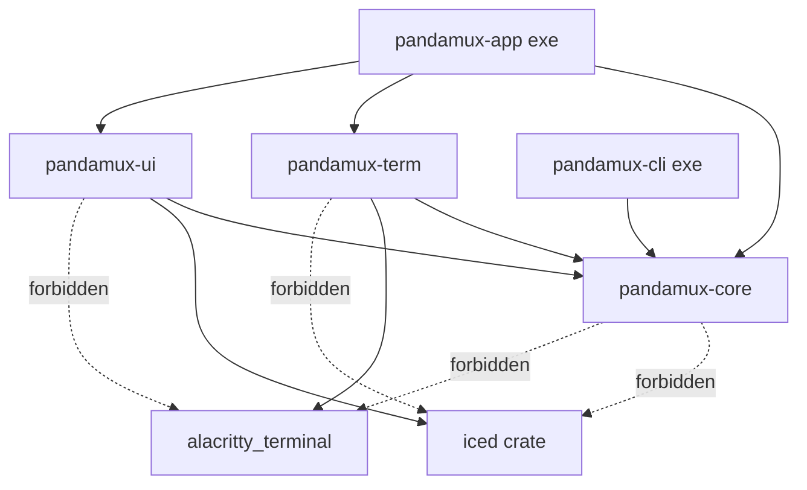
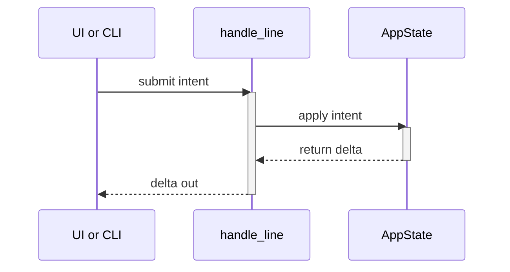

<!-- PAGE_ID: pandamux_03_architecture -->

Relevant source files

The following files were used as evidence for this page:

- [CLAUDE.md:55-82](../../CLAUDE.md#L55-L82)
- [crates/pandamux-core/src/lib.rs:1-59](../../crates/pandamux-core/src/lib.rs#L1-L59)
- [scripts/check-rust-boundaries.ps1:1-32](../../scripts/check-rust-boundaries.ps1#L1-L32)
- [crates/pandamux-ui/src/lib.rs:1-66](../../crates/pandamux-ui/src/lib.rs#L1-L66)
- [crates/pandamux-core/src/state.rs:16-426](../../crates/pandamux-core/src/state.rs#L16-L426)
- [crates/pandamux-app/src/backend.rs:1-336](../../crates/pandamux-app/src/backend.rs#L1-L336)
- [crates/pandamux-app/src/backend.rs:1651-1710](../../crates/pandamux-app/src/backend.rs#L1651-L1710)
- [crates/pandamux-app/src/backend.rs:2068-2154](../../crates/pandamux-app/src/backend.rs#L2068-L2154)
- [crates/pandamux-core/src/split_tree.rs:93-179](../../crates/pandamux-core/src/split_tree.rs#L93-L179)
- [crates/pandamux-ui/src/shell_projection.rs:1-153](../../crates/pandamux-ui/src/shell_projection.rs#L1-L153)
- [crates/pandamux-core/src/surface_content.rs:1-49](../../crates/pandamux-core/src/surface_content.rs#L1-L49)
- [crates/pandamux-app/src/iced_runtime.rs:52-149](../../crates/pandamux-app/src/iced_runtime.rs#L52-L149)
- [crates/pandamux-app/src/iced_runtime.rs:2509-2565](../../crates/pandamux-app/src/iced_runtime.rs#L2509-L2565)
- [crates/pandamux-app/src/iced_runtime.rs:3843-3902](../../crates/pandamux-app/src/iced_runtime.rs#L3843-L3902)
- [crates/pandamux-app/src/iced_runtime.rs:4242-4290](../../crates/pandamux-app/src/iced_runtime.rs#L4242-L4290)

# Architecture

> **Related Pages**: [Core Domain and State](CORE_DOMAIN.md), [Application Runtime](APP_RUNTIME.md), [Named Pipe Control Plane](../features/NAMED_PIPE_IPC.md)

---

<!-- BEGIN:AUTOGEN pandamux_03_architecture_crates -->
## Workspace and Crate Boundaries

PandaMUX is a five-crate Cargo workspace built around a hard crate-isolation invariant: the terminal engine and the UI framework can each be swapped without touching the other, because neither leaks its types across the boundary (CLAUDE.md:78).

| Crate | Kind | Responsibility | Source |
|---|---|---|---|
| `pandamux-core` | lib | Shared domain types: split tree, session model, pipe-protocol types, agent/sidebar/notification/ssh models. Canonical state lives here. Zero Iced ([lib.rs:1-16](../../crates/pandamux-core/src/lib.rs#L1-L16)) |
| `pandamux-term` | lib | Terminal engine: `alacritty_terminal` grid, `portable-pty` local PTY, `russh` remote PTY + SFTP, OSC 52 policy, shell lifecycle. Exposes PandaMUX's own grid types; `alacritty_terminal` never leaks out (CLAUDE.md:58-61) |
| `pandamux-ui` | lib | Iced app: canvas terminal viewport, panes/splits/tabs, chrome, session panel, command palette, settings, theming. The ONLY crate that imports Iced ([lib.rs:1-26](../../crates/pandamux-ui/src/lib.rs#L1-L26)) |
| `pandamux-app` | bin (`pandamux.exe`) | Composition root + tokio runtime; owns authoritative mutable state; named-pipe server, agent manager, pollers, persistence, updater (CLAUDE.md:65-67) |
| `pandamux-cli` | bin (`pandamux-cli.exe`) | The `pandamux` CLI, pipe client wire-compatible with the V2 JSON-RPC protocol (CLAUDE.md:68-69) |

The invariant is CI-enforced, not just documented. `scripts/check-rust-boundaries.ps1` reads each crate's `Cargo.toml` and fails the build if a forbidden dependency line is present: `pandamux-core` may depend on neither `iced` nor `alacritty_terminal`, and `pandamux-term` may not depend on `iced` ([check-rust-boundaries.ps1:7-16](../../scripts/check-rust-boundaries.ps1#L7-L16)). The check is a regex match against `^\s*<dep>\s*=` in the manifest text, so it catches the dependency regardless of version pin or feature list ([check-rust-boundaries.ps1:24-29](../../scripts/check-rust-boundaries.ps1#L24-L29)).

`pandamux-core`'s module list confirms the "zero Iced" boundary in practice: every exported type (`AppState`, `SplitNode`, `AgentRegistry`, `SshProfiles`, `Keymap`, and so on) is a plain Rust/serde type with no rendering dependency ([lib.rs:1-59](../../crates/pandamux-core/src/lib.rs#L1-L59)). `pandamux-ui`'s module list is gated almost entirely behind the `iced-runtime` feature, and its `shell_projection` module (the only one built unconditionally) is the seam that lets a headless build still compute layout projections without pulling in Iced ([pandamux-ui/src/lib.rs:1-26](../../crates/pandamux-ui/src/lib.rs#L1-L26)).

Sources: [CLAUDE.md:55-82](../../CLAUDE.md#L55-L82), [lib.rs:1-59](../../crates/pandamux-core/src/lib.rs#L1-L59), [pandamux-ui/src/lib.rs:1-66](../../crates/pandamux-ui/src/lib.rs#L1-L66), [check-rust-boundaries.ps1:1-32](../../scripts/check-rust-boundaries.ps1#L1-L32)
<!-- END:AUTOGEN pandamux_03_architecture_crates -->

---

<!-- BEGIN:AUTOGEN pandamux_03_architecture_state -->
## Backend-Owned State

State ownership follows an intent-in, delta-out, single-writer pattern: `pandamux-app` owns the canonical `AppState` (workspace/pane/surface split tree and friends), and the Iced UI holds only a read-projection over it, submitting intents rather than mutating state directly (CLAUDE.md:79).

`AppState` is the root of canonical state: a list of `WorkspaceState` (each carrying its own immutable `SplitNode` split tree, focus, and zoom), the active workspace id, the project registry, and the Home dashboard layout ([state.rs:16-31](../../crates/pandamux-core/src/state.rs#L16-L31)). Every workspace's `split_tree`, `focused_pane_id`, and `zoomed_pane_id` live on `WorkspaceState` ([state.rs:35-48](../../crates/pandamux-core/src/state.rs#L35-L48)), and mutation happens through exactly one entry point: `AppState::apply(&mut self, intent: AppIntent) -> Result<AppDelta, String>`, which routes to a per-domain handler (`apply_system`, `apply_workspace`, `apply_pane`, `apply_surface`, `apply_project`, `apply_home`) and returns a typed `AppDelta` describing what changed ([state.rs:416-426](../../crates/pandamux-core/src/state.rs#L416-L426)).

Both callers of this single writer build the same `DispatchCtx<'_>` (mutable borrows of `AppState`, `PtySessionManager`, `Notifications`, and the rest of the backend-owned collections) and pass it to the same free function, `handle_line` ([backend.rs:36-63](../../crates/pandamux-app/src/backend.rs#L36-L63)). The headless `Backend` struct (used by the standalone pipe server) builds a `DispatchCtx` from its own owned fields in `Backend::handle_line` ([backend.rs:111-133](../../crates/pandamux-app/src/backend.rs#L111-L133)); the live Iced runtime builds an equivalent `DispatchCtx` from `NativeShellRuntime` fields when it receives a `ShellMessage::PipeRequest` ([iced_runtime.rs:2509-2534](../../crates/pandamux-app/src/iced_runtime.rs#L2509-L2534)). Because both paths funnel into the same `dispatch` function and the same `app.apply(intent)` call, a CLI-driven split and a UI-driven split are indistinguishable at the state layer (CLAUDE.md:79; [backend.rs:326-336](../../crates/pandamux-app/src/backend.rs#L326-L336)).

The pipe server itself is not a standalone process in the live app: it runs as an Iced `Subscription` inside the running GUI, so activating and deactivating the embedded pipe server is tied to the runtime's own subscription lifecycle rather than a separate service (CLAUDE.md:79; [iced_runtime.rs:3843-3871](../../crates/pandamux-app/src/iced_runtime.rs#L3843-L3871)).

Sources: [state.rs:16-426](../../crates/pandamux-core/src/state.rs#L16-L426), [backend.rs:1-63](../../crates/pandamux-app/src/backend.rs#L1-L63), [backend.rs:111-336](../../crates/pandamux-app/src/backend.rs#L111-L336), [iced_runtime.rs:2509-2565](../../crates/pandamux-app/src/iced_runtime.rs#L2509-L2565)
<!-- END:AUTOGEN pandamux_03_architecture_state -->

---

<!-- BEGIN:AUTOGEN pandamux_03_architecture_intents -->
## Intent Dispatch and Deltas

`handle_line` in `pandamux-app::backend` is the single dispatch code path shared by both clients of canonical state: the named-pipe server (CLI / agents / orchestrator) and the live Iced runtime ([backend.rs:1-6](../../crates/pandamux-app/src/backend.rs#L1-L6)). It is synchronous and never awaits, so the pipe server calls it under an async mutex while the Iced runtime calls it directly inside `update` ([backend.rs:8-12](../../crates/pandamux-app/src/backend.rs#L8-L12)).

`handle_line` first handles two non-JSON protocol lines (the V1 `ping` liveness check and `report_pwd <surfaceId> <path>` shell-integration cwd reports), then parses everything else as a V2 `RpcRequest` and calls `dispatch` ([backend.rs:192-228](../../crates/pandamux-app/src/backend.rs#L192-L228)). `dispatch` tries a sequence of domain-specific sub-dispatchers before falling through to the generic `AppIntent`/`AppState::apply` path:

| Sub-dispatcher | Domain | Source |
|---|---|---|
| `dispatch_notifications` | `notification.*` | [backend.rs:251](../../crates/pandamux-app/src/backend.rs#L251) |
| `dispatch_sidebar` | `sidebar.*` | [backend.rs:255](../../crates/pandamux-app/src/backend.rs#L255) |
| `dispatch_settings` | `config` settings get/set | [backend.rs:259](../../crates/pandamux-app/src/backend.rs#L259) |
| `dispatch_config` | `theme.*` / locale | [backend.rs:263](../../crates/pandamux-app/src/backend.rs#L263) |
| `dispatch_window` | `window.*` | [backend.rs:267](../../crates/pandamux-app/src/backend.rs#L267) |
| `dispatch_surface_scheme` | `surface.set_color_scheme` | [backend.rs:271](../../crates/pandamux-app/src/backend.rs#L271) |
| `dispatch_agents` | `agent.*` | [backend.rs:275](../../crates/pandamux-app/src/backend.rs#L275) |
| `dispatch_projects` | project registry / launch | [backend.rs:279-289](../../crates/pandamux-app/src/backend.rs#L279-L289) |
| `dispatch_ssh` | `ssh.*` | [backend.rs:291-300](../../crates/pandamux-app/src/backend.rs#L291-L300) |
| `dispatch_clipboard` | `clipboard.*` | [backend.rs:302](../../crates/pandamux-app/src/backend.rs#L302) |
| `dispatch_terminal_io` | `surface.send_text` / `send_key` / `paste` | [backend.rs:306-310](../../crates/pandamux-app/src/backend.rs#L306-L310) |
| `dispatch_surface_content` | `markdown.*` / `diff.*` | [backend.rs:312](../../crates/pandamux-app/src/backend.rs#L312) |

`browser.*` and `cdp` methods are rejected explicitly with a message directing callers to Claude Code's own browser tooling, rather than falling through to a generic "method not found" ([backend.rs:316-324](../../crates/pandamux-app/src/backend.rs#L316-L324)). Everything else is translated by `intent_for_request` from an RPC method name and JSON params into a typed `AppIntent` variant (for example `"surface.create"` becomes `AppIntent::Surface(SurfaceIntent::Create { .. })`) ([backend.rs:1651-1699](../../crates/pandamux-app/src/backend.rs#L1651-L1699)), applied via `app.apply(intent)`, and converted back to a JSON result with `delta_to_result(delta)` ([backend.rs:326-336](../../crates/pandamux-app/src/backend.rs#L326-L336)). After a successful mutation, `dispatch` also reconciles side effects that follow from a changed tree: respawning/killing local PTYs (`sync_terminal_sessions`), dropping markdown/diff content and color-scheme overrides for surfaces that no longer exist, and killing orphaned SSH sessions (`sync_remote_sessions`) ([backend.rs:328-334](../../crates/pandamux-app/src/backend.rs#L328-L334)).

Sources: [backend.rs:1-12](../../crates/pandamux-app/src/backend.rs#L1-L12), [backend.rs:192-336](../../crates/pandamux-app/src/backend.rs#L192-L336), [backend.rs:1651-1710](../../crates/pandamux-app/src/backend.rs#L1651-L1710)
<!-- END:AUTOGEN pandamux_03_architecture_intents -->

---

<!-- BEGIN:AUTOGEN pandamux_03_architecture_split-tree -->
## Immutable Split Tree

Pane layouts are a binary `SplitNode` tree: a `Leaf` holds a pane id and its tabbed surfaces, a `Branch` holds a direction, a ratio, and exactly two child `SplitNode`s ([split_tree.rs:85-106](../../crates/pandamux-core/src/split_tree.rs#L85-L106)). Mutations never edit a tree in place; they produce a new tree. `split_node`, for example, recurses to the target pane and, on finding it, returns a brand-new `Branch` wrapping the untouched original leaf and a freshly created leaf; every ancestor on the path to that pane is likewise rebuilt as a new `Branch`, and any subtree that did not change is returned via `tree.clone()` unchanged ([split_tree.rs:134-179](../../crates/pandamux-core/src/split_tree.rs#L134-L179)).

The Iced UI does not render the binary tree directly. `pandamux-ui::shell_projection` projects it into the design's 2-level column layout (decision 12.1): a root horizontal split yields side-by-side columns, and a vertical split stacks panes within one column ([shell_projection.rs:14-19](../../crates/pandamux-ui/src/shell_projection.rs#L14-L19)). `columns_from_node` implements this: a `Pane` becomes a single one-pane column; a horizontal `Split` concatenates the columns of both sides; a vertical `Split` flattens everything beneath it (including a nested horizontal split) into one column's stack ([shell_projection.rs:116-142](../../crates/pandamux-ui/src/shell_projection.rs#L116-L142)). That flattening is the graceful fallback for arbitrary-depth trees: UI-initiated splits stay 2-level so the projection round-trips exactly, while a deeper tree built by the CLI or orchestrator (for example via `layout.grid`) still renders every pane, just stacked instead of laid out at native depth ([shell_projection.rs:124-127](../../crates/pandamux-ui/src/shell_projection.rs#L124-L127)).

| `SplitNode` variant | Fields | Source |
|---|---|---|
| `Leaf` | `pane_id`, `surfaces: Vec<SurfaceRef>`, `active_surface_index` | [split_tree.rs:86-91](../../crates/pandamux-core/src/split_tree.rs#L86-L91) |
| `Branch` | `direction: SplitDirection`, `ratio: f32`, `children: Box<[SplitNode; 2]>` | [split_tree.rs:93-99](../../crates/pandamux-core/src/split_tree.rs#L93-L99) |

Sources: [split_tree.rs:93-179](../../crates/pandamux-core/src/split_tree.rs#L93-L179), [shell_projection.rs:1-153](../../crates/pandamux-ui/src/shell_projection.rs#L1-L153)
<!-- END:AUTOGEN pandamux_03_architecture_split-tree -->

---

<!-- BEGIN:AUTOGEN pandamux_03_architecture_surfaces -->
## Surfaces and Keep-Alive

Each terminal surface keeps its PTY (or SSH channel) alive in memory keyed by its own surface id, so switching the active tab in a pane never reconstructs grid state (CLAUDE.md:80). `sync_terminal_sessions` makes this literal: the session id handed to `PtySessionManager::spawn` is `surface.id.to_string()` for every terminal surface in every workspace, and a surface already present in `ptys` is left alone rather than respawned ([backend.rs:2078-2112](../../crates/pandamux-app/src/backend.rs#L2078-L2112)). Sessions for surfaces that no longer exist in the tree are the only ones killed ([backend.rs:2116-2120](../../crates/pandamux-app/src/backend.rs#L2116-L2120)).

The live Iced runtime relies on the same key when it reads grid state to render: `terminal_snapshots` collects the surface ids visible in the active workspace's projection, then reads each one's styled grid straight out of `ptys.screen_cells(surface_id.as_str())` (or `remotes.screen_cells` for an SSH-backed surface) ([iced_runtime.rs:4253-4289](../../crates/pandamux-app/src/iced_runtime.rs#L4253-L4289)). Because `ptys`/`remotes` are long-lived fields on `NativeShellRuntime` rather than per-view state, bringing a tab back to front is a lookup by surface id, not a re-spawn ([iced_runtime.rs:52-95](../../crates/pandamux-app/src/iced_runtime.rs#L52-L95)).

Non-terminal surfaces (markdown/diff) have no PTY at all; their content is a plain string set over the pipe (`markdown.set_content`, `markdown.load_file`, `diff.refresh`) and stored in `SurfaceContents`, a `HashMap<SurfaceId, String>` owned alongside `AppState` on the single-writer path ([surface_content.rs:1-15](../../crates/pandamux-core/src/surface_content.rs#L1-L15)). `SurfaceContents::retain_live` is called after every dispatch that can close surfaces, so a closed markdown/diff pane's content does not leak ([surface_content.rs:44-48](../../crates/pandamux-core/src/surface_content.rs#L44-L48)).

| Surface kind | Backing store | Keyed by | Source |
|---|---|---|---|
| Terminal (local) | `PtySessionManager` (live PTY + `alacritty_terminal` grid) | `SurfaceId` as string | [backend.rs:2068-2113](../../crates/pandamux-app/src/backend.rs#L2068-L2113) |
| Terminal (SSH remote) | `RemoteSessionManager` (russh channel) | `SurfaceId` as string | [backend.rs:2078-2088](../../crates/pandamux-app/src/backend.rs#L2078-L2088) |
| Markdown / Diff | `SurfaceContents` (`HashMap<SurfaceId, String>`) | `SurfaceId` | [surface_content.rs:12-15](../../crates/pandamux-core/src/surface_content.rs#L12-L15) |

Sources: [surface_content.rs:1-49](../../crates/pandamux-core/src/surface_content.rs#L1-L49), [backend.rs:2068-2154](../../crates/pandamux-app/src/backend.rs#L2068-L2154), [iced_runtime.rs:4242-4290](../../crates/pandamux-app/src/iced_runtime.rs#L4242-L4290)
<!-- END:AUTOGEN pandamux_03_architecture_surfaces -->

---

<!-- BEGIN:AUTOGEN pandamux_03_architecture_runtime -->
## Runtime Composition

`pandamux-app` is the composition root: the binary that owns the tokio runtime, the authoritative mutable state, the named-pipe server, the agent manager, git/port pollers, session persistence, and the in-app updater (CLAUDE.md:65-67). Its live GUI path is `NativeShellRuntime`, a single struct that owns every piece of backend-owned state alongside UI-only state: `app_state: AppState`, `ptys: PtySessionManager`, `remotes: RemoteSessionManager`, `notifications`, `agents`, `sidebar`, `contents`, `themes`, `settings`, and view-only fields like `chrome`, `drag`, `palette`, and `view_model` all live on one struct ([iced_runtime.rs:52-149](../../crates/pandamux-app/src/iced_runtime.rs#L52-L149)).

The embedded named-pipe server is not a background thread the app happens to also run; it is modeled as an Iced `Subscription`, so its lifecycle is driven by the Iced runtime loop itself. `subscription_iced_shell` only pushes the pipe subscription (plus periodic git/port polling and update checks) when `state.live_ptys` is true; headless smoke runs and tests never bind a pipe ([iced_runtime.rs:3843-3871](../../crates/pandamux-app/src/iced_runtime.rs#L3843-L3871)). The subscription's identity is hashed only on the pipe name, while the shared `Arc` handles (registry, sequence counter) are captured by the running stream so the server is spawned exactly once and survives view rebuilds ([iced_runtime.rs:3873-3893](../../crates/pandamux-app/src/iced_runtime.rs#L3873-L3893)). `run_embedded_pipe_server` runs the accept loop for the life of the app, spawning a task per connection that forwards each line into the Iced message loop as a `ShellMessage::PipeRequest` and writes back whatever reply the runtime produces ([iced_runtime.rs:3904-3920](../../crates/pandamux-app/src/iced_runtime.rs#L3904-L3920)).

When `update` receives that `ShellMessage::PipeRequest`, it builds a `DispatchCtx` from `NativeShellRuntime`'s own fields and calls the exact same `crate::backend::handle_line` the headless `Backend` calls, then performs a small set of runtime-only side effects the headless path does not need (persisting SSH profiles, live-applying and debounce-saving settings, saving the session after certain project mutations) before replying to the waiting pipe client through the shared registry ([iced_runtime.rs:2509-2565](../../crates/pandamux-app/src/iced_runtime.rs#L2509-L2565)).

Sources: [iced_runtime.rs:52-149](../../crates/pandamux-app/src/iced_runtime.rs#L52-L149), [iced_runtime.rs:2509-2565](../../crates/pandamux-app/src/iced_runtime.rs#L2509-L2565), [iced_runtime.rs:3843-3902](../../crates/pandamux-app/src/iced_runtime.rs#L3843-L3902)
<!-- END:AUTOGEN pandamux_03_architecture_runtime -->

---
