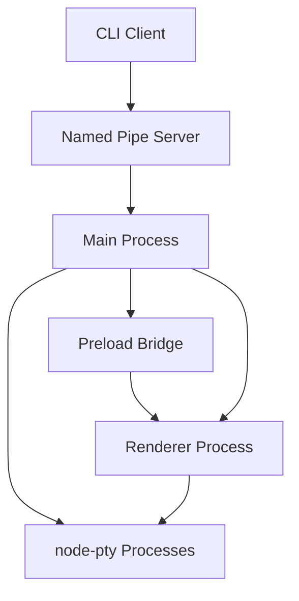
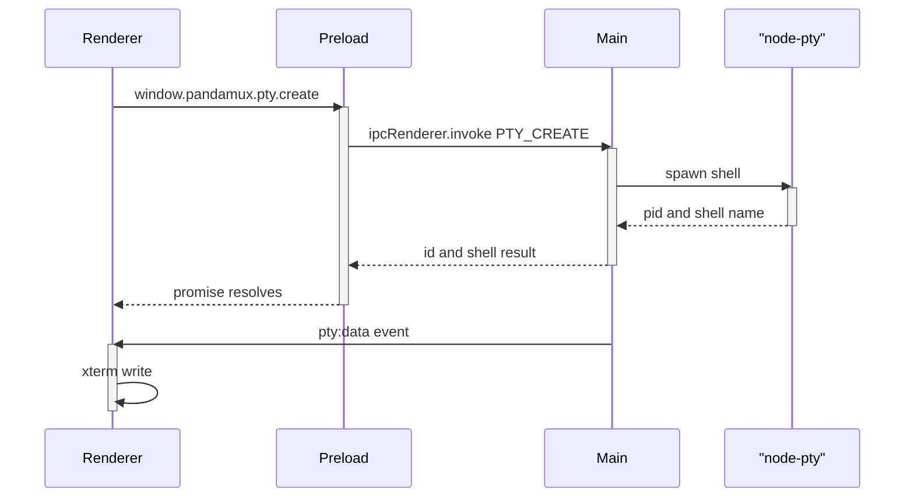

<!-- PAGE_ID: pandamux_03_architecture -->
<details>
<summary>Relevant source files</summary>

The following files were used as evidence for this page:

- [index.ts:79-90](https://github.com/BoardPandas/Pandamux/blob/0ab9e6463a9017a7b8ea98f10b3f847507658ac4/src/main/index.ts#L79-L90)
- [index.ts:276-337](https://github.com/BoardPandas/Pandamux/blob/0ab9e6463a9017a7b8ea98f10b3f847507658ac4/src/main/index.ts#L276-L337)
- [index.ts:390-787](https://github.com/BoardPandas/Pandamux/blob/0ab9e6463a9017a7b8ea98f10b3f847507658ac4/src/main/index.ts#L390-L787)
- [index.ts:790-818](https://github.com/BoardPandas/Pandamux/blob/0ab9e6463a9017a7b8ea98f10b3f847507658ac4/src/main/index.ts#L790-L818)
- [index.ts:1-30](https://github.com/BoardPandas/Pandamux/blob/0ab9e6463a9017a7b8ea98f10b3f847507658ac4/src/preload/index.ts#L1-L30)
- [index.ts:161-201](https://github.com/BoardPandas/Pandamux/blob/0ab9e6463a9017a7b8ea98f10b3f847507658ac4/src/preload/index.ts#L161-L201)
- [index.tsx:1-12](https://github.com/BoardPandas/Pandamux/blob/0ab9e6463a9017a7b8ea98f10b3f847507658ac4/src/renderer/index.tsx#L1-L12)
- [App.tsx:239-260](https://github.com/BoardPandas/Pandamux/blob/0ab9e6463a9017a7b8ea98f10b3f847507658ac4/src/renderer/App.tsx#L239-L260)
- [App.tsx:368-386](https://github.com/BoardPandas/Pandamux/blob/0ab9e6463a9017a7b8ea98f10b3f847507658ac4/src/renderer/App.tsx#L368-L386)
- [App.tsx:857-897](https://github.com/BoardPandas/Pandamux/blob/0ab9e6463a9017a7b8ea98f10b3f847507658ac4/src/renderer/App.tsx#L857-L897)
- [types.ts:1-10](https://github.com/BoardPandas/Pandamux/blob/0ab9e6463a9017a7b8ea98f10b3f847507658ac4/src/shared/types.ts#L1-L10)
- [types.ts:222-333](https://github.com/BoardPandas/Pandamux/blob/0ab9e6463a9017a7b8ea98f10b3f847507658ac4/src/shared/types.ts#L222-L333)
- [id.ts:1-14](https://github.com/BoardPandas/Pandamux/blob/0ab9e6463a9017a7b8ea98f10b3f847507658ac4/src/shared/id.ts#L1-L14)
- [instance.ts:1-93](https://github.com/BoardPandas/Pandamux/blob/0ab9e6463a9017a7b8ea98f10b3f847507658ac4/src/shared/instance.ts#L1-L93)

</details>

# Architecture

> **Related Pages**: [Main Process Modules](../core/MAIN_PROCESS.md), [Renderer and State](../core/RENDERER_AND_STATE.md), [Named Pipe Control Plane](../features/NAMED_PIPE_IPC.md)

---

<!-- BEGIN:AUTOGEN pandamux_03_architecture_process-model -->
## Process Model

PandaMUX Everywhere is a standard three-process Electron application (main, renderer, preload) plus two external entry points, the CLI and the named pipe, that let terminal-based tools drive the running app without an MCP server.

The main process (`src/main/index.ts`) owns the app lifecycle, spawns the single `BrowserWindow` via `WindowManager`, starts the named pipe server, and hosts `ptyManager` for all PTY processes ([index.ts:79-90](https://github.com/BoardPandas/Pandamux/blob/0ab9e6463a9017a7b8ea98f10b3f847507658ac4/src/main/index.ts#L79-L90)). It acquires a single-instance lock so a second launch (or a `pandamux browser open` invocation that resolves to the GUI exe) hands off to the running instance instead of opening a second window (`app.requestSingleInstanceLock()`) ([index.ts:208-228](https://github.com/BoardPandas/Pandamux/blob/0ab9e6463a9017a7b8ea98f10b3f847507658ac4/src/main/index.ts#L208-L228)). The renderer (`src/renderer/index.tsx`, `App.tsx`) is a React 19 + Zustand application mounted into `#root` ([index.tsx:1-12](https://github.com/BoardPandas/Pandamux/blob/0ab9e6463a9017a7b8ea98f10b3f847507658ac4/src/renderer/index.tsx#L1-L12)). The preload script is the only bridge between the two, exposing a single `window.pandamux` object via `contextBridge.exposeInMainWorld` ([preload/index.ts:1-4](https://github.com/BoardPandas/Pandamux/blob/0ab9e6463a9017a7b8ea98f10b3f847507658ac4/src/preload/index.ts#L1-L4)).

| Process / Entry Point | Source | Responsibility |
|---|---|---|
| Main | `src/main/index.ts` | App lifecycle, single-instance lock, PTY key translation, named pipe V1/V2 dispatch, auto-save scheduling ([index.ts:276-337](https://github.com/BoardPandas/Pandamux/blob/0ab9e6463a9017a7b8ea98f10b3f847507658ac4/src/main/index.ts#L276-L337)) |
| Renderer | `src/renderer/index.tsx`, `App.tsx` | React UI shell, Zustand-backed workspace/pane/surface state, session restore, pipe-bridge globals ([App.tsx:239-260](https://github.com/BoardPandas/Pandamux/blob/0ab9e6463a9017a7b8ea98f10b3f847507658ac4/src/renderer/App.tsx#L239-L260)) |
| Preload | `src/preload/index.ts` | `contextBridge`-exposed `window.pandamux` API surface; sole privileged channel between renderer and main ([preload/index.ts:1-30](https://github.com/BoardPandas/Pandamux/blob/0ab9e6463a9017a7b8ea98f10b3f847507658ac4/src/preload/index.ts#L1-L30)) |
| CLI | `src/cli/pandamux.ts` (not in this page's source set) | Translates `pandamux <command>` invocations into named-pipe JSON-RPC requests; documented on [CLI Reference](../api/CLI_REFERENCE.md) |
| Named Pipe | `\\.\pipe\pandamux[-instance]`, path resolved in `src/shared/instance.ts` | V1 text protocol (shell hooks) and V2 JSON-RPC (CLI/agents), token-authenticated ([instance.ts:19-26](https://github.com/BoardPandas/Pandamux/blob/0ab9e6463a9017a7b8ea98f10b3f847507658ac4/src/shared/instance.ts#L19-L26)) |



The named pipe path and the app-data directory both carry an optional `-<name>` suffix from `PANDAMUX_INSTANCE`, which is what lets a dev build run alongside an installed production build without colliding on the exclusive Windows pipe or on `session.json` ([instance.ts:14-26](https://github.com/BoardPandas/Pandamux/blob/0ab9e6463a9017a7b8ea98f10b3f847507658ac4/src/shared/instance.ts#L14-L26)).

Sources: [index.ts:79-90](https://github.com/BoardPandas/Pandamux/blob/0ab9e6463a9017a7b8ea98f10b3f847507658ac4/src/main/index.ts#L79-L90), [index.ts:208-228](https://github.com/BoardPandas/Pandamux/blob/0ab9e6463a9017a7b8ea98f10b3f847507658ac4/src/main/index.ts#L208-L228), [instance.ts:1-93](https://github.com/BoardPandas/Pandamux/blob/0ab9e6463a9017a7b8ea98f10b3f847507658ac4/src/shared/instance.ts#L1-L93)
<!-- END:AUTOGEN pandamux_03_architecture_process-model -->

---

<!-- BEGIN:AUTOGEN pandamux_03_architecture_main -->
## Main Process

`src/main/index.ts` is the Electron entry point and the busiest file in the codebase: it wires together `WindowManager`, `PipeServer`, `PortScanner`, `GitPoller`, `PrPoller`, and `CDPProxy`, then drives them all from a single `app.whenReady()` callback ([index.ts:276-337](https://github.com/BoardPandas/Pandamux/blob/0ab9e6463a9017a7b8ea98f10b3f847507658ac4/src/main/index.ts#L276-L337)).

Startup sequence inside `app.whenReady()`:

1. `hardenWebContents()` locks down `<webview>` preload/node-integration and denies `window.open` popups except for `http(s)` links routed to the OS browser ([index.ts:230-274](https://github.com/BoardPandas/Pandamux/blob/0ab9e6463a9017a7b8ea98f10b3f847507658ac4/src/main/index.ts#L230-L274)).
2. `ensureClaudeContext`, `ensureClaudeHooks`, `ensureChromeDevtoolsConfig`, `ensureOrchestratorPlugin`, `ensureOpencodeContext`, and `ensureOpencodePlugin` inject AI-tool configuration into `~/.claude` and `~/.opencode` ([index.ts:280-286](https://github.com/BoardPandas/Pandamux/blob/0ab9e6463a9017a7b8ea98f10b3f847507658ac4/src/main/index.ts#L280-L286)).
3. `registerIpcHandlers(windowManager, cdpProxy)` attaches the bulk Electron IPC handlers ([index.ts:302](https://github.com/BoardPandas/Pandamux/blob/0ab9e6463a9017a7b8ea98f10b3f847507658ac4/src/main/index.ts#L302)).
4. The last saved session (or none) determines the initial window bounds passed to `windowManager.createWindow()` ([index.ts:307-310](https://github.com/BoardPandas/Pandamux/blob/0ab9e6463a9017a7b8ea98f10b3f847507658ac4/src/main/index.ts#L307-L310)).
5. `pipeServer.start()` opens the named pipe and `cdpProxy.start()` opens the (best-effort, non-fatal) CDP proxy ([index.ts:332-334](https://github.com/BoardPandas/Pandamux/blob/0ab9e6463a9017a7b8ea98f10b3f847507658ac4/src/main/index.ts#L332-L334)).

The bulk of the file's line count is the V2 JSON-RPC method switch registered via `pipeServer.on('v2', ...)`, which handles roughly 25 methods directly (`system.identify`, `pane.focus`, `pane.zoom`, `surface.set_color_scheme`, `theme.list`, `config.get`/`config.reload`, `surface.send_text`/`send_key`/`read_text`/`trigger_flash`, `markdown.load_file`, `notification.clear`, `sidebar.*`, `agent.spawn`/`spawn_batch`/`status`/`list`/`kill`, `hook.event`, `agent.activity`, `diff.refresh`) before delegating everything else to `routeSpecialV2()` ([index.ts:390-787](https://github.com/BoardPandas/Pandamux/blob/0ab9e6463a9017a7b8ea98f10b3f847507658ac4/src/main/index.ts#L390-L787)). `routeSpecialV2` first tries `browser.*` methods (isolated per-caller CDP routing) and then the uniform renderer-bridge methods, so the main switch is only reached for methods neither of those own ([index.ts:24-37](https://github.com/BoardPandas/Pandamux/blob/0ab9e6463a9017a7b8ea98f10b3f847507658ac4/src/main/index.ts#L24-L37)).

Terminal I/O methods resolve which surface to write to through `resolvePtySurface()`, which falls back to the renderer's active surface via `executeJavaScript` and returns a typed error rather than silently dropping input when the target pane has no PTY (markdown/browser panes) ([index.ts:130-158](https://github.com/BoardPandas/Pandamux/blob/0ab9e6463a9017a7b8ea98f10b3f847507658ac4/src/main/index.ts#L130-L158)). `surface.send_key` translates named keys (`enter`, `tab`, `up`, `f1`..`f12`, `ctrl-c`, etc.) into raw PTY byte sequences through the `PTY_KEY_MAP` table before writing ([index.ts:160-200](https://github.com/BoardPandas/Pandamux/blob/0ab9e6463a9017a7b8ea98f10b3f847507658ac4/src/main/index.ts#L160-L200)).

On shutdown, `app.on('will-quit')` kills every PTY before any other teardown runs, because node-pty's pending libuv batons otherwise trigger an `Assertion failed: remove_pty_baton` crash if the process exits first ([index.ts:804-814](https://github.com/BoardPandas/Pandamux/blob/0ab9e6463a9017a7b8ea98f10b3f847507658ac4/src/main/index.ts#L804-L814)).

Sources: [index.ts:24-37](https://github.com/BoardPandas/Pandamux/blob/0ab9e6463a9017a7b8ea98f10b3f847507658ac4/src/main/index.ts#L24-L37), [index.ts:130-158](https://github.com/BoardPandas/Pandamux/blob/0ab9e6463a9017a7b8ea98f10b3f847507658ac4/src/main/index.ts#L130-L158), [index.ts:276-337](https://github.com/BoardPandas/Pandamux/blob/0ab9e6463a9017a7b8ea98f10b3f847507658ac4/src/main/index.ts#L276-L337), [index.ts:390-787](https://github.com/BoardPandas/Pandamux/blob/0ab9e6463a9017a7b8ea98f10b3f847507658ac4/src/main/index.ts#L390-L787), [index.ts:804-814](https://github.com/BoardPandas/Pandamux/blob/0ab9e6463a9017a7b8ea98f10b3f847507658ac4/src/main/index.ts#L804-L814)
<!-- END:AUTOGEN pandamux_03_architecture_main -->

---

<!-- BEGIN:AUTOGEN pandamux_03_architecture_renderer -->
## Renderer Process

`src/renderer/index.tsx` is a five-line bootstrap: it calls `initNotificationSound()`, then mounts `<App />` into `#root` under `React.StrictMode` ([index.tsx:1-12](https://github.com/BoardPandas/Pandamux/blob/0ab9e6463a9017a7b8ea98f10b3f847507658ac4/src/renderer/index.tsx#L1-L12)). All real work happens in `App.tsx`, a ~1000-line component that owns session lifecycle, workspace/pane focus state, drag-and-drop preview state, and every `window.pandamux` event subscription.

`App()` destructures workspace CRUD actions and notification state from the Zustand store (`useStore()`) at the top of the component, alongside local `useState` for settings/command-palette/tutorial/browser-panel visibility ([App.tsx:239-260](https://github.com/BoardPandas/Pandamux/blob/0ab9e6463a9017a7b8ea98f10b3f847507658ac4/src/renderer/App.tsx#L239-L260)). On mount, a session-restore effect tries, in order: the rolling 30-second auto-saved session (`window.pandamux.session.loadAuto()`), the most recent named session, then falls back to creating one default workspace with a 3-pane split tree ([App.tsx:330-366](https://github.com/BoardPandas/Pandamux/blob/0ab9e6463a9017a7b8ea98f10b3f847507658ac4/src/renderer/App.tsx#L330-L366)).

A separate effect exposes two globals the main process queries through `executeJavaScript` during V2 pipe handling, `window.__pandamux_getActiveWorkspaceId` and `window.__pandamux_getPaneLoads`, and calls `initPipeBridge()` to register the rest of the store-backed pipe-bridge globals used by `agent.spawn`, `pane.focus`, `markdown.load_file`, and friends ([App.tsx:368-386](https://github.com/BoardPandas/Pandamux/blob/0ab9e6463a9017a7b8ea98f10b3f847507658ac4/src/renderer/App.tsx#L368-L386)). Further effects subscribe to `window.pandamux.metadata.onUpdate` (shell-integration reports: cwd, git branch, PR status, shell state), `window.pandamux.hook.onEvent` (Claude Code tool-use hooks, which also auto-open a diff tab), `window.pandamux.claudeActivity.onUpdate`, `window.pandamux.agent.onUpdate` (agent-spawn events that graft a new terminal surface into the target pane), and `window.pandamux.session.onAutoSaveRequest` (the main process's 30-second and pre-quit save trigger).

Sources: [index.tsx:1-12](https://github.com/BoardPandas/Pandamux/blob/0ab9e6463a9017a7b8ea98f10b3f847507658ac4/src/renderer/index.tsx#L1-L12), [App.tsx:239-260](https://github.com/BoardPandas/Pandamux/blob/0ab9e6463a9017a7b8ea98f10b3f847507658ac4/src/renderer/App.tsx#L239-L260), [App.tsx:330-386](https://github.com/BoardPandas/Pandamux/blob/0ab9e6463a9017a7b8ea98f10b3f847507658ac4/src/renderer/App.tsx#L330-L386)
<!-- END:AUTOGEN pandamux_03_architecture_renderer -->

---

<!-- BEGIN:AUTOGEN pandamux_03_architecture_preload -->
## Preload Bridge

The preload script is the only file allowed to touch both `electron` internals and the renderer's global scope. It builds one object, `window.pandamux`, via `contextBridge.exposeInMainWorld`, grouped by feature area (`pty`, `system`, `config`, `metadata`, `notification`, `browser`, `agent`, `clipboard`, `shell`, `settings`, `update`, `hook`, `claudeActivity`, `orchestration`, `session`, `markdown`, `diff`, `cdp`, `window`) ([preload/index.ts:1-4](https://github.com/BoardPandas/Pandamux/blob/0ab9e6463a9017a7b8ea98f10b3f847507658ac4/src/preload/index.ts#L1-L4)).

```typescript
contextBridge.exposeInMainWorld('pandamux', {
  pty: {
    create: (options: { shell: string; cwd: string; env: Record<string, string>; surfaceId?: string; startupCommands?: string[]; cols?: number; rows?: number }) =>
      ipcRenderer.invoke(IPC_CHANNELS.PTY_CREATE, options) as Promise<{ id: string; shell: string; startupCommandsConsumed?: boolean }>,
    write: (id: string, data: string) =>
      ipcRenderer.send(IPC_CHANNELS.PTY_WRITE, id, data),
    resize: (id: string, cols: number, rows: number) =>
      ipcRenderer.send(IPC_CHANNELS.PTY_RESIZE, id, cols, rows),
    kill: (id: string) =>
      ipcRenderer.send(IPC_CHANNELS.PTY_KILL, id),
    has: (id: string) =>
      ipcRenderer.invoke(IPC_CHANNELS.PTY_HAS, id),
```

Every `pty.create` call accepts an optional `surfaceId`, which the renderer always supplies so that the PTY id equals the surface id (see [Keep-Alive Tabs](#keep-alive-tabs)) ([preload/index.ts:5-30](https://github.com/BoardPandas/Pandamux/blob/0ab9e6463a9017a7b8ea98f10b3f847507658ac4/src/preload/index.ts#L5-L30)).

Two groups are worth calling out for their non-obvious plumbing:

| Group | Notable member | Why it's interesting |
|---|---|---|
| `settings` | `getAllSync()` | Uses `ipcRenderer.sendSync('settings:get-all-sync')` (a magic string, not an `IPC_CHANNELS` entry) so the Zustand store can hydrate synchronously at module-load time, before any `await` could run ([preload/index.ts:115-125](https://github.com/BoardPandas/Pandamux/blob/0ab9e6463a9017a7b8ea98f10b3f847507658ac4/src/preload/index.ts#L115-L125)) |
| `shell` | `getPathForFile(file)` | Wraps `webUtils.getPathForFile`, the Electron 33+ replacement for the removed `File.path`, needed for terminal drag-and-drop of files ([preload/index.ts:102-114](https://github.com/BoardPandas/Pandamux/blob/0ab9e6463a9017a7b8ea98f10b3f847507658ac4/src/preload/index.ts#L102-L114)) |
| `session` | `pushAutoSave(data)` / `onAutoSaveRequest(cb)` | Implements the pull-then-push handshake behind the 30-second auto-save: main asks (`session:request`), renderer answers (`session:save`) ([preload/index.ts:161-173](https://github.com/BoardPandas/Pandamux/blob/0ab9e6463a9017a7b8ea98f10b3f847507658ac4/src/preload/index.ts#L161-L173)) |
| `browser` | `navigate(surfaceId, url)` | Does not go through `ipcRenderer` at all, it dispatches a `pandamux:browser-navigate` `CustomEvent` that `BrowserPane` listens for directly in the DOM ([preload/index.ts:82-87](https://github.com/BoardPandas/Pandamux/blob/0ab9e6463a9017a7b8ea98f10b3f847507658ac4/src/preload/index.ts#L82-L87)) |

Sources: [preload/index.ts:1-30](https://github.com/BoardPandas/Pandamux/blob/0ab9e6463a9017a7b8ea98f10b3f847507658ac4/src/preload/index.ts#L1-L30), [preload/index.ts:82-125](https://github.com/BoardPandas/Pandamux/blob/0ab9e6463a9017a7b8ea98f10b3f847507658ac4/src/preload/index.ts#L82-L125), [preload/index.ts:161-201](https://github.com/BoardPandas/Pandamux/blob/0ab9e6463a9017a7b8ea98f10b3f847507658ac4/src/preload/index.ts#L161-L201)
<!-- END:AUTOGEN pandamux_03_architecture_preload -->

---

<!-- BEGIN:AUTOGEN pandamux_03_architecture_ipc -->
## IPC Channels

All Electron IPC channel names live in one place, the `IPC_CHANNELS` const object in `src/shared/types.ts`, so neither the preload script nor the main-process handlers ever hardcode a raw string channel name for a documented channel ([types.ts:222-333](https://github.com/BoardPandas/Pandamux/blob/0ab9e6463a9017a7b8ea98f10b3f847507658ac4/src/shared/types.ts#L222-L333)).

| Channel Group | Representative Channels | Direction |
|---|---|---|
| PTY | `PTY_CREATE`, `PTY_WRITE`, `PTY_RESIZE`, `PTY_KILL`, `PTY_HAS`, `PTY_DATA`, `PTY_EXIT` | renderer→main (invoke/send), main→renderer (data/exit) ([types.ts:224-230](https://github.com/BoardPandas/Pandamux/blob/0ab9e6463a9017a7b8ea98f10b3f847507658ac4/src/shared/types.ts#L224-L230)) |
| Workspace / Pane / Surface | `WORKSPACE_CREATE`..`WORKSPACE_MOVE_TO_WINDOW`, `PANE_SPLIT`..`PANE_LIST`, `SURFACE_CREATE`..`SURFACE_TRIGGER_FLASH` | renderer↔main | ([types.ts:231-253](https://github.com/BoardPandas/Pandamux/blob/0ab9e6463a9017a7b8ea98f10b3f847507658ac4/src/shared/types.ts#L231-L253)) |
| Notification | `NOTIFICATION_FIRE`, `NOTIFICATION_LIST`, `NOTIFICATION_CLEAR`, `NOTIFICATION_JUMP` | renderer→main and main→renderer ([types.ts:254-258](https://github.com/BoardPandas/Pandamux/blob/0ab9e6463a9017a7b8ea98f10b3f847507658ac4/src/shared/types.ts#L254-L258)) |
| Window | `WINDOW_CREATE`, `WINDOW_CLOSE`, `WINDOW_FOCUS`, `WINDOW_LIST`, `WINDOW_MINIMIZE`, `WINDOW_MAXIMIZE`, `WINDOW_IS_MAXIMIZED` | renderer→main ([types.ts:263-270](https://github.com/BoardPandas/Pandamux/blob/0ab9e6463a9017a7b8ea98f10b3f847507658ac4/src/shared/types.ts#L263-L270)) |
| Config | `CONFIG_GET_THEME`, `CONFIG_GET_THEME_LIST`, `CONFIG_IMPORT_WT`, `CONFIG_IMPORT_GHOSTTY`, `CONFIG_GET_USER_CONFIG`, `CONFIG_RELOAD_USER_CONFIG`, `CONFIG_USER_CONFIG_UPDATED` | renderer→main and main→renderer (updated) ([types.ts:271-278](https://github.com/BoardPandas/Pandamux/blob/0ab9e6463a9017a7b8ea98f10b3f847507658ac4/src/shared/types.ts#L271-L278)) |
| Agent | `AGENT_SPAWN`, `AGENT_SPAWN_BATCH`, `AGENT_STATUS`, `AGENT_LIST`, `AGENT_KILL`, `AGENT_UPDATE` | renderer→main and main→renderer (update) ([types.ts:288-294](https://github.com/BoardPandas/Pandamux/blob/0ab9e6463a9017a7b8ea98f10b3f847507658ac4/src/shared/types.ts#L288-L294)) |
| CDP | `CDP_ATTACH`, `CDP_DETACH`, `CDP_NAVIGATE`, `CDP_SNAPSHOT`, `CDP_CLICK`, `CDP_TYPE`, `CDP_FILL`, `CDP_SCREENSHOT`, `CDP_GET_TEXT`, `CDP_EVAL`, `CDP_WAIT` | renderer→main; internal targets of the `browser.*` V2 pipe methods ([types.ts:295-306](https://github.com/BoardPandas/Pandamux/blob/0ab9e6463a9017a7b8ea98f10b3f847507658ac4/src/shared/types.ts#L295-L306)) |
| Session / Diff / Markdown | `SESSION_SAVE_NAMED`..`SESSION_LOAD_AUTO`, `DIFF_GET_FILES`, `DIFF_GET_DIFF`, `DIFF_UPDATE`, `MARKDOWN_OPEN_FILE` | renderer↔main ([types.ts:313-325](https://github.com/BoardPandas/Pandamux/blob/0ab9e6463a9017a7b8ea98f10b3f847507658ac4/src/shared/types.ts#L313-L325)) |
| Orchestration / Update | `ORCHESTRATION_UPDATE`, `ORCHESTRATION_CLEAR`, `UPDATE_AVAILABLE`, `UPDATE_GET_LATEST`, `UPDATE_OPEN_RELEASE` | main→renderer (broadcast) and renderer→main (query) ([types.ts:326-332](https://github.com/BoardPandas/Pandamux/blob/0ab9e6463a9017a7b8ea98f10b3f847507658ac4/src/shared/types.ts#L326-L332)) |

The PTY channels illustrate the full request/response and event-push shape used across the whole surface: `pty:create` is a request/response `invoke`, while `pty:data` and `pty:exit` are main-initiated pushes the preload filters by id before invoking the renderer's callback (`if (ptyId === id) callback(data)`) ([preload/index.ts:16-29](https://github.com/BoardPandas/Pandamux/blob/0ab9e6463a9017a7b8ea98f10b3f847507658ac4/src/preload/index.ts#L16-L29)).



Sources: [types.ts:222-333](https://github.com/BoardPandas/Pandamux/blob/0ab9e6463a9017a7b8ea98f10b3f847507658ac4/src/shared/types.ts#L222-L333), [preload/index.ts:5-29](https://github.com/BoardPandas/Pandamux/blob/0ab9e6463a9017a7b8ea98f10b3f847507658ac4/src/preload/index.ts#L5-L29)
<!-- END:AUTOGEN pandamux_03_architecture_ipc -->

---

<!-- BEGIN:AUTOGEN pandamux_03_architecture_split-tree -->
## Split Tree and Surfaces

Pane layouts are modeled as an immutable binary tree, `SplitNode`, a discriminated union of `leaf` (one pane, holding an array of `SurfaceRef` tabs and an `activeSurfaceIndex`) and `branch` (a `horizontal`/`vertical` split with a `ratio` and exactly two children) ([types.ts:8-10](https://github.com/BoardPandas/Pandamux/blob/0ab9e6463a9017a7b8ea98f10b3f847507658ac4/src/shared/types.ts#L8-L10)). A `SurfaceRef` carries its `SurfaceType` (`'terminal' | 'browser' | 'markdown' | 'diff'`), plus optional per-surface overrides: `colorScheme`, `cwd`, `startupCommands`, `url`, and persisted `markdownContent` ([types.ts:12-30](https://github.com/BoardPandas/Pandamux/blob/0ab9e6463a9017a7b8ea98f10b3f847507658ac4/src/shared/types.ts#L12-L30)).

```typescript
export type SplitNode =
  | { type: 'leaf'; paneId: PaneId; surfaces: SurfaceRef[]; activeSurfaceIndex: number }
  | { type: 'branch'; direction: 'horizontal' | 'vertical'; ratio: number; children: [SplitNode, SplitNode] };
```

`App.tsx` builds the default 3-terminal layout for new workspaces with `buildDefaultSplitTree()`: a vertical split whose top half is itself a horizontal split of two leaves, and whose bottom half is a third leaf, each leaf created with a fresh `pane-${uuid()}` and `surf-${uuid()}` id ([App.tsx:203-237](https://github.com/BoardPandas/Pandamux/blob/0ab9e6463a9017a7b8ea98f10b3f847507658ac4/src/renderer/App.tsx#L203-L237)). Both `uuid()` here and every other id in the codebase resolve to `crypto.randomUUID()`, a shared helper chosen because the `uuid` npm package went ESM-only and broke the CommonJS main-process build ([id.ts:1-14](https://github.com/BoardPandas/Pandamux/blob/0ab9e6463a9017a7b8ea98f10b3f847507658ac4/src/shared/id.ts#L1-L14)).

Two recursive tree walkers in `App.tsx` are used throughout the component: `getAllSurfaces(tree)` flattens every surface id in the tree (used to resolve which workspace owns an incoming shell-integration or hook event) and `findLeafFromTree(node, paneId)` locates the leaf for a given pane id (used to compute per-pane tab counts for agent-batch distribution) ([App.tsx:28-37](https://github.com/BoardPandas/Pandamux/blob/0ab9e6463a9017a7b8ea98f10b3f847507658ac4/src/renderer/App.tsx#L28-L37)).

Sources: [types.ts:1-30](https://github.com/BoardPandas/Pandamux/blob/0ab9e6463a9017a7b8ea98f10b3f847507658ac4/src/shared/types.ts#L1-L30), [App.tsx:28-37](https://github.com/BoardPandas/Pandamux/blob/0ab9e6463a9017a7b8ea98f10b3f847507658ac4/src/renderer/App.tsx#L28-L37), [App.tsx:203-237](https://github.com/BoardPandas/Pandamux/blob/0ab9e6463a9017a7b8ea98f10b3f847507658ac4/src/renderer/App.tsx#L203-L237), [id.ts:1-14](https://github.com/BoardPandas/Pandamux/blob/0ab9e6463a9017a7b8ea98f10b3f847507658ac4/src/shared/id.ts#L1-L14)
<!-- END:AUTOGEN pandamux_03_architecture_split-tree -->

---

<!-- BEGIN:AUTOGEN pandamux_03_architecture_keep-alive -->
## Keep-Alive Tabs

`App.tsx` renders every workspace's `SplitContainer` simultaneously, toggling only `visibility` and `pointerEvents` based on which workspace is active, rather than mounting/unmounting the active one:

```typescript
{workspaces.map((ws) => (
  <div
    key={ws.id}
    style={{
      position: 'absolute',
      inset: 0,
      visibility: ws.id === activeWorkspaceId ? 'visible' : 'hidden',
      pointerEvents: ws.id === activeWorkspaceId ? 'auto' : 'none',
    }}
  >
```

This is what keeps a background workspace's PTYs (and any long-running `Claude Code` process inside them) alive when the user switches sessions, since no xterm.js instance or PTY connection is ever torn down on tab switch ([App.tsx:857-897](https://github.com/BoardPandas/Pandamux/blob/0ab9e6463a9017a7b8ea98f10b3f847507658ac4/src/renderer/App.tsx#L857-L897)). The browser panel uses the identical pattern one section below it, keyed by `browser-${ws.id}` and toggling `display` instead of `visibility` ([App.tsx:961-977](https://github.com/BoardPandas/Pandamux/blob/0ab9e6463a9017a7b8ea98f10b3f847507658ac4/src/renderer/App.tsx#L961-L977)).

The mechanism that makes this safe to re-attach to is the `surfaceId` parameter on `window.pandamux.pty.create()`: the renderer always passes the surface's own id as the PTY id, so `PTY ID == Surface ID` and a surface can always find (or re-find) its PTY by its own id, whether or not the pane holding it was just remounted by a split-tree restructure ([preload/index.ts:5-7](https://github.com/BoardPandas/Pandamux/blob/0ab9e6463a9017a7b8ea98f10b3f847507658ac4/src/preload/index.ts#L5-L7)). `resolvePtySurface()` on the main-process side depends on exactly this invariant: when a V2 caller omits `surfaceId`, it falls back to the renderer's currently active surface id and treats "no PTY registered under that id" as an explicit, reportable error rather than a silent no-op ([index.ts:130-158](https://github.com/BoardPandas/Pandamux/blob/0ab9e6463a9017a7b8ea98f10b3f847507658ac4/src/main/index.ts#L130-L158)).

Sources: [App.tsx:857-897](https://github.com/BoardPandas/Pandamux/blob/0ab9e6463a9017a7b8ea98f10b3f847507658ac4/src/renderer/App.tsx#L857-L897), [App.tsx:961-977](https://github.com/BoardPandas/Pandamux/blob/0ab9e6463a9017a7b8ea98f10b3f847507658ac4/src/renderer/App.tsx#L961-L977), [preload/index.ts:5-7](https://github.com/BoardPandas/Pandamux/blob/0ab9e6463a9017a7b8ea98f10b3f847507658ac4/src/preload/index.ts#L5-L7), [index.ts:130-158](https://github.com/BoardPandas/Pandamux/blob/0ab9e6463a9017a7b8ea98f10b3f847507658ac4/src/main/index.ts#L130-L158)
<!-- END:AUTOGEN pandamux_03_architecture_keep-alive -->

---
