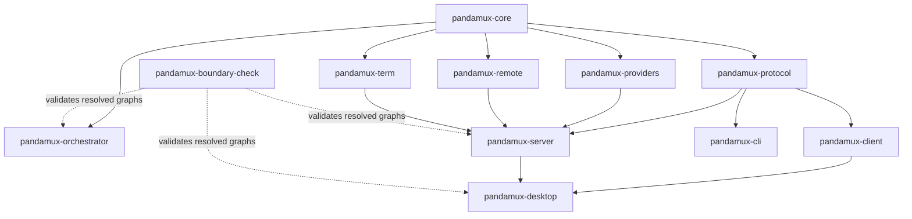
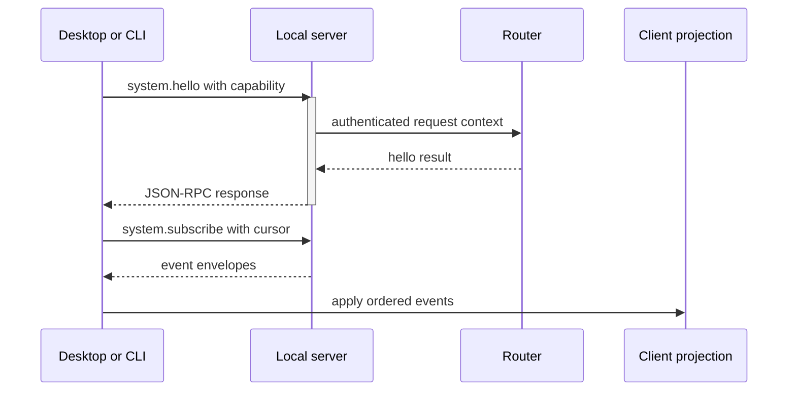
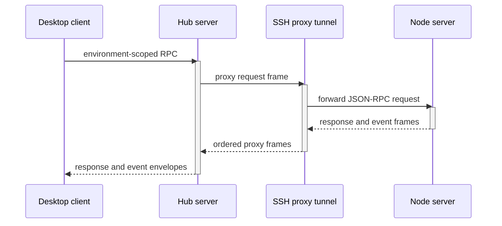

<!-- PAGE_ID: pandamux_03_architecture -->
<details>
<summary>Relevant source files</summary>

The following files were used as evidence for this page:

- [Cargo.toml:1-48](../../Cargo.toml#L1-L48)
- [CLAUDE.md:188-237](../../CLAUDE.md#L188-L237)
- [crates/pandamux-client/src/lib.rs:1-702](../../crates/pandamux-client/src/lib.rs#L1-L702)
- [crates/pandamux-desktop/src/lib.rs:1-558](../../crates/pandamux-desktop/src/lib.rs#L1-L558)
- [crates/pandamux-orchestrator/src/lib.rs:1-55](../../crates/pandamux-orchestrator/src/lib.rs#L1-L55)
- [crates/pandamux-orchestrator/src/compatibility.rs:1-501](../../crates/pandamux-orchestrator/src/compatibility.rs#L1-L501)
- [crates/pandamux-orchestrator/src/bundle.rs:1-1157](../../crates/pandamux-orchestrator/src/bundle.rs#L1-L1157)
- [crates/pandamux-orchestrator/src/state.rs:1-1300](../../crates/pandamux-orchestrator/src/state.rs#L1-L1300)
- [crates/pandamux-protocol/src/lib.rs:1-245](../../crates/pandamux-protocol/src/lib.rs#L1-L245)
- [crates/pandamux-server/src/lib.rs:1-101](../../crates/pandamux-server/src/lib.rs#L1-L101)
- [tools/pandamux-boundary-check/src/lib.rs:1-761](../../tools/pandamux-boundary-check/src/lib.rs#L1-L761)

</details>

# Architecture

> **Related Pages**: [Core Domain](CORE_DOMAIN.md), [Application Runtime](APP_RUNTIME.md), [Local IPC and Security](../features/NAMED_PIPE_IPC.md)

---

<!-- BEGIN:AUTOGEN pandamux_03_architecture_crates -->
## Workspace and Crate Boundaries

PandaMUX has ten product crates plus one workspace validation tool. Domain, orchestration, and wire contracts sit below server, client, CLI, and desktop composition; terminal and SSH implementation details remain in dedicated crates rather than leaking into those contracts ([Cargo.toml:1-14](../../Cargo.toml#L1-L14), [lib.rs:368-416](../../tools/pandamux-boundary-check/src/lib.rs#L368-L416)).

| Crate | Primary responsibility | Boundary evidence |
|---|---|---|
| `pandamux-core` | Framework-free IDs, threads, events, policy, settings, routing, and usage types | Foundation for pure domain consumers ([CLAUDE.md:208-208](../../CLAUDE.md#L208-L208)) |
| `pandamux-orchestrator` | Pure Phase 5A schema, bundle, DAG, routing, approval, proposal-parse, and run-state engine | Its public surface is value-to-value behavior, and forbidden transitive runtime implementations are rejected ([lib.rs:3-55](../../crates/pandamux-orchestrator/src/lib.rs#L3-L55), [lib.rs:614-647](../../tools/pandamux-boundary-check/src/lib.rs#L614-L647)) |
| `pandamux-protocol` | Versioned JSON-RPC, subscriptions, terminal, settings, usage, and proxy messages | Carries wire values without importing implementation crates ([CLAUDE.md:211-211](../../CLAUDE.md#L211-L211)) |
| `pandamux-providers` | Provider drivers and process supervision | Runtime implementation remains outside the pure orchestrator ([CLAUDE.md:195-195](../../CLAUDE.md#L195-L195)) |
| `pandamux-remote` | SSH pool, bootstrap, command execution, SFTP, proxy tunnels, and worktree bundles | Server remains the production composition owner ([CLAUDE.md:212-212](../../CLAUDE.md#L212-L212)) |
| `pandamux-term` | Feature-split grid and PTY primitives | Server resolves exactly `pty`; desktop resolves exactly `grid` ([lib.rs:524-612](../../tools/pandamux-boundary-check/src/lib.rs#L524-L612)) |
| `pandamux-server` | Store, router, providers, terminals, remote environments, and Hub/node runtime | Exposes the production composition surface ([lib.rs:1-58](../../crates/pandamux-server/src/lib.rs#L1-L58)) |
| `pandamux-client` | Event projections, client state, usage presentation, and transport seam | Exports projections and a mockable transport without UI types ([lib.rs:1-19](../../crates/pandamux-client/src/lib.rs#L1-L19)) |
| `pandamux-desktop` | GPUI shell and the server bridge | Re-exports view state and bridge types from focused modules ([lib.rs:3-60](../../crates/pandamux-desktop/src/lib.rs#L3-L60)) |
| `pandamux-cli` | Authenticated command-line and MCP adapter | Client entry point without UI ownership ([CLAUDE.md:200-200](../../CLAUDE.md#L200-L200)) |
| `pandamux-boundary-check` | Target-resolved Cargo graph and feature validation | Validates the locked graph for five declared targets and reports stable violation codes ([lib.rs:9-15](../../tools/pandamux-boundary-check/src/lib.rs#L9-L15), [lib.rs:368-416](../../tools/pandamux-boundary-check/src/lib.rs#L368-L416)) |


```mermaid
graph TD
    Core["pandamux-core"] --> Protocol["pandamux-protocol"]
    Core --> Orchestrator["pandamux-orchestrator"]
    Core --> Providers["pandamux-providers"]
    Core --> Remote["pandamux-remote"]
    Core --> Term["pandamux-term"]
    Protocol --> Server["pandamux-server"]
    Providers --> Server
    Remote --> Server
    Term --> Server
    Protocol --> Client["pandamux-client"]
    Client --> Desktop["pandamux-desktop"]
    Server --> Desktop
    Protocol --> Cli["pandamux-cli"]
    Checker["pandamux-boundary-check"] -. validates resolved graphs .-> Orchestrator
    Checker -. validates resolved graphs .-> Server
    Checker -. validates resolved graphs .-> Desktop
```

Sources: [Cargo.toml:1-48](../../Cargo.toml#L1-L48), [CLAUDE.md:190-221](../../CLAUDE.md#L190-L221), [lib.rs:1-55](../../crates/pandamux-orchestrator/src/lib.rs#L1-L55), [lib.rs:368-449](../../tools/pandamux-boundary-check/src/lib.rs#L368-L449), [lib.rs:524-647](../../tools/pandamux-boundary-check/src/lib.rs#L524-L647)
<!-- END:AUTOGEN pandamux_03_architecture_crates -->

---

<!-- BEGIN:AUTOGEN pandamux_03_architecture_ownership -->
## State and Process Ownership

The server owns durable and executable state; clients own projections and presentation state. This prevents the desktop from becoming a second authority for threads, provider processes, terminals, event ordering, or remote routing ([CLAUDE.md:197-215](../../CLAUDE.md#L197-L215), [CLAUDE.md:221-223](../../CLAUDE.md#L221-L223)).

| Owner | State or process | Client-facing consequence |
|---|---|---|
| Server | SQLite store, provider drivers, terminal manager, attachments, environment router, usage services | Mutations are submitted as RPC requests; state is not written directly by the desktop ([lib.rs:25-58](../../crates/pandamux-server/src/lib.rs#L25-L58)) |
| Pure orchestrator | Authored-schema parsing, canonical bundles, validated plans, deterministic routes, command decisions, event reduction, and replay | Produces serializable events and effects but does not persist or execute them ([lib.rs:9-55](../../crates/pandamux-orchestrator/src/lib.rs#L9-L55), [state.rs:55-356](../../crates/pandamux-orchestrator/src/state.rs#L55-L356)) |
| Client crate | Thread/run projections, token smoothing, usage view state | Rendering state is derived from server events and can be rebuilt ([lib.rs:7-19](../../crates/pandamux-client/src/lib.rs#L7-L19)) |
| Desktop | GPUI views, composer, picker, terminal view, tray, and bridge handle | UI modules consume projections and send commands through the bridge ([lib.rs:21-60](../../crates/pandamux-desktop/src/lib.rs#L21-L60)) |
| Protocol | Serializable request, response, event, and proxy contracts | Both sides share data types without importing the other's implementation ([lib.rs:1-22](../../crates/pandamux-protocol/src/lib.rs#L1-L22)) |

The server's public composition surface makes these responsibilities explicit: `Store`, `Router`, `ThreadManager`, `TerminalServerManager`, `EnvironmentRouter`, and `ProxyEnvironmentTransport` are server exports, while the client exports projection and formatting types ([lib.rs:31-58](../../crates/pandamux-server/src/lib.rs#L31-L58), [lib.rs:7-19](../../crates/pandamux-client/src/lib.rs#L7-L19)).

Sources: [CLAUDE.md:190-225](../../CLAUDE.md#L190-L225), [lib.rs:9-55](../../crates/pandamux-orchestrator/src/lib.rs#L9-L55), [state.rs:55-356](../../crates/pandamux-orchestrator/src/state.rs#L55-L356), [lib.rs:25-58](../../crates/pandamux-server/src/lib.rs#L25-L58), [lib.rs:7-19](../../crates/pandamux-client/src/lib.rs#L7-L19)
<!-- END:AUTOGEN pandamux_03_architecture_ownership -->

---

<!-- BEGIN:AUTOGEN pandamux_03_architecture_local-flow -->
## Local Request and Event Flow

Local desktop and CLI traffic uses versioned JSON-RPC. The protocol crate exports the request/response types, `system.hello` contracts, subscriptions, and event envelopes; the server authenticates and routes them, and the client reduces returned events into projections ([lib.rs:48-76](../../crates/pandamux-protocol/src/lib.rs#L48-L76), [lib.rs:7-13](../../crates/pandamux-client/src/lib.rs#L7-L13)).


```mermaid
sequenceDiagram
    participant D as Desktop or CLI
    participant S as Local server
    participant R as Router
    participant P as Client projection

    D->>S: system.hello with capability
    activate S
    S->>R: authenticated request context
    R-->>S: hello result
    S-->>D: JSON-RPC response
    deactivate S
    D->>S: system.subscribe with cursor
    S-->>D: event envelopes
    D->>P: apply ordered events
```

The shared wire surface includes thread, provider, terminal, settings, schedule, attachment, filesystem, Git, usage, and worktree contracts. `EventEnvelope` adds environment identity and sequence information around domain events, allowing projections to remain transport-agnostic ([lib.rs:24-96](../../crates/pandamux-protocol/src/lib.rs#L24-L96)).

Sources: [lib.rs:24-96](../../crates/pandamux-protocol/src/lib.rs#L24-L96), [lib.rs:7-19](../../crates/pandamux-client/src/lib.rs#L7-L19), [lib.rs:36-39](../../crates/pandamux-desktop/src/lib.rs#L36-L39)
<!-- END:AUTOGEN pandamux_03_architecture_local-flow -->

---

<!-- BEGIN:AUTOGEN pandamux_03_architecture_remote-flow -->
## Remote Node Flow

The same server binary composes a desktop-machine Hub and remote Linux nodes. The Hub owns environment routing and connects to a node through the SSH-backed proxy transport; protocol contracts remain identical on either side ([CLAUDE.md:196-212](../../CLAUDE.md#L196-L212), [lib.rs:31-47](../../crates/pandamux-server/src/lib.rs#L31-L47)).


```mermaid
sequenceDiagram
    participant U as Desktop client
    participant H as Hub server
    participant T as SSH proxy tunnel
    participant N as Node server

    U->>H: environment-scoped RPC
    activate H
    H->>T: proxy request frame
    activate T
    T->>N: forward JSON-RPC request
    activate N
    N-->>T: response and event frames
    deactivate N
    T-->>H: ordered proxy frames
    deactivate T
    H-->>U: response and event envelopes
    deactivate H
```

`pandamux-server` exposes both sides of this boundary: `serve_proxy_connection` runs on the node, while `ProxyEnvironmentTransport` and `EnvironmentRouter` run on the Hub ([lib.rs:31-47](../../crates/pandamux-server/src/lib.rs#L31-L47)). The protocol crate carries the proxy envelope and environment-scoped RPC types without importing the SSH implementation ([lib.rs:4-22](../../crates/pandamux-protocol/src/lib.rs#L4-L22)).

Sources: [CLAUDE.md:194-212](../../CLAUDE.md#L194-L212), [lib.rs:31-47](../../crates/pandamux-server/src/lib.rs#L31-L47), [lib.rs:1-22](../../crates/pandamux-protocol/src/lib.rs#L1-L22)
<!-- END:AUTOGEN pandamux_03_architecture_remote-flow -->

---

<!-- BEGIN:AUTOGEN pandamux_03_architecture_persistence -->
## Durability and Replay

Durable state and event ordering belong to the server, while the client projection is deliberately reconstructable. This split lets local reconnects and remote proxy reconnects resume from sequence cursors instead of treating the desktop's in-memory view as canonical ([CLAUDE.md:194-201](../../CLAUDE.md#L194-L201)).

| Durable concern | Authority | Replay consumer |
|---|---|---|
| Threads, turns, events, settings, schedules, usage, and attachments | Server `Store` ([lib.rs:47-58](../../crates/pandamux-server/src/lib.rs#L47-L58)) | Desktop/client projections |
| Thread and run timeline state | Ordered protocol event envelopes ([lib.rs:67-95](../../crates/pandamux-protocol/src/lib.rs#L67-L95)) | `ThreadProjection` and `RunProjection` |
| Remote event cursor | Hub-side environment transport ([lib.rs:31-47](../../crates/pandamux-server/src/lib.rs#L31-L47)) | Reconnected node proxy |
| Terminal attachment state | Server terminal manager and terminal RPC offsets ([lib.rs:73-77](../../crates/pandamux-protocol/src/lib.rs#L73-L77)) | Reattached desktop terminal grid |

The protocol test surface verifies that event envelopes retain their subscription id and sequence across serialization, and that terminal attach responses preserve replay offset and truncation state ([lib.rs:129-155](../../crates/pandamux-protocol/src/lib.rs#L129-L155), [lib.rs:213-243](../../crates/pandamux-protocol/src/lib.rs#L213-L243)).

Sources: [CLAUDE.md:194-201](../../CLAUDE.md#L194-L201), [lib.rs:67-95](../../crates/pandamux-protocol/src/lib.rs#L67-L95), [lib.rs:129-155](../../crates/pandamux-protocol/src/lib.rs#L129-L155), [lib.rs:213-243](../../crates/pandamux-protocol/src/lib.rs#L213-L243)
<!-- END:AUTOGEN pandamux_03_architecture_persistence -->

---

<!-- BEGIN:AUTOGEN pandamux_03_architecture_invariants -->
## Architectural Invariants

The repository encodes its most important boundaries as build-time checks and narrow public APIs rather than relying only on convention.

- `pandamux-core` stays independent of UI, terminal-grid, and database implementations ([CLAUDE.md:206-211](../../CLAUDE.md#L206-L211)).
- `pandamux-orchestrator` stays free of runtimes, filesystem, network, storage, UI, provider, keyring, and embedding implementations ([lib.rs:3-7](../../crates/pandamux-orchestrator/src/lib.rs#L3-L7), [lib.rs:614-647](../../tools/pandamux-boundary-check/src/lib.rs#L614-L647)).
- `pandamux-protocol` contains wire contracts and cannot import implementation crates ([CLAUDE.md:211-211](../../CLAUDE.md#L211-L211)).
- `pandamux-server` is the production composition owner for SSH remoting, PTYs, provider execution, persistence, and routing ([CLAUDE.md:197-215](../../CLAUDE.md#L197-L215), [CLAUDE.md:221-223](../../CLAUDE.md#L221-L223)).
- Desktop code holds rendering-oriented state and sends intents; it is not a durable-state writer ([CLAUDE.md:199-215](../../CLAUDE.md#L199-L215)).
- Request identity and capability scope are assigned by the accepting server transport, not accepted from request JSON ([CLAUDE.md:225-233](../../CLAUDE.md#L225-L233)).
- Full-access providers have host-user authority; the local boundary is per OS user and is not hostile same-user process isolation ([CLAUDE.md:235-237](../../CLAUDE.md#L235-L237)).
- Direct registry dependencies must be exact-pinned; path dependencies remain exempt ([lib.rs:418-449](../../tools/pandamux-boundary-check/src/lib.rs#L418-L449)).
- The boundary check reconstructs each workspace root's resolved feature graph per declared target, so indirect dependencies and default-feature leakage are visible ([lib.rs:140-339](../../tools/pandamux-boundary-check/src/lib.rs#L140-L339), [lib.rs:341-416](../../tools/pandamux-boundary-check/src/lib.rs#L341-L416)).
- GPUI snapshot alignment, desktop-only GPUI ownership, PTY/grid separation, future embedding isolation, and native-stack uniqueness are executable invariants ([lib.rs:451-698](../../tools/pandamux-boundary-check/src/lib.rs#L451-L698)).

```bash
cargo test --locked -p pandamux-boundary-check
cargo run --locked -p pandamux-boundary-check --quiet
```

The fixture test makes the guard falsifiable before the real locked graph is accepted ([CLAUDE.md:216-219](../../CLAUDE.md#L216-L219)).

Sources: [CLAUDE.md:206-219](../../CLAUDE.md#L206-L219), [lib.rs:140-449](../../tools/pandamux-boundary-check/src/lib.rs#L140-L449), [lib.rs:451-698](../../tools/pandamux-boundary-check/src/lib.rs#L451-L698)
<!-- END:AUTOGEN pandamux_03_architecture_invariants -->

---
