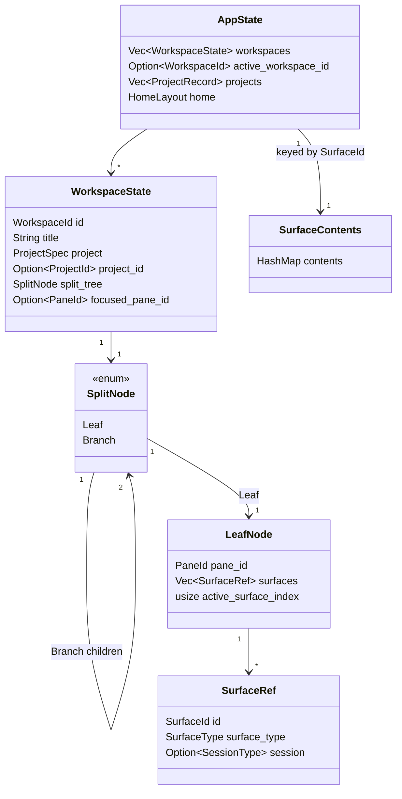

<!-- PAGE_ID: pandamux_04_core-domain -->
<details>
<summary>Relevant source files</summary>

The following files were used as evidence for this page:

- [lib.rs:1-59](crates/pandamux-core/src/lib.rs#L1-L59)
- [ids.rs:1-48](crates/pandamux-core/src/ids.rs#L1-L48)
- [state.rs:1-1289](crates/pandamux-core/src/state.rs#L1-L1289)
- [surface_content.rs:1-76](crates/pandamux-core/src/surface_content.rs#L1-L76)
- [split_tree.rs:1-825](crates/pandamux-core/src/split_tree.rs#L1-L825)
- [project.rs:1-441](crates/pandamux-core/src/project.rs#L1-L441)
- [project_registry.rs:1-459](crates/pandamux-core/src/project_registry.rs#L1-L459)
- [agent.rs:1-194](crates/pandamux-core/src/agent.rs#L1-L194)
- [sidebar.rs:1-117](crates/pandamux-core/src/sidebar.rs#L1-L117)
- [notification.rs:1-238](crates/pandamux-core/src/notification.rs#L1-L238)

</details>

# Core Domain and State

> **Related Pages**: [Architecture](ARCHITECTURE.md), [Configuration](CONFIGURATION.md)

---

<!-- BEGIN:AUTOGEN pandamux_04_core-domain_overview -->
## Overview and Module Map

`pandamux-core` holds every domain type that is canonical state or wire protocol: workspaces, the split tree, projects, agents, sidebar, notifications, settings, and branded ids. It has zero dependency on Iced, so `pandamux-ui` can only ever consume it through plain data and the crate-isolation invariant stays enforceable by `scripts/check-rust-boundaries.ps1`.

The crate root re-exports its public surface from sixteen modules ([lib.rs:1-16](crates/pandamux-core/src/lib.rs#L1-L16)):

| Module | Responsibility |
|---|---|
| `agent` | Registry of live agent-backed terminal surfaces (id, placement, status) ([lib.rs:18](crates/pandamux-core/src/lib.rs#L18)) |
| `config` | Theme/appearance types, hex parsing, Windows Terminal/Ghostty theme import ([lib.rs:19-21](crates/pandamux-core/src/lib.rs#L19-L21)) |
| `home` | The Home dashboard layout (pinned/relaunchable panes, spec 2.5) ([lib.rs:22](crates/pandamux-core/src/lib.rs#L22)) |
| `i18n` | Locale and localizer for UI strings ([lib.rs:23](crates/pandamux-core/src/lib.rs#L23)) |
| `ids` | Branded newtype ids for every entity (`WorkspaceId`, `PaneId`, ...) ([lib.rs:24](crates/pandamux-core/src/lib.rs#L24)) |
| `keymap` | Data-driven keymap: actions, key chords, modifiers ([lib.rs:25-27](crates/pandamux-core/src/lib.rs#L25-L27)) |
| `notification` | The backend-owned notification store (add/read/evict) ([lib.rs:28](crates/pandamux-core/src/lib.rs#L28)) |
| `project` | `ProjectLocation`/`ProjectKey`/path normalization helpers ([lib.rs:29-34](crates/pandamux-core/src/lib.rs#L29-L34)) |
| `project_registry` | Stable `ProjectRecord` identity above `ProjectKey` (spec 1.4) ([lib.rs:35-39](crates/pandamux-core/src/lib.rs#L35-L39)) |
| `protocol` | The pipe wire types: `RpcRequest`/`RpcResponse`/`RpcError` ([lib.rs:40](crates/pandamux-core/src/lib.rs#L40)) |
| `settings` | User settings schema (keyboard/terminal/UI) and get/set helpers ([lib.rs:41-44](crates/pandamux-core/src/lib.rs#L41-L44)) |
| `sidebar` | Status/progress/log state for the CLI-driven sidebar ([lib.rs:45](crates/pandamux-core/src/lib.rs#L45)) |
| `split_tree` | The immutable `SplitNode` binary tree and its mutation helpers ([lib.rs:46-52](crates/pandamux-core/src/lib.rs#L46-L52)) |
| `ssh` | SSH host profiles, auth config, clipboard policy, config parsing ([lib.rs:53](crates/pandamux-core/src/lib.rs#L53)) |
| `state` | `AppState`/`WorkspaceState` plus the `AppIntent` -> `AppDelta` state machine ([lib.rs:54-58](crates/pandamux-core/src/lib.rs#L54-L58)) |
| `surface_content` | Backend-owned text content for markdown/diff surfaces ([lib.rs:59](crates/pandamux-core/src/lib.rs#L59)) |

This page covers `state`, `surface_content`, `split_tree`, `project`, `project_registry`, `agent`, `sidebar`, `notification`, and `ids`; `config`, `home`, `i18n`, `keymap`, `protocol`, `settings`, and `ssh` are documented elsewhere.

Sources: [lib.rs:1-59](crates/pandamux-core/src/lib.rs#L1-L59)
<!-- END:AUTOGEN pandamux_04_core-domain_overview -->

---

<!-- BEGIN:AUTOGEN pandamux_04_core-domain_ids -->
## Branded IDs

Every entity in the domain model is addressed by a branded newtype string id rather than a bare `String`, so a `PaneId` can never be passed where a `SurfaceId` is expected. All six ids share one implementation via the `prefixed_id!` macro, which derives `Clone`/`Debug`/`Eq`/`Ord`/`Hash`/`Serialize`/`Deserialize`, generates a UUID-suffixed value, and implements `Display` and `From<&str>`/`From<String>` ([ids.rs:1-41](crates/pandamux-core/src/ids.rs#L1-L41)):

```rust
macro_rules! prefixed_id {
    ($name:ident, $prefix:literal) => {
        #[derive(Clone, Debug, PartialEq, Eq, PartialOrd, Ord, Hash, Serialize, Deserialize)]
        pub struct $name(String);

        impl $name {
            pub fn new(value: impl Into<String>) -> Self {
                Self(value.into())
            }

            pub fn generate() -> Self {
                Self(format!("{}{}", $prefix, uuid::Uuid::new_v4()))
            }
```

Sources: [ids.rs:4-21](crates/pandamux-core/src/ids.rs#L4-L21)

Six ids are instantiated from the macro, each with its own string prefix so a serialized id is self-describing in logs and session files ([ids.rs:43-48](crates/pandamux-core/src/ids.rs#L43-L48)):

| Type | Prefix | Identifies |
|---|---|---|
| `WorkspaceId` | `ws-` | A workspace (one tab/project instance) ([ids.rs:43](crates/pandamux-core/src/ids.rs#L43)) |
| `PaneId` | `pane-` | A pane (a leaf position in the split tree) ([ids.rs:44](crates/pandamux-core/src/ids.rs#L44)) |
| `SurfaceId` | `surf-` | A surface (one terminal/markdown/diff/browser tab inside a pane) ([ids.rs:45](crates/pandamux-core/src/ids.rs#L45)) |
| `WindowId` | `win-` | An OS window ([ids.rs:46](crates/pandamux-core/src/ids.rs#L46)) |
| `SshProfileId` | `ssh-` | A saved SSH host profile ([ids.rs:47](crates/pandamux-core/src/ids.rs#L47)) |
| `ProjectId` | `proj-` | A `ProjectRecord` in the project registry ([ids.rs:48](crates/pandamux-core/src/ids.rs#L48)) |

`new()` accepts any string (used when deserializing ids from a session file or a pipe request), while `generate()` mints a fresh id for newly created entities ([ids.rs:10-16](crates/pandamux-core/src/ids.rs#L10-L16)).

Sources: [ids.rs:1-48](crates/pandamux-core/src/ids.rs#L1-L48)
<!-- END:AUTOGEN pandamux_04_core-domain_ids -->

---

<!-- BEGIN:AUTOGEN pandamux_04_core-domain_state -->
## Workspace State Model

`AppState` is the top-level, single-writer document: a session-persisted list of workspaces, which workspace is active, the project registry, and the Home layout ([state.rs:16-31](crates/pandamux-core/src/state.rs#L16-L31)).

| Field | Type | Notes |
|---|---|---|
| `schema_version` | `u32` | Defaults via serde; bumped only for explicit `session.json` migrations, not additive fields ([state.rs:12-20](crates/pandamux-core/src/state.rs#L12-L20)) |
| `workspaces` | `Vec<WorkspaceState>` | Every open workspace ([state.rs:21](crates/pandamux-core/src/state.rs#L21)) |
| `active_workspace_id` | `Option<WorkspaceId>` | `None` only in the empty state once every workspace is closed (spec 1.5) ([state.rs:22-24](crates/pandamux-core/src/state.rs#L22-L24)) |
| `projects` | `Vec<ProjectRecord>` | The project registry (spec 1.4) ([state.rs:25-27](crates/pandamux-core/src/state.rs#L25-L27)) |
| `home` | `HomeLayout` | The persisted Home dashboard layout (spec 2.5) ([state.rs:28-30](crates/pandamux-core/src/state.rs#L28-L30)) |

`WorkspaceState` is one workspace: its title/shell, the `ProjectSpec` it was launched against, the owning `ProjectId`, its `SplitNode` layout, and focus/zoom pointers into that tree ([state.rs:33-48](crates/pandamux-core/src/state.rs#L33-L48)). `WorkspaceSummary` is the read-only projection returned to CLI/UI listings, dropping the split tree and focus state ([state.rs:50-57](crates/pandamux-core/src/state.rs#L50-L57)). `Capabilities` reports what the running backend supports over the pipe, notably `browser: false` since the CDP surface was dropped from the native rewrite ([state.rs:59-65](crates/pandamux-core/src/state.rs#L59-L65)).

`AppState::apply` is the single entry point for every mutation: it takes an `AppIntent` (tagged `System`/`Workspace`/`Pane`/`Surface`/`Project`/`Home`) and returns a `Result<AppDelta, String>`, so the named-pipe server and the Iced UI submit identical intents to the identical dispatcher ([state.rs:68-76](crates/pandamux-core/src/state.rs#L68-L76), [state.rs:417-426](crates/pandamux-core/src/state.rs#L417-L426)). Errors are plain `String`s returned instead of panics, since a pipe client can request an id that no longer exists (e.g. `resolve_workspace_id` fails cleanly on the empty state) ([state.rs:504-511](crates/pandamux-core/src/state.rs#L504-L511)).

Non-terminal surface bodies (markdown/diff) are not part of `AppState`'s split tree at all; they live in a separate `SurfaceContents` map keyed by `SurfaceId`, owned alongside `AppState` on the same single-writer path, and pruned to whatever surfaces are still live after a mutation that can close one ([surface_content.rs:9-49](crates/pandamux-core/src/surface_content.rs#L9-L49)).



`AppIntent` and `AppDelta` are the request/response halves of this state machine. `AppIntent` variants match the pipe's `domain`/`type` shape (`WorkspaceIntent::Create`, `PaneIntent::Split`, `SurfaceIntent::Move`, `ProjectIntent::Merge`, `HomeIntent::Pin`, and so on) ([state.rs:69-247](crates/pandamux-core/src/state.rs#L69-L247)); `AppDelta` mirrors them one-for-one with the resulting data (`WorkspaceCreated`, `PaneSplit`, `SurfaceMoved`, ...) so the same delta can update both the UI's read-projection and any subscribed pipe clients ([state.rs:271-384](crates/pandamux-core/src/state.rs#L271-L384)).

Sources: [state.rs:1-105](crates/pandamux-core/src/state.rs#L1-L105), [state.rs:271-426](crates/pandamux-core/src/state.rs#L271-L426), [state.rs:504-511](crates/pandamux-core/src/state.rs#L504-L511), [surface_content.rs:1-49](crates/pandamux-core/src/surface_content.rs#L1-L49)
<!-- END:AUTOGEN pandamux_04_core-domain_state -->

---

<!-- BEGIN:AUTOGEN pandamux_04_core-domain_split -->
## Split Tree

The layout of one workspace is an immutable binary tree of `SplitNode`: either a `Leaf` holding one pane's tabs, or a `Branch` holding a direction, a resize ratio, and exactly two children ([split_tree.rs:101-106](crates/pandamux-core/src/split_tree.rs#L101-L106)):

```rust
#[derive(Clone, Debug, PartialEq, Serialize, Deserialize)]
#[serde(rename_all = "camelCase")]
pub struct BranchNode {
    pub direction: SplitDirection,
    pub ratio: f32,
    pub children: Box<[SplitNode; 2]>,
}

#[derive(Clone, Debug, PartialEq, Serialize, Deserialize)]
#[serde(tag = "type", rename_all = "lowercase")]
pub enum SplitNode {
    Leaf(LeafNode),
    Branch(BranchNode),
}
```

Sources: [split_tree.rs:93-106](crates/pandamux-core/src/split_tree.rs#L93-L106)

A `LeafNode` is one pane: its `PaneId`, an ordered list of `SurfaceRef` tabs, and which tab is active ([split_tree.rs:85-91](crates/pandamux-core/src/split_tree.rs#L85-L91)). A `SurfaceRef` carries its `SurfaceType` (`Terminal`/`Markdown`/`Diff`/`Browser`), an optional `SessionType` describing what program runs in a terminal surface, and an optional user-set display name ([split_tree.rs:52-76](crates/pandamux-core/src/split_tree.rs#L52-L76)). `SessionType` covers the plain shell plus the agent-CLI variants the launcher can start ([split_tree.rs:23-36](crates/pandamux-core/src/split_tree.rs#L23-L36)):

| `SessionType` variant | Meaning | Label |
|---|---|---|
| `Terminal` (default) | The project's default shell ([split_tree.rs:25](crates/pandamux-core/src/split_tree.rs#L25)) | `"Terminal"` |
| `PowerShell { program }` | A specific PowerShell flavor ("pwsh"/"powershell") ([split_tree.rs:26-29](crates/pandamux-core/src/split_tree.rs#L26-L29)) | `"PowerShell"` |
| `Claude` | Claude Code CLI as the PTY program ([split_tree.rs:30](crates/pandamux-core/src/split_tree.rs#L30)) | `"Claude"` |
| `Codex` | Codex CLI ([split_tree.rs:31](crates/pandamux-core/src/split_tree.rs#L31)) | `"Codex"` |
| `Gemini` | Gemini CLI ([split_tree.rs:32](crates/pandamux-core/src/split_tree.rs#L32)) | `"Gemini"` |
| `Custom { command }` | Any other launch command ([split_tree.rs:33-35](crates/pandamux-core/src/split_tree.rs#L33-L35)) | `"Custom"` |

Every mutation is pure: each helper takes `&SplitNode` and returns a new `SplitNode`, structurally sharing unaffected subtrees (an unchanged branch's `children` clone is skipped when both sides compare equal) ([split_tree.rs:169-177](crates/pandamux-core/src/split_tree.rs#L169-L177)).

| Function | Purpose |
|---|---|
| `create_leaf` / `create_leaf_with_ids` | Build a fresh single-surface leaf, generating or accepting explicit ids ([split_tree.rs:114-132](crates/pandamux-core/src/split_tree.rs#L114-L132)) |
| `split_node` | Replace a target leaf with a `Branch` holding the original leaf and a new one, ratio 0.5 ([split_tree.rs:134-179](crates/pandamux-core/src/split_tree.rs#L134-L179)) |
| `remove_leaf` | Drop a pane by id; a branch collapses to its surviving child when the other side empties ([split_tree.rs:181-211](crates/pandamux-core/src/split_tree.rs#L181-L211)) |
| `find_leaf` / `find_pane_id_for_surface` | Look up a leaf by pane id, or the owning pane id for a surface id ([split_tree.rs:213-225](crates/pandamux-core/src/split_tree.rs#L213-L225), [split_tree.rs:252-268](crates/pandamux-core/src/split_tree.rs#L252-L268)) |
| `replace_leaf` | Swap in a mutated leaf (used for rename/session-type/focus updates) ([split_tree.rs:227-250](crates/pandamux-core/src/split_tree.rs#L227-L250)) |
| `update_ratio` / `adjust_pane_ratio` | Set or nudge (clamped 0.1-0.9) a branch's resize ratio ([split_tree.rs:270-305](crates/pandamux-core/src/split_tree.rs#L270-L305), [split_tree.rs:318-361](crates/pandamux-core/src/split_tree.rs#L318-L361), [split_tree.rs:662-664](crates/pandamux-core/src/split_tree.rs#L662-L664)) |
| `get_all_pane_ids` | Flatten every pane id in the tree, left-to-right ([split_tree.rs:307-316](crates/pandamux-core/src/split_tree.rs#L307-L316)) |
| `build_grid_layout` | Absorb every other pane's surfaces into the anchor, then rebuild an N-cell grid of new panes (`ceil(sqrt(count))` columns) ([split_tree.rs:384-464](crates/pandamux-core/src/split_tree.rs#L384-L464)) |
| `move_surface` | Drag-drop relocate a surface per a `DropZone` (`Center` appends as a tab; directional zones split a new pane) ([split_tree.rs:512-574](crates/pandamux-core/src/split_tree.rs#L512-L574)) |

`DropZone` (`Center`/`Left`/`Right`/`Top`/`Bottom`) encodes plan Section 12.3's drag-drop semantics; directional zones map to a `SplitDirection` plus whether the moved leaf goes first, while `Center` has no split ([split_tree.rs:469-502](crates/pandamux-core/src/split_tree.rs#L469-L502)). `move_surface` returns `None` for a no-op drop, such as a pane's only tab dropped back onto itself, so the caller leaves the tree untouched ([split_tree.rs:517-544](crates/pandamux-core/src/split_tree.rs#L517-L544)).

Sources: [split_tree.rs:1-133](crates/pandamux-core/src/split_tree.rs#L1-L133), [split_tree.rs:181-268](crates/pandamux-core/src/split_tree.rs#L181-L268), [split_tree.rs:384-574](crates/pandamux-core/src/split_tree.rs#L384-L574), [split_tree.rs:662-674](crates/pandamux-core/src/split_tree.rs#L662-L674)
<!-- END:AUTOGEN pandamux_04_core-domain_split -->

---

<!-- BEGIN:AUTOGEN pandamux_04_core-domain_projects -->
## Projects and Registry

A workspace's launch location is described by `ProjectLocation`, a tagged enum over the three ways a project can be opened, wrapped in `ProjectSpec` ([project.rs:15-32](crates/pandamux-core/src/project.rs#L15-L32)):

| `ProjectLocation` variant | Fields | Meaning |
|---|---|---|
| `Legacy` (default) | none | Pre-1.4 workspaces with no folder identity; never resolves to a project ([project.rs:17](crates/pandamux-core/src/project.rs#L17), [project_registry.rs:186-187](crates/pandamux-core/src/project_registry.rs#L186-L187)) |
| `Local` | `cwd`, `shell` | A local filesystem project ([project.rs:18-21](crates/pandamux-core/src/project.rs#L18-L21)) |
| `Ssh` | `profile_id`, `remote_cwd` | A remote project reached over an `SshProfileId` ([project.rs:22-25](crates/pandamux-core/src/project.rs#L22-L25)) |

`ProjectKey` derives a normalized identity string from a location (`"local:<lowercased-path>"` or `"ssh:<profile>:<posix-path>"`), so the same folder opened with different casing or slash style still keys identically ([project.rs:34-59](crates/pandamux-core/src/project.rs#L34-L59)). The module also owns platform-specific folder helpers used by the project picker: `normalize_windows_path`/`normalize_posix_path`, `local_parent`/`posix_parent`, `local_breadcrumbs`/`posix_breadcrumbs`, and `strip_windows_verbatim` for stripping `\\?\` prefixes off `std::fs::canonicalize` output ([project.rs:134-297](crates/pandamux-core/src/project.rs#L134-L297)).

`ProjectRecord` is the stable identity that lives above `ProjectKey`, held in `AppState.projects` as config, never as a marker file inside a user's repo ([project_registry.rs:18-35](crates/pandamux-core/src/project_registry.rs#L18-L35)):

| Field | Type | Notes |
|---|---|---|
| `id` | `ProjectId` | Stable across renames/merges ([project_registry.rs:21](crates/pandamux-core/src/project_registry.rs#L21)) |
| `name` | `String` | User-renameable display name ([project_registry.rs:23](crates/pandamux-core/src/project_registry.rs#L23)) |
| `matchers` | `Vec<ProjectMatcher>` | Location > GitRemote > FolderName precedence ([project_registry.rs:24-25](crates/pandamux-core/src/project_registry.rs#L24-L25)) |
| `known_locations` | `Vec<ProjectLocation>` | Most-recent-first, capped at 8 ([project_registry.rs:27-28](crates/pandamux-core/src/project_registry.rs#L27-L28), [project_registry.rs:319-321](crates/pandamux-core/src/project_registry.rs#L319-L321)) |
| `manual` | `bool` | Set by user rename/merge/split; stops heuristics from overriding a human decision ([project_registry.rs:31-34](crates/pandamux-core/src/project_registry.rs#L31-L34)) |

`ProjectMatcher` is one of `Location { key }`, `GitRemote { url }`, or `FolderName { name }` ([project_registry.rs:37-50](crates/pandamux-core/src/project_registry.rs#L37-L50)); `LaunchConfig` pairs a `ProjectId` with a `SessionType` so favorites/recents and Home-pane pins can relaunch the right project running the right thing (spec 2.3/2.5) ([project_registry.rs:59-67](crates/pandamux-core/src/project_registry.rs#L59-L67)).

| Function | Purpose |
|---|---|
| `normalize_git_remote` | Lowercase, strip credentials/scheme/`.git`, and convert scp-like syntax to `host/org/repo` ([project_registry.rs:73-105](crates/pandamux-core/src/project_registry.rs#L73-L105)) |
| `normalize_folder_name` | Last path segment, lowercased, for the folder-name heuristic ([project_registry.rs:109-127](crates/pandamux-core/src/project_registry.rs#L109-L127)) |
| `parse_git_remote_url` | Hand-rolled `.git/config` parser preferring the `origin` remote ([project_registry.rs:131-158](crates/pandamux-core/src/project_registry.rs#L131-L158)) |
| `resolve_project_id` | Match an incoming location against the registry (Location, then GitRemote, then FolderName), proposing a new record when nothing matches; hosts never participate ([project_registry.rs:180-230](crates/pandamux-core/src/project_registry.rs#L180-L230)) |
| `ensure_project_registry` | Bulk-assign `project_id` to every workspace lacking one at load time, then prune unreferenced non-manual records ([project_registry.rs:237-272](crates/pandamux-core/src/project_registry.rs#L237-L272)) |
| `assign_workspace_project` | Per-launch resolve-or-create for one workspace ([project_registry.rs:277-307](crates/pandamux-core/src/project_registry.rs#L277-L307)) |
| `record_location` | Remember a location on a record (deduped, most-recent-first, capped at 8) and add its exact-match matcher ([project_registry.rs:311-332](crates/pandamux-core/src/project_registry.rs#L311-L332)) |

`AppState::apply_project` drives the user-facing mutations: `Rename` and `Merge` both set `manual = true` on the surviving record; `Split` detaches one workspace into a fresh record (the undo path for a wrong merge) and marks the old record `manual` too, so heuristics stop re-merging what a human just separated ([state.rs:1092-1221](crates/pandamux-core/src/state.rs#L1092-L1221)).

Sources: [project.rs:1-59](crates/pandamux-core/src/project.rs#L1-L59), [project.rs:134-297](crates/pandamux-core/src/project.rs#L134-L297), [project_registry.rs:1-332](crates/pandamux-core/src/project_registry.rs#L1-L332), [state.rs:1092-1221](crates/pandamux-core/src/state.rs#L1092-L1221)
<!-- END:AUTOGEN pandamux_04_core-domain_projects -->

---

<!-- BEGIN:AUTOGEN pandamux_04_core-domain_peripherals -->
## Agents, Sidebar, and Notifications

Three small backend-owned stores round out the domain model, each ported from the pre-rewrite Electron slices and each holding canonical state alongside `AppState` rather than deriving it.

### Agents (`agent.rs`)

An agent is a terminal surface running a specific command (typically `claude ...`) instead of the plain workspace shell; the registry tracks its identity, placement, and status so the CLI (`agent status`/`agent list`) and the pandamux-orchestrator plugin can coordinate ([agent.rs:1-8](crates/pandamux-core/src/agent.rs#L1-L8)).

| Type | Fields / Variants | Purpose |
|---|---|---|
| `SpawnStrategy` | `Distribute` (default, round-robin tabs), `Stack` (all as tabs in the focused pane), `Split` (one new pane each) | Batch-spawn distribution ([agent.rs:14-34](crates/pandamux-core/src/agent.rs#L14-L34)) |
| `AgentStatus` | `Starting`, `Running`, `Exited` | Lifecycle status ([agent.rs:36-42](crates/pandamux-core/src/agent.rs#L36-L42)) |
| `AgentInfo` | `id`, `label`, `command`, `cwd`, `workspace_id`, `pane_id`, `surface_id`, `status` | One registered agent ([agent.rs:44-55](crates/pandamux-core/src/agent.rs#L44-L55)) |
| `AgentRegistry` | `agents: Vec<AgentInfo>`, monotonic `seq` | The live set; ids are `agent-1`, `agent-2`, ... ([agent.rs:57-62](crates/pandamux-core/src/agent.rs#L57-L62)) |

`AgentRegistry::prune_missing` drops entries whose surface id is no longer in the live set and returns the removed agents, so a closed surface's agent record does not linger ([agent.rs:116-127](crates/pandamux-core/src/agent.rs#L116-L127)).

### Sidebar (`sidebar.rs`)

`SidebarState` holds the status key/value pairs, an optional progress bar, and a capped activity log that the CLI (`set-status`/`set-progress`/`log`/`sidebar-state`) and the orchestrator plugin write to report progress; the UI surfaces the progress value in the status bar ([sidebar.rs:1-5](crates/pandamux-core/src/sidebar.rs#L1-L5)).

| Type | Fields | Notes |
|---|---|---|
| `Progress` | `value: u8`, `label: Option<String>` | Clamped to 0-100 on `set_progress` ([sidebar.rs:9-15](crates/pandamux-core/src/sidebar.rs#L9-L15), [sidebar.rs:62-67](crates/pandamux-core/src/sidebar.rs#L62-L67)) |
| `StatusEntry` | `key`, `value` | An empty value clears the key instead of storing it ([sidebar.rs:17-22](crates/pandamux-core/src/sidebar.rs#L17-L22), [sidebar.rs:48-59](crates/pandamux-core/src/sidebar.rs#L48-L59)) |
| `LogEntry` | `level`, `message` | One capped log line ([sidebar.rs:24-29](crates/pandamux-core/src/sidebar.rs#L24-L29)) |
| `SidebarState` | `statuses`, `progress`, `logs` | `MAX_LOGS = 200`; oldest lines drop first ([sidebar.rs:31-41](crates/pandamux-core/src/sidebar.rs#L31-L41), [sidebar.rs:73-83](crates/pandamux-core/src/sidebar.rs#L73-L83)) |

### Notifications (`notification.rs`)

`Notifications` mirrors the old renderer slice's add / mark-read / mark-all-read / clear / jump-to-unread behavior as canonical backend state instead of UI-local state ([notification.rs:1-6](crates/pandamux-core/src/notification.rs#L1-L6)).

| Type | Fields / Variants | Notes |
|---|---|---|
| `NotificationSource` | `Build`, `Agent`, `Deploy`, `Port`, `Generic` | Drives the source dot color in the panel ([notification.rs:11-20](crates/pandamux-core/src/notification.rs#L11-L20)) |
| `NotificationInfo` | `id`, `workspace_id`, `surface_id`, `title`, `body`, `source`, `timestamp_ms`, `read` | The persisted/serialized shape ([notification.rs:22-34](crates/pandamux-core/src/notification.rs#L22-L34)) |
| `NewNotification` | same minus `id`/`timestamp_ms`/`read` | The construction input; `Notifications::push` assigns the rest ([notification.rs:37-56](crates/pandamux-core/src/notification.rs#L37-L56), [notification.rs:100-112](crates/pandamux-core/src/notification.rs#L100-L112)) |
| `Notifications` | `items: Vec<NotificationInfo>` | `MAX = 200` ([notification.rs:58-71](crates/pandamux-core/src/notification.rs#L58-L71)) |

When over the cap, `evict_overflow` drops the oldest *read* notifications first, and only falls back to dropping the oldest overall once every remaining item is unread ([notification.rs:148-169](crates/pandamux-core/src/notification.rs#L148-L169)).

Sources: [agent.rs:1-127](crates/pandamux-core/src/agent.rs#L1-L127), [sidebar.rs:1-83](crates/pandamux-core/src/sidebar.rs#L1-L83), [notification.rs:1-169](crates/pandamux-core/src/notification.rs#L1-L169)
<!-- END:AUTOGEN pandamux_04_core-domain_peripherals -->

---
