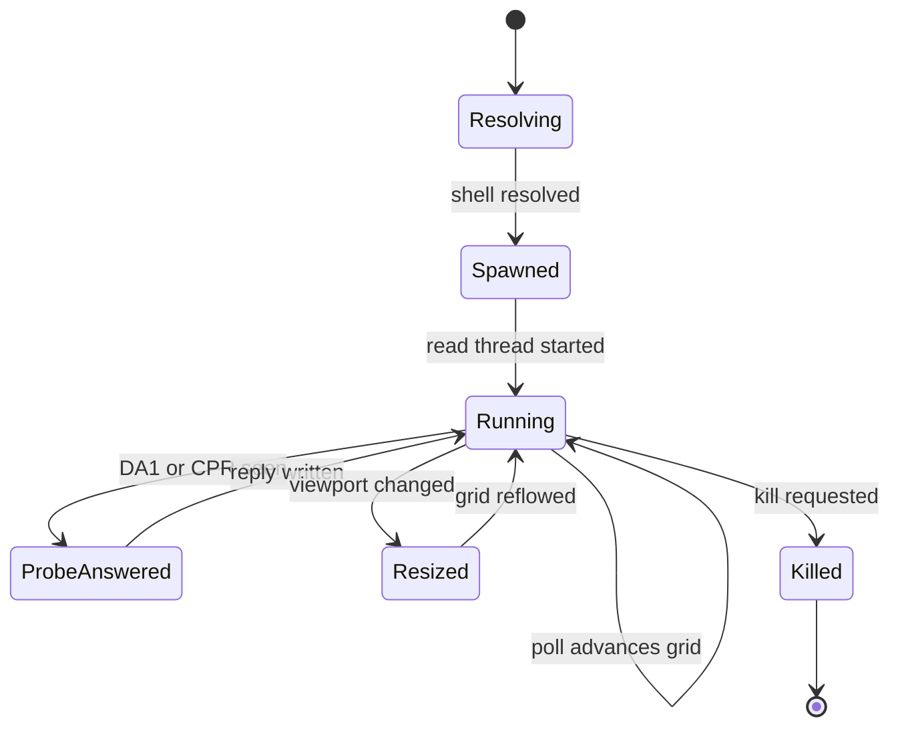

<!-- PAGE_ID: pandamux_05_terminal-engine -->
<details>
<summary>Relevant source files</summary>

The following files were used as evidence for this page:

- [lib.rs:1-25](crates/pandamux-term/src/lib.rs#L1-L25)
- [grid.rs:1-866](crates/pandamux-term/src/grid.rs#L1-L866)
- [pty.rs:1-239](crates/pandamux-term/src/pty.rs#L1-L239)
- [session.rs:1-510](crates/pandamux-term/src/session.rs#L1-L510)
- [shell.rs:1-273](crates/pandamux-term/src/shell.rs#L1-L273)
- [search.rs:1-192](crates/pandamux-term/src/search.rs#L1-L192)
- [links.rs:1-159](crates/pandamux-term/src/links.rs#L1-L159)
- [clipboard.rs:1-97](crates/pandamux-term/src/clipboard.rs#L1-L97)
- [cwd.rs:1-199](crates/pandamux-term/src/cwd.rs#L1-L199)

</details>

# Terminal Engine

> **Related Pages**: [SSH Remote Surfaces](../features/SSH_REMOTE.md), [Shell Integration and Status](../features/SHELL_INTEGRATION.md)

---

<!-- BEGIN:AUTOGEN pandamux_05_terminal-engine_overview -->
## Overview and Isolation

`pandamux-term` is the terminal engine crate: it wraps `alacritty_terminal` for grid/ANSI parsing, `portable-pty` for local PTYs, and hand-built search/link/clipboard/cwd logic, and exposes only PandaMUX's own types across its public API (`alacritty_terminal` types never leak out, per the crate-isolation invariant) ([lib.rs:1-25](crates/pandamux-term/src/lib.rs#L1-L25)).

The crate root declares nine modules and re-exports their public surface; `ssh.rs` (remote PTY/SFTP over russh) is part of this crate but is documented separately since it is large enough to warrant its own page (see [SSH Remote Surfaces](../features/SSH_REMOTE.md)) ([lib.rs:1-25](crates/pandamux-term/src/lib.rs#L1-L25)).

| Module | Purpose |
|---|---|
| `clipboard` | OSC 52 clipboard policy and bracketed-paste wrapping ([lib.rs:11](crates/pandamux-term/src/lib.rs#L11)) |
| `cwd` | Incremental OSC 7 / OSC 9;9 cwd scanner ([lib.rs:12](crates/pandamux-term/src/lib.rs#L12)) |
| `grid` | `TerminalGrid`, the wrapper over `alacritty_terminal::Term` exposing PandaMUX's own cell/screen types ([lib.rs:13-16](crates/pandamux-term/src/lib.rs#L13-L16)) |
| `links` | Hand-built URL detection over rendered lines ([lib.rs:17](crates/pandamux-term/src/lib.rs#L17)) |
| `pty` | One-shot PTY command capture (marker-based shell probing) ([lib.rs:18](crates/pandamux-term/src/lib.rs#L18)) |
| `search` | Hand-built terminal search over serialized grid lines ([lib.rs:19](crates/pandamux-term/src/lib.rs#L19)) |
| `session` | `PtySessionManager`, the long-lived local PTY + grid registry ([lib.rs:20](crates/pandamux-term/src/lib.rs#L20)) |
| `shell` | Shell resolution, write chunking, DA1/CPR interception, POSIX-path handling ([lib.rs:21](crates/pandamux-term/src/lib.rs#L21)) |
| `ssh` | Remote PTY/SFTP over russh (see [SSH Remote Surfaces](../features/SSH_REMOTE.md)) ([lib.rs:22-25](crates/pandamux-term/src/lib.rs#L22-L25)) |

Sources: [lib.rs:1-25](crates/pandamux-term/src/lib.rs#L1-L25)
<!-- END:AUTOGEN pandamux_05_terminal-engine_overview -->

---

<!-- BEGIN:AUTOGEN pandamux_05_terminal-engine_grid -->
## Terminal Grid

`TerminalGrid` is the single type through which the rest of the workspace touches a terminal buffer; it owns an ANSI parser and an `alacritty_terminal::Term`, plus a shared clipboard-store buffer fed by the terminal's event listener ([grid.rs:198-202](crates/pandamux-term/src/grid.rs#L198-L202)).

Cell colors and styled cells are PandaMUX's own theme-independent types rather than raw alacritty colors: `CellColor` keeps default/background/indexed colors symbolic so the UI can re-resolve them against the active theme, while explicit RGB passes through unchanged, and `StyledCell` has reverse-video already applied by swapping `fg`/`bg` so the UI never special-cases `INVERSE` ([grid.rs:21-45](crates/pandamux-term/src/grid.rs#L21-L45)). `ScreenCells` is the full per-poll snapshot handed to the renderer: one `Vec<StyledCell>` row per visible line, the cursor position and visibility, the scrollback `display_offset`/`history_size`, selection spans, and terminal mode flags ([grid.rs:91-119](crates/pandamux-term/src/grid.rs#L91-L119)).

Every grid runs with `Osc52::OnlyCopy`, PandaMUX's secure default: a remote's OSC 52 clipboard-store is accepted, but an OSC 52 clipboard-load (a remote reading the local clipboard) is denied at the alacritty config layer (plan F1) ([grid.rs:204-213](crates/pandamux-term/src/grid.rs#L204-L213)).

```rust
/// The alacritty config PandaMUX runs every grid with. OnlyCopy is the secure
/// default and exactly F1's policy: accept a remote's OSC 52 copy, deny its
/// clipboard-read (load) query.
fn grid_config(scrollback_lines: usize) -> Config {
    Config {
        scrolling_history: scrollback_lines,
        osc52: Osc52::OnlyCopy,
        ..Config::default()
    }
}
```

Sources: [grid.rs:204-213](crates/pandamux-term/src/grid.rs#L204-L213)

Resizing is content-preserving: `TerminalGrid::resize` calls into alacritty's own reflow rather than recreating the grid, so both the visible screen and scrollback survive a resize (the caller is responsible for resizing the underlying PTY or SSH channel to match) ([grid.rs:238-243](crates/pandamux-term/src/grid.rs#L238-L243)). There is no incremental damage tracking: every poll recomputes the full visible cell grid from scratch in `visible_cells`, which also collapses wide-char spacer cells, resolves colors, applies reverse-video, and reports selection spans in the same rendered-cell index space ([grid.rs:441-505](crates/pandamux-term/src/grid.rs#L441-L505)). Scrollback defaults to 10,000 lines and is configurable per grid via `with_scrollback`/`set_scrollback` ([grid.rs:13,220-236](crates/pandamux-term/src/grid.rs#L13-L236)); `serialize`/`serialize_lines` produce the full scrollback-plus-visible text used by search, link detection, and the pipe's `read-screen`-equivalent surface calls ([grid.rs:520-534](crates/pandamux-term/src/grid.rs#L520-L534)).

| Type | Role |
|---|---|
| `CellColor` | Theme-independent fg/bg color (`Default`, `Background`, `Indexed(u8)`, `Rgb(u8,u8,u8)`) ([grid.rs:24-35](crates/pandamux-term/src/grid.rs#L24-L35)) |
| `StyledCell` | One rendered cell (`char`, resolved `fg`/`bg`, `bold`) ([grid.rs:39-45](crates/pandamux-term/src/grid.rs#L39-L45)) |
| `ScreenCells` | Full visible-screen snapshot: rows, cursor, scroll state, selection, modes ([grid.rs:91-105](crates/pandamux-term/src/grid.rs#L91-L105)) |
| `TermModes` | UI input-routing flags: alt screen, mouse reporting, app cursor, bracketed paste ([grid.rs:59-66](crates/pandamux-term/src/grid.rs#L59-L66)) |

Sources: [grid.rs:1-866](crates/pandamux-term/src/grid.rs#L1-L866)
<!-- END:AUTOGEN pandamux_05_terminal-engine_grid -->

---

<!-- BEGIN:AUTOGEN pandamux_05_terminal-engine_pty -->
## Local PTY

`pty.rs` implements one-shot PTY command capture: spawn a command under `portable-pty`, feed its output into a fresh `TerminalGrid`, and wait for a caller-supplied marker string to appear before returning both the raw output and the rendered screen text ([pty.rs:82-95](crates/pandamux-term/src/pty.rs#L82-L95)). This is the mechanism the app layer uses to probe a shell (e.g. detect which PowerShell/cmd is actually usable) without keeping a session alive.

`PtyCommand` is the shared command description across this module and `session.rs`: a program, args, optional cwd, and injected environment variables (the `PANDAMUX_*` set that shell integration, the CLI, and orchestrator hooks read), converted to a `portable_pty::CommandBuilder` via `to_builder` ([pty.rs:11-65](crates/pandamux-term/src/pty.rs#L11-L65)).

`capture_output` opens a PTY pair sized to the caller's `GridSize`, spawns the child, and reads its output on a background thread into an `mpsc` channel while the calling thread polls for the marker with a 20 ms sleep loop and a hard `timeout` deadline; if the marker never appears the child is killed and an error is returned ([pty.rs:97-192](crates/pandamux-term/src/pty.rs#L97-L192)). While waiting, it also answers a Cursor Position Report (`ESC [ 6 n`) probe exactly once by writing `ESC [ 1 ; 1 R` back to the PTY, so a shell that blocks on CPR during startup does not hang the capture ([pty.rs:151-155](crates/pandamux-term/src/pty.rs#L151-L155)).

`pty.rs` intentionally does not implement resize, ongoing writes, or tree-kill: those belong to a long-lived interactive session and are owned by `PtySessionManager` in `session.rs`, covered next ([session.rs:133-154](crates/pandamux-term/src/session.rs#L133-L154), [session.rs:357-370](crates/pandamux-term/src/session.rs#L357-L370)).

Sources: [pty.rs:1-239](crates/pandamux-term/src/pty.rs#L1-L239)
<!-- END:AUTOGEN pandamux_05_terminal-engine_pty -->

---

<!-- BEGIN:AUTOGEN pandamux_05_terminal-engine_session -->
## Session and Shell Lifecycle

`PtySessionManager` (`session.rs`) is the registry of every live local PTY surface: it maps a session id to a `PtySession` bundling the `TerminalGrid`, the PTY master/writer/child handles, the background reader channel, accumulated raw output, and a `CwdScanner` ([session.rs:15-30](crates/pandamux-term/src/session.rs#L15-L30)). `spawn` opens a `portable-pty` pair sized to the requested `GridSize`, starts a background read thread that forwards chunks over an `mpsc` channel, and rejects a duplicate session id outright ([session.rs:48-105](crates/pandamux-term/src/session.rs#L48-L105)).

Writes are chunked through `shell::chunk_write` above a 1024-byte threshold, because ConPTY's input pipe silently drops bytes when a single write outruns the foreground process ([session.rs:111-131](crates/pandamux-term/src/session.rs#L111-L131), [shell.rs:112-130](crates/pandamux-term/src/shell.rs#L112-L130)). `resize` is a no-op when the requested size matches the current size (forwarding a same-size resize still makes the shell redraw its prompt, a doubled-prompt bug), and otherwise resizes the PTY and reflows the grid content-preservingly ([session.rs:133-154](crates/pandamux-term/src/session.rs#L133-L154)).

`PtySession::poll` is the per-session pump: it drains the reader channel, advances the grid, feeds the `CwdScanner`, and answers two escape-sequence probes in-process so they never reach the visible screen or stall the shell ([session.rs:409-436](crates/pandamux-term/src/session.rs#L409-L436)):

```rust
// Answer DA1 (Primary Device Attributes) probes in-process so
// oh-my-posh / PSReadLine never stall or leak the reply onto
// the prompt.
if shell::contains_da1_query(&chunk) {
    self.writer.write_all(shell::DA1_REPLY)?;
    self.writer.flush()?;
}
// Answer the first CPR query so a bounded probe does not hang.
if !self.cpr_answered && shell::contains_cpr_query(&self.output) {
    self.writer.write_all(shell::CPR_REPLY)?;
    self.writer.flush()?;
    self.cpr_answered = true;
}
```

Sources: [session.rs:417-429](crates/pandamux-term/src/session.rs#L417-L429)

`shell.rs` supplies the pure logic `session.rs` calls into: `shell_type` classifies a shell string into `PowerShell`/`Cmd`/`Wsl`/`Unknown` ([shell.rs:9-30](crates/pandamux-term/src/shell.rs#L9-L30)); `resolve_shell` falls back through `pwsh.exe` -> `powershell.exe` -> `cmd.exe` on Windows (or `$SHELL` -> `/bin/sh` elsewhere) when the preferred shell is missing ([shell.rs:39-72](crates/pandamux-term/src/shell.rs#L39-L72)); `contains_da1_query`/`contains_cpr_query` recognize the two probe escape sequences while rejecting DA1 replies and DA2/DA3 forms ([shell.rs:136-165](crates/pandamux-term/src/shell.rs#L136-L165)); and `win32_spawn_cwd` rewrites a POSIX/WSL cwd (which fails Win32 `spawn` with error 267) to the Windows home directory ([shell.rs:167-186](crates/pandamux-term/src/shell.rs#L167-L186)).

`PtySessionManager::kill` tree-kills the shell's whole process subtree before terminating the child, so grandchildren (e.g. Claude Code's persistent backend process) do not orphan when the pseudoconsole closes; on Windows this shells out to `taskkill /PID <pid> /T /F` spawned detached with `CREATE_NO_WINDOW`, and is a no-op on other platforms because `portable-pty`'s own kill already signals the process group there ([session.rs:357-370](crates/pandamux-term/src/session.rs#L357-L370), [session.rs:438-467](crates/pandamux-term/src/session.rs#L438-L467)).



Sources: [session.rs:1-510](crates/pandamux-term/src/session.rs#L1-L510), [shell.rs:1-273](crates/pandamux-term/src/shell.rs#L1-L273)
<!-- END:AUTOGEN pandamux_05_terminal-engine_session -->

---

<!-- BEGIN:AUTOGEN pandamux_05_terminal-engine_search -->
## Search, Links, and Serialization

Both `search.rs` and `links.rs` are dependency-free, hand-built replacements for xterm.js addons (the find addon and the web-links addon respectively), operating on character offsets rather than byte offsets so results line up with rendered grid columns; both are driven from `TerminalGrid::serialize_lines`/`visible_lines` (see [Terminal Grid](#terminal-grid)) ([search.rs:1-8](crates/pandamux-term/src/search.rs#L1-L8), [links.rs:1-7](crates/pandamux-term/src/links.rs#L1-L7), [grid.rs:527-534](crates/pandamux-term/src/grid.rs#L527-L534)).

`search_lines` finds every non-overlapping, left-to-right, top-to-bottom occurrence of a query across a line vector, honoring `SearchOptions`'s `case_sensitive` and `whole_word` toggles; `is_word_boundary` treats any non-alphanumeric/underscore character (including a hyphen) as a boundary, so `cargo-watch` still matches a whole-word search for `cargo` ([search.rs:9-90](crates/pandamux-term/src/search.rs#L9-L90)).

`detect_links` scans each rendered line for a fixed set of schemes plus bare `www.` hosts, extends the match to the end of the URL body, and trims trailing sentence punctuation (`.`, `,`, `;`, `:`, `!`, `?`, closing brackets, a right double quote) so a URL at a sentence's end does not swallow the period; a bare `www.` match is normalized to an `http://`-prefixed URL ([links.rs:19-67](crates/pandamux-term/src/links.rs#L19-L67), [links.rs:103-107](crates/pandamux-term/src/links.rs#L103-L107)).

| Recognized scheme | Notes |
|---|---|
| `https://` | ([links.rs:19](crates/pandamux-term/src/links.rs#L19)) |
| `http://` | ([links.rs:19](crates/pandamux-term/src/links.rs#L19)) |
| `file://` | ([links.rs:19](crates/pandamux-term/src/links.rs#L19)) |
| `ftp://` | ([links.rs:19](crates/pandamux-term/src/links.rs#L19)) |
| bare `www.` | normalized to `http://www...` ([links.rs:82-84](crates/pandamux-term/src/links.rs#L82-L84)) |

Both modules expose their results back through `TerminalGrid`: `TerminalGrid::search` runs `search_lines` over the full serialized buffer, and `TerminalGrid::links` runs `detect_links` over only the visible lines ([grid.rs:545-558](crates/pandamux-term/src/grid.rs#L545-L558)).

Sources: [search.rs:1-192](crates/pandamux-term/src/search.rs#L1-L192), [links.rs:1-159](crates/pandamux-term/src/links.rs#L1-L159)
<!-- END:AUTOGEN pandamux_05_terminal-engine_search -->

---

<!-- BEGIN:AUTOGEN pandamux_05_terminal-engine_clipboard -->
## Clipboard and CWD Tracking

`clipboard.rs` implements the OSC 52 clipboard policy from plan F1: `ClipboardStore` is a captured, already base64-decoded OSC 52 write (`ClipboardKind::Clipboard` or `Selection`), and `ClipboardPolicy` is secure by default, accepting stores up to a 1 MiB cap while denying OSC 52 loads (a remote reading the local clipboard) unless explicitly opted in per host ([clipboard.rs:10-54](crates/pandamux-term/src/clipboard.rs#L10-L54)). Because the grid's alacritty `Config` is built with `Osc52::OnlyCopy` (see [Terminal Grid](#terminal-grid)), the load-deny half of the policy is actually enforced one layer down, in `grid.rs` ([grid.rs:204-213](crates/pandamux-term/src/grid.rs#L204-L213)).

`wrap_paste` brackets outgoing paste bytes in `ESC [ 200 ~` / `ESC [ 201 ~` only when the terminal has requested bracketed-paste mode (DECSET 2004), leaving bytes untouched otherwise; callers pass `TerminalGrid::bracketed_paste_active` as the `bracketed` flag ([clipboard.rs:56-74](crates/pandamux-term/src/clipboard.rs#L56-L74)).

`cwd.rs`'s `CwdScanner` tracks a session's working directory purely from the PTY byte stream, recognizing cmd's OSC 9;9 (`ESC ] 9 ; 9 ; <path> ST`) and the standard OSC 7 (`ESC ] 7 ; file://<host><path> ST`); bash/pwsh instead report cwd over the named pipe via `report_pwd`, which calls `PtySessionManager::set_cwd` directly and bypasses the scanner ([cwd.rs:1-12](crates/pandamux-term/src/cwd.rs#L1-L12), [session.rs:385-391](crates/pandamux-term/src/session.rs#L385-L391)). The scanner is a small incremental state machine (`Ground` -> `Esc` -> `Osc`) so an OSC split across PTY reads still parses correctly, with a bounded 4096-byte payload buffer and a terminator on BEL or ST (`ESC \`) ([cwd.rs:14-104](crates/pandamux-term/src/cwd.rs#L14-L104)). `parse_cwd_osc` also percent-decodes OSC 7 URIs and normalizes a Windows-style OSC 7 path (`/C:/Users/x`) to `C:/Users/x` ([cwd.rs:108-157](crates/pandamux-term/src/cwd.rs#L108-L157)).

| OSC form | Emitted by | Parsed as |
|---|---|---|
| `9;9;<path>` | cmd / Windows Terminal | Path used verbatim after percent-decoding ([cwd.rs:110-113](crates/pandamux-term/src/cwd.rs#L110-L113)) |
| `7;file://<host><path>` | Many POSIX shells | Host stripped, path percent-decoded and normalized ([cwd.rs:114-127](crates/pandamux-term/src/cwd.rs#L114-L127)) |
| (none, pipe `report_pwd`) | bash / pwsh shell integration | Set directly via `CwdScanner::set` ([cwd.rs:49-52](crates/pandamux-term/src/cwd.rs#L49-L52)) |

Sources: [clipboard.rs:1-97](crates/pandamux-term/src/clipboard.rs#L1-L97), [cwd.rs:1-199](crates/pandamux-term/src/cwd.rs#L1-L199)
<!-- END:AUTOGEN pandamux_05_terminal-engine_clipboard -->

---
