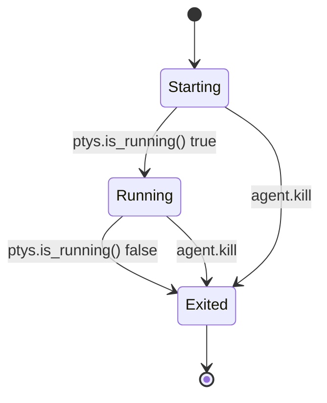

<!-- PAGE_ID: pandamux_12_agent-orchestration -->
<details>
<summary>Relevant source files</summary>

The following files were used as evidence for this page:

- [agent.rs:1-194](crates/pandamux-core/src/agent.rs#L1-L194)
- [backend.rs:640-739](crates/pandamux-app/src/backend.rs#L640-L739)
- [backend.rs:744-824](crates/pandamux-app/src/backend.rs#L744-L824)
- [backend.rs:826-841](crates/pandamux-app/src/backend.rs#L826-L841)
- [backend.rs:884-923](crates/pandamux-app/src/backend.rs#L884-L923)
- [backend.rs:925-937](crates/pandamux-app/src/backend.rs#L925-L937)
- [Cargo.toml:61-68](crates/pandamux-app/Cargo.toml#L61-L68)
- [CHANGELOG.md:199-203](CHANGELOG.md#L199-L203)
- [README.md:1-153](resources/pandamux-orchestrator/README.md#L1-L153)
- [claude-instructions.md:1-23](resources/claude-instructions/claude-instructions.md#L1-L23)

</details>

# Agent Orchestration

> **Related Pages**: [CLI Reference](../api/CLI_REFERENCE.md), [Named Pipe Control Plane](NAMED_PIPE_IPC.md)

---

<!-- BEGIN:AUTOGEN pandamux_12_agent-orchestration_overview -->
## Overview

An *agent* in PandaMUX is a terminal surface running a specific command (typically `claude ...`) instead of a plain workspace shell; the backend tracks its identity, placement, and status in an in-process registry so the CLI (`agent status`/`agent list`) and the bundled pandamux-orchestrator plugin can coordinate work across panes (agent.rs:1-8).

Agents run as ordinary, fully visible terminal surfaces: spawning an agent creates (or splits) a pane the same way any other terminal surface is created, then starts a PTY in it with the agent's command, so the user can watch and type into any agent mid-flight (agent.rs:3-8). The pandamux-orchestrator plugin builds on top of this primitive to decompose a large task into dependency-aware waves of parallel Claude Code agents, each confined to a strict file zone, coordinated through a JSON state file in a temp directory rather than a daemon (README.md:7, README.md:42, README.md:103). There is no MCP integration anywhere in this path: Claude Code talks to PandaMUX exclusively through the `pandamux` CLI over the named pipe, and the orchestrator's hooks and scripts are themselves just CLI callers (README.md:76, README.md:101).

Sources: [agent.rs:1-8](crates/pandamux-core/src/agent.rs#L1-L8), [README.md:1-103](resources/pandamux-orchestrator/README.md#L1-L103)
<!-- END:AUTOGEN pandamux_12_agent-orchestration_overview -->

---

<!-- BEGIN:AUTOGEN pandamux_12_agent-orchestration_model -->
## Agent State Model

`pandamux-core::agent` defines the registry and status enum that the backend threads through the single-writer dispatcher; it has zero Iced dependency, matching the crate-isolation invariant.

`AgentInfo` carries the agent's identity, spawn command, working directory, and its placement in the split tree (workspace/pane/surface ids), plus a three-state `AgentStatus` (agent.rs:36-55):

```rust
// crates/pandamux-core/src/agent.rs:36-55
pub enum AgentStatus {
    Starting,
    Running,
    Exited,
}

pub struct AgentInfo {
    pub id: String,
    pub label: String,
    pub command: String,
    pub cwd: Option<String>,
    pub workspace_id: WorkspaceId,
    pub pane_id: PaneId,
    pub surface_id: SurfaceId,
    pub status: AgentStatus,
}
```

`AgentRegistry` holds the live set of agents in a `Vec<AgentInfo>` plus a monotonic sequence counter that mints ids as `agent-1`, `agent-2`, ... (agent.rs:57-73). It exposes lookup by id (`get`) and by surface (`by_surface`), an in-place `set_status`, and `prune_missing`, which drops any registry entry whose surface is no longer present among the live surface ids and returns the removed agents so callers can react to surfaces that disappeared out from under an agent (agent.rs:79-127). A `SpawnStrategy` enum (`Distribute` / `Stack` / `Split`, default `Distribute`) controls how a batch spawn distributes new agents across panes, parsed from the CLI's `--strategy` string with an unrecognized value falling back to `Distribute` (agent.rs:14-34).



Status is not pushed by the PTY layer; it is recomputed lazily. `refresh_agent_status` polls `PtySessionManager::is_running()` for every registered agent's surface on each `agent.status`/`agent.list` call and writes `Running` or `Exited` back into the registry (backend.rs:884-907), so `Starting` only ever appears in the brief window between `AgentInfo` construction and the first status refresh (agent.rs:812-822).

Sources: [agent.rs:1-194](crates/pandamux-core/src/agent.rs#L1-L194), [backend.rs:884-907](crates/pandamux-app/src/backend.rs#L884-L907)
<!-- END:AUTOGEN pandamux_12_agent-orchestration_model -->

---

<!-- BEGIN:AUTOGEN pandamux_12_agent-orchestration_methods -->
## Agent Pipe Methods

`dispatch_agents` in `pandamux-app::backend` handles the `agent.*` JSON-RPC methods, all routed through the single shared dispatcher (`handle_line`) so a CLI-driven spawn and a UI-driven spawn are indistinguishable at the state layer (backend.rs:640-739).

| Method | Purpose |
|---|---|
| `agent.spawn` | Creates one agent surface. Requires `cmd` (or the legacy `command` alias); `label` defaults to `"agent"`; placement is `InPane(pane or paneId)`, i.e. a new tab in the given pane or, if omitted, wherever `SurfaceIntent::Create` lands it ([backend.rs:648-660](crates/pandamux-app/src/backend.rs#L648-L660)) |
| `agent.spawn_batch` | Spawns several agents at once from a `strategy` (`distribute`/`stack`/`split`, default `distribute`) plus an `agents`/`json` array of `{cmd, label, cwd}` specs; `distribute` round-robins across the panes that exist at call time, `stack` puts every agent in the focused pane, `split` opens one new split per agent ([backend.rs:662-705](crates/pandamux-app/src/backend.rs#L662-L705)) |
| `agent.status` | Refreshes status for every tracked agent, then returns the single requested `id`'s `AgentInfo`, erroring with a JSON-RPC `-32000` if the id is unknown ([backend.rs:707-714](crates/pandamux-app/src/backend.rs#L707-L714)) |
| `agent.list` | Refreshes status for every tracked agent and returns the full list, mapped through `agent_json` so each entry carries both `id` and the `agentId` alias the orchestrator's scripts read ([backend.rs:716-721](crates/pandamux-app/src/backend.rs#L716-L721)) |
| `agent.kill` | Removes the agent from the registry, kills its PTY if one is running, and closes its surface (bypassing the "keep last surface open" guard) ([backend.rs:723-737](crates/pandamux-app/src/backend.rs#L723-L737)) |

`spawn_agent` is the shared implementation behind both `agent.spawn` and `agent.spawn_batch`: it creates the surface (or a new split pane) via the same `AppIntent` path any other surface mutation uses, tags it with the terminal session type for the rail/type grouping, mints the agent id *before* spawning the PTY so the child process can carry `PANDAMUX_AGENT_ID`, starts the PTY with `pandamux_env()`-injected environment, and finally registers the `AgentInfo` (backend.rs:744-824). That environment always includes `PANDAMUX=1`, `PANDAMUX_SURFACE_ID`, and `PANDAMUX_PIPE`, plus `PANDAMUX_AGENT_ID` when spawning an agent, so the orchestrator's `on-agent-stop`/`on-tool-use` hooks can key per-agent state on it (backend.rs:826-841). Every returned agent object is built by `agent_json`, which always emits both `id` and an `agentId` alias for orchestrator-script compatibility (backend.rs:925-937).

Sources: [backend.rs:640-739](crates/pandamux-app/src/backend.rs#L640-L739), [backend.rs:744-841](crates/pandamux-app/src/backend.rs#L744-L841), [backend.rs:925-937](crates/pandamux-app/src/backend.rs#L925-L937)
<!-- END:AUTOGEN pandamux_12_agent-orchestration_methods -->

---

<!-- BEGIN:AUTOGEN pandamux_12_agent-orchestration_context -->
## Claude Context Startup Integration

_TBD_ — no such integration exists in the current Rust codebase. A repo-wide search of `crates/pandamux-app/src/iced_runtime.rs` (and every other file under `crates/`) turns up no `claude_context` module, no plugin-cache install routine, and no code that reads `resources/claude-instructions/claude-instructions.md`; the only Rust-side hit for "orchestrator" in `iced_runtime.rs` is doc-comment prose describing the CLI/agent/orchestrator pipe-method family, not a startup hook.

This is a deliberate removal, not an oversight. `CHANGELOG.md` records that PandaMUX used to inject a marker-delimited block into `~/.claude/CLAUDE.md` and auto-install/enable the pandamux-orchestrator plugin (`installed_plugins.json` + `settings.json`) on GUI launch, ported from the earlier Electron `claude-context.ts`, but that entire startup integration, including the `claude-instructions.md` payload that fed it, was removed in v0.35.6 (CHANGELOG.md:201-203). The `resources/claude-instructions/claude-instructions.md` file still exists on disk with the same marker-delimited PandaMUX block (`<!-- pandamux:start -->` / `<!-- pandamux:end -->`) it always had (claude-instructions.md:1-23), but nothing in the shipped app reads or installs it any more, and it is not in the packager's bundled resource list (only `themes`, `sounds`, `icons`, `shell-integration`, and `pandamux-orchestrator` are bundled into the installer; `claude-instructions.md` is absent) (Cargo.toml:61-68).

Practically, this means the pandamux-orchestrator plugin is no longer auto-installed: a user must run `/plugin install pandamux-orchestrator` themselves (README.md:44-50) against the copy bundled on disk under `resources/pandamux-orchestrator/` (Cargo.toml:66, CHANGELOG.md:203). The project's own top-level `CLAUDE.md` still describes this as "auto-installed into the Claude plugin cache on GUI launch by `pandamux-app::claude_context`," which is stale relative to the code as of this reading and should be corrected or re-implemented, not relied upon.

Sources: [CHANGELOG.md:199-203](CHANGELOG.md#L199-L203), [claude-instructions.md:1-23](resources/claude-instructions/claude-instructions.md#L1-L23), [Cargo.toml:61-68](crates/pandamux-app/Cargo.toml#L61-L68), [README.md:44-50](resources/pandamux-orchestrator/README.md#L44-L50)
<!-- END:AUTOGEN pandamux_12_agent-orchestration_context -->

---

<!-- BEGIN:AUTOGEN pandamux_12_agent-orchestration_plugin -->
## Orchestrator Plugin

`resources/pandamux-orchestrator/` is a bundled Claude Code plugin that decomposes a large task into dependency-aware waves of parallel Claude Code agents, each confined to a strict file zone, followed by an automated reviewer pass (README.md:1-7). It talks to PandaMUX only through the CLI and the named pipe (the `agent.*` methods above plus `layout.grid`, `notification.raise`, and `sidebar.*`); there is no direct code coupling to the app, and it degrades gracefully to Claude Code's native Agent tool when PandaMUX is not running (README.md:63-82).

The plugin has three coordination layers, all reading and writing a single JSON state file in `/tmp/pandamux-orch-{id}/` rather than running a daemon (README.md:95-103):

| Layer | Role | Key components |
|---|---|---|
| Skills | Codebase analysis, task decomposition, plan presentation, review | `skills/orchestrate/SKILL.md` (main flow), `skills/reviewer/SKILL.md` (post-run review), `skills/pandamux-detect/SKILL.md` (fallback-mode detection) (README.md:113-121) |
| Hooks | Event-driven reactivity | `PostToolUse` (activity tracking), `SubagentStop` (wave transitions), `SessionStart` (crash recovery), `Stop` (active-run warning) (README.md:100, README.md:122-123) |
| Scripts | PandaMUX operations | `spawn-agents.sh` (launches a wave via the `pandamux` CLI), `update-dashboard.sh`, `orchestration-state.sh`, `check-status.sh`, `collect-results.sh`, `detect-pandamux.sh`, `on-tool-use.sh`, `on-agent-stop.sh`, `on-stop.sh`, `on-session-start.sh`, `cleanup.sh` (README.md:101, README.md:126-138) |

Up to 5 agents run in parallel per wave, each with an explicit allowed/excluded file list to prevent cross-agent conflicts, and each wave's agents receive the previous wave's results for context continuity; an optional `--worktree` flag isolates each agent in its own git worktree (README.md:85-93). The manifest lives at `.claude-plugin/plugin.json`, the slash command entry point is `commands/orchestrate.md` (`/pandamux:orchestrate`), and the per-wave worker prompt template is `agents/pandamux-worker.md` (README.md:109-125).

Sources: [README.md:1-153](resources/pandamux-orchestrator/README.md#L1-L153)
<!-- END:AUTOGEN pandamux_12_agent-orchestration_plugin -->

---
