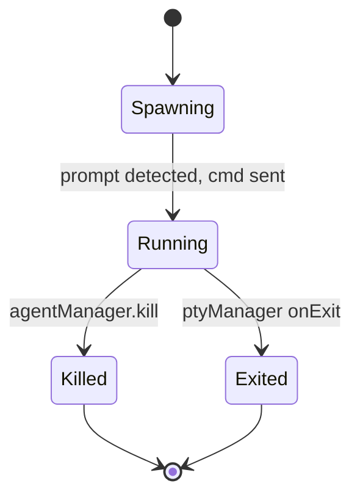

<!-- PAGE_ID: pandamux_09_agent-orchestration -->
<details>
<summary>Relevant source files</summary>

The following files were used as evidence for this page:

- [agent-manager.ts:1-115](https://github.com/BoardPandas/Pandamux/blob/0ab9e6463a9017a7b8ea98f10b3f847507658ac4/src/main/agent-manager.ts#L1-L115)
- [orchestration-watcher.ts:1-165](https://github.com/BoardPandas/Pandamux/blob/0ab9e6463a9017a7b8ea98f10b3f847507658ac4/src/main/orchestration-watcher.ts#L1-L165)
- [agent-slice.ts:1-37](https://github.com/BoardPandas/Pandamux/blob/0ab9e6463a9017a7b8ea98f10b3f847507658ac4/src/renderer/store/agent-slice.ts#L1-L37)
- [orchestration-slice.ts:1-18](https://github.com/BoardPandas/Pandamux/blob/0ab9e6463a9017a7b8ea98f10b3f847507658ac4/src/renderer/store/orchestration-slice.ts#L1-L18)
- [OrchestrationPanel.tsx:1-204](https://github.com/BoardPandas/Pandamux/blob/0ab9e6463a9017a7b8ea98f10b3f847507658ac4/src/renderer/components/Sidebar/OrchestrationPanel.tsx#L1-L204)
- [README.md:1-153](https://github.com/BoardPandas/Pandamux/blob/0ab9e6463a9017a7b8ea98f10b3f847507658ac4/resources/pandamux-orchestrator/README.md#L1-L153)
- [index.ts:39-77](https://github.com/BoardPandas/Pandamux/blob/0ab9e6463a9017a7b8ea98f10b3f847507658ac4/src/main/index.ts#L39-L77)
- [index.ts:665-739](https://github.com/BoardPandas/Pandamux/blob/0ab9e6463a9017a7b8ea98f10b3f847507658ac4/src/main/index.ts#L665-L739)
- [types.ts:127-157](https://github.com/BoardPandas/Pandamux/blob/0ab9e6463a9017a7b8ea98f10b3f847507658ac4/src/shared/types.ts#L127-L157)
- [types.ts:335-387](https://github.com/BoardPandas/Pandamux/blob/0ab9e6463a9017a7b8ea98f10b3f847507658ac4/src/shared/types.ts#L335-L387)
- [pandamux.ts:109-143](https://github.com/BoardPandas/Pandamux/blob/0ab9e6463a9017a7b8ea98f10b3f847507658ac4/src/cli/pandamux.ts#L109-L143)
- [ipc-handlers.ts:218-223](https://github.com/BoardPandas/Pandamux/blob/0ab9e6463a9017a7b8ea98f10b3f847507658ac4/src/main/ipc-handlers.ts#L218-L223)

</details>

# Agent Orchestration

> **Related Pages**: [CLI Reference](../api/CLI_REFERENCE.md), [AI Agent Integration](AI_INTEGRATION.md)

---

<!-- BEGIN:AUTOGEN pandamux_09_agent-orchestration_overview -->
## Overview

PandaMUX lets AI agents (Claude Code instances or any other CLI process) spawn as PTYs inside visible terminal panes, tracked by an `AgentManager` in the main process, and lets a higher-level plugin (pandamux-orchestrator) coordinate many such agents in dependency-aware waves.

Two layers cooperate. The lower layer is generic agent-spawning infrastructure owned by PandaMUX itself: `AgentManager` creates a PTY per agent, waits for the shell prompt, then injects the agent's command, while pane-distribution strategies decide which pane each new agent lands in ([agent-manager.ts:24-90](https://github.com/BoardPandas/Pandamux/blob/0ab9e6463a9017a7b8ea98f10b3f847507658ac4/src/main/agent-manager.ts#L24-L90)). The upper layer is the pandamux-orchestrator Claude Code plugin, a separate bundled artifact that uses the agent-spawning CLI to decompose a task into waves of parallel Claude Code agents and reports run state back into the sidebar through a filesystem-polling watcher ([orchestration-watcher.ts:1-10](https://github.com/BoardPandas/Pandamux/blob/0ab9e6463a9017a7b8ea98f10b3f847507658ac4/src/main/orchestration-watcher.ts#L1-L10)). The two layers are decoupled: the orchestrator plugin only talks to PandaMUX through the CLI and the named pipe, never through direct code coupling.

Sources: [agent-manager.ts:1-115](https://github.com/BoardPandas/Pandamux/blob/0ab9e6463a9017a7b8ea98f10b3f847507658ac4/src/main/agent-manager.ts#L1-L115), [orchestration-watcher.ts:1-30](https://github.com/BoardPandas/Pandamux/blob/0ab9e6463a9017a7b8ea98f10b3f847507658ac4/src/main/orchestration-watcher.ts#L1-L30)
<!-- END:AUTOGEN pandamux_09_agent-orchestration_overview -->

---

<!-- BEGIN:AUTOGEN pandamux_09_agent-orchestration_manager -->
## Agent Manager

`AgentManager` (in `src/main/agent-manager.ts`) owns the lifecycle of every agent PTY: spawn, status lookup, listing, and kill. It keeps agent state entirely in memory, keyed by `AgentId` ([agent-manager.ts:24-30](https://github.com/BoardPandas/Pandamux/blob/0ab9e6463a9017a7b8ea98f10b3f847507658ac4/src/main/agent-manager.ts#L24-L30)).

### Spawn flow and prompt detection

`spawn()` creates a PTY with the default shell (never a hardcoded `cmd.exe`) and tags the environment with `PANDAMUX_AGENT_ID` / `PANDAMUX_AGENT_LABEL` ([agent-manager.ts:32-39](https://github.com/BoardPandas/Pandamux/blob/0ab9e6463a9017a7b8ea98f10b3f847507658ac4/src/main/agent-manager.ts#L32-L39)). Rather than blindly waiting a fixed timeout before injecting the agent's command, it listens to PTY output for a shell-prompt pattern (`PS ...>`, `$`, `#`, `%`, `>`) and only sends the command once a prompt is detected, with a 1.5s debounce for slow-loading shells and an absolute 5s fallback if no prompt is ever recognized ([agent-manager.ts:42-75](https://github.com/BoardPandas/Pandamux/blob/0ab9e6463a9017a7b8ea98f10b3f847507658ac4/src/main/agent-manager.ts#L42-L75)):

```typescript
// src/main/agent-manager.ts:62-75
// Listen for PTY output to detect when the shell prompt appears
const removeDataListener = this.ptyManager.onData(surfaceId, (data) => {
  if (commandSent) return;
  // Prompt patterns: "PS C:\path>" (PowerShell), "$ " (bash), "> " (generic)
  if (/(?:PS\s.*>|[$#%>])\s*$/m.test(data)) {
    sendOnce();
  } else if (!promptDebounce) {
    // Got output but no prompt yet — shell is loading; wait a bit more
    promptDebounce = setTimeout(sendOnce, 1500);
  }
});

// Absolute fallback: if shell produces no recognizable prompt after 5s, send anyway
const fallbackTimer = setTimeout(sendOnce, 5000);
```

This replaced an earlier blind 800ms timeout that was dropping commands sent before PowerShell (which can take 1-3s with shell-integration scripts loaded) reached a usable prompt ([agent-manager.ts:42-44](https://github.com/BoardPandas/Pandamux/blob/0ab9e6463a9017a7b8ea98f10b3f847507658ac4/src/main/agent-manager.ts#L42-L44)). The PTY's own ID doubles as the agent's `SurfaceId` so the spawned shell shows up as a normal terminal tab ([agent-manager.ts:40](https://github.com/BoardPandas/Pandamux/blob/0ab9e6463a9017a7b8ea98f10b3f847507658ac4/src/main/agent-manager.ts#L40)). An `onExit` listener flips the tracked `AgentInfo.status` to `'exited'` and records the exit code ([agent-manager.ts:84-87](https://github.com/BoardPandas/Pandamux/blob/0ab9e6463a9017a7b8ea98f10b3f847507658ac4/src/main/agent-manager.ts#L84-L87)).

### Pane distribution strategies

When multiple agents spawn together (`agent.spawn_batch`), each one needs a pane. `resolveAgentAssignments()` in the main process picks the strategy ([index.ts:39-49](https://github.com/BoardPandas/Pandamux/blob/0ab9e6463a9017a7b8ea98f10b3f847507658ac4/src/main/index.ts#L39-L49)):

```typescript
// src/main/index.ts:39-49
function resolveAgentAssignments(strategy: string, count: number, paneLoads: any[]): string[] {
  if (strategy === 'stack') {
    const sorted = [...paneLoads].sort((a, b) => a.tabCount - b.tabCount);
    return Array.from({ length: count }, () => sorted[0].paneId);
  }
  if (strategy !== 'distribute') {
    console.warn('[pandamux] split strategy not yet implemented, falling back to distribute');
  }
  return distributeAgents(count, paneLoads);
}
```

| Strategy | Behavior | Source |
|---|---|---|
| `distribute` | Sorts panes by current tab count (stable on ties, preserving input order), then round-robins every agent across that sorted list so load spreads evenly ([agent-manager.ts:10-22](https://github.com/BoardPandas/Pandamux/blob/0ab9e6463a9017a7b8ea98f10b3f847507658ac4/src/main/agent-manager.ts#L10-L22)) |
| `stack` | Puts every agent in the batch into the single least-loaded pane (sorts once, always returns that pane's ID) ([index.ts:41-44](https://github.com/BoardPandas/Pandamux/blob/0ab9e6463a9017a7b8ea98f10b3f847507658ac4/src/main/index.ts#L41-L44)) |
| `split` | Not yet implemented; falls back to `distribute` with a console warning ([index.ts:45-47](https://github.com/BoardPandas/Pandamux/blob/0ab9e6463a9017a7b8ea98f10b3f847507658ac4/src/main/index.ts#L45-L47)) |

`distributeAgents()` itself is the shared round-robin primitive used both for single-agent spawn (when no `paneId` is given) and for the `distribute` batch strategy ([agent-manager.ts:10-22](https://github.com/BoardPandas/Pandamux/blob/0ab9e6463a9017a7b8ea98f10b3f847507658ac4/src/main/agent-manager.ts#L10-L22), [index.ts:682](https://github.com/BoardPandas/Pandamux/blob/0ab9e6463a9017a7b8ea98f10b3f847507658ac4/src/main/index.ts#L682)):

```typescript
// src/main/agent-manager.ts:10-22
export function distributeAgents(count: number, panes: PaneLoadInfo[]): string[] {
  // Sort panes once by their initial load (stable sort preserves input order on ties),
  // then round-robin through that sorted order for all agent assignments.
  const sorted = panes
    .map((p, i) => ({ ...p, _origIdx: i }))
    .sort((a, b) => a.tabCount !== b.tabCount ? a.tabCount - b.tabCount : a._origIdx - b._origIdx);

  const assignments: string[] = [];
  for (let i = 0; i < count; i++) {
    assignments.push(sorted[i % sorted.length].paneId);
  }
  return assignments;
}
```

### Pipe methods and CLI surface

`agent.spawn` resolves a missing `workspaceId` from the active window and a missing `paneId` via `distributeAgents(1, ...)`, accepts `cmd` or `prompt` as the command field, and broadcasts an `AGENT_UPDATE` IPC event to every window once the PTY is created ([index.ts:666-701](https://github.com/BoardPandas/Pandamux/blob/0ab9e6463a9017a7b8ea98f10b3f847507658ac4/src/main/index.ts#L666-L701)). `agent.spawn_batch` resolves pane loads once, computes assignments with `resolveAgentAssignments()`, and spawns every agent through `spawnAgentBatch()`, which isolates per-agent failures as `{ error }` entries so one bad spawn does not abort the batch ([index.ts:703-723](https://github.com/BoardPandas/Pandamux/blob/0ab9e6463a9017a7b8ea98f10b3f847507658ac4/src/main/index.ts#L703-L723), [index.ts:53-77](https://github.com/BoardPandas/Pandamux/blob/0ab9e6463a9017a7b8ea98f10b3f847507658ac4/src/main/index.ts#L53-L77)). `agent.status`, `agent.list`, and `agent.kill` are thin wrappers over `AgentManager` ([index.ts:725-739](https://github.com/BoardPandas/Pandamux/blob/0ab9e6463a9017a7b8ea98f10b3f847507658ac4/src/main/index.ts#L725-L739)). The same list/status lookups are also exposed as Electron IPC handlers (`AGENT_LIST`, `AGENT_STATUS`) for renderer callers that do not go through the pipe ([ipc-handlers.ts:218-223](https://github.com/BoardPandas/Pandamux/blob/0ab9e6463a9017a7b8ea98f10b3f847507658ac4/src/main/ipc-handlers.ts#L218-L223)).

The `pandamux agent` CLI command group is the only interface plugins (including pandamux-orchestrator) use to reach these pipe methods; there is no direct code coupling between a plugin and the main process ([pandamux.ts:109-143](https://github.com/BoardPandas/Pandamux/blob/0ab9e6463a9017a7b8ea98f10b3f847507658ac4/src/cli/pandamux.ts#L109-L143)):

| Command | Arguments | Pipe method | Notes |
|---|---|---|---|
| `agent spawn` | `--cmd`, `--label`, `--cwd`, `--pane`, `--workspace` | `agent.spawn` | `--label` defaults to the first whitespace-delimited token of `--cmd` when omitted ([pandamux.ts:109-121](https://github.com/BoardPandas/Pandamux/blob/0ab9e6463a9017a7b8ea98f10b3f847507658ac4/src/cli/pandamux.ts#L109-L121)) |
| `agent spawn-batch` | `--json '[...]'`, `--strategy` | `agent.spawn_batch` | `--strategy` defaults to `distribute` if omitted ([pandamux.ts:123-129](https://github.com/BoardPandas/Pandamux/blob/0ab9e6463a9017a7b8ea98f10b3f847507658ac4/src/cli/pandamux.ts#L123-L129)) |
| `agent status <id>` | positional `agentId` | `agent.status` | ([pandamux.ts:134](https://github.com/BoardPandas/Pandamux/blob/0ab9e6463a9017a7b8ea98f10b3f847507658ac4/src/cli/pandamux.ts#L134)) |
| `agent list` | `--workspace` | `agent.list` | ([pandamux.ts:135](https://github.com/BoardPandas/Pandamux/blob/0ab9e6463a9017a7b8ea98f10b3f847507658ac4/src/cli/pandamux.ts#L135)) |
| `agent kill <id>` | positional `agentId` | `agent.kill` | ([pandamux.ts:136](https://github.com/BoardPandas/Pandamux/blob/0ab9e6463a9017a7b8ea98f10b3f847507658ac4/src/cli/pandamux.ts#L136)) |

Full parameter and pipe-method details, including the shared `sendV2()` transport, are documented on the [CLI Reference](../api/CLI_REFERENCE.md) page.

### Agent lifecycle



`AgentInfo.status` is typed as `'spawning' | 'running' | 'exited'` in the shared types, though `AgentManager.spawn()` currently sets the in-memory record straight to `'running'` once the PTY is created rather than passing through a distinct spawning state ([types.ts:130-141](https://github.com/BoardPandas/Pandamux/blob/0ab9e6463a9017a7b8ea98f10b3f847507658ac4/src/shared/types.ts#L130-L141), [agent-manager.ts:77-82](https://github.com/BoardPandas/Pandamux/blob/0ab9e6463a9017a7b8ea98f10b3f847507658ac4/src/main/agent-manager.ts#L77-L82)). `kill()` calls `ptyManager.kill()` and marks the agent `'exited'` with `exitCode: -1` immediately, without waiting for the underlying process-exit callback ([agent-manager.ts:99-106](https://github.com/BoardPandas/Pandamux/blob/0ab9e6463a9017a7b8ea98f10b3f847507658ac4/src/main/agent-manager.ts#L99-L106)).

Sources: [agent-manager.ts:1-115](https://github.com/BoardPandas/Pandamux/blob/0ab9e6463a9017a7b8ea98f10b3f847507658ac4/src/main/agent-manager.ts#L1-L115), [index.ts:39-77](https://github.com/BoardPandas/Pandamux/blob/0ab9e6463a9017a7b8ea98f10b3f847507658ac4/src/main/index.ts#L39-L77), [index.ts:665-739](https://github.com/BoardPandas/Pandamux/blob/0ab9e6463a9017a7b8ea98f10b3f847507658ac4/src/main/index.ts#L665-L739), [types.ts:127-157](https://github.com/BoardPandas/Pandamux/blob/0ab9e6463a9017a7b8ea98f10b3f847507658ac4/src/shared/types.ts#L127-L157), [pandamux.ts:109-143](https://github.com/BoardPandas/Pandamux/blob/0ab9e6463a9017a7b8ea98f10b3f847507658ac4/src/cli/pandamux.ts#L109-L143)
<!-- END:AUTOGEN pandamux_09_agent-orchestration_manager -->

---

<!-- BEGIN:AUTOGEN pandamux_09_agent-orchestration_watcher -->
## Orchestration Watcher

`orchestration-watcher.ts` runs entirely inside the main process and is fully decoupled from the pandamux-orchestrator plugin: it only reads files, never writes them, and polls the OS temp directory once per second for directories matching `pandamux-orch-*` ([orchestration-watcher.ts:1-18](https://github.com/BoardPandas/Pandamux/blob/0ab9e6463a9017a7b8ea98f10b3f847507658ac4/src/main/orchestration-watcher.ts#L1-L18), [orchestration-watcher.ts:35-45](https://github.com/BoardPandas/Pandamux/blob/0ab9e6463a9017a7b8ea98f10b3f847507658ac4/src/main/orchestration-watcher.ts#L35-L45)).

Each tick, the watcher tracks every discovered `orchDir`, reads its `state.json`, and decides which single run to show. It prefers any run that is currently `'running'`; among running runs it prefers the most recently modified one; completed runs remain visible for a `COMPLETE_LINGER_MS` window (30 seconds) before being dropped ([orchestration-watcher.ts:19-20](https://github.com/BoardPandas/Pandamux/blob/0ab9e6463a9017a7b8ea98f10b3f847507658ac4/src/main/orchestration-watcher.ts#L19-L20), [orchestration-watcher.ts:97-125](https://github.com/BoardPandas/Pandamux/blob/0ab9e6463a9017a7b8ea98f10b3f847507658ac4/src/main/orchestration-watcher.ts#L97-L125)):

```typescript
// src/main/orchestration-watcher.ts:113-125
// Skip runs that completed long ago (past the linger window)
if (state.status !== 'running' && t.completedAt !== null && (now - t.completedAt) > COMPLETE_LINGER_MS) {
  continue;
}

// Prefer running runs; among running runs, prefer most recent
const isBetter = !best
  || (state.status === 'running' && best.state.status !== 'running')
  || (state.status === best.state.status && mtime > best.mtime);
if (isBetter) {
  best = { dir: t.orchDir, state, mtime };
}
```

Only ONE run is ever displayed at a time; if a newer run starts while an older one is still lingering, the watcher switches to the newer one ([orchestration-watcher.ts:31-33](https://github.com/BoardPandas/Pandamux/blob/0ab9e6463a9017a7b8ea98f10b3f847507658ac4/src/main/orchestration-watcher.ts#L31-L33)). When the active run's directory disappears from disk entirely, the watcher clears it and broadcasts `ORCHESTRATION_CLEAR`; whenever the active run's status or mtime changes, it broadcasts `ORCHESTRATION_UPDATE` with the full parsed `OrchestrationState` to every open `BrowserWindow` ([orchestration-watcher.ts:67-73](https://github.com/BoardPandas/Pandamux/blob/0ab9e6463a9017a7b8ea98f10b3f847507658ac4/src/main/orchestration-watcher.ts#L67-L73), [orchestration-watcher.ts:86-145](https://github.com/BoardPandas/Pandamux/blob/0ab9e6463a9017a7b8ea98f10b3f847507658ac4/src/main/orchestration-watcher.ts#L86-L145)). `startOrchestrationWatcher()` runs one tick immediately (so an in-flight run is picked up at PandaMUX startup) before starting the 1000ms `setInterval`; both the immediate tick and every interval tick are wrapped in try/catch so a malformed `state.json` cannot crash the poller ([orchestration-watcher.ts:148-155](https://github.com/BoardPandas/Pandamux/blob/0ab9e6463a9017a7b8ea98f10b3f847507658ac4/src/main/orchestration-watcher.ts#L148-L155)).

Sources: [orchestration-watcher.ts:1-165](https://github.com/BoardPandas/Pandamux/blob/0ab9e6463a9017a7b8ea98f10b3f847507658ac4/src/main/orchestration-watcher.ts#L1-L165)
<!-- END:AUTOGEN pandamux_09_agent-orchestration_watcher -->

---

<!-- BEGIN:AUTOGEN pandamux_09_agent-orchestration_state -->
## Store Slices

Two independent Zustand slices back agent and orchestration UI: `agent-slice.ts` tracks per-surface agent metadata for terminal tab labeling, and `orchestration-slice.ts` tracks the single currently-displayed orchestration run pushed by the watcher.

`AgentSlice` stores an `agentMeta` map keyed by `SurfaceId`, holding a label, optional status (`'running' | 'exited'`), and optional exit code; `setAgentMeta` and `removeAgentMeta` always replace the map immutably (`new Map(state.agentMeta)`) to keep Zustand's shallow-equality change detection working ([agent-slice.ts:4-33](https://github.com/BoardPandas/Pandamux/blob/0ab9e6463a9017a7b8ea98f10b3f847507658ac4/src/renderer/store/agent-slice.ts#L4-L33)):

```typescript
// src/renderer/store/agent-slice.ts:20-26
setAgentMeta(surfaceId: SurfaceId, meta: AgentMeta): void {
  set((state) => {
    const newMap = new Map(state.agentMeta);
    newMap.set(surfaceId, meta);
    return { agentMeta: newMap };
  });
},
```

`OrchestrationSlice` is deliberately minimal: it holds one `currentOrchestration: OrchestrationState | null` and two setters, `setOrchestration` and `clearOrchestration` ([orchestration-slice.ts:4-18](https://github.com/BoardPandas/Pandamux/blob/0ab9e6463a9017a7b8ea98f10b3f847507658ac4/src/renderer/store/orchestration-slice.ts#L4-L18)). The main process's `ORCHESTRATION_UPDATE` / `ORCHESTRATION_CLEAR` IPC events (sent by the watcher) drive these setters from the preload bridge, which is how `OrchestrationPanel` receives live data without polling itself.

| Slice | State shape | Mutators | Source |
|---|---|---|---|
| `AgentSlice` | `agentMeta: Map<SurfaceId, AgentMeta>` | `setAgentMeta`, `removeAgentMeta`, `getAgentMeta` | [agent-slice.ts:11-16](https://github.com/BoardPandas/Pandamux/blob/0ab9e6463a9017a7b8ea98f10b3f847507658ac4/src/renderer/store/agent-slice.ts#L11-L16) |
| `OrchestrationSlice` | `currentOrchestration: OrchestrationState \| null` | `setOrchestration`, `clearOrchestration` | [orchestration-slice.ts:4-8](https://github.com/BoardPandas/Pandamux/blob/0ab9e6463a9017a7b8ea98f10b3f847507658ac4/src/renderer/store/orchestration-slice.ts#L4-L8) |

The shared `OrchestrationState` shape mirrors the JSON that the plugin writes to disk: an `id`, `task`, run-level `status`, an array of `waves` (each with its own `status` and `agents`), and an optional `reviewer` block for the post-run consistency check ([types.ts:338-387](https://github.com/BoardPandas/Pandamux/blob/0ab9e6463a9017a7b8ea98f10b3f847507658ac4/src/shared/types.ts#L338-L387)).

Sources: [agent-slice.ts:1-37](https://github.com/BoardPandas/Pandamux/blob/0ab9e6463a9017a7b8ea98f10b3f847507658ac4/src/renderer/store/agent-slice.ts#L1-L37), [orchestration-slice.ts:1-18](https://github.com/BoardPandas/Pandamux/blob/0ab9e6463a9017a7b8ea98f10b3f847507658ac4/src/renderer/store/orchestration-slice.ts#L1-L18), [types.ts:335-387](https://github.com/BoardPandas/Pandamux/blob/0ab9e6463a9017a7b8ea98f10b3f847507658ac4/src/shared/types.ts#L335-L387)
<!-- END:AUTOGEN pandamux_09_agent-orchestration_state -->

---

<!-- BEGIN:AUTOGEN pandamux_09_agent-orchestration_plugin -->
## Orchestrator Plugin

pandamux-orchestrator is a bundled Claude Code plugin (auto-installed by `ensureOrchestratorPlugin()`, documented on the [AI Agent Integration](AI_INTEGRATION.md) page) that decomposes a large task into dependency-aware waves of parallel Claude Code agents, each confined to a strict file zone, with a final automated reviewer pass ([README.md:1-7](https://github.com/BoardPandas/Pandamux/blob/0ab9e6463a9017a7b8ea98f10b3f847507658ac4/resources/pandamux-orchestrator/README.md#L1-L7)).

The plugin has three coordination layers, all reading/writing a single JSON state file in a temp directory rather than running a daemon ([README.md:95-103](https://github.com/BoardPandas/Pandamux/blob/0ab9e6463a9017a7b8ea98f10b3f847507658ac4/resources/pandamux-orchestrator/README.md#L95-L103)):

| Layer | Role | Key components |
|---|---|---|
| Skills | Intelligence: codebase analysis, task decomposition, plan presentation, review | `skills/orchestrate/SKILL.md` (main flow), `skills/reviewer/SKILL.md` (post-run review) ([README.md:113-121](https://github.com/BoardPandas/Pandamux/blob/0ab9e6463a9017a7b8ea98f10b3f847507658ac4/resources/pandamux-orchestrator/README.md#L113-L121)) |
| Hooks | Reactivity: event-driven wave transitions and crash recovery | `PostToolUse` (activity tracking), `SubagentStop` (wave transitions), `SessionStart` (crash recovery), `Stop` (active-run warning) ([README.md:100](https://github.com/BoardPandas/Pandamux/blob/0ab9e6463a9017a7b8ea98f10b3f847507658ac4/resources/pandamux-orchestrator/README.md#L100), [README.md:122-123](https://github.com/BoardPandas/Pandamux/blob/0ab9e6463a9017a7b8ea98f10b3f847507658ac4/resources/pandamux-orchestrator/README.md#L122-L123)) |
| Scripts | PandaMUX operations: spawning, dashboard, state | `spawn-agents.sh`, `update-dashboard.sh`, `orchestration-state.sh`, `on-agent-stop.sh`, `cleanup.sh` ([README.md:101](https://github.com/BoardPandas/Pandamux/blob/0ab9e6463a9017a7b8ea98f10b3f847507658ac4/resources/pandamux-orchestrator/README.md#L101), [README.md:126-138](https://github.com/BoardPandas/Pandamux/blob/0ab9e6463a9017a7b8ea98f10b3f847507658ac4/resources/pandamux-orchestrator/README.md#L126-L138)) |

### Plugin structure

| Component | File | Purpose |
|---|---|---|
| Manifest | `.claude-plugin/plugin.json` | Plugin metadata (name, version, author) ([README.md:109-110](https://github.com/BoardPandas/Pandamux/blob/0ab9e6463a9017a7b8ea98f10b3f847507658ac4/resources/pandamux-orchestrator/README.md#L109-L110)) |
| Slash command | `commands/orchestrate.md` | `/pandamux:orchestrate` entry point ([README.md:111-112](https://github.com/BoardPandas/Pandamux/blob/0ab9e6463a9017a7b8ea98f10b3f847507658ac4/resources/pandamux-orchestrator/README.md#L111-L112)) |
| Orchestrate skill | `skills/orchestrate/SKILL.md` | Analyze, decompose, plan, launch; includes a decomposition-guide reference ([README.md:114-117](https://github.com/BoardPandas/Pandamux/blob/0ab9e6463a9017a7b8ea98f10b3f847507658ac4/resources/pandamux-orchestrator/README.md#L114-L117)) |
| Reviewer skill | `skills/reviewer/SKILL.md` | Post-orchestration consistency review and auto-fix ([README.md:118-119](https://github.com/BoardPandas/Pandamux/blob/0ab9e6463a9017a7b8ea98f10b3f847507658ac4/resources/pandamux-orchestrator/README.md#L118-L119)) |
| Detect skill | `skills/pandamux-detect/SKILL.md` | Detects PandaMUX availability and sets fallback mode ([README.md:120-121](https://github.com/BoardPandas/Pandamux/blob/0ab9e6463a9017a7b8ea98f10b3f847507658ac4/resources/pandamux-orchestrator/README.md#L120-L121)) |
| Worker template | `agents/pandamux-worker.md` | File-zone enforcement and standardized result format for each wave agent ([README.md:124-125](https://github.com/BoardPandas/Pandamux/blob/0ab9e6463a9017a7b8ea98f10b3f847507658ac4/resources/pandamux-orchestrator/README.md#L124-L125)) |
| Hooks config | `hooks/hooks.json` | Registers `PostToolUse`, `SubagentStop`, `Stop`, `SessionStart` handlers ([README.md:122-123](https://github.com/BoardPandas/Pandamux/blob/0ab9e6463a9017a7b8ea98f10b3f847507658ac4/resources/pandamux-orchestrator/README.md#L122-L123)) |
| Wave driver | `scripts/on-agent-stop.sh` | Core wave-transition logic run from the `SubagentStop` hook ([README.md:135](https://github.com/BoardPandas/Pandamux/blob/0ab9e6463a9017a7b8ea98f10b3f847507658ac4/resources/pandamux-orchestrator/README.md#L135)) |
| Agent spawner | `scripts/spawn-agents.sh` | Launches agents for a wave via the pandamux CLI ([README.md:128](https://github.com/BoardPandas/Pandamux/blob/0ab9e6463a9017a7b8ea98f10b3f847507658ac4/resources/pandamux-orchestrator/README.md#L128)) |

Up to 5 agents run in parallel per wave; each gets an explicit allowed/excluded file list to prevent cross-agent conflicts, and each wave's agents receive the previous wave's results for context continuity ([README.md:85-87](https://github.com/BoardPandas/Pandamux/blob/0ab9e6463a9017a7b8ea98f10b3f847507658ac4/resources/pandamux-orchestrator/README.md#L85-L87)). An optional `--worktree` flag isolates each agent in its own git worktree ([README.md:93](https://github.com/BoardPandas/Pandamux/blob/0ab9e6463a9017a7b8ea98f10b3f847507658ac4/resources/pandamux-orchestrator/README.md#L93)).

### With vs without PandaMUX

The plugin degrades gracefully when PandaMUX is not running, falling back to Claude Code's native Agent tool instead of visible panes ([README.md:68-82](https://github.com/BoardPandas/Pandamux/blob/0ab9e6463a9017a7b8ea98f10b3f847507658ac4/resources/pandamux-orchestrator/README.md#L68-L82)):

| Capability | With PandaMUX | Without (degraded) |
|---|---|---|
| Agent execution | Visible panes via `pandamux agent spawn` | Invisible native subagents |
| Real-time dashboard | Live markdown pane | Text summary in terminal |
| User intervention | Focus any pane, type directly | Not possible |
| Multi-agent visibility | Watch all agents simultaneously | Single spinner |

Sources: [README.md:1-153](https://github.com/BoardPandas/Pandamux/blob/0ab9e6463a9017a7b8ea98f10b3f847507658ac4/resources/pandamux-orchestrator/README.md#L1-L153)
<!-- END:AUTOGEN pandamux_09_agent-orchestration_plugin -->

---

<!-- BEGIN:AUTOGEN pandamux_09_agent-orchestration_panel -->
## Orchestration Panel UI

`OrchestrationPanel` is a self-contained sidebar component that renders `useStore((s) => s.currentOrchestration)` and auto-hides (`return null`) whenever no orchestration is active; it never polls the filesystem itself, only reacting to state the main process pushes over IPC ([OrchestrationPanel.tsx:9-23](https://github.com/BoardPandas/Pandamux/blob/0ab9e6463a9017a7b8ea98f10b3f847507658ac4/src/renderer/components/Sidebar/OrchestrationPanel.tsx#L9-L23)).

It renders, per run: a collapsible header with a status label and shortened run ID, the task description, an elapsed-time / wave-progress / done-count summary line, one `WaveBlock` per wave with a progress bar, and one `AgentCard` per agent inside each wave ([OrchestrationPanel.tsx:39-94](https://github.com/BoardPandas/Pandamux/blob/0ab9e6463a9017a7b8ea98f10b3f847507658ac4/src/renderer/components/Sidebar/OrchestrationPanel.tsx#L39-L94)). While a run is `'running'`, a `setInterval` ticks a local `now` state every second purely to keep the elapsed-time display live between `state.json` polls, without needing new data from the main process ([OrchestrationPanel.tsx:17-21](https://github.com/BoardPandas/Pandamux/blob/0ab9e6463a9017a7b8ea98f10b3f847507658ac4/src/renderer/components/Sidebar/OrchestrationPanel.tsx#L17-L21)):

```tsx
// src/renderer/components/Sidebar/OrchestrationPanel.tsx:17-21
useEffect(() => {
  if (!orch || orch.status !== 'running') return;
  const t = setInterval(() => setNow(Date.now()), 1000);
  return () => clearInterval(t);
}, [orch?.status, orch?.id]);
```

`AgentCard` derives a failed visual state when `agent.status === 'failed'` or when the agent exited with a non-zero code, and shows a tool-use counter plus elapsed duration for running/exited agents ([OrchestrationPanel.tsx:122-156](https://github.com/BoardPandas/Pandamux/blob/0ab9e6463a9017a7b8ea98f10b3f847507658ac4/src/renderer/components/Sidebar/OrchestrationPanel.tsx#L122-L156)). Once a run reaches `'complete'` or `'failed'`, a "dismiss" button calls the `clearOrchestration` store action directly, so the user does not have to wait out the watcher's 30-second linger window ([OrchestrationPanel.tsx:86-90](https://github.com/BoardPandas/Pandamux/blob/0ab9e6463a9017a7b8ea98f10b3f847507658ac4/src/renderer/components/Sidebar/OrchestrationPanel.tsx#L86-L90)).

Helper functions compute the currently-active wave (`findCurrentWaveIndex`, preferring a `'running'` wave, then the first `'pending'` one, then the last wave) and per-status agent counts across all waves (`countByStatus`) ([OrchestrationPanel.tsx:166-184](https://github.com/BoardPandas/Pandamux/blob/0ab9e6463a9017a7b8ea98f10b3f847507658ac4/src/renderer/components/Sidebar/OrchestrationPanel.tsx#L166-L184)).

Sources: [OrchestrationPanel.tsx:1-204](https://github.com/BoardPandas/Pandamux/blob/0ab9e6463a9017a7b8ea98f10b3f847507658ac4/src/renderer/components/Sidebar/OrchestrationPanel.tsx#L1-L204)
<!-- END:AUTOGEN pandamux_09_agent-orchestration_panel -->

---
