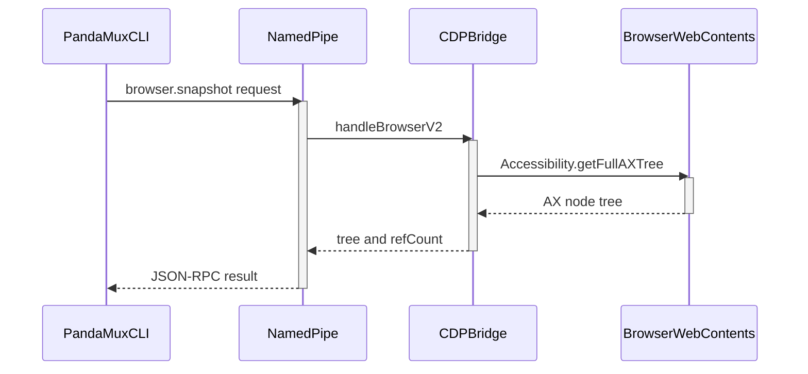

<!-- PAGE_ID: pandamux_10_browser-cdp -->
<details>
<summary>Relevant source files</summary>

The following files were used as evidence for this page:

- [cdp-bridge.ts:1-55](https://github.com/BoardPandas/Pandamux/blob/0ab9e6463a9017a7b8ea98f10b3f847507658ac4/src/main/cdp-bridge.ts#L1-L55)
- [cdp-bridge.ts:57-134](https://github.com/BoardPandas/Pandamux/blob/0ab9e6463a9017a7b8ea98f10b3f847507658ac4/src/main/cdp-bridge.ts#L57-L134)
- [cdp-bridge.ts:161-264](https://github.com/BoardPandas/Pandamux/blob/0ab9e6463a9017a7b8ea98f10b3f847507658ac4/src/main/cdp-bridge.ts#L161-L264)
- [cdp-proxy.ts:1-53](https://github.com/BoardPandas/Pandamux/blob/0ab9e6463a9017a7b8ea98f10b3f847507658ac4/src/main/cdp-proxy.ts#L1-L53)
- [cdp-proxy.ts:55-225](https://github.com/BoardPandas/Pandamux/blob/0ab9e6463a9017a7b8ea98f10b3f847507658ac4/src/main/cdp-proxy.ts#L55-L225)
- [v2-browser.ts:1-101](https://github.com/BoardPandas/Pandamux/blob/0ab9e6463a9017a7b8ea98f10b3f847507658ac4/src/main/v2-browser.ts#L1-L101)
- [v2-browser.ts:103-167](https://github.com/BoardPandas/Pandamux/blob/0ab9e6463a9017a7b8ea98f10b3f847507658ac4/src/main/v2-browser.ts#L103-L167)
- [BrowserPane.tsx:1-127](https://github.com/BoardPandas/Pandamux/blob/0ab9e6463a9017a7b8ea98f10b3f847507658ac4/src/renderer/components/Browser/BrowserPane.tsx#L1-L127)
- [AddressBar.tsx:1-118](https://github.com/BoardPandas/Pandamux/blob/0ab9e6463a9017a7b8ea98f10b3f847507658ac4/src/renderer/components/Browser/AddressBar.tsx#L1-L118)
- [pandamux.ts:41-107](https://github.com/BoardPandas/Pandamux/blob/0ab9e6463a9017a7b8ea98f10b3f847507658ac4/src/cli/pandamux.ts#L41-L107)
- [ipc-handlers.ts:200-216](https://github.com/BoardPandas/Pandamux/blob/0ab9e6463a9017a7b8ea98f10b3f847507658ac4/src/main/ipc-handlers.ts#L200-L216)
- [types.ts:159-162](https://github.com/BoardPandas/Pandamux/blob/0ab9e6463a9017a7b8ea98f10b3f847507658ac4/src/shared/types.ts#L159-L162)

</details>

# Browser Panel and CDP

> **Related Pages**: [CLI Reference](../api/CLI_REFERENCE.md), [Named Pipe Control Plane](NAMED_PIPE_IPC.md)

---

<!-- BEGIN:AUTOGEN pandamux_10_browser-cdp_overview -->
## Overview

PandaMUX Everywhere embeds a Chromium `<webview>` inside a pane and drives it through the Chrome DevTools Protocol (CDP), so a human or an AI agent can navigate, inspect, click, type, and read a live web page as ordinary CLI commands, with no headless-browser process to manage.

There are two independent ways into the same underlying `webContents.debugger` session. The primary path is the named-pipe control plane: `pandamux browser <subcommand>` sends a V2 JSON-RPC request that `v2-browser.ts` routes to a per-caller `CDPBridge` target, which issues CDP domain commands directly against the attached webview ([v2-browser.ts:152-167](https://github.com/BoardPandas/Pandamux/blob/0ab9e6463a9017a7b8ea98f10b3f847507658ac4/src/main/v2-browser.ts#L152-L167)). The secondary path is `CDPProxy`, a loopback-only HTTP/WebSocket server on ports 9222-9230 that mimics Chrome's own remote-debugging endpoint (`/json/version`, `/json/list`) so external tools such as Puppeteer or chrome-devtools-mcp can attach directly ([cdp-proxy.ts:80-126](https://github.com/BoardPandas/Pandamux/blob/0ab9e6463a9017a7b8ea98f10b3f847507658ac4/src/main/cdp-proxy.ts#L80-L126)).

Every attached webview is tracked as its own `CDPTarget` keyed by webContents id rather than as one shared singleton, so concurrent agents each get an isolated browser session, ref map, and history instead of clobbering one another (issue #62) ([cdp-bridge.ts:60-95](https://github.com/BoardPandas/Pandamux/blob/0ab9e6463a9017a7b8ea98f10b3f847507658ac4/src/main/cdp-bridge.ts#L60-L95)). `v2-browser.ts` resolves which browser a given caller's command should hit: reuse an already-bound surface, adopt an unowned browser surface already open in the caller's workspace, or spawn a fresh split pane on demand ([v2-browser.ts:65-101](https://github.com/BoardPandas/Pandamux/blob/0ab9e6463a9017a7b8ea98f10b3f847507658ac4/src/main/v2-browser.ts#L65-L101)).



Sources: [cdp-bridge.ts:60-95](https://github.com/BoardPandas/Pandamux/blob/0ab9e6463a9017a7b8ea98f10b3f847507658ac4/src/main/cdp-bridge.ts#L60-L95), [v2-browser.ts:65-167](https://github.com/BoardPandas/Pandamux/blob/0ab9e6463a9017a7b8ea98f10b3f847507658ac4/src/main/v2-browser.ts#L65-L167), [cdp-proxy.ts:80-126](https://github.com/BoardPandas/Pandamux/blob/0ab9e6463a9017a7b8ea98f10b3f847507658ac4/src/main/cdp-proxy.ts#L80-L126)
<!-- END:AUTOGEN pandamux_10_browser-cdp_overview -->

---

<!-- BEGIN:AUTOGEN pandamux_10_browser-cdp_bridge -->
## CDP Bridge

`CDPBridge` is the in-process client for `webContents.debugger`: it attaches to a webview's debugger session, turns Chrome accessibility nodes into a numbered `@eN` ref list, and exposes one method per browser verb.

Each attachment is stored as a `CDPTarget` (webContents id, owning surface/workspace, and its own ref map), so `detach()` only ever tears down the caller's own connection instead of a shared one (issues #27, #62) ([cdp-bridge.ts:60-111](https://github.com/BoardPandas/Pandamux/blob/0ab9e6463a9017a7b8ea98f10b3f847507658ac4/src/main/cdp-bridge.ts#L60-L111)). `resolveTarget()` picks the explicit `wcId` when it is a live target, otherwise falls back to `lastWcId`, the most recently attached browser, preserving single-browser behavior for manual/human use ([cdp-bridge.ts:140-148](https://github.com/BoardPandas/Pandamux/blob/0ab9e6463a9017a7b8ea98f10b3f847507658ac4/src/main/cdp-bridge.ts#L140-L148)).

```typescript
attach(wcId: number, surfaceId?: string | null, workspaceId?: string | null): void {
  try {
    const wc = webContents.fromId(wcId);
    if (wc && !wc.debugger.isAttached()) {
      wc.debugger.attach('1.3');
    }
  } catch (err) {
    console.error('[cdp-bridge] Failed to attach:', err);
    return;
  }
  const existing = this.targets.get(wcId);
  this.targets.set(wcId, {
    wcId,
    surfaceId: surfaceId ?? existing?.surfaceId ?? null,
    workspaceId: workspaceId ?? existing?.workspaceId ?? null,
    refMap: existing?.refMap ?? new Map<string, RefEntry>(),
  });
  this.lastWcId = wcId;
}
```

Sources: [cdp-bridge.ts:77-95](https://github.com/BoardPandas/Pandamux/blob/0ab9e6463a9017a7b8ea98f10b3f847507658ac4/src/main/cdp-bridge.ts#L77-L95)

`snapshot()` calls `Accessibility.getFullAXTree` and feeds the raw node list into `buildAccessibilityTree()`, which walks the tree from the root, skips uninformative roles (`generic`, `none`, `presentation`, `InlineTextBox`, `LineBreak`) unless they carry an accessible name, and assigns each remaining node a stable `@eN` reference used by every subsequent `click`/`type`/`fill`/`get-text` call ([cdp-bridge.ts:9-51](https://github.com/BoardPandas/Pandamux/blob/0ab9e6463a9017a7b8ea98f10b3f847507658ac4/src/main/cdp-bridge.ts#L9-L51)):

```typescript
refCounter++;
const ref = `@e${refCounter}`;
refMap.set(ref, { nodeId: node.nodeId, backendNodeId: node.backendNodeId || node.nodeId });

const indent = '  '.repeat(depth);
let line = `${indent}${ref}: ${role}`;
if (name) line += ` "${name}"`;
if (value !== undefined && value !== '') line += ` value="${value}"`;
lines.push(line);
```

Sources: [cdp-bridge.ts:35-43](https://github.com/BoardPandas/Pandamux/blob/0ab9e6463a9017a7b8ea98f10b3f847507658ac4/src/main/cdp-bridge.ts#L35-L43), [types.ts:159-162](https://github.com/BoardPandas/Pandamux/blob/0ab9e6463a9017a7b8ea98f10b3f847507658ac4/src/shared/types.ts#L159-L162)

Every `CDPBridge` verb resolves to one or more concrete CDP domain calls:

| `CDPBridge` method | CDP domain call(s) | Notes |
|---|---|---|
| `navigate(url, timeout, wcId)` | `Page.navigate`, then waits on `did-finish-load` | Rejects with `timeout` if the page never fires the event ([cdp-bridge.ts:161-173](https://github.com/BoardPandas/Pandamux/blob/0ab9e6463a9017a7b8ea98f10b3f847507658ac4/src/main/cdp-bridge.ts#L161-L173)) |
| `snapshot(wcId)` | `Accessibility.getFullAXTree` | Rebuilds and replaces the target's `refMap` on every call ([cdp-bridge.ts:175-181](https://github.com/BoardPandas/Pandamux/blob/0ab9e6463a9017a7b8ea98f10b3f847507658ac4/src/main/cdp-bridge.ts#L175-L181)) |
| `click(ref, wcId)` | `DOM.getBoxModel` + two `Input.dispatchMouseEvent` (pressed/released) | Clicks the geometric center of the ref's content quad ([cdp-bridge.ts:183-193](https://github.com/BoardPandas/Pandamux/blob/0ab9e6463a9017a7b8ea98f10b3f847507658ac4/src/main/cdp-bridge.ts#L183-L193)) |
| `type(ref, text, wcId)` | `click()` then `Input.dispatchKeyEvent` (keyDown/keyUp) per character | Focuses via a real click before typing ([cdp-bridge.ts:195-202](https://github.com/BoardPandas/Pandamux/blob/0ab9e6463a9017a7b8ea98f10b3f847507658ac4/src/main/cdp-bridge.ts#L195-L202)) |
| `fill(ref, value, wcId)` | `DOM.resolveNode` + `Runtime.callFunctionOn` | Sets `.value` directly and dispatches an `input` event, bypassing keystroke simulation ([cdp-bridge.ts:204-214](https://github.com/BoardPandas/Pandamux/blob/0ab9e6463a9017a7b8ea98f10b3f847507658ac4/src/main/cdp-bridge.ts#L204-L214)) |
| `screenshot(fullPage, wcId)` | `Page.getLayoutMetrics` (only if `fullPage`) + `Page.captureScreenshot` | Returns a base64 PNG string ([cdp-bridge.ts:216-225](https://github.com/BoardPandas/Pandamux/blob/0ab9e6463a9017a7b8ea98f10b3f847507658ac4/src/main/cdp-bridge.ts#L216-L225)) |
| `getText(ref?, wcId)` | `DOM.resolveNode` + `Runtime.callFunctionOn`, or `Runtime.evaluate` on `document.body.innerText` when no ref is given | Falls back to page-wide text extraction ([cdp-bridge.ts:227-240](https://github.com/BoardPandas/Pandamux/blob/0ab9e6463a9017a7b8ea98f10b3f847507658ac4/src/main/cdp-bridge.ts#L227-L240)) |
| `evaluate(js, wcId)` | `Runtime.evaluate` with `awaitPromise: true` | Throws using `exceptionDetails.text` on a JS error ([cdp-bridge.ts:242-247](https://github.com/BoardPandas/Pandamux/blob/0ab9e6463a9017a7b8ea98f10b3f847507658ac4/src/main/cdp-bridge.ts#L242-L247)) |
| `wait(ref?, timeout, wcId)` | Repeated `snapshot()` polling (300ms interval) until `ref` resolves, or a flat 200ms sleep with no ref | Throws `timeout` if the deadline passes ([cdp-bridge.ts:249-263](https://github.com/BoardPandas/Pandamux/blob/0ab9e6463a9017a7b8ea98f10b3f847507658ac4/src/main/cdp-bridge.ts#L249-L263)) |

Sources: [cdp-bridge.ts:1-264](https://github.com/BoardPandas/Pandamux/blob/0ab9e6463a9017a7b8ea98f10b3f847507658ac4/src/main/cdp-bridge.ts#L1-L264)
<!-- END:AUTOGEN pandamux_10_browser-cdp_bridge -->

---

<!-- BEGIN:AUTOGEN pandamux_10_browser-cdp_proxy -->
## CDP Proxy

`CDPProxy` exposes the same attached webview over a standards-shaped remote-debugging endpoint so external CDP clients (Puppeteer, Playwright's CDP transport, chrome-devtools-mcp) can connect without going through the pandamux pipe at all.

It binds an HTTP server to `127.0.0.1` only, scanning ports 9222 through 9230 until one is free ([cdp-proxy.ts:194-211](https://github.com/BoardPandas/Pandamux/blob/0ab9e6463a9017a7b8ea98f10b3f847507658ac4/src/main/cdp-proxy.ts#L194-L211)), and serves `/json/version`, `/json/list` (with live page title/URL), and `/json/protocol` the way Chrome's own debugger port does ([cdp-proxy.ts:92-122](https://github.com/BoardPandas/Pandamux/blob/0ab9e6463a9017a7b8ea98f10b3f847507658ac4/src/main/cdp-proxy.ts#L92-L122)). `setWebContentsId()` ties the proxy to whichever webview `CDPBridge.attach()` most recently claimed, wired from the renderer's `cdp:attach` / `cdp:detach` IPC channels ([ipc-handlers.ts:200-216](https://github.com/BoardPandas/Pandamux/blob/0ab9e6463a9017a7b8ea98f10b3f847507658ac4/src/main/ipc-handlers.ts#L200-L216)).

Because the full CDP surface includes `Runtime.evaluate` (arbitrary JS execution inside the webview), the proxy applies two loopback-hardening guards before a WebSocket upgrade is accepted:

```typescript
export function isAllowedCdpHost(hostHeader: string | undefined): boolean {
  if (hostHeader === undefined) return true;
  // ... strips :port / [IPv6] ...
  return host === 'localhost' || host === '127.0.0.1' || host === '::1' || host === '0:0:0:0:0:0:0:1';
}

export function isAllowedCdpOrigin(origin: string | undefined): boolean {
  if (origin === undefined || origin === '') return true;
  if (origin.toLowerCase().startsWith('devtools://')) return true;
  return false;
}
```

Sources: [cdp-proxy.ts:16-53](https://github.com/BoardPandas/Pandamux/blob/0ab9e6463a9017a7b8ea98f10b3f847507658ac4/src/main/cdp-proxy.ts#L16-L53)

`isAllowedCdpHost` alone stops DNS-rebinding (a malicious page resolving an attacker domain to `127.0.0.1`), but WebSocket upgrades are exempt from CORS preflight, so a page in the user's own browser could still open `ws://127.0.0.1:9222` directly. `isAllowedCdpOrigin` closes that gap by rejecting every `Origin` header except an absent one or `devtools://`, mirroring Chrome's `--remote-allow-origins` policy; both checks are combined in the WebSocket server's `verifyClient` ([cdp-proxy.ts:128-137](https://github.com/BoardPandas/Pandamux/blob/0ab9e6463a9017a7b8ea98f10b3f847507658ac4/src/main/cdp-proxy.ts#L128-L137)). Once connected, the proxy forwards `wc.debugger` `message` events to the WebSocket client and relays incoming `{ method, params, id }` frames into `wc.debugger.sendCommand()`, echoing `{ id, result }` or `{ id, error }` back over the socket ([cdp-proxy.ts:153-189](https://github.com/BoardPandas/Pandamux/blob/0ab9e6463a9017a7b8ea98f10b3f847507658ac4/src/main/cdp-proxy.ts#L153-L189)).

| Endpoint | Method | Response |
|---|---|---|
| `/json/version` | GET | Static `Browser`/`Protocol-Version`/`User-Agent` fields plus a `ws://localhost:{port}/devtools/browser/1` URL ([cdp-proxy.ts:92-102](https://github.com/BoardPandas/Pandamux/blob/0ab9e6463a9017a7b8ea98f10b3f847507658ac4/src/main/cdp-proxy.ts#L92-L102)) |
| `/json/list`, `/json` | GET | Single-element array describing the attached page (title, URL, page WS URL) ([cdp-proxy.ts:104-116](https://github.com/BoardPandas/Pandamux/blob/0ab9e6463a9017a7b8ea98f10b3f847507658ac4/src/main/cdp-proxy.ts#L104-L116)) |
| `/json/protocol` | GET | Returns `{}` (stubbed; not the full protocol descriptor) ([cdp-proxy.ts:119-122](https://github.com/BoardPandas/Pandamux/blob/0ab9e6463a9017a7b8ea98f10b3f847507658ac4/src/main/cdp-proxy.ts#L119-L122)) |
| `/devtools/browser/1`, `/devtools/page/1` (WebSocket) | Upgrade | Bidirectional CDP command/event relay to `wc.debugger` ([cdp-proxy.ts:139-189](https://github.com/BoardPandas/Pandamux/blob/0ab9e6463a9017a7b8ea98f10b3f847507658ac4/src/main/cdp-proxy.ts#L139-L189)) |

Sources: [cdp-proxy.ts:80-225](https://github.com/BoardPandas/Pandamux/blob/0ab9e6463a9017a7b8ea98f10b3f847507658ac4/src/main/cdp-proxy.ts#L80-L225)
<!-- END:AUTOGEN pandamux_10_browser-cdp_proxy -->

---

<!-- BEGIN:AUTOGEN pandamux_10_browser-cdp_pane -->
## Browser Pane UI

`BrowserPane` renders an Electron `<webview>` element plus an `AddressBar`, and is responsible for claiming the CDP attachment on behalf of its own surface/workspace so backend commands land on the right pane.

On `dom-ready` and on any mouse-down inside the pane, `claimCdp()` reads the webview's own `webContentsId` and calls `window.pandamux.cdp.attach(wcId, surfaceId, workspaceId)`, tagging the CDP target with the owning surface and workspace ids so `v2-browser.ts` can route per-caller commands to the correct pane ([BrowserPane.tsx:72-92](https://github.com/BoardPandas/Pandamux/blob/0ab9e6463a9017a7b8ea98f10b3f847507658ac4/src/renderer/components/Browser/BrowserPane.tsx#L72-L92)):

```tsx
const claimCdp = useCallback(() => {
  const wcId = webviewRef.current?.getWebContentsId?.();
  if (wcId && window.pandamux?.cdp?.attach) {
    wcIdRef.current = wcId;
    window.pandamux.cdp.attach(wcId, surfaceId, workspaceId ?? null);
  }
}, [surfaceId, workspaceId]);
```

On unmount the pane detaches only its own `wcId` (never a wholesale detach), so closing one split-tree browser pane cannot kill another still-open pane's CDP connection (issue #27) ([BrowserPane.tsx:82-92](https://github.com/BoardPandas/Pandamux/blob/0ab9e6463a9017a7b8ea98f10b3f847507658ac4/src/renderer/components/Browser/BrowserPane.tsx#L82-L92)). `navigate()` applies a light heuristic to whatever the address bar submits: a value already matching `https?://` is used as-is, a bare-looking host (contains a dot, no spaces) gets `https://` prefixed, and anything else is treated as a Google search query ([BrowserPane.tsx:20-33](https://github.com/BoardPandas/Pandamux/blob/0ab9e6463a9017a7b8ea98f10b3f847507658ac4/src/renderer/components/Browser/BrowserPane.tsx#L20-L33)). The pane also listens for a `pandamux:browser-navigate` `window` `CustomEvent`, used for programmatic navigation such as auto-navigating on dev-server port detection ([BrowserPane.tsx:95-103](https://github.com/BoardPandas/Pandamux/blob/0ab9e6463a9017a7b8ea98f10b3f847507658ac4/src/renderer/components/Browser/BrowserPane.tsx#L95-L103)).

`AddressBar` is a controlled input that only shows an "editing" buffer while focused (selecting all text on focus), commits on Enter, and discards edits on Escape ([AddressBar.tsx:28-63](https://github.com/BoardPandas/Pandamux/blob/0ab9e6463a9017a7b8ea98f10b3f847507658ac4/src/renderer/components/Browser/AddressBar.tsx#L28-L63)):

| Control | Wired to | Underlying `webview` call |
|---|---|---|
| URL field (Enter) | `onNavigate` | `BrowserPane.navigate()` resolves the value, then `webviewRef.current.loadURL(resolved)` ([AddressBar.tsx:49-63](https://github.com/BoardPandas/Pandamux/blob/0ab9e6463a9017a7b8ea98f10b3f847507658ac4/src/renderer/components/Browser/AddressBar.tsx#L49-L63); [BrowserPane.tsx:20-33](https://github.com/BoardPandas/Pandamux/blob/0ab9e6463a9017a7b8ea98f10b3f847507658ac4/src/renderer/components/Browser/BrowserPane.tsx#L20-L33)) |
| Back / Forward buttons (disabled via `canGoBack`/`canGoForward`) | `onBack` / `onForward` | `webviewRef.current.goBack()` / `.goForward()` ([BrowserPane.tsx:35-36](https://github.com/BoardPandas/Pandamux/blob/0ab9e6463a9017a7b8ea98f10b3f847507658ac4/src/renderer/components/Browser/BrowserPane.tsx#L35-L36)) |
| Reload/Stop button (icon flips on `isLoading`) | `onReload` / `onStop` | `webviewRef.current.reload()` / `.stop()` ([BrowserPane.tsx:37-38](https://github.com/BoardPandas/Pandamux/blob/0ab9e6463a9017a7b8ea98f10b3f847507658ac4/src/renderer/components/Browser/BrowserPane.tsx#L37-L38); [AddressBar.tsx:85-91](https://github.com/BoardPandas/Pandamux/blob/0ab9e6463a9017a7b8ea98f10b3f847507658ac4/src/renderer/components/Browser/AddressBar.tsx#L85-L91)) |
| DevTools button (optional, gear icon) | `onDevTools` | `webviewRef.current.openDevTools()` ([BrowserPane.tsx:39](https://github.com/BoardPandas/Pandamux/blob/0ab9e6463a9017a7b8ea98f10b3f847507658ac4/src/renderer/components/Browser/BrowserPane.tsx#L39); [AddressBar.tsx:93-102](https://github.com/BoardPandas/Pandamux/blob/0ab9e6463a9017a7b8ea98f10b3f847507658ac4/src/renderer/components/Browser/AddressBar.tsx#L93-L102)) |

These back/forward/reload/stop controls call the webview element's own navigation history directly and do not go through `CDPBridge`; they are separate from the CDP-driven `browser.*` pipe methods described below.

Sources: [BrowserPane.tsx:1-127](https://github.com/BoardPandas/Pandamux/blob/0ab9e6463a9017a7b8ea98f10b3f847507658ac4/src/renderer/components/Browser/BrowserPane.tsx#L1-L127), [AddressBar.tsx:1-118](https://github.com/BoardPandas/Pandamux/blob/0ab9e6463a9017a7b8ea98f10b3f847507658ac4/src/renderer/components/Browser/AddressBar.tsx#L1-L118)
<!-- END:AUTOGEN pandamux_10_browser-cdp_pane -->

---

<!-- BEGIN:AUTOGEN pandamux_10_browser-cdp_cli -->
## Browser CLI Surface

`pandamux browser <subcommand>` is the primary way an agent drives the browser pane: each subcommand is a thin wrapper that issues one `browser.*` V2 request over the named pipe, which `handleBrowserV2` in `v2-browser.ts` dispatches to the resolved `CDPBridge` target.

`sendV2()` auto-attaches the caller's identity for every `browser.*` method: when `PANDAMUX_SURFACE_ID` is set in the environment (true for shells and agent PTYs spawned by pandamux) and no explicit `caller` was passed, it is injected into `params.caller` ([pandamux.ts:41-47](https://github.com/BoardPandas/Pandamux/blob/0ab9e6463a9017a7b8ea98f10b3f847507658ac4/src/cli/pandamux.ts#L41-L47)). `resolveBrowserWcId()` then uses that `caller` id to reuse, adopt, or create the browser surface bound to that agent, falling back to the single legacy shared browser when there is no caller context ([v2-browser.ts:65-101](https://github.com/BoardPandas/Pandamux/blob/0ab9e6463a9017a7b8ea98f10b3f847507658ac4/src/main/v2-browser.ts#L65-L101)):

```typescript
async function resolveBrowserWcId(caller?: string): Promise<number | null> {
  const win = firstWindow();
  if (!win) return null;
  if (!caller) return legacyWcId();

  const bound = callerBrowserSurface.get(caller);
  if (bound) {
    const wcId = cdpBridge.wcIdForSurface(bound);
    if (wcId !== null) return wcId;
    callerBrowserSurface.delete(caller);
    boundBrowserSurfaces.delete(bound);
  }
  // ... adopt an unowned browser surface in the caller's workspace, or spawn one
}
```

Sources: [v2-browser.ts:65-101](https://github.com/BoardPandas/Pandamux/blob/0ab9e6463a9017a7b8ea98f10b3f847507658ac4/src/main/v2-browser.ts#L65-L101)

Once a `wcId` is resolved, `runBrowserCommand()` maps the method name straight onto a `CDPBridge` call ([v2-browser.ts:106-134](https://github.com/BoardPandas/Pandamux/blob/0ab9e6463a9017a7b8ea98f10b3f847507658ac4/src/main/v2-browser.ts#L106-L134)):

| CLI subcommand | V2 method | `CDPBridge` operation invoked |
|---|---|---|
| `pandamux browser open <url>` | `browser.navigate` | `navigate()` ([cdp-bridge.ts:161-173](https://github.com/BoardPandas/Pandamux/blob/0ab9e6463a9017a7b8ea98f10b3f847507658ac4/src/main/cdp-bridge.ts#L161-L173); [pandamux.ts:89](https://github.com/BoardPandas/Pandamux/blob/0ab9e6463a9017a7b8ea98f10b3f847507658ac4/src/cli/pandamux.ts#L89)) |
| `pandamux browser snapshot` | `browser.snapshot` | `snapshot()` ([cdp-bridge.ts:175-181](https://github.com/BoardPandas/Pandamux/blob/0ab9e6463a9017a7b8ea98f10b3f847507658ac4/src/main/cdp-bridge.ts#L175-L181); [pandamux.ts:90](https://github.com/BoardPandas/Pandamux/blob/0ab9e6463a9017a7b8ea98f10b3f847507658ac4/src/cli/pandamux.ts#L90)) |
| `pandamux browser click @eN` | `browser.click` | `click()` ([cdp-bridge.ts:183-193](https://github.com/BoardPandas/Pandamux/blob/0ab9e6463a9017a7b8ea98f10b3f847507658ac4/src/main/cdp-bridge.ts#L183-L193); [pandamux.ts:91](https://github.com/BoardPandas/Pandamux/blob/0ab9e6463a9017a7b8ea98f10b3f847507658ac4/src/cli/pandamux.ts#L91)) |
| `pandamux browser type @eN <text>` | `browser.type` | `type()` ([cdp-bridge.ts:195-202](https://github.com/BoardPandas/Pandamux/blob/0ab9e6463a9017a7b8ea98f10b3f847507658ac4/src/main/cdp-bridge.ts#L195-L202); [pandamux.ts:92](https://github.com/BoardPandas/Pandamux/blob/0ab9e6463a9017a7b8ea98f10b3f847507658ac4/src/cli/pandamux.ts#L92)) |
| `pandamux browser fill @eN <value>` | `browser.fill` | `fill()` ([cdp-bridge.ts:204-214](https://github.com/BoardPandas/Pandamux/blob/0ab9e6463a9017a7b8ea98f10b3f847507658ac4/src/main/cdp-bridge.ts#L204-L214); [pandamux.ts:93](https://github.com/BoardPandas/Pandamux/blob/0ab9e6463a9017a7b8ea98f10b3f847507658ac4/src/cli/pandamux.ts#L93)) |
| `pandamux browser get-text [@eN]` | `browser.get_text` | `getText()` ([cdp-bridge.ts:227-240](https://github.com/BoardPandas/Pandamux/blob/0ab9e6463a9017a7b8ea98f10b3f847507658ac4/src/main/cdp-bridge.ts#L227-L240); [pandamux.ts:95](https://github.com/BoardPandas/Pandamux/blob/0ab9e6463a9017a7b8ea98f10b3f847507658ac4/src/cli/pandamux.ts#L95)) |
| `pandamux browser screenshot [--full]` | `browser.screenshot` | `screenshot()` ([cdp-bridge.ts:216-225](https://github.com/BoardPandas/Pandamux/blob/0ab9e6463a9017a7b8ea98f10b3f847507658ac4/src/main/cdp-bridge.ts#L216-L225); [pandamux.ts:94](https://github.com/BoardPandas/Pandamux/blob/0ab9e6463a9017a7b8ea98f10b3f847507658ac4/src/cli/pandamux.ts#L94)) |
| `pandamux browser eval <js>` | `browser.eval` | `evaluate()` ([cdp-bridge.ts:242-247](https://github.com/BoardPandas/Pandamux/blob/0ab9e6463a9017a7b8ea98f10b3f847507658ac4/src/main/cdp-bridge.ts#L242-L247); [pandamux.ts:96](https://github.com/BoardPandas/Pandamux/blob/0ab9e6463a9017a7b8ea98f10b3f847507658ac4/src/cli/pandamux.ts#L96)) |
| `pandamux browser back` | `browser.back` | _TBD_: no case in `runBrowserCommand`'s switch; falls to the `default` branch and returns RPC error `-32601` ("Unknown: browser.back") ([v2-browser.ts:106-134](https://github.com/BoardPandas/Pandamux/blob/0ab9e6463a9017a7b8ea98f10b3f847507658ac4/src/main/v2-browser.ts#L106-L134); [pandamux.ts:98](https://github.com/BoardPandas/Pandamux/blob/0ab9e6463a9017a7b8ea98f10b3f847507658ac4/src/cli/pandamux.ts#L98)) |
| `pandamux browser forward` | `browser.forward` | _TBD_: same gap as `browser.back` ([v2-browser.ts:106-134](https://github.com/BoardPandas/Pandamux/blob/0ab9e6463a9017a7b8ea98f10b3f847507658ac4/src/main/v2-browser.ts#L106-L134); [pandamux.ts:99](https://github.com/BoardPandas/Pandamux/blob/0ab9e6463a9017a7b8ea98f10b3f847507658ac4/src/cli/pandamux.ts#L99)) |
| `pandamux browser reload` | `browser.reload` | _TBD_: same gap as `browser.back` ([v2-browser.ts:106-134](https://github.com/BoardPandas/Pandamux/blob/0ab9e6463a9017a7b8ea98f10b3f847507658ac4/src/main/v2-browser.ts#L106-L134); [pandamux.ts:100](https://github.com/BoardPandas/Pandamux/blob/0ab9e6463a9017a7b8ea98f10b3f847507658ac4/src/cli/pandamux.ts#L100)) |

Two subcommands exist outside this exact list: `pandamux browser wait [@eN] [timeoutMs]` maps to `browser.wait` / `CDPBridge.wait()` ([pandamux.ts:97](https://github.com/BoardPandas/Pandamux/blob/0ab9e6463a9017a7b8ea98f10b3f847507658ac4/src/cli/pandamux.ts#L97); [cdp-bridge.ts:249-263](https://github.com/BoardPandas/Pandamux/blob/0ab9e6463a9017a7b8ea98f10b3f847507658ac4/src/main/cdp-bridge.ts#L249-L263)), and `browser.batch` runs a list of the above commands against one resolved `wcId`, stopping at the first error ([v2-browser.ts:136-149](https://github.com/BoardPandas/Pandamux/blob/0ab9e6463a9017a7b8ea98f10b3f847507658ac4/src/main/v2-browser.ts#L136-L149)).

Sources: [v2-browser.ts:1-167](https://github.com/BoardPandas/Pandamux/blob/0ab9e6463a9017a7b8ea98f10b3f847507658ac4/src/main/v2-browser.ts#L1-L167), [pandamux.ts:41-107](https://github.com/BoardPandas/Pandamux/blob/0ab9e6463a9017a7b8ea98f10b3f847507658ac4/src/cli/pandamux.ts#L41-L107)
<!-- END:AUTOGEN pandamux_10_browser-cdp_cli -->

---
