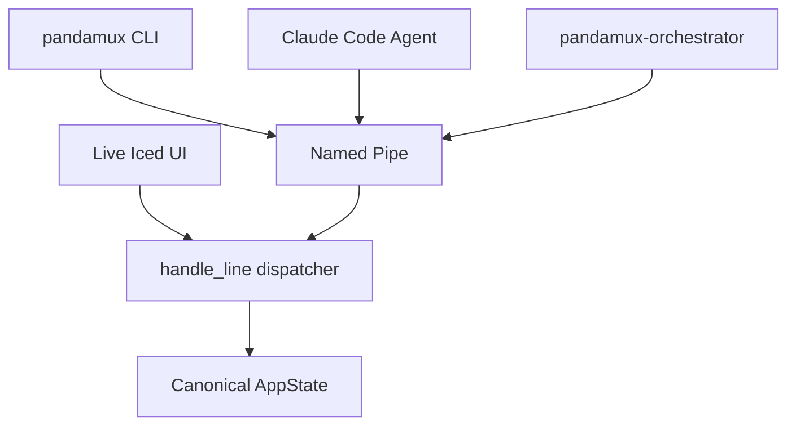
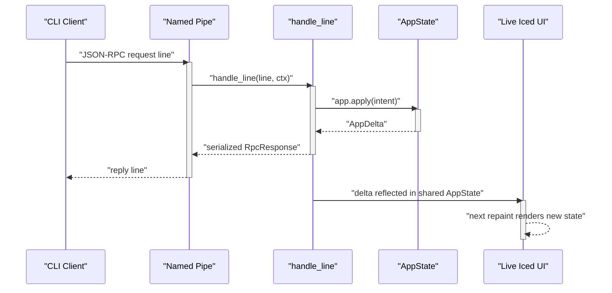

<!-- PAGE_ID: pandamux_10_named-pipe-ipc -->
<details>
<summary>Relevant source files</summary>

The following files were used as evidence for this page:

- [pipe_server.rs:1-59](crates/pandamux-app/src/pipe_server.rs#L1-L59)
- [backend.rs:1-336](crates/pandamux-app/src/backend.rs#L1-L336)
- [backend.rs:342-408](crates/pandamux-app/src/backend.rs#L342-L408)
- [backend.rs:1412-1520](crates/pandamux-app/src/backend.rs#L1412-L1520)
- [backend.rs:1573-1610](crates/pandamux-app/src/backend.rs#L1573-L1610)
- [backend.rs:1651-1746](crates/pandamux-app/src/backend.rs#L1651-L1746)
- [backend.rs:1942-2056](crates/pandamux-app/src/backend.rs#L1942-L2056)
- [backend.rs:2237-2243](crates/pandamux-app/src/backend.rs#L2237-L2243)
- [backend.rs:2696-2735](crates/pandamux-app/src/backend.rs#L2696-L2735)
- [protocol.rs:1-49](crates/pandamux-core/src/protocol.rs#L1-L49)
- [state.rs:59-65](crates/pandamux-core/src/state.rs#L59-L65)
- [state.rs:522-535](crates/pandamux-core/src/state.rs#L522-L535)
- [iced_runtime.rs:2509-2565](crates/pandamux-app/src/iced_runtime.rs#L2509-L2565)
- [iced_runtime.rs:3843-3903](crates/pandamux-app/src/iced_runtime.rs#L3843-L3903)
- [main.rs:1070-1113](crates/pandamux-cli/src/main.rs#L1070-L1113)

</details>

# Named Pipe Control Plane

> **Related Pages**: [CLI Reference](../api/CLI_REFERENCE.md), [Application Runtime](../core/APP_RUNTIME.md)

---

<!-- BEGIN:AUTOGEN pandamux_10_named-pipe-ipc_overview -->
## Overview

`\\.\pipe\pandamux` is the single transport used by the `pandamux` CLI, Claude Code agents, and the `pandamux-orchestrator` plugin to drive PandaMUX; it carries two protocols on the same connection: a legacy V1 text protocol and a V2 JSON-RPC protocol (backend.rs:1-13, backend.rs:192-210).

The pipe is accepted in two places depending on how the app is running. The headless build spawns a standalone accept loop in `pipe_server::run` that owns its own `Backend` and hands each connection's line to `Backend::handle_line` (pipe_server.rs:14-33, pipe_server.rs:40-59). The GUI build instead embeds an equivalent accept loop as an Iced subscription (`pipe_subscription` / `run_embedded_pipe_server`) so the live window is the one process binding the pipe (iced_runtime.rs:3848-3859, iced_runtime.rs:3895-3903). Both paths end up calling the same free function, `backend::handle_line`, so a CLI request and a UI-originated mutation are dispatched identically.



Sources: [pipe_server.rs:1-59](crates/pandamux-app/src/pipe_server.rs#L1-L59), [backend.rs:1-13](crates/pandamux-app/src/backend.rs#L1-L13), [backend.rs:192-210](crates/pandamux-app/src/backend.rs#L192-L210), [iced_runtime.rs:3843-3903](crates/pandamux-app/src/iced_runtime.rs#L3843-L3903)
<!-- END:AUTOGEN pandamux_10_named-pipe-ipc_overview -->

---

<!-- BEGIN:AUTOGEN pandamux_10_named-pipe-ipc_v1 -->
## V1 Text Protocol

The V1 protocol predates the JSON-RPC envelope and is kept for shell-integration hooks that write a single plain-text line rather than JSON. `handle_line` checks for it before attempting to parse JSON: a bare `ping` line replies `pong`, and a line prefixed `report_pwd <surfaceId> <path>` updates that surface's tracked working directory and returns an empty reply (backend.rs:192-206).

```rust
// backend.rs:194-206
if message == "ping" {
    return "pong".to_string();
}

if let Some(rest) = message.strip_prefix("report_pwd ") {
    let mut parts = rest.splitn(2, ' ');
    if let (Some(surface_id), Some(path)) = (parts.next(), parts.next()) {
        ctx.ptys.set_cwd(surface_id, path.trim());
    }
    return String::new();
}
```

`report_pwd` is the cwd-reporting half of the shell-integration scripts (bash/zsh/PowerShell report over the pipe this way; `cmd.exe` reports inline via OSC instead, parsed in the terminal layer) (backend.rs:198-200). Any line that is not `ping`, not a `report_pwd` line, and does not start with `{` is silently dropped, returning an empty string, which the regression test `non_json_line_returns_empty` pins down (backend.rs:208-210, backend.rs:2723-2727). A hermetic `Backend` with no live PTY session still accepts a `report_pwd` line as a no-op, which `report_pwd_v1_line_is_accepted` verifies (backend.rs:2729-2735).

`hook.event`, the shell-integration hook-forwarding method referenced by the wider plugin docs, was not found as a matched string in `backend.rs`'s dispatch tables during this pass. _TBD_ — no `"hook."`-prefixed match arm exists in `backend.rs`; document this method once it lands, or correct the naming if the intended surface is `report_pwd`/`sidebar.log` instead.

Sources: [backend.rs:192-210](crates/pandamux-app/src/backend.rs#L192-L210), [backend.rs:2723-2735](crates/pandamux-app/src/backend.rs#L2723-L2735)
<!-- END:AUTOGEN pandamux_10_named-pipe-ipc_v1 -->

---

<!-- BEGIN:AUTOGEN pandamux_10_named-pipe-ipc_v2 -->
## V2 JSON-RPC Protocol

Any line starting with `{` is parsed as an `RpcRequest`: `{ method: String, params: Value, id: Value, token: Option<String> }` (protocol.rs:4-13). Parse failures reply with a JSON-RPC `-32700` "parse error" envelope rather than dropping the connection (backend.rs:212-221).

```rust
// protocol.rs:4-22
pub struct RpcRequest {
    pub method: String,
    #[serde(default)]
    pub params: Value,
    #[serde(default)]
    pub id: Value,
    #[serde(default)]
    pub token: Option<String>,
}

pub struct RpcResponse {
    #[serde(skip_serializing_if = "Option::is_none")]
    pub result: Option<Value>,
    #[serde(skip_serializing_if = "Option::is_none")]
    pub error: Option<RpcError>,
    pub id: Value,
}
```

Every successful dispatch replies `RpcResponse::result(id, result)`; every failure replies `RpcResponse::error(id, code, message)`, and both are serialized with `serialize_response`, which falls back to a hand-written `-32603` envelope if `serde_json` itself fails (backend.rs:223-227, backend.rs:2237-2243).

The `token` field is the request envelope's auth slot: the CLI populates it from the `PANDAMUX_PIPE_TOKEN` environment variable on every V2 call (`read_pipe_token`), sending an empty string when unset (main.rs:1070-1076, main.rs:1109-1113). _TBD_ — no code path in `dispatch`/`handle_line` reads or validates `request.token`; the field is carried end-to-end in the envelope but not yet enforced server-side in this snapshot of `backend.rs`.

This V2 surface is wire-compatible with the historical (pre-Rust-rewrite) prototype's pipe protocol, per the crate-level documentation on `handle_line`: the CLI, agents, and the orchestrator plugin all talk the same request/response shape regardless of which pandamux backend (Electron-era or native) is on the other end (backend.rs:1-13, backend.rs:188-191).

Sources: [protocol.rs:1-49](crates/pandamux-core/src/protocol.rs#L1-L49), [backend.rs:212-227](crates/pandamux-app/src/backend.rs#L212-L227), [backend.rs:2237-2243](crates/pandamux-app/src/backend.rs#L2237-L2243), [main.rs:1070-1113](crates/pandamux-cli/src/main.rs#L1070-L1113)
<!-- END:AUTOGEN pandamux_10_named-pipe-ipc_v2 -->

---

<!-- BEGIN:AUTOGEN pandamux_10_named-pipe-ipc_methods -->
## Method Catalog

`dispatch` tries a sequence of namespace-specific sub-dispatchers before falling through to the intent-based `AppIntent`/`AppDelta` path; each sub-dispatcher returns `Ok(None)` to fall through to the next one, or `Ok(Some(value))`/`Err` to short-circuit (backend.rs:230-336).

| Namespace | Sample methods | Purpose |
|---|---|---|
| `system.*` | `system.identify`, `system.capabilities`, `system.tree` | Identify the running binary/version, report capability flags, and dump a workspace's split tree ([backend.rs:1653-1657](crates/pandamux-app/src/backend.rs#L1653-L1657)) |
| `workspace.*` | `workspace.create`, `workspace.close`, `workspace.select`, `workspace.rename`, `workspace.list`, `workspace.close_all` | Create/select/rename/close top-level workspaces (each with its own split tree and shell) ([backend.rs:1658-1673](crates/pandamux-app/src/backend.rs#L1658-L1673), [backend.rs:1728-1730](crates/pandamux-app/src/backend.rs#L1728-L1730)) |
| `pane.*` / `layout.grid` | `pane.split`, `pane.close`, `pane.focus`, `pane.zoom`, `pane.list`, `layout.grid` | Mutate the immutable `SplitNode` tree: split/close/focus/zoom a pane, or lay out N panes in a grid in one call ([backend.rs:1674-1694](crates/pandamux-app/src/backend.rs#L1674-L1694)) |
| `surface.*` | `surface.create`, `surface.focus`, `surface.close`, `surface.move`, `surface.list`, `surface.rename`, `surface.set_session_type`, `surface.send_text`, `surface.send_key`, `surface.paste`, `surface.paste_image`, `surface.read_text`, `surface.resize`/`pty.resize`, `surface.kill`/`pty.kill`, `surface.set_color_scheme`, `surface.trigger_flash` | Structural surface CRUD (`surface.create`/`focus`/`close`/`move`/`list`/`rename`) plus terminal I/O against the surface's PTY or SSH channel (send/paste/read/resize) ([backend.rs:1695-1727](crates/pandamux-app/src/backend.rs#L1695-L1727), [backend.rs:1421-1490](crates/pandamux-app/src/backend.rs#L1421-L1490)) |
| `markdown.*` / `diff.*` | `markdown.set_content`/`diff.set_content`, `markdown.load_file`/`diff.refresh` | Push inline content into a markdown or diff surface, or load it from a client-supplied path (a small one-shot blocking read on the sync dispatch path) ([backend.rs:1579-1602](crates/pandamux-app/src/backend.rs#L1579-L1602)) |
| `notification.*` | `notification.raise`/`notification.fire`, `notification.list`, `notification.clear` | Raise/list/clear the sidebar notification feed ([backend.rs:349-375](crates/pandamux-app/src/backend.rs#L349-L375)) |
| `sidebar.*` | `sidebar.set_status`, `sidebar.set_progress`, `sidebar.log`, `sidebar.get_state` | Update the status-bar/progress/log fields agents use to report activity ([backend.rs:408-431](crates/pandamux-app/src/backend.rs#L408-L431)) |
| `agent.*` | `agent.spawn`, `agent.spawn_batch`, `agent.status`, `agent.list`, `agent.kill` | Spawn/query/kill orchestrator-managed agent processes attached to panes ([backend.rs:648-725](crates/pandamux-app/src/backend.rs#L648-L725)) |
| `clipboard.*` | `clipboard.copy`, `clipboard.get`, `clipboard.policy` | Read/write the OS clipboard and configure the OSC 52 clipboard policy (size cap, per-host load opt-in) ([backend.rs:1370-1410](crates/pandamux-app/src/backend.rs#L1370-L1410)) |
| `ssh.*` | `ssh.connect`, `ssh.disconnect`, `ssh.list`, `ssh.profiles`/`ssh.profile.list`, `ssh.save_profile`/`ssh.profile.save`, `ssh.remove_profile`/`ssh.profile.remove`, `ssh.import_config`/`ssh.profile.import_config` | Manage remote PTY sessions and saved SSH host profiles ([backend.rs:1166-1284](crates/pandamux-app/src/backend.rs#L1166-L1284)) |
| `window.*` | `window.list`, `window.focus` | Enumerate/focus OS-level app windows ([backend.rs:571-578](crates/pandamux-app/src/backend.rs#L571-L578)) |
| `config.*` / `theme.*` | `config.get`, `config.set`, `config.show`, `config.path`, `config.reload`, `config.import_windows_terminal`, `config.import_ghostty`, `theme.list`, `theme.select`, `theme.get` | Read/write persisted user settings and import/select terminal color themes ([backend.rs:449-543](crates/pandamux-app/src/backend.rs#L449-L543)) |
| `hook.event` | _TBD_ | No `"hook."`-prefixed match arm was found anywhere in `backend.rs`; not currently implemented in this snapshot |

Browser/CDP methods are intentionally rejected rather than routed: any `browser.*` method or the bare `cdp` method, and `layout.grid`/`surface.create` requests with `"type":"browser"`, return a `-32601`/`-32602` error whose message tells the caller to use Claude Code's own browser tooling instead (backend.rs:316-324, backend.rs:1812). `system.capabilities` reports `browser: false` in its `Capabilities` struct, so callers can detect this without triggering the rejection path (state.rs:59-65, state.rs:529-535). Both behaviors are pinned by tests: `rejects_browser_methods_with_clear_message` and `rejects_browser_grid_surface` (backend.rs:2697-2721).

Sources: [backend.rs:230-336](crates/pandamux-app/src/backend.rs#L230-L336), [backend.rs:1651-1746](crates/pandamux-app/src/backend.rs#L1651-L1746), [state.rs:59-65](crates/pandamux-core/src/state.rs#L59-L65), [state.rs:522-535](crates/pandamux-core/src/state.rs#L522-L535)
<!-- END:AUTOGEN pandamux_10_named-pipe-ipc_methods -->

---

<!-- BEGIN:AUTOGEN pandamux_10_named-pipe-ipc_dispatch -->
## Shared Dispatch and Deltas

`handle_line` is the single synchronous dispatch code path shared by both clients of canonical state: the standalone pipe server and the live Iced runtime's `update` loop. It borrows `AppState`, `PtySessionManager`, and `Notifications` (bundled with the rest of the mutable backend fields into `DispatchCtx`) by mutable reference and never awaits, so a CLI-driven pane split and a UI-driven pane split are indistinguishable once they reach this function (backend.rs:1-12, backend.rs:36-63).

For methods not claimed by a namespace sub-dispatcher, `dispatch` converts the request into an `AppIntent` (`intent_for_request`), applies it against canonical `AppState` (`app.apply(intent)`), reconciles PTY/remote sessions, prunes surface content/color-scheme overrides for anything the mutation closed, and finally converts the resulting `AppDelta` into the JSON `result` via `delta_to_result` (backend.rs:326-336, backend.rs:1942-2056). This is the intent-in, delta-out shape: the request supplies intent, and the only state mutation channel back out is the typed delta.

The Iced runtime's `ShellMessage::PipeRequest` handler builds an equivalent `DispatchCtx` from its own live fields and calls the same free `backend::handle_line`, then performs side effects the pipe server doesn't need (persisting SSH profiles, live-applying `config.set`, saving sessions after `project.create`) before returning the reply to the waiting pipe connection through a registry channel (iced_runtime.rs:2509-2565). The embedded accept loop that feeds it runs as an `iced::Subscription` only when the app has live PTYs, which is what lets a CLI/agent/orchestrator line repaint the same window the user is looking at (iced_runtime.rs:3848-3859, iced_runtime.rs:3895-3903).



1. The client (CLI, agent, or orchestrator script) writes one JSON-RPC line to the pipe and reads back exactly one reply line (pipe_server.rs:40-59, main.rs:1090-1107).
2. The accept loop (standalone `handle_connection` or the embedded subscription) hands the trimmed line to `Backend::handle_line`, which builds a `DispatchCtx` over the canonical fields and calls the free `handle_line` (backend.rs:112-133, iced_runtime.rs:2509-2534).
3. `dispatch` resolves the method to either a namespace sub-dispatcher's `Ok(Some(value))` or an `AppIntent` applied via `app.apply`, producing an `AppDelta` that `delta_to_result` renders back into the JSON `result` field of the reply (backend.rs:230-336, backend.rs:1942-1953).
4. Because the embedded (GUI) path mutates the exact same `AppState`/`PtySessionManager` the live window renders from, the next repaint shows the CLI-driven change with no separate sync step (iced_runtime.rs:2509-2534).

Sources: [backend.rs:1-13](crates/pandamux-app/src/backend.rs#L1-L13), [backend.rs:112-145](crates/pandamux-app/src/backend.rs#L112-L145), [backend.rs:230-336](crates/pandamux-app/src/backend.rs#L230-L336), [iced_runtime.rs:2509-2565](crates/pandamux-app/src/iced_runtime.rs#L2509-L2565)
<!-- END:AUTOGEN pandamux_10_named-pipe-ipc_dispatch -->

---
