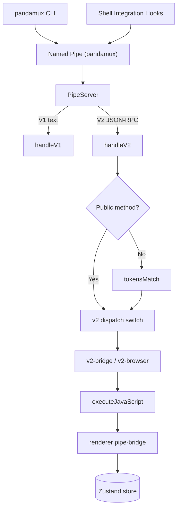

<!-- PAGE_ID: pandamux_08_named-pipe-ipc -->
<details>
<summary>Relevant source files</summary>

The following files were used as evidence for this page:

- [pipe-server.ts:1-177](https://github.com/BoardPandas/Pandamux/blob/0ab9e6463a9017a7b8ea98f10b3f847507658ac4/src/main/pipe-server.ts#L1-L177)
- [instance.ts:1-93](https://github.com/BoardPandas/Pandamux/blob/0ab9e6463a9017a7b8ea98f10b3f847507658ac4/src/shared/instance.ts#L1-L93)
- [v2-bridge.ts:1-125](https://github.com/BoardPandas/Pandamux/blob/0ab9e6463a9017a7b8ea98f10b3f847507658ac4/src/main/v2-bridge.ts#L1-L125)
- [v2-browser.ts:1-167](https://github.com/BoardPandas/Pandamux/blob/0ab9e6463a9017a7b8ea98f10b3f847507658ac4/src/main/v2-browser.ts#L1-L167)
- [pipe-bridge.ts:1-345](https://github.com/BoardPandas/Pandamux/blob/0ab9e6463a9017a7b8ea98f10b3f847507658ac4/src/renderer/pipe-bridge.ts#L1-L345)
- [types.ts:222-333](https://github.com/BoardPandas/Pandamux/blob/0ab9e6463a9017a7b8ea98f10b3f847507658ac4/src/shared/types.ts#L222-L333)
- [index.ts:27-37](https://github.com/BoardPandas/Pandamux/blob/0ab9e6463a9017a7b8ea98f10b3f847507658ac4/src/main/index.ts#L27-L37)
- [index.ts:390-787](https://github.com/BoardPandas/Pandamux/blob/0ab9e6463a9017a7b8ea98f10b3f847507658ac4/src/main/index.ts#L390-L787)
- [App.tsx:368-386](https://github.com/BoardPandas/Pandamux/blob/0ab9e6463a9017a7b8ea98f10b3f847507658ac4/src/renderer/App.tsx#L368-L386)

</details>

# Named Pipe Control Plane

> **Related Pages**: [CLI Reference](../api/CLI_REFERENCE.md), [Main Process Modules](../core/MAIN_PROCESS.md)

---

<!-- BEGIN:AUTOGEN pandamux_08_named-pipe-ipc_overview -->
## Overview

PandaMUX exposes a single Windows named pipe, `\\.\pipe\pandamux`, as the control plane every external client (the `pandamux` CLI, shell integration hooks, and Claude Code hooks) uses to drive a running instance. The pipe carries two protocols on the same socket: a legacy newline-delimited V1 text protocol for shell telemetry, and a JSON-RPC-shaped V2 protocol for structured commands (workspace/pane/surface CRUD, terminal I/O, agent spawning, browser control) (([pipe-server.ts:47-97](https://github.com/BoardPandas/Pandamux/blob/0ab9e6463a9017a7b8ea98f10b3f847507658ac4/src/main/pipe-server.ts#L47-L97))).

Most V2 methods do not mutate main-process state directly. Instead the main process calls `win.webContents.executeJavaScript(...)` to invoke a `window.__pandamux_*` global that the renderer's `pipe-bridge.ts` exposes, which reads and writes the Zustand store ([v2-bridge.ts:95-111](https://github.com/BoardPandas/Pandamux/blob/0ab9e6463a9017a7b8ea98f10b3f847507658ac4/src/main/v2-bridge.ts#L95-L111), [pipe-bridge.ts:11-24](https://github.com/BoardPandas/Pandamux/blob/0ab9e6463a9017a7b8ea98f10b3f847507658ac4/src/renderer/pipe-bridge.ts#L11-L24)). A smaller set of methods (terminal I/O, agent lifecycle, browser control, hook events) are handled directly in the main process because they touch `ptyManager`, `agentManager`, or the CDP bridge instead of renderer state ([index.ts:489-499](https://github.com/BoardPandas/Pandamux/blob/0ab9e6463a9017a7b8ea98f10b3f847507658ac4/src/main/index.ts#L489-L499), [index.ts:666-701](https://github.com/BoardPandas/Pandamux/blob/0ab9e6463a9017a7b8ea98f10b3f847507658ac4/src/main/index.ts#L666-L701)).



The pipe path and the per-instance auth token both come from `src/shared/instance.ts`, which also supports running a second, side-by-side pandamux instance via `PANDAMUX_INSTANCE` so a dev build does not collide with an installed one on the exclusive Windows pipe namespace ([instance.ts:14-26](https://github.com/BoardPandas/Pandamux/blob/0ab9e6463a9017a7b8ea98f10b3f847507658ac4/src/shared/instance.ts#L14-L26)).

Sources: [pipe-server.ts:1-177](https://github.com/BoardPandas/Pandamux/blob/0ab9e6463a9017a7b8ea98f10b3f847507658ac4/src/main/pipe-server.ts#L1-L177), [v2-bridge.ts:1-125](https://github.com/BoardPandas/Pandamux/blob/0ab9e6463a9017a7b8ea98f10b3f847507658ac4/src/main/v2-bridge.ts#L1-L125), [instance.ts:1-93](https://github.com/BoardPandas/Pandamux/blob/0ab9e6463a9017a7b8ea98f10b3f847507658ac4/src/shared/instance.ts#L1-L93)
<!-- END:AUTOGEN pandamux_08_named-pipe-ipc_overview -->

---

<!-- BEGIN:AUTOGEN pandamux_08_named-pipe-ipc_v1 -->
## V1 Text Protocol

The V1 protocol is the original newline-delimited text format used by shell integration scripts (bash, zsh, PowerShell, cmd) to report ambient state such as cwd, git branch, and PR status. A line that does not start with `{` is treated as V1 ([pipe-server.ts:62-73](https://github.com/BoardPandas/Pandamux/blob/0ab9e6463a9017a7b8ea98f10b3f847507658ac4/src/main/pipe-server.ts#L62-L73)).

`handleV1` splits each line into a fixed `<command> <surfaceId> <args...>` shape, but the args portion is parsed per-command rather than with a single split, so paths and titles containing spaces (for example an OneDrive path) survive intact ([pipe-server.ts:104-133](https://github.com/BoardPandas/Pandamux/blob/0ab9e6463a9017a7b8ea98f10b3f847507658ac4/src/main/pipe-server.ts#L104-L133)):

```typescript
switch (command) {
  case 'report_pwd':
  case 'notify':
    // Single free-text argument, may contain spaces (issue #53).
    args = argsRaw ? [argsRaw] : [];
    break;
  case 'report_pr': {
    // format: <number> <state> <title...>  (title may contain spaces)
    const prParts = argsRaw.split(/\s+/);
    args = prParts.length >= 3
      ? [prParts[0], prParts[1], prParts.slice(2).join(' ')]
      : prParts;
    break;
  }
  default:
    args = argsRaw ? argsRaw.split(/\s+/) : [];
    break;
}
```

Every V1 line is emitted as a `v1` event with a `V1Command { command, surfaceId, args }` payload ([pipe-server.ts:5-9](https://github.com/BoardPandas/Pandamux/blob/0ab9e6463a9017a7b8ea98f10b3f847507658ac4/src/main/pipe-server.ts#L5-L9), [pipe-server.ts:135-136](https://github.com/BoardPandas/Pandamux/blob/0ab9e6463a9017a7b8ea98f10b3f847507658ac4/src/main/pipe-server.ts#L135-L136)). `index.ts` listens for this event, forwards every command as a `METADATA_UPDATE` IPC message to all renderer windows, and additionally kicks the port scanner when it sees `ports_kick` ([index.ts:377-388](https://github.com/BoardPandas/Pandamux/blob/0ab9e6463a9017a7b8ea98f10b3f847507658ac4/src/main/index.ts#L377-L388)).

| Command | Args parsing | Socket reply | Consumer |
|---|---|---|---|
| `ping` | whitespace-split (none expected) | `pong\n` | Health check ([pipe-server.ts:139-140](https://github.com/BoardPandas/Pandamux/blob/0ab9e6463a9017a7b8ea98f10b3f847507658ac4/src/main/pipe-server.ts#L139-L140)) |
| `report_pwd` | single free-text arg | `ok\n` | `METADATA_UPDATE` broadcast ([index.ts:382-387](https://github.com/BoardPandas/Pandamux/blob/0ab9e6463a9017a7b8ea98f10b3f847507658ac4/src/main/index.ts#L382-L387)) |
| `notify` | single free-text arg | `ok\n` | `METADATA_UPDATE` broadcast ([index.ts:382-387](https://github.com/BoardPandas/Pandamux/blob/0ab9e6463a9017a7b8ea98f10b3f847507658ac4/src/main/index.ts#L382-L387)) |
| `report_pr` | `<number> <state> <title...>` | `ok\n` | `METADATA_UPDATE` broadcast ([index.ts:382-387](https://github.com/BoardPandas/Pandamux/blob/0ab9e6463a9017a7b8ea98f10b3f847507658ac4/src/main/index.ts#L382-L387)) |
| `ports_kick` | whitespace-split | `ok\n` | Triggers `portScanner.kick()` in addition to the broadcast ([index.ts:377-381](https://github.com/BoardPandas/Pandamux/blob/0ab9e6463a9017a7b8ea98f10b3f847507658ac4/src/main/index.ts#L377-L381)) |
| any other command | whitespace-split | `ok\n` | `METADATA_UPDATE` broadcast only |

Sources: [pipe-server.ts:47-144](https://github.com/BoardPandas/Pandamux/blob/0ab9e6463a9017a7b8ea98f10b3f847507658ac4/src/main/pipe-server.ts#L47-L144), [index.ts:377-388](https://github.com/BoardPandas/Pandamux/blob/0ab9e6463a9017a7b8ea98f10b3f847507658ac4/src/main/index.ts#L377-L388)
<!-- END:AUTOGEN pandamux_08_named-pipe-ipc_v1 -->

---

<!-- BEGIN:AUTOGEN pandamux_08_named-pipe-ipc_v2 -->
## V2 JSON-RPC Protocol

A line starting with `{` is parsed as a `V2Request { method, params, id?, token? }` and, on JSON parse failure, gets an immediate `{ error: { code: -32700, message: 'Parse error' } }` reply ([pipe-server.ts:11-16](https://github.com/BoardPandas/Pandamux/blob/0ab9e6463a9017a7b8ea98f10b3f847507658ac4/src/main/pipe-server.ts#L11-L16), [pipe-server.ts:62-69](https://github.com/BoardPandas/Pandamux/blob/0ab9e6463a9017a7b8ea98f10b3f847507658ac4/src/main/pipe-server.ts#L62-L69)). Every V2 reply has the shape `V2Response { result?, error?: { code, message }, id? }` and is written back as one JSON line ([pipe-server.ts:30-34](https://github.com/BoardPandas/Pandamux/blob/0ab9e6463a9017a7b8ea98f10b3f847507658ac4/src/main/pipe-server.ts#L30-L34)).

`handleV2` authenticates every method that is not in the `PUBLIC_V2_METHODS` allowlist (`system.identify`, `system.capabilities`, `hook.event`, `agent.activity`) before dispatch. Using an allowlist rather than a blocklist means any new privileged method is locked down by default ([pipe-server.ts:18-28](https://github.com/BoardPandas/Pandamux/blob/0ab9e6463a9017a7b8ea98f10b3f847507658ac4/src/main/pipe-server.ts#L18-L28)):

```typescript
if (!PUBLIC_V2_METHODS.has(request.method)) {
  if (!this.authToken) {
    respondError(-32001, 'Unauthorized: pipe auth token not initialized');
    return;
  }
  if (!tokensMatch(request.token || '', this.authToken)) {
    respondError(-32001, 'Unauthorized: missing or invalid token');
    return;
  }
}

// Emit the V2 request and let handlers respond
const handled = this.emit('v2', request, respond, respondError);
if (!handled) {
  respondError(-32601, `Method not found: ${request.method}`);
}
```

The auth token itself is a 32-byte random hex string generated once per instance by `ensurePipeToken()`, persisted under the instance's APPDATA directory with `0o600` permissions, and injected into every pandamux-spawned shell as `PANDAMUX_PIPE_TOKEN` so the CLI and Claude Code hooks authenticate automatically ([instance.ts:60-77](https://github.com/BoardPandas/Pandamux/blob/0ab9e6463a9017a7b8ea98f10b3f847507658ac4/src/shared/instance.ts#L60-L77), [index.ts:79-85](https://github.com/BoardPandas/Pandamux/blob/0ab9e6463a9017a7b8ea98f10b3f847507658ac4/src/main/index.ts#L79-L85)). Clients outside a pandamux shell fall back to reading the token file directly via `readPipeToken()` ([instance.ts:39-53](https://github.com/BoardPandas/Pandamux/blob/0ab9e6463a9017a7b8ea98f10b3f847507658ac4/src/shared/instance.ts#L39-L53)). Comparison uses `crypto.timingSafeEqual` to avoid leaking the token through timing side channels ([instance.ts:79-92](https://github.com/BoardPandas/Pandamux/blob/0ab9e6463a9017a7b8ea98f10b3f847507658ac4/src/shared/instance.ts#L79-L92)).

Example request/response pair for `workspace.create`, one of the methods handled through the uniform renderer bridge described in the next two sections ([v2-bridge.ts:31-34](https://github.com/BoardPandas/Pandamux/blob/0ab9e6463a9017a7b8ea98f10b3f847507658ac4/src/main/v2-bridge.ts#L31-L34)):

```json
{"method": "workspace.create", "params": {"title": "Build", "shell": "pwsh"}, "id": 1, "token": "<PANDAMUX_PIPE_TOKEN>"}
```

```json
{"result": {"workspaceId": "ws-1234"}, "id": 1}
```

Once authenticated, `index.ts` routes the request through `routeSpecialV2` before falling into its own large `switch` on `request.method` ([index.ts:27-37](https://github.com/BoardPandas/Pandamux/blob/0ab9e6463a9017a7b8ea98f10b3f847507658ac4/src/main/index.ts#L27-L37)):

```typescript
function routeSpecialV2(
  request: { method: string; params?: any },
  respond: (result: any) => void,
  respondError: (code: number, message: string) => void,
): boolean {
  if (request.method.startsWith('browser.')) {
    handleBrowserV2(request.method, request.params, respond, respondError);
    return true;
  }
  return handleBridgeV2(request.method, request.params, respond, respondError);
}
```

Sources: [pipe-server.ts:11-34](https://github.com/BoardPandas/Pandamux/blob/0ab9e6463a9017a7b8ea98f10b3f847507658ac4/src/main/pipe-server.ts#L11-L34), [pipe-server.ts:146-176](https://github.com/BoardPandas/Pandamux/blob/0ab9e6463a9017a7b8ea98f10b3f847507658ac4/src/main/pipe-server.ts#L146-L176), [instance.ts:39-92](https://github.com/BoardPandas/Pandamux/blob/0ab9e6463a9017a7b8ea98f10b3f847507658ac4/src/shared/instance.ts#L39-L92), [index.ts:27-37](https://github.com/BoardPandas/Pandamux/blob/0ab9e6463a9017a7b8ea98f10b3f847507658ac4/src/main/index.ts#L27-L37)
<!-- END:AUTOGEN pandamux_08_named-pipe-ipc_v2 -->

---

<!-- BEGIN:AUTOGEN pandamux_08_named-pipe-ipc_methods -->
## Method Catalog

Every V2 method falls into one of three dispatch paths: the uniform renderer-bridge table in `v2-bridge.ts`, the per-caller browser router in `v2-browser.ts`, or a hand-written `case` in the `index.ts` switch. `routeSpecialV2` tries the first two before the switch runs ([index.ts:390-395](https://github.com/BoardPandas/Pandamux/blob/0ab9e6463a9017a7b8ea98f10b3f847507658ac4/src/main/index.ts#L390-L395)).

Methods routed through `v2-bridge.ts`'s `SPECS` table call `window.__pandamux_*` via `executeJavaScript` and shape the result; `emptyOnNoWindow` lets read-only "list" methods return an empty collection instead of an error when no window exists yet ([v2-bridge.ts:30-93](https://github.com/BoardPandas/Pandamux/blob/0ab9e6463a9017a7b8ea98f10b3f847507658ac4/src/main/v2-bridge.ts#L30-L93)):

| Method | Params | Delegates to | Source |
|---|---|---|---|
| `workspace.create` | `title?`, `shell?`, `cwd?` | `window.__pandamux_createWorkspace` | ([v2-bridge.ts:31-34](https://github.com/BoardPandas/Pandamux/blob/0ab9e6463a9017a7b8ea98f10b3f847507658ac4/src/main/v2-bridge.ts#L31-L34)) |
| `workspace.close` | `id` / `workspaceId` | `window.__pandamux_closeWorkspace` | ([v2-bridge.ts:35-37](https://github.com/BoardPandas/Pandamux/blob/0ab9e6463a9017a7b8ea98f10b3f847507658ac4/src/main/v2-bridge.ts#L35-L37)) |
| `workspace.select` | `id` / `workspaceId` | `window.__pandamux_selectWorkspace` | ([v2-bridge.ts:38-40](https://github.com/BoardPandas/Pandamux/blob/0ab9e6463a9017a7b8ea98f10b3f847507658ac4/src/main/v2-bridge.ts#L38-L40)) |
| `workspace.rename` | `id` / `workspaceId`, `title?` | `window.__pandamux_renameWorkspace` | ([v2-bridge.ts:41-43](https://github.com/BoardPandas/Pandamux/blob/0ab9e6463a9017a7b8ea98f10b3f847507658ac4/src/main/v2-bridge.ts#L41-L43)) |
| `workspace.list` | none | `window.__pandamux_listWorkspaces` | ([v2-bridge.ts:44-48](https://github.com/BoardPandas/Pandamux/blob/0ab9e6463a9017a7b8ea98f10b3f847507658ac4/src/main/v2-bridge.ts#L44-L48)) |
| `pane.split` | `direction?`, `type?`, `workspaceId?`, `colorScheme?` | `window.__pandamux_splitPane` | ([v2-bridge.ts:49-52](https://github.com/BoardPandas/Pandamux/blob/0ab9e6463a9017a7b8ea98f10b3f847507658ac4/src/main/v2-bridge.ts#L49-L52)) |
| `pane.close` | `id` / `paneId`, `workspaceId?` | `window.__pandamux_closePane` | ([v2-bridge.ts:53-55](https://github.com/BoardPandas/Pandamux/blob/0ab9e6463a9017a7b8ea98f10b3f847507658ac4/src/main/v2-bridge.ts#L53-L55)) |
| `pane.list` | `workspaceId?` | `window.__pandamux_listPanes` | ([v2-bridge.ts:56-60](https://github.com/BoardPandas/Pandamux/blob/0ab9e6463a9017a7b8ea98f10b3f847507658ac4/src/main/v2-bridge.ts#L56-L60)) |
| `layout.grid` | `count`, `type?`, `anchorSurfaceId?`, `anchorPaneId?`, `workspaceId?` | `window.__pandamux_layoutGrid` | ([v2-bridge.ts:61-64](https://github.com/BoardPandas/Pandamux/blob/0ab9e6463a9017a7b8ea98f10b3f847507658ac4/src/main/v2-bridge.ts#L61-L64)) |
| `system.tree` | `workspaceId?` | `window.__pandamux_getTree` | ([v2-bridge.ts:65-69](https://github.com/BoardPandas/Pandamux/blob/0ab9e6463a9017a7b8ea98f10b3f847507658ac4/src/main/v2-bridge.ts#L65-L69)) |
| `surface.create` | `type?`, `paneId?`, `workspaceId?`, `colorScheme?` | `window.__pandamux_createSurface` | ([v2-bridge.ts:70-73](https://github.com/BoardPandas/Pandamux/blob/0ab9e6463a9017a7b8ea98f10b3f847507658ac4/src/main/v2-bridge.ts#L70-L73)) |
| `surface.close` | `id` / `surfaceId`, `workspaceId?` | `window.__pandamux_closeSurface` | ([v2-bridge.ts:74-76](https://github.com/BoardPandas/Pandamux/blob/0ab9e6463a9017a7b8ea98f10b3f847507658ac4/src/main/v2-bridge.ts#L74-L76)) |
| `surface.focus` | `id` / `surfaceId`, `workspaceId?` | `window.__pandamux_focusSurface` | ([v2-bridge.ts:77-79](https://github.com/BoardPandas/Pandamux/blob/0ab9e6463a9017a7b8ea98f10b3f847507658ac4/src/main/v2-bridge.ts#L77-L79)) |
| `surface.list` | `workspaceId?` | `window.__pandamux_listSurfaces` | ([v2-bridge.ts:80-84](https://github.com/BoardPandas/Pandamux/blob/0ab9e6463a9017a7b8ea98f10b3f847507658ac4/src/main/v2-bridge.ts#L80-L84)) |
| `markdown.set_content` | `surfaceId?`, `markdown?` | `window.__pandamux_setMarkdownContent` | ([v2-bridge.ts:85-87](https://github.com/BoardPandas/Pandamux/blob/0ab9e6463a9017a7b8ea98f10b3f847507658ac4/src/main/v2-bridge.ts#L85-L87)) |
| `notification.list` | none | `window.__pandamux_listNotifications` | ([v2-bridge.ts:88-92](https://github.com/BoardPandas/Pandamux/blob/0ab9e6463a9017a7b8ea98f10b3f847507658ac4/src/main/v2-bridge.ts#L88-L92)) |

`browser.*` methods are routed to `v2-browser.ts`, which resolves a per-caller browser `webContents` id (so concurrent agents each get their own browser surface, issue #62) and then runs the verb through the CDP bridge ([v2-browser.ts:65-101](https://github.com/BoardPandas/Pandamux/blob/0ab9e6463a9017a7b8ea98f10b3f847507658ac4/src/main/v2-browser.ts#L65-L101), [v2-browser.ts:106-134](https://github.com/BoardPandas/Pandamux/blob/0ab9e6463a9017a7b8ea98f10b3f847507658ac4/src/main/v2-browser.ts#L106-L134)):

| Method | Params | Delegates to | Source |
|---|---|---|---|
| `browser.navigate` | `url`, `timeout?` | `cdpBridge.navigate` | ([v2-browser.ts:108-110](https://github.com/BoardPandas/Pandamux/blob/0ab9e6463a9017a7b8ea98f10b3f847507658ac4/src/main/v2-browser.ts#L108-L110)) |
| `browser.snapshot` | none | `cdpBridge.snapshot` | ([v2-browser.ts:111-112](https://github.com/BoardPandas/Pandamux/blob/0ab9e6463a9017a7b8ea98f10b3f847507658ac4/src/main/v2-browser.ts#L111-L112)) |
| `browser.click` | `ref` | `cdpBridge.click` | ([v2-browser.ts:113-115](https://github.com/BoardPandas/Pandamux/blob/0ab9e6463a9017a7b8ea98f10b3f847507658ac4/src/main/v2-browser.ts#L113-L115)) |
| `browser.type` | `ref`, `text` | `cdpBridge.type` | ([v2-browser.ts:116-118](https://github.com/BoardPandas/Pandamux/blob/0ab9e6463a9017a7b8ea98f10b3f847507658ac4/src/main/v2-browser.ts#L116-L118)) |
| `browser.fill` | `ref`, `value` | `cdpBridge.fill` | ([v2-browser.ts:119-121](https://github.com/BoardPandas/Pandamux/blob/0ab9e6463a9017a7b8ea98f10b3f847507658ac4/src/main/v2-browser.ts#L119-L121)) |
| `browser.screenshot` | `fullPage?` | `cdpBridge.screenshot` | ([v2-browser.ts:122-123](https://github.com/BoardPandas/Pandamux/blob/0ab9e6463a9017a7b8ea98f10b3f847507658ac4/src/main/v2-browser.ts#L122-L123)) |
| `browser.get_text` | `ref?` | `cdpBridge.getText` | ([v2-browser.ts:124-125](https://github.com/BoardPandas/Pandamux/blob/0ab9e6463a9017a7b8ea98f10b3f847507658ac4/src/main/v2-browser.ts#L124-L125)) |
| `browser.eval` | `js` | `cdpBridge.evaluate` | ([v2-browser.ts:126-127](https://github.com/BoardPandas/Pandamux/blob/0ab9e6463a9017a7b8ea98f10b3f847507658ac4/src/main/v2-browser.ts#L126-L127)) |
| `browser.wait` | `ref?`, `timeout?` | `cdpBridge.wait` | ([v2-browser.ts:128-130](https://github.com/BoardPandas/Pandamux/blob/0ab9e6463a9017a7b8ea98f10b3f847507658ac4/src/main/v2-browser.ts#L128-L130)) |
| `browser.batch` | `commands: [{method, params}]`, `caller?` | Runs each command via `runBrowserCommand`, stopping at first error | ([v2-browser.ts:136-149](https://github.com/BoardPandas/Pandamux/blob/0ab9e6463a9017a7b8ea98f10b3f847507658ac4/src/main/v2-browser.ts#L136-L149)) |

The remaining methods are handled directly in the `index.ts` switch because they touch main-process singletons (`ptyManager`, `agentManager`) or broadcast Electron IPC rather than reading/writing renderer state through `executeJavaScript` alone:

| Method | Params | Delegates to | Source |
|---|---|---|---|
| `system.identify` | none (public) | Static `{ name, version, platform }` | ([index.ts:396-397](https://github.com/BoardPandas/Pandamux/blob/0ab9e6463a9017a7b8ea98f10b3f847507658ac4/src/main/index.ts#L396-L397)) |
| `system.capabilities` | none (public) | Static `{ protocols, features }` | ([index.ts:399-401](https://github.com/BoardPandas/Pandamux/blob/0ab9e6463a9017a7b8ea98f10b3f847507658ac4/src/main/index.ts#L399-L401)) |
| `pane.focus` | `id` / `paneId`, `workspaceId?` | Looks up the pane's first surface via `__pandamux_listPanes`, then `__pandamux_focusSurface` | ([index.ts:403-423](https://github.com/BoardPandas/Pandamux/blob/0ab9e6463a9017a7b8ea98f10b3f847507658ac4/src/main/index.ts#L403-L423)) |
| `pane.zoom` | any | Acknowledged only; zoom is renderer-only UI state | ([index.ts:424-428](https://github.com/BoardPandas/Pandamux/blob/0ab9e6463a9017a7b8ea98f10b3f847507658ac4/src/main/index.ts#L424-L428)) |
| `surface.set_color_scheme` | `surfaceId` / `id`, `colorScheme` / `scheme` | `window.__pandamux_setSurfaceColorScheme` | ([index.ts:431-447](https://github.com/BoardPandas/Pandamux/blob/0ab9e6463a9017a7b8ea98f10b3f847507658ac4/src/main/index.ts#L431-L447)) |
| `theme.list` | none | `loadBundledThemes()` from `theme-loader.ts` | ([index.ts:448-460](https://github.com/BoardPandas/Pandamux/blob/0ab9e6463a9017a7b8ea98f10b3f847507658ac4/src/main/index.ts#L448-L460)) |
| `config.get` | none | `loadUserConfig()` from `user-config.ts` | ([index.ts:461-470](https://github.com/BoardPandas/Pandamux/blob/0ab9e6463a9017a7b8ea98f10b3f847507658ac4/src/main/index.ts#L461-L470)) |
| `config.reload` | none | Re-reads config, pushes `config:userConfigUpdated` to all windows | ([index.ts:471-486](https://github.com/BoardPandas/Pandamux/blob/0ab9e6463a9017a7b8ea98f10b3f847507658ac4/src/main/index.ts#L471-L486)) |
| `surface.send_text` | `surfaceId?` / `id?`, `text?` | `ptyManager.write` | ([index.ts:489-499](https://github.com/BoardPandas/Pandamux/blob/0ab9e6463a9017a7b8ea98f10b3f847507658ac4/src/main/index.ts#L489-L499)) |
| `surface.send_key` | `key`, `modifiers?` / `ctrl?`/`alt?`/`shift?`, `surfaceId?` | Translates key name to bytes, then `ptyManager.write` | ([index.ts:500-532](https://github.com/BoardPandas/Pandamux/blob/0ab9e6463a9017a7b8ea98f10b3f847507658ac4/src/main/index.ts#L500-L532)) |
| `surface.read_text` | `surfaceId?` | _TBD_ (stub only; returns `{ text: '', note: '...' }`, real screen read needs an xterm serializer addon) | ([index.ts:533-538](https://github.com/BoardPandas/Pandamux/blob/0ab9e6463a9017a7b8ea98f10b3f847507658ac4/src/main/index.ts#L533-L538)) |
| `surface.trigger_flash` | `surfaceId?` | Broadcasts `NOTIFICATION_FIRE` to all windows | ([index.ts:539-550](https://github.com/BoardPandas/Pandamux/blob/0ab9e6463a9017a7b8ea98f10b3f847507658ac4/src/main/index.ts#L539-L550)) |
| `markdown.load_file` | `filePath` / `path` / `file`, `surfaceId?` | Validates extension/size, reads file, `window.__pandamux_setMarkdownContent` | ([index.ts:554-585](https://github.com/BoardPandas/Pandamux/blob/0ab9e6463a9017a7b8ea98f10b3f847507658ac4/src/main/index.ts#L554-L585)) |
| `notification.clear` | `id?`, `all?` | `window.__pandamux_clearNotification` / `__pandamux_clearAllNotifications` | ([index.ts:589-607](https://github.com/BoardPandas/Pandamux/blob/0ab9e6463a9017a7b8ea98f10b3f847507658ac4/src/main/index.ts#L589-L607)) |
| `sidebar.set_status` | `surfaceId?`, `key?`, `value?` | Broadcasts `METADATA_UPDATE` (`status`) | ([index.ts:610-623](https://github.com/BoardPandas/Pandamux/blob/0ab9e6463a9017a7b8ea98f10b3f847507658ac4/src/main/index.ts#L610-L623)) |
| `sidebar.set_progress` | `surfaceId?`, `value?`, `label?` | Broadcasts `METADATA_UPDATE` (`progress`) | ([index.ts:624-636](https://github.com/BoardPandas/Pandamux/blob/0ab9e6463a9017a7b8ea98f10b3f847507658ac4/src/main/index.ts#L624-L636)) |
| `sidebar.log` | `surfaceId?`, `level?`, `message?` | Broadcasts `METADATA_UPDATE` (`log`) | ([index.ts:637-649](https://github.com/BoardPandas/Pandamux/blob/0ab9e6463a9017a7b8ea98f10b3f847507658ac4/src/main/index.ts#L637-L649)) |
| `sidebar.get_state` | none | `window.__pandamux_listWorkspaces` | ([index.ts:650-663](https://github.com/BoardPandas/Pandamux/blob/0ab9e6463a9017a7b8ea98f10b3f847507658ac4/src/main/index.ts#L650-L663)) |
| `agent.spawn` | `cmd` / `prompt`, `label?`, `cwd?`, `env?`, `paneId?`, `workspaceId?` | `agentManager.spawn`, then `AGENT_UPDATE` broadcast | ([index.ts:666-701](https://github.com/BoardPandas/Pandamux/blob/0ab9e6463a9017a7b8ea98f10b3f847507658ac4/src/main/index.ts#L666-L701)) |
| `agent.spawn_batch` | `agents[]`, `strategy?`, `workspaceId?` | `resolveAgentAssignments` + `spawnAgentBatch` | ([index.ts:703-723](https://github.com/BoardPandas/Pandamux/blob/0ab9e6463a9017a7b8ea98f10b3f847507658ac4/src/main/index.ts#L703-L723)) |
| `agent.status` | `agentId` | `agentManager.getStatus` | ([index.ts:725-730](https://github.com/BoardPandas/Pandamux/blob/0ab9e6463a9017a7b8ea98f10b3f847507658ac4/src/main/index.ts#L725-L730)) |
| `agent.list` | `workspaceId?` | `agentManager.list` | ([index.ts:731-733](https://github.com/BoardPandas/Pandamux/blob/0ab9e6463a9017a7b8ea98f10b3f847507658ac4/src/main/index.ts#L731-L733)) |
| `agent.kill` | `agentId` | `agentManager.kill` | ([index.ts:734-739](https://github.com/BoardPandas/Pandamux/blob/0ab9e6463a9017a7b8ea98f10b3f847507658ac4/src/main/index.ts#L734-L739)) |
| `hook.event` | Claude Code hook payload (public) | Broadcasts `HOOK_EVENT`; staggers `DIFF_UPDATE` for Edit/Write tools | ([index.ts:741-760](https://github.com/BoardPandas/Pandamux/blob/0ab9e6463a9017a7b8ea98f10b3f847507658ac4/src/main/index.ts#L741-L760)) |
| `agent.activity` | `surfaceId`, `tool?`, `skill?`, `done?` (public) | `applyExternalActivity` (claude-observer) | ([index.ts:762-773](https://github.com/BoardPandas/Pandamux/blob/0ab9e6463a9017a7b8ea98f10b3f847507658ac4/src/main/index.ts#L762-L773)) |
| `diff.refresh` | `file?` | Broadcasts `DIFF_UPDATE` | ([index.ts:775-782](https://github.com/BoardPandas/Pandamux/blob/0ab9e6463a9017a7b8ea98f10b3f847507658ac4/src/main/index.ts#L775-L782)) |

Any method matching none of the above falls to the `default` case and returns `-32601 Method not found` ([index.ts:784-785](https://github.com/BoardPandas/Pandamux/blob/0ab9e6463a9017a7b8ea98f10b3f847507658ac4/src/main/index.ts#L784-L785)).

Sources: [v2-bridge.ts:30-124](https://github.com/BoardPandas/Pandamux/blob/0ab9e6463a9017a7b8ea98f10b3f847507658ac4/src/main/v2-bridge.ts#L30-L124), [v2-browser.ts:106-167](https://github.com/BoardPandas/Pandamux/blob/0ab9e6463a9017a7b8ea98f10b3f847507658ac4/src/main/v2-browser.ts#L106-L167), [index.ts:390-787](https://github.com/BoardPandas/Pandamux/blob/0ab9e6463a9017a7b8ea98f10b3f847507658ac4/src/main/index.ts#L390-L787)
<!-- END:AUTOGEN pandamux_08_named-pipe-ipc_methods -->

---

<!-- BEGIN:AUTOGEN pandamux_08_named-pipe-ipc_bridge -->
## Renderer Bridge

`src/renderer/pipe-bridge.ts` exposes Zustand store operations as `window.__pandamux_*` globals during `initPipeBridge()`, which is called once from `App.tsx` alongside two extra globals (`__pandamux_getActiveWorkspaceId`, `__pandamux_getPaneLoads`) that the agent-spawn methods need ([pipe-bridge.ts:11-24](https://github.com/BoardPandas/Pandamux/blob/0ab9e6463a9017a7b8ea98f10b3f847507658ac4/src/renderer/pipe-bridge.ts#L11-L24), [App.tsx:368-386](https://github.com/BoardPandas/Pandamux/blob/0ab9e6463a9017a7b8ea98f10b3f847507658ac4/src/renderer/App.tsx#L368-L386)). Every global reads `useStore.getState()` fresh on each call rather than closing over a stale snapshot, since `executeJavaScript` calls can arrive at any time relative to React renders.

| Global | Backing store call | Purpose |
|---|---|---|
| `__pandamux_createWorkspace` / `_closeWorkspace` / `_selectWorkspace` / `_renameWorkspace` / `_listWorkspaces` | `store.createWorkspace` / `closeWorkspace` / `selectWorkspace` / `renameWorkspace` / `workspaces` | Workspace CRUD ([pipe-bridge.ts:16-47](https://github.com/BoardPandas/Pandamux/blob/0ab9e6463a9017a7b8ea98f10b3f847507658ac4/src/renderer/pipe-bridge.ts#L16-L47)) |
| `__pandamux_getWorkspaceIdForSurface` / `_listBrowserSurfaces` | Walks `ws.splitTree` via `getAllPaneIds` / `findLeaf` | Resolves per-caller browser routing for `v2-browser.ts` (#62) ([pipe-bridge.ts:52-77](https://github.com/BoardPandas/Pandamux/blob/0ab9e6463a9017a7b8ea98f10b3f847507658ac4/src/renderer/pipe-bridge.ts#L52-L77)) |
| `__pandamux_splitPane` / `_closePane` / `_layoutGrid` / `_listPanes` | `splitNode` / `removeLeaf` / `buildGridLayout` from `split-utils.ts` | Pane tree mutation ([pipe-bridge.ts:81-193](https://github.com/BoardPandas/Pandamux/blob/0ab9e6463a9017a7b8ea98f10b3f847507658ac4/src/renderer/pipe-bridge.ts#L81-L193)) |
| `__pandamux_createSurface` / `_setSurfaceColorScheme` / `_closeSurface` / `_focusSurface` / `_listSurfaces` / `_getActiveSurfaceId` | `store.addSurface` / `updateSurface` / `closeSurface` / `selectSurface` | Surface (tab) CRUD ([pipe-bridge.ts:197-309](https://github.com/BoardPandas/Pandamux/blob/0ab9e6463a9017a7b8ea98f10b3f847507658ac4/src/renderer/pipe-bridge.ts#L197-L309)) |
| `__pandamux_setMarkdownContent` | `store.setMarkdownContent` | Fixes markdown content not reaching `MarkdownPane` (issue #54) ([pipe-bridge.ts:313-319](https://github.com/BoardPandas/Pandamux/blob/0ab9e6463a9017a7b8ea98f10b3f847507658ac4/src/renderer/pipe-bridge.ts#L313-L319)) |
| `__pandamux_listNotifications` / `_clearNotification` / `_clearAllNotifications` | `store.notifications` / `clearNotification` / `clearAll` | Notification list/clear ([pipe-bridge.ts:323-333](https://github.com/BoardPandas/Pandamux/blob/0ab9e6463a9017a7b8ea98f10b3f847507658ac4/src/renderer/pipe-bridge.ts#L323-L333)) |
| `__pandamux_getTree` | `ws.splitTree` | `system.tree` support ([pipe-bridge.ts:337-343](https://github.com/BoardPandas/Pandamux/blob/0ab9e6463a9017a7b8ea98f10b3f847507658ac4/src/renderer/pipe-bridge.ts#L337-L343)) |
| `__pandamux_getActiveWorkspaceId` / `_getPaneLoads` | `store.activeWorkspaceId` / pane tab counts | Read by `agent.spawn` / `agent.spawn_batch` to pick a target pane ([App.tsx:370-379](https://github.com/BoardPandas/Pandamux/blob/0ab9e6463a9017a7b8ea98f10b3f847507658ac4/src/renderer/App.tsx#L370-L379)) |

`__pandamux_splitPane` is representative of the denser globals: it resolves the target workspace, picks the first pane as the split target, builds the new leaf via `splitNode`, and, for `pandamux split --color-scheme prod`, applies a per-pane color-scheme override to the freshly created surface before returning `{ paneId, surfaceId }` ([pipe-bridge.ts:81-110](https://github.com/BoardPandas/Pandamux/blob/0ab9e6463a9017a7b8ea98f10b3f847507658ac4/src/renderer/pipe-bridge.ts#L81-L110)):

```typescript
const newTree = splitNode(ws.splitTree, targetPaneId, newPaneId, surfaceType, direction);
store.updateSplitTree(wsId, newTree);

const newLeaf = findLeaf(newTree, newPaneId);
const surfaceId = newLeaf?.surfaces?.[0]?.id || null;

if (params?.colorScheme && surfaceId && newLeaf) {
  store.updateSurface(wsId, newPaneId, surfaceId as SurfaceId, { colorScheme: params.colorScheme });
}

return { paneId: newPaneId, surfaceId };
```

Sources: [pipe-bridge.ts:1-345](https://github.com/BoardPandas/Pandamux/blob/0ab9e6463a9017a7b8ea98f10b3f847507658ac4/src/renderer/pipe-bridge.ts#L1-L345), [App.tsx:368-386](https://github.com/BoardPandas/Pandamux/blob/0ab9e6463a9017a7b8ea98f10b3f847507658ac4/src/renderer/App.tsx#L368-L386)
<!-- END:AUTOGEN pandamux_08_named-pipe-ipc_bridge -->

---

<!-- BEGIN:AUTOGEN pandamux_08_named-pipe-ipc_channels -->
## Electron IPC Channels

The named pipe is a process-external protocol; once a V2 handler needs to notify open renderer windows of a change, it does so over ordinary Electron IPC, using string constants centralized in `IPC_CHANNELS` so no handler hardcodes a channel name ([types.ts:222-333](https://github.com/BoardPandas/Pandamux/blob/0ab9e6463a9017a7b8ea98f10b3f847507658ac4/src/shared/types.ts#L222-L333)). These channels are distinct from the pipe's V1/V2 methods: a single pipe request can fan out to a broadcast on one or more of these channels across every `BrowserWindow`.

| IPC channel | Constant | Triggered by |
|---|---|---|
| `metadata:update` | `METADATA_UPDATE` ([types.ts:287](https://github.com/BoardPandas/Pandamux/blob/0ab9e6463a9017a7b8ea98f10b3f847507658ac4/src/shared/types.ts#L287)) | Every V1 command ([index.ts:382-387](https://github.com/BoardPandas/Pandamux/blob/0ab9e6463a9017a7b8ea98f10b3f847507658ac4/src/main/index.ts#L382-L387)), `sidebar.set_status` / `_set_progress` / `_log` ([index.ts:610-649](https://github.com/BoardPandas/Pandamux/blob/0ab9e6463a9017a7b8ea98f10b3f847507658ac4/src/main/index.ts#L610-L649)) |
| `notification:fire` | `NOTIFICATION_FIRE` ([types.ts:255](https://github.com/BoardPandas/Pandamux/blob/0ab9e6463a9017a7b8ea98f10b3f847507658ac4/src/shared/types.ts#L255)) | `surface.trigger_flash` ([index.ts:539-550](https://github.com/BoardPandas/Pandamux/blob/0ab9e6463a9017a7b8ea98f10b3f847507658ac4/src/main/index.ts#L539-L550)) |
| `agent:update` | `AGENT_UPDATE` ([types.ts:294](https://github.com/BoardPandas/Pandamux/blob/0ab9e6463a9017a7b8ea98f10b3f847507658ac4/src/shared/types.ts#L294)) | `agent.spawn` ([index.ts:694-696](https://github.com/BoardPandas/Pandamux/blob/0ab9e6463a9017a7b8ea98f10b3f847507658ac4/src/main/index.ts#L694-L696)) |
| `hook:event` | `HOOK_EVENT` ([types.ts:310](https://github.com/BoardPandas/Pandamux/blob/0ab9e6463a9017a7b8ea98f10b3f847507658ac4/src/shared/types.ts#L310)) | `hook.event` ([index.ts:741-744](https://github.com/BoardPandas/Pandamux/blob/0ab9e6463a9017a7b8ea98f10b3f847507658ac4/src/main/index.ts#L741-L744)) |
| `diff:update` | `DIFF_UPDATE` ([types.ts:323](https://github.com/BoardPandas/Pandamux/blob/0ab9e6463a9017a7b8ea98f10b3f847507658ac4/src/shared/types.ts#L323)) | `hook.event` for Edit/Write tools (staggered at 500ms/2s) ([index.ts:748-757](https://github.com/BoardPandas/Pandamux/blob/0ab9e6463a9017a7b8ea98f10b3f847507658ac4/src/main/index.ts#L748-L757)), `diff.refresh` ([index.ts:775-780](https://github.com/BoardPandas/Pandamux/blob/0ab9e6463a9017a7b8ea98f10b3f847507658ac4/src/main/index.ts#L775-L780)) |
| `config:userConfigUpdated` | `CONFIG_USER_CONFIG_UPDATED` ([types.ts:278](https://github.com/BoardPandas/Pandamux/blob/0ab9e6463a9017a7b8ea98f10b3f847507658ac4/src/shared/types.ts#L278)) | `config.reload` ([index.ts:476-481](https://github.com/BoardPandas/Pandamux/blob/0ab9e6463a9017a7b8ea98f10b3f847507658ac4/src/main/index.ts#L476-L481)) |
| `cdp:navigate`, `cdp:snapshot`, `cdp:click`, `cdp:type`, `cdp:fill`, `cdp:screenshot`, `cdp:get-text`, `cdp:eval`, `cdp:wait` | `CDP_*` ([types.ts:296-306](https://github.com/BoardPandas/Pandamux/blob/0ab9e6463a9017a7b8ea98f10b3f847507658ac4/src/shared/types.ts#L296-L306)) | Underlying transport for the `browser.*` V2 methods handled by `v2-browser.ts` and the CDP bridge |

Everything else in `IPC_CHANNELS` (PTY, window management, settings, session persistence) exists for the preload/renderer boundary and is not driven by the named pipe; it is documented on the [Main Process Modules](../core/MAIN_PROCESS.md) page.

Sources: [types.ts:222-333](https://github.com/BoardPandas/Pandamux/blob/0ab9e6463a9017a7b8ea98f10b3f847507658ac4/src/shared/types.ts#L222-L333), [index.ts:539-780](https://github.com/BoardPandas/Pandamux/blob/0ab9e6463a9017a7b8ea98f10b3f847507658ac4/src/main/index.ts#L539-L780)
<!-- END:AUTOGEN pandamux_08_named-pipe-ipc_channels -->

---
