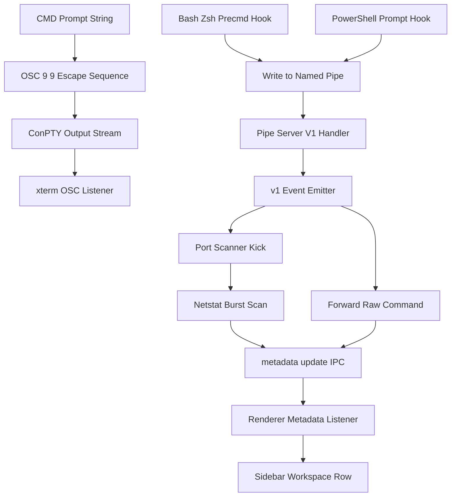

<!-- PAGE_ID: pandamux_12_shell-integration -->
<details>
<summary>Relevant source files</summary>

The following files were used as evidence for this page:

- [pandamux-bash-integration.sh:1-71](https://github.com/BoardPandas/Pandamux/blob/0ab9e6463a9017a7b8ea98f10b3f847507658ac4/src/shell-integration/pandamux-bash-integration.sh#L1-L71)
- [pandamux-powershell-integration.ps1:1-149](https://github.com/BoardPandas/Pandamux/blob/0ab9e6463a9017a7b8ea98f10b3f847507658ac4/src/shell-integration/pandamux-powershell-integration.ps1#L1-L149)
- [pandamux-cmd-integration.cmd:1-15](https://github.com/BoardPandas/Pandamux/blob/0ab9e6463a9017a7b8ea98f10b3f847507658ac4/src/shell-integration/pandamux-cmd-integration.cmd#L1-L15)
- [git-poller.ts:1-79](https://github.com/BoardPandas/Pandamux/blob/0ab9e6463a9017a7b8ea98f10b3f847507658ac4/src/main/git-poller.ts#L1-L79)
- [pr-poller.ts:1-64](https://github.com/BoardPandas/Pandamux/blob/0ab9e6463a9017a7b8ea98f10b3f847507658ac4/src/main/pr-poller.ts#L1-L64)
- [port-scanner.ts:1-102](https://github.com/BoardPandas/Pandamux/blob/0ab9e6463a9017a7b8ea98f10b3f847507658ac4/src/main/port-scanner.ts#L1-L102)
- [shell-detector.ts:1-80](https://github.com/BoardPandas/Pandamux/blob/0ab9e6463a9017a7b8ea98f10b3f847507658ac4/src/main/shell-detector.ts#L1-L80)
- [pipe-server.ts:104-144](https://github.com/BoardPandas/Pandamux/blob/0ab9e6463a9017a7b8ea98f10b3f847507658ac4/src/main/pipe-server.ts#L104-L144)
- [index.ts:339-388](https://github.com/BoardPandas/Pandamux/blob/0ab9e6463a9017a7b8ea98f10b3f847507658ac4/src/main/index.ts#L339-L388)
- [App.tsx:126-180](https://github.com/BoardPandas/Pandamux/blob/0ab9e6463a9017a7b8ea98f10b3f847507658ac4/src/renderer/App.tsx#L126-L180)
- [pty-manager.ts:97-134](https://github.com/BoardPandas/Pandamux/blob/0ab9e6463a9017a7b8ea98f10b3f847507658ac4/src/main/pty-manager.ts#L97-L134)
- [types.ts:165-170](https://github.com/BoardPandas/Pandamux/blob/0ab9e6463a9017a7b8ea98f10b3f847507658ac4/src/shared/types.ts#L165-L170)

</details>

# Shell Integration and Status

> **Related Pages**: [Configuration](../core/CONFIGURATION.md), [AI Agent Integration](AI_INTEGRATION.md), [Main Process Modules](../core/MAIN_PROCESS.md)

---

<!-- BEGIN:AUTOGEN pandamux_12_shell-integration_overview -->
## Overview

PandaMUX Everywhere injects a small hook script into every spawned terminal shell so the sidebar can show a workspace's current directory, git branch, dirty state, PR status, and busy/idle state without the user running a status command. The hook scripts talk back to the main process over the named pipe (or, for `cmd.exe`, an OSC escape sequence embedded in the prompt), and a handful of main-process poller classes complement that self-reporting for port detection.

The three scripts, `pandamux-bash-integration.sh`, `pandamux-powershell-integration.ps1`, and `pandamux-cmd-integration.cmd`, are deployed to `resources/shell-integration/` and selected per shell type when a PTY is spawned ([pty-manager.ts:100-134](https://github.com/BoardPandas/Pandamux/blob/0ab9e6463a9017a7b8ea98f10b3f847507658ac4/src/main/pty-manager.ts#L100-L134)). Reports arrive at the main process as V1 text commands on `\\.\pipe\pandamux` ([pipe-server.ts:104-144](https://github.com/BoardPandas/Pandamux/blob/0ab9e6463a9017a7b8ea98f10b3f847507658ac4/src/main/pipe-server.ts#L104-L144)), are forwarded verbatim to every renderer window over the `metadata:update` IPC channel ([index.ts:377-388](https://github.com/BoardPandas/Pandamux/blob/0ab9e6463a9017a7b8ea98f10b3f847507658ac4/src/main/index.ts#L377-L388)), and are applied to per-workspace state in `App.tsx`, which the Sidebar then renders ([App.tsx:152-180](https://github.com/BoardPandas/Pandamux/blob/0ab9e6463a9017a7b8ea98f10b3f847507658ac4/src/renderer/App.tsx#L152-L180)).



Three poller classes also exist in the main process for this feature area: `GitPoller`, `PrPoller`, and `PortScanner`. Only `PortScanner` is actually driven from a shell hook today, via the `ports_kick` V1 command ([index.ts:377-381](https://github.com/BoardPandas/Pandamux/blob/0ab9e6463a9017a7b8ea98f10b3f847507658ac4/src/main/index.ts#L377-L381)). `GitPoller.watch()` and `PrPoller.startPolling()` are fully implemented and wired to `metadata:update` on their `onUpdate` callbacks ([index.ts:351-375](https://github.com/BoardPandas/Pandamux/blob/0ab9e6463a9017a7b8ea98f10b3f847507658ac4/src/main/index.ts#L351-L375)), but no call site in this revision invokes `watch()` or `startPolling()`; the live git-branch and PR reporting the sidebar actually receives today comes from the shell scripts calling `git`/`gh` directly inside their own prompt hooks (see the Git Poller and PR Poller sections below for the exact evidence).

Sources: [pty-manager.ts:100-134](https://github.com/BoardPandas/Pandamux/blob/0ab9e6463a9017a7b8ea98f10b3f847507658ac4/src/main/pty-manager.ts#L100-L134), [pipe-server.ts:104-144](https://github.com/BoardPandas/Pandamux/blob/0ab9e6463a9017a7b8ea98f10b3f847507658ac4/src/main/pipe-server.ts#L104-L144), [index.ts:339-388](https://github.com/BoardPandas/Pandamux/blob/0ab9e6463a9017a7b8ea98f10b3f847507658ac4/src/main/index.ts#L339-L388), [App.tsx:126-180](https://github.com/BoardPandas/Pandamux/blob/0ab9e6463a9017a7b8ea98f10b3f847507658ac4/src/renderer/App.tsx#L126-L180)
<!-- END:AUTOGEN pandamux_12_shell-integration_overview -->

---

<!-- BEGIN:AUTOGEN pandamux_12_shell-integration_scripts -->
## Shell Hook Scripts

Each script is selected by `buildShellArgs()` based on the detected shell type (`powershell`, `cmd`, or `wsl`; the bash script is sourced inside WSL/Linux shells rather than launched as a direct argument) and receives `PANDAMUX_SURFACE_ID`, `PANDAMUX_CLI`, `PANDAMUX_PIPE`, and `PANDAMUX_PIPE_TOKEN` through the PTY environment ([pty-manager.ts:100-134](https://github.com/BoardPandas/Pandamux/blob/0ab9e6463a9017a7b8ea98f10b3f847507658ac4/src/main/pty-manager.ts#L100-L134)).

| Script | Shell | Mechanism | Reports |
|---|---|---|---|
| `pandamux-bash-integration.sh` | Bash / Zsh (WSL), sourced when `PANDAMUX_INTEGRATION=1` ([pandamux-bash-integration.sh:3](https://github.com/BoardPandas/Pandamux/blob/0ab9e6463a9017a7b8ea98f10b3f847507658ac4/src/shell-integration/pandamux-bash-integration.sh#L3)) | Appends `report_*` lines to a temp file via `_pandamux_report()` ([pandamux-bash-integration.sh:11-17](https://github.com/BoardPandas/Pandamux/blob/0ab9e6463a9017a7b8ea98f10b3f847507658ac4/src/shell-integration/pandamux-bash-integration.sh#L11-L17)) | cwd, git branch/dirty, shell state (idle/running/interrupted), triggers a ports scan |
| `pandamux-powershell-integration.ps1` | PowerShell 7 / Windows PowerShell | Opens a `NamedPipeClientStream` to `\\.\pipe\pandamux` per message via `Send-PandaMUXMessage` ([pandamux-powershell-integration.ps1:19-31](https://github.com/BoardPandas/Pandamux/blob/0ab9e6463a9017a7b8ea98f10b3f847507658ac4/src/shell-integration/pandamux-powershell-integration.ps1#L19-L31)) | cwd, git branch/dirty, shell state, ports, and PR number/state/title from a background `Start-Job` polling `gh pr view` every 45s ([pandamux-powershell-integration.ps1:101-129](https://github.com/BoardPandas/Pandamux/blob/0ab9e6463a9017a7b8ea98f10b3f847507658ac4/src/shell-integration/pandamux-powershell-integration.ps1#L101-L129)) |
| `pandamux-cmd-integration.cmd` | Command Prompt | Rewrites the `PROMPT` environment variable to embed an OSC 9 escape sequence ([pandamux-cmd-integration.cmd:12-14](https://github.com/BoardPandas/Pandamux/blob/0ab9e6463a9017a7b8ea98f10b3f847507658ac4/src/shell-integration/pandamux-cmd-integration.cmd#L12-L14)) | cwd only (no git, PR, or shell-state reporting) |

The bash script's `_pandamux_precmd()` runs on every prompt redraw and fires cwd, git, and shell-state reports plus a port-scan kick in one pass:

```bash
_pandamux_precmd() {
    local exit_code=$?
    _pandamux_report_cwd
    _pandamux_report_git
    # 130 = SIGINT (Ctrl+C), 137 = SIGKILL, 143 = SIGTERM
    if [ $exit_code -eq 130 ] || [ $exit_code -eq 137 ] || [ $exit_code -eq 143 ]; then
        _pandamux_report "report_shell_state ${PANDAMUX_SURFACE_ID} interrupted"
    else
        _pandamux_report "report_shell_state ${PANDAMUX_SURFACE_ID} idle"
    fi
    _pandamux_report "ports_kick ${PANDAMUX_SURFACE_ID}"
}
```

Note that `_pandamux_report()` writes to `/mnt/c/Users/${USER}/AppData/Local/Temp/pandamux/messages` rather than the named pipe ([pandamux-bash-integration.sh:11-17](https://github.com/BoardPandas/Pandamux/blob/0ab9e6463a9017a7b8ea98f10b3f847507658ac4/src/shell-integration/pandamux-bash-integration.sh#L11-L17)); no reader for that temp file was found in `src/main`, so bash/zsh (WSL) self-reporting is `_TBD_` as a fully wired end-to-end path in this revision, unlike the PowerShell script's direct pipe write.

The CMD integration reports cwd only, using OSC 9 with a pandamux-specific subcode:

| OSC Sequence | Format | Purpose | Used By |
|---|---|---|---|
| `ESC]9;9;<path>ESC\` | `$e]9;9;$P$e\$P$G` baked into `PROMPT` ([pandamux-cmd-integration.cmd:14](https://github.com/BoardPandas/Pandamux/blob/0ab9e6463a9017a7b8ea98f10b3f847507658ac4/src/shell-integration/pandamux-cmd-integration.cmd#L14)) | Reports the current working directory on every prompt draw | `pandamux-cmd-integration.cmd` only; bash and PowerShell report cwd over the named pipe/temp file instead of an OSC sequence |

Sources: [pandamux-bash-integration.sh:1-71](https://github.com/BoardPandas/Pandamux/blob/0ab9e6463a9017a7b8ea98f10b3f847507658ac4/src/shell-integration/pandamux-bash-integration.sh#L1-L71), [pandamux-powershell-integration.ps1:1-149](https://github.com/BoardPandas/Pandamux/blob/0ab9e6463a9017a7b8ea98f10b3f847507658ac4/src/shell-integration/pandamux-powershell-integration.ps1#L1-L149), [pandamux-cmd-integration.cmd:1-15](https://github.com/BoardPandas/Pandamux/blob/0ab9e6463a9017a7b8ea98f10b3f847507658ac4/src/shell-integration/pandamux-cmd-integration.cmd#L1-L15), [pty-manager.ts:100-134](https://github.com/BoardPandas/Pandamux/blob/0ab9e6463a9017a7b8ea98f10b3f847507658ac4/src/main/pty-manager.ts#L100-L134)
<!-- END:AUTOGEN pandamux_12_shell-integration_scripts -->

---

<!-- BEGIN:AUTOGEN pandamux_12_shell-integration_git -->
## Git Poller

`GitPoller` watches a working directory's `.git/HEAD` file with `fs.watch` and re-runs `git rev-parse` / `git status` whenever it changes, reporting the branch name and dirty flag through a registered callback.

```typescript
private async pollGitState(cwd: string): Promise<void> {
    try {
      const { stdout: branch } = await execFileAsync('git', ['rev-parse', '--abbrev-ref', 'HEAD'], {
        cwd,
        windowsHide: true,
        timeout: 5000,
      });

      let dirty = false;
      try {
        const { stdout: status } = await execFileAsync('git', ['status', '--porcelain'], {
          cwd,
          windowsHide: true,
          timeout: 5000,
        });
        dirty = status.trim().length > 0;
      } catch {}

      this.callback?.(cwd, { branch: branch.trim(), dirty });
    } catch {
      this.callback?.(cwd, { branch: null, dirty: false });
    }
  }
```

Sources: [git-poller.ts:56-78](https://github.com/BoardPandas/Pandamux/blob/0ab9e6463a9017a7b8ea98f10b3f847507658ac4/src/main/git-poller.ts#L56-L78)

| Method | Purpose |
|---|---|
| `onUpdate(callback)` | Registers the single callback invoked with `(cwd, { branch, dirty })` ([git-poller.ts:17-19](https://github.com/BoardPandas/Pandamux/blob/0ab9e6463a9017a7b8ea98f10b3f847507658ac4/src/main/git-poller.ts#L17-L19)) |
| `watch(cwd)` | Starts an `fs.watch` on `<cwd>/.git/HEAD` and does an initial poll; no-op if already watching or `.git/HEAD` does not exist ([git-poller.ts:24-40](https://github.com/BoardPandas/Pandamux/blob/0ab9e6463a9017a7b8ea98f10b3f847507658ac4/src/main/git-poller.ts#L24-L40)) |
| `unwatch(cwd)` / `unwatchAll()` | Closes and removes the watcher(s) for a cwd or all cwds ([git-poller.ts:42-54](https://github.com/BoardPandas/Pandamux/blob/0ab9e6463a9017a7b8ea98f10b3f847507658ac4/src/main/git-poller.ts#L42-L54)) |

`index.ts` registers `gitPoller.onUpdate(...)` to translate a state change into a `report_git_branch` (or `clear_git_branch`) `metadata:update` broadcast to every window ([index.ts:351-361](https://github.com/BoardPandas/Pandamux/blob/0ab9e6463a9017a7b8ea98f10b3f847507658ac4/src/main/index.ts#L351-L361)), and calls `gitPoller.unwatchAll()` during shutdown. However, `watch()` itself is never called anywhere in `src/main` at this commit, so this callback currently never fires; the git branch and dirty flag actually shown in the sidebar are self-reported instead by the bash and PowerShell hook scripts' own `git rev-parse` / `git status` calls sent as `report_git_branch` V1 commands ([pandamux-bash-integration.sh:25-37](https://github.com/BoardPandas/Pandamux/blob/0ab9e6463a9017a7b8ea98f10b3f847507658ac4/src/shell-integration/pandamux-bash-integration.sh#L25-L37), [pandamux-powershell-integration.ps1:42-59](https://github.com/BoardPandas/Pandamux/blob/0ab9e6463a9017a7b8ea98f10b3f847507658ac4/src/shell-integration/pandamux-powershell-integration.ps1#L42-L59)) and applied on the renderer side by `handleSurfaceMetadata()` ([App.tsx:158-159](https://github.com/BoardPandas/Pandamux/blob/0ab9e6463a9017a7b8ea98f10b3f847507658ac4/src/renderer/App.tsx#L158-L159)).

Sources: [git-poller.ts:1-79](https://github.com/BoardPandas/Pandamux/blob/0ab9e6463a9017a7b8ea98f10b3f847507658ac4/src/main/git-poller.ts#L1-L79), [index.ts:351-361](https://github.com/BoardPandas/Pandamux/blob/0ab9e6463a9017a7b8ea98f10b3f847507658ac4/src/main/index.ts#L351-L361), [App.tsx:158-159](https://github.com/BoardPandas/Pandamux/blob/0ab9e6463a9017a7b8ea98f10b3f847507658ac4/src/renderer/App.tsx#L158-L159)
<!-- END:AUTOGEN pandamux_12_shell-integration_git -->

---

<!-- BEGIN:AUTOGEN pandamux_12_shell-integration_pr -->
## PR Poller

`PrPoller` runs a per-cwd `setInterval` every 45 seconds that shells out to `gh pr view --json number,state,title` and reports the result (or `null` when there is no PR or `gh` is missing).

```typescript
private async pollPr(cwd: string): Promise<void> {
    try {
      const { stdout } = await execFileAsync('gh', ['pr', 'view', '--json', 'number,state,title'], {
        cwd,
        windowsHide: true,
        timeout: 10000,
      });

      const pr = JSON.parse(stdout.trim()) as PrInfo;
      this.callback?.(cwd, pr);
    } catch {
      // gh not installed or no PR — that's fine
      this.callback?.(cwd, null);
    }
  }
```

Sources: [pr-poller.ts:49-63](https://github.com/BoardPandas/Pandamux/blob/0ab9e6463a9017a7b8ea98f10b3f847507658ac4/src/main/pr-poller.ts#L49-L63)

| Method | Purpose |
|---|---|
| `onUpdate(callback)` | Registers the callback invoked with `(cwd, PrInfo \| null)` ([pr-poller.ts:17-19](https://github.com/BoardPandas/Pandamux/blob/0ab9e6463a9017a7b8ea98f10b3f847507658ac4/src/main/pr-poller.ts#L17-L19)) |
| `startPolling(cwd)` | Does an initial poll, then a `setInterval` every `pollIntervalMs` (45000ms) ([pr-poller.ts:24-33](https://github.com/BoardPandas/Pandamux/blob/0ab9e6463a9017a7b8ea98f10b3f847507658ac4/src/main/pr-poller.ts#L24-L33)) |
| `stopPolling(cwd)` / `stopAll()` | Clears the interval for one cwd or every tracked cwd ([pr-poller.ts:35-47](https://github.com/BoardPandas/Pandamux/blob/0ab9e6463a9017a7b8ea98f10b3f847507658ac4/src/main/pr-poller.ts#L35-L47)) |

As with `GitPoller`, `index.ts` wires `prPoller.onUpdate(...)` to broadcast a `report_pr` `metadata:update` ([index.ts:363-375](https://github.com/BoardPandas/Pandamux/blob/0ab9e6463a9017a7b8ea98f10b3f847507658ac4/src/main/index.ts#L363-L375)) and calls `prPoller.stopAll()` at shutdown, but `startPolling()` has no call site in this revision. PR status shown in the sidebar today comes from the PowerShell script's own deferred `Start-Job` loop, which polls `gh pr view` every 45 seconds and writes `report_pr <surfaceId> <number> <state> <title>` straight to the named pipe:

```powershell
$global:_pandamux_pr_job = Start-Job -ScriptBlock {
        param($surfaceId, $pipeName)
        while ($true) {
            Start-Sleep -Seconds 45
            try {
                $prJson = gh pr view --json number,state,title 2>$null
                if ($LASTEXITCODE -eq 0 -and $prJson) {
                    $pr = $prJson | ConvertFrom-Json
                    $pipe = New-Object System.IO.Pipes.NamedPipeClientStream(".", $pipeName, [System.IO.Pipes.PipeDirection]::InOut)
                    $pipe.Connect(1000)
                    $writer = New-Object System.IO.StreamWriter($pipe)
                    $writer.AutoFlush = $true
                    $writer.WriteLine("report_pr $surfaceId $($pr.number) $($pr.state) $($pr.title)")
                    $pipe.Close()
                }
            } catch { }
        }
    } -ArgumentList $env:PANDAMUX_SURFACE_ID, "pandamux"
```

The job is deliberately started on the PowerShell engine's first `OnIdle` event rather than at profile load, because `Start-Job` spins up a full child runspace that would otherwise delay the first prompt ([pandamux-powershell-integration.ps1:101-107](https://github.com/BoardPandas/Pandamux/blob/0ab9e6463a9017a7b8ea98f10b3f847507658ac4/src/shell-integration/pandamux-powershell-integration.ps1#L101-L107)). Bash/cmd have no equivalent PR polling; only PowerShell reports PR status.

Sources: [pr-poller.ts:1-64](https://github.com/BoardPandas/Pandamux/blob/0ab9e6463a9017a7b8ea98f10b3f847507658ac4/src/main/pr-poller.ts#L1-L64), [index.ts:363-375](https://github.com/BoardPandas/Pandamux/blob/0ab9e6463a9017a7b8ea98f10b3f847507658ac4/src/main/index.ts#L363-L375), [pandamux-powershell-integration.ps1:101-129](https://github.com/BoardPandas/Pandamux/blob/0ab9e6463a9017a7b8ea98f10b3f847507658ac4/src/shell-integration/pandamux-powershell-integration.ps1#L101-L129)
<!-- END:AUTOGEN pandamux_12_shell-integration_pr -->

---

<!-- BEGIN:AUTOGEN pandamux_12_shell-integration_ports -->
## Port Scanner

`PortScanner` is kicked every time a shell prompt redraws (`ports_kick <surfaceId>` sent by the bash and PowerShell hooks, [pandamux-bash-integration.sh:49](https://github.com/BoardPandas/Pandamux/blob/0ab9e6463a9017a7b8ea98f10b3f847507658ac4/src/shell-integration/pandamux-bash-integration.sh#L49), [pandamux-powershell-integration.ps1:91](https://github.com/BoardPandas/Pandamux/blob/0ab9e6463a9017a7b8ea98f10b3f847507658ac4/src/shell-integration/pandamux-powershell-integration.ps1#L91)). `index.ts` receives the raw `ports_kick` V1 command and calls `portScanner.kick()` directly, this is the one poller entry point that is actually wired end to end ([index.ts:377-381](https://github.com/BoardPandas/Pandamux/blob/0ab9e6463a9017a7b8ea98f10b3f847507658ac4/src/main/index.ts#L377-L381)).

`kick()` coalesces rapid calls (a fast prompt loop should not launch a `netstat` per keystroke) and then fires a fixed burst of scans, since a freshly started dev server does not bind its port instantly:

```typescript
kick(): void {
    // Clear existing coalesce timer
    if (this.coalesceTimer) clearTimeout(this.coalesceTimer);

    // Coalesce: wait 200ms before starting burst
    this.coalesceTimer = setTimeout(() => {
      this.clearBurst();
      const offsets = [500, 1500, 3000, 5000, 7500, 10000];
      offsets.forEach(ms => {
        const timer = setTimeout(() => this.scan(), ms);
        this.burstTimers.push(timer);
      });
    }, 200);
  }
```

Sources: [port-scanner.ts:24-37](https://github.com/BoardPandas/Pandamux/blob/0ab9e6463a9017a7b8ea98f10b3f847507658ac4/src/main/port-scanner.ts#L24-L37)

Each `scan()` shells out to `netstat -ano` and `parseNetstat()` extracts `LISTENING` sockets, mapping each PID to the list of ports it holds, while filtering out ports below 1024:

| Step | Behavior | Source |
|---|---|---|
| Guard | Skips overlapping scans with a `scanning` boolean flag | [port-scanner.ts:49-51](https://github.com/BoardPandas/Pandamux/blob/0ab9e6463a9017a7b8ea98f10b3f847507658ac4/src/main/port-scanner.ts#L49-L51) |
| Execute | `execFile('netstat', ['-ano'], { windowsHide: true, timeout: 10000 })` | [port-scanner.ts:54](https://github.com/BoardPandas/Pandamux/blob/0ab9e6463a9017a7b8ea98f10b3f847507658ac4/src/main/port-scanner.ts#L54) |
| Filter | Keeps only lines containing `LISTENING`, parses `PROTO LOCAL_ADDR FOREIGN_ADDR STATE PID` | [port-scanner.ts:72-82](https://github.com/BoardPandas/Pandamux/blob/0ab9e6463a9017a7b8ea98f10b3f847507658ac4/src/main/port-scanner.ts#L72-L82) |
| Extract port | Splits `LOCAL_ADDR` on the last `:` to handle both `0.0.0.0:3000` and `[::]:3000` | [port-scanner.ts:84-88](https://github.com/BoardPandas/Pandamux/blob/0ab9e6463a9017a7b8ea98f10b3f847507658ac4/src/main/port-scanner.ts#L84-L88) |
| Skip system ports | Discards any port below 1024 | [port-scanner.ts:91](https://github.com/BoardPandas/Pandamux/blob/0ab9e6463a9017a7b8ea98f10b3f847507658ac4/src/main/port-scanner.ts#L91) |

Results are delivered to `onResults(callback)` as a `Map<pid, ports[]>` ([port-scanner.ts:16-18](https://github.com/BoardPandas/Pandamux/blob/0ab9e6463a9017a7b8ea98f10b3f847507658ac4/src/main/port-scanner.ts#L16-L18)); `index.ts` serializes that map with `Object.fromEntries` and sends it as a `ports_update` `metadata:update` to every window ([index.ts:339-349](https://github.com/BoardPandas/Pandamux/blob/0ab9e6463a9017a7b8ea98f10b3f847507658ac4/src/main/index.ts#L339-L349)), which the renderer applies globally rather than to one workspace, since `ports_update` carries no `surfaceId` ([App.tsx:441-442](https://github.com/BoardPandas/Pandamux/blob/0ab9e6463a9017a7b8ea98f10b3f847507658ac4/src/renderer/App.tsx#L441-L442)).

Sources: [port-scanner.ts:1-102](https://github.com/BoardPandas/Pandamux/blob/0ab9e6463a9017a7b8ea98f10b3f847507658ac4/src/main/port-scanner.ts#L1-L102), [index.ts:339-388](https://github.com/BoardPandas/Pandamux/blob/0ab9e6463a9017a7b8ea98f10b3f847507658ac4/src/main/index.ts#L339-L388), [App.tsx:441-442](https://github.com/BoardPandas/Pandamux/blob/0ab9e6463a9017a7b8ea98f10b3f847507658ac4/src/renderer/App.tsx#L441-L442)
<!-- END:AUTOGEN pandamux_12_shell-integration_ports -->

---

<!-- BEGIN:AUTOGEN pandamux_12_shell-integration_detector -->
## Shell Detector

`shell-detector.ts` enumerates which Windows shells are installed so the New Workspace / shell picker UI and `getDefaultShell()` fallback logic (used when spawning a PTY) know what is available. Detection shells out to `where.exe` for each candidate, run in parallel with `Promise.all`.

```typescript
export async function detectShells(): Promise<ShellInfo[]> {
  const shells: ShellInfo[] = [];

  // Run all checks in parallel instead of sequentially
  const [hasPwsh, hasPowershell, hasWsl] = await Promise.all([
    commandExists('pwsh.exe'),
    commandExists('powershell.exe'),
    commandExists('wsl.exe'),
  ]);
  ...
```

Sources: [shell-detector.ts:25-65](https://github.com/BoardPandas/Pandamux/blob/0ab9e6463a9017a7b8ea98f10b3f847507658ac4/src/main/shell-detector.ts#L25-L65)

| Shell | Detection command | `ShellInfo.command` | Always available |
|---|---|---|---|
| PowerShell 7 (`pwsh`) | `where pwsh.exe` | Resolved absolute path via `where` ([shell-detector.ts:16-23](https://github.com/BoardPandas/Pandamux/blob/0ab9e6463a9017a7b8ea98f10b3f847507658ac4/src/main/shell-detector.ts#L16-L23)) | No |
| Windows PowerShell | `where powershell.exe` | Resolved absolute path via `where` | No |
| Command Prompt | None, unconditionally pushed | `cmd.exe` ([shell-detector.ts:57](https://github.com/BoardPandas/Pandamux/blob/0ab9e6463a9017a7b8ea98f10b3f847507658ac4/src/main/shell-detector.ts#L57)) | Yes |
| WSL | `where wsl.exe` | Resolved absolute path via `where` | No |

Each entry conforms to the `ShellInfo` shape shared with the renderer:

```typescript
export interface ShellInfo {
  name: string;
  command: string;
  args: string[];
  available: boolean;
}
```

Sources: [types.ts:165-170](https://github.com/BoardPandas/Pandamux/blob/0ab9e6463a9017a7b8ea98f10b3f847507658ac4/src/shared/types.ts#L165-L170)

`getDefaultShell()` picks the first available shell in preference order `PowerShell 7 > Windows PowerShell > Command Prompt`, falling back to `shells[0]` (which is always Command Prompt since it is pushed unconditionally) if none of the preferred names match ([shell-detector.ts:67-80](https://github.com/BoardPandas/Pandamux/blob/0ab9e6463a9017a7b8ea98f10b3f847507658ac4/src/main/shell-detector.ts#L67-L80)).

Sources: [shell-detector.ts:1-80](https://github.com/BoardPandas/Pandamux/blob/0ab9e6463a9017a7b8ea98f10b3f847507658ac4/src/main/shell-detector.ts#L1-L80)
<!-- END:AUTOGEN pandamux_12_shell-integration_detector -->

---
