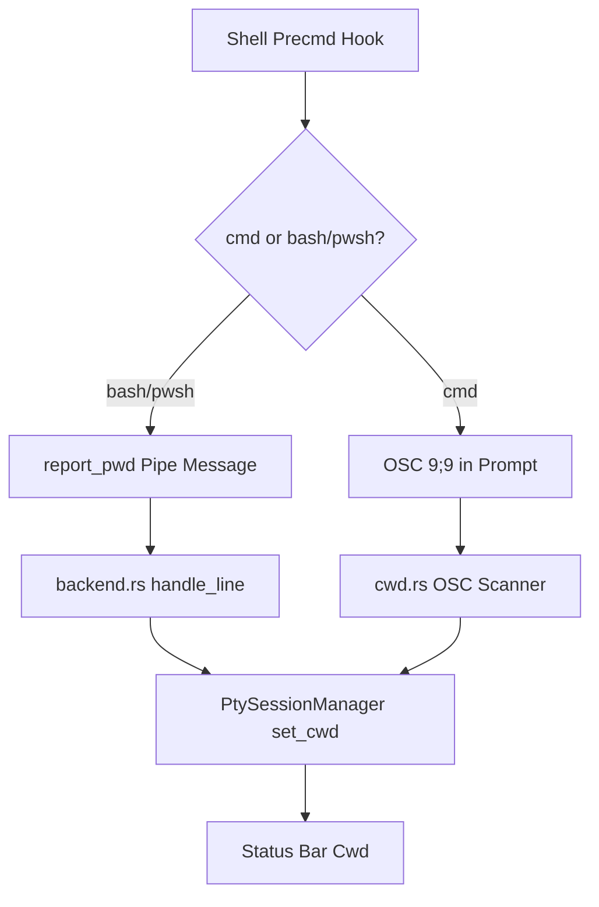

<!-- PAGE_ID: pandamux_13_shell-integration -->
<details>
<summary>Relevant source files</summary>

The following files were used as evidence for this page:

- [pandamux-bash-integration.sh:1-67](resources/shell-integration/pandamux-bash-integration.sh#L1-L67)
- [pandamux-powershell-integration.ps1:1-108](resources/shell-integration/pandamux-powershell-integration.ps1#L1-L108)
- [pandamux-cmd-integration.cmd:1-11](resources/shell-integration/pandamux-cmd-integration.cmd#L1-L11)
- [cwd.rs:1-199](crates/pandamux-term/src/cwd.rs#L1-L199)
- [backend.rs:192-210](crates/pandamux-app/src/backend.rs#L192-L210)
- [backend.rs:828-841](crates/pandamux-app/src/backend.rs#L828-L841)
- [backend.rs:2729-2735](crates/pandamux-app/src/backend.rs#L2729-L2735)
- [pollers.rs:1-79](crates/pandamux-app/src/pollers.rs#L1-L79)

</details>

# Shell Integration and Status

> **Related Pages**: [Configuration](../core/CONFIGURATION.md), [Terminal Engine](../core/TERMINAL_ENGINE.md)

---

<!-- BEGIN:AUTOGEN pandamux_13_shell-integration_overview -->
## Overview

Shell hook scripts injected into spawned shells report the current working directory, git branch/dirty state, and shell run state back to PandaMUX, either inline as terminal escape sequences or as messages over the named pipe (`report_pwd <surfaceId> <path>`) (backend.rs:198-206). Every spawned shell also receives a small set of `PANDAMUX_*` environment variables so it (and any hook script) can find the pipe and identify itself: `PANDAMUX=1`, `PANDAMUX_SURFACE_ID`, `PANDAMUX_PIPE`, and `PANDAMUX_AGENT_ID` for agent surfaces (backend.rs:828-841).

Two reporting paths exist side by side. cmd.exe has no scripting hook for pipe I/O, so it embeds an OSC 9;9 escape sequence directly in its `prompt` string, which is scanned out of the PTY byte stream by `pandamux-term::cwd` (pandamux-cmd-integration.cmd:8-10, cwd.rs:1-13). Bash/zsh and PowerShell instead have real hook points (`precmd`/`preexec`, or a `prompt` function override) and send `report_pwd`, `report_git_branch`, and other messages directly over the named pipe (pandamux-bash-integration.sh:35-46, pandamux-powershell-integration.ps1:68-79).



Sources: [pandamux-cmd-integration.cmd:1-11](resources/shell-integration/pandamux-cmd-integration.cmd#L1-L11), [pandamux-bash-integration.sh:1-67](resources/shell-integration/pandamux-bash-integration.sh#L1-L67), [cwd.rs:1-13](crates/pandamux-term/src/cwd.rs#L1-L13), [backend.rs:192-210](crates/pandamux-app/src/backend.rs#L192-L210), [backend.rs:828-841](crates/pandamux-app/src/backend.rs#L828-L841)
<!-- END:AUTOGEN pandamux_13_shell-integration_overview -->

---

<!-- BEGIN:AUTOGEN pandamux_13_shell-integration_scripts -->
## Shell Hook Scripts

PandaMUX ships one integration script per shell family under `resources/shell-integration/`; each is sourced (or, for cmd, has its `prompt` set) in spawned shells that carry `PANDAMUX_SURFACE_ID`.

| Script | Shells | Reported Signals |
|---|---|---|
| `pandamux-bash-integration.sh` | bash, zsh | `report_pwd` on every prompt, `report_git_branch`/`clear_git_branch` with a `dirty` flag from `git status --porcelain`, `report_shell_state` (`running`/`idle`/`interrupted`) from `preexec`/`precmd`, and `ports_kick` on every precmd (pandamux-bash-integration.sh:15-46) |
| `pandamux-powershell-integration.ps1` | PowerShell (`pwsh`) | The same `report_pwd`/`report_git_branch`/`report_shell_state`/`ports_kick` set, sent from a `prompt` override plus a PSReadLine Enter-key handler for the pre-execution `running` state, and additionally `report_pr` (PR number/state/title via `gh pr view`) from a 45-second background job (pandamux-powershell-integration.ps1:21-107) |
| `pandamux-cmd-integration.cmd` | cmd.exe | cwd only, embedded as an OSC 9;9 escape sequence in the `prompt` string (`$e]9;9;$P$e\$P$G`); cmd has no scripting hook to send pipe messages, so git/shell-state/ports are not reported from this script (pandamux-cmd-integration.cmd:8-10) |

Bash/zsh and PowerShell both write their pipe messages differently: the bash script appends lines to a temp file the main process tails (`_pandamux_report`) (pandamux-bash-integration.sh:7-13), while PowerShell opens a `NamedPipeClientStream` directly per message (`Send-PandaMUXMessage`) (pandamux-powershell-integration.ps1:7-19). Of these, only `report_pwd` is currently consumed by `pandamux-app::backend::handle_line`; other V1 messages (`report_git_branch`, `report_shell_state`, `ports_kick`, `report_pr`) do not match the `report_pwd ` prefix or a JSON `{` payload and are dropped by the dispatcher's fallthrough, since git branch/ahead-count and open ports are instead recomputed independently by the pollers (see below) (backend.rs:192-210).

Sources: [pandamux-bash-integration.sh:1-67](resources/shell-integration/pandamux-bash-integration.sh#L1-L67), [pandamux-powershell-integration.ps1:1-108](resources/shell-integration/pandamux-powershell-integration.ps1#L1-L108), [pandamux-cmd-integration.cmd:1-11](resources/shell-integration/pandamux-cmd-integration.cmd#L1-L11), [backend.rs:192-210](crates/pandamux-app/src/backend.rs#L192-L210)
<!-- END:AUTOGEN pandamux_13_shell-integration_scripts -->

---

<!-- BEGIN:AUTOGEN pandamux_13_shell-integration_cwd -->
## CWD Tracking and report_pwd

`CwdScanner` in `pandamux-term::cwd` is an incremental byte-level parser fed every chunk of PTY output; it walks a small `Ground`/`Esc`/`Osc` state machine looking for an OSC introducer (`ESC ]`) and commits a cwd only when a terminator (`BEL` or `ESC \`) closes the sequence, so a sequence split across PTY reads is still parsed correctly (cwd.rs:14-104). `parse_cwd_osc` recognizes two payload shapes: `9;9;<path>` (cmd/Windows Terminal) and `7;<uri>` (standard OSC 7), percent-decoding the path and stripping the `file://host` prefix and any Windows drive-letter leading slash for OSC 7 (cwd.rs:106-157).

```rust
// crates/pandamux-term/src/cwd.rs:106-127
fn parse_cwd_osc(payload: &[u8]) -> Option<String> {
    let text = std::str::from_utf8(payload).ok()?;
    if let Some(rest) = text.strip_prefix("9;9;") {
        let path = normalize_path(percent_decode(rest.trim()));
        return (!path.is_empty()).then_some(path);
    }
    if let Some(rest) = text.strip_prefix("7;") {
        let rest = rest.trim();
        let path = match rest.strip_prefix("file://") {
            Some(after) => match after.find('/') {
                Some(index) => &after[index..],
                None => "",
            },
            None => rest,
        };
        let path = normalize_path(percent_decode(path));
        return (!path.is_empty()).then_some(path);
    }
    None
}
```

Bash and PowerShell do not rely on this in-stream scanning at all; they instead send the V1 text message `report_pwd <surfaceId> <path>` over the pipe on every prompt (pandamux-bash-integration.sh:15-19, pandamux-powershell-integration.ps1:21-27). `pandamux-app::backend::handle_line` special-cases this prefix before falling into the JSON-RPC path, splitting the surface id from the path and calling `ctx.ptys.set_cwd(surface_id, path.trim())` (backend.rs:198-206); a regression test asserts the line is accepted and produces an empty (no-reply) response (backend.rs:2729-2735). `CwdScanner::set` is the same direct-override entry point the pipe path calls into, bypassing the OSC state machine entirely (cwd.rs:49-52).

Sources: [cwd.rs:1-199](crates/pandamux-term/src/cwd.rs#L1-L199), [backend.rs:192-210](crates/pandamux-app/src/backend.rs#L192-L210), [backend.rs:2729-2735](crates/pandamux-app/src/backend.rs#L2729-L2735)
<!-- END:AUTOGEN pandamux_13_shell-integration_cwd -->

---

<!-- BEGIN:AUTOGEN pandamux_13_shell-integration_pollers -->
## Git and Port Pollers

Independently of the shell hooks' `report_git_branch`/`ports_kick` messages, `pandamux-app::pollers` recomputes both signals itself for the status bar. `poll_all` runs a git poll and a port poll concurrently with `tokio::join!`, using the focused session's known cwd (from `report_pwd`/OSC reporting) or falling back to the process working directory (pollers.rs:28-39).

`poll_git` shells out to `git rev-parse --abbrev-ref HEAD` for the branch name, treating an empty or detached (`HEAD`) result as "no branch," and then runs `git rev-list --count @{u}..HEAD` to compute the ahead-count against the branch's upstream (pollers.rs:41-52). All git invocations go through `run_git`, an async `tokio::process::Command` call that sets Windows' `CREATE_NO_WINDOW` creation flag so the console-subsystem `git.exe` child doesn't pop a window and steal focus from the GUI-subsystem `pandamux.exe` (pollers.rs:54-68).

`poll_ports` scans a fixed candidate list of common local dev-server ports (`3000, 3001, 4000, 4200, 5000, 5173, 5199, 8000, 8080, 8081, 9000`) with a 120ms `tokio::net::TcpStream::connect` timeout against localhost per port, collecting whichever connect succeeds (pollers.rs:24-25, 70-79).

| Poller | Signal | Mechanism | Source |
|---|---|---|---|
| `poll_git` | branch name + ahead count | `git rev-parse` / `git rev-list --count` via async `tokio::process::Command` | ([pollers.rs:41-52](crates/pandamux-app/src/pollers.rs#L41-L52)) |
| `poll_ports` | open localhost dev ports | 120ms `TcpStream::connect` against a fixed candidate list | ([pollers.rs:24-25](crates/pandamux-app/src/pollers.rs#L24-L25), [pollers.rs:70-79](crates/pandamux-app/src/pollers.rs#L70-L79)) |

Sources: [pollers.rs:1-79](crates/pandamux-app/src/pollers.rs#L1-L79)
<!-- END:AUTOGEN pandamux_13_shell-integration_pollers -->

---
