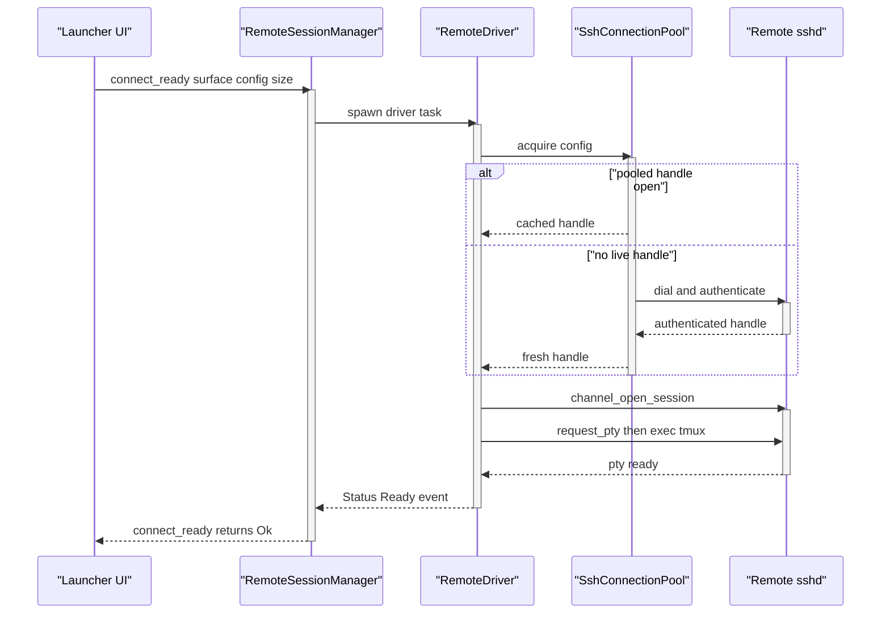

<!-- PAGE_ID: pandamux_11_ssh-remote -->
<details>
<summary>Relevant source files</summary>

The following files were used as evidence for this page:

- [ssh.rs:1-346](crates/pandamux-core/src/ssh.rs#L1-L346)
- [ssh.rs:1-1585](crates/pandamux-term/src/ssh.rs#L1-L1585)
- [clipboard.rs:1-97](crates/pandamux-term/src/clipboard.rs#L1-L97)
- [session_launcher.rs:1-129](crates/pandamux-ui/src/session_launcher.rs#L1-L129)
- [session_launcher.rs:324-561](crates/pandamux-ui/src/session_launcher.rs#L324-L561)
- [session_launcher.rs:563-680](crates/pandamux-ui/src/session_launcher.rs#L563-L680)
- [backend.rs:1157-1359](crates/pandamux-app/src/backend.rs#L1157-L1359)
- [backend.rs:1412-1471](crates/pandamux-app/src/backend.rs#L1412-L1471)
- [backend.rs:135-178](crates/pandamux-app/src/backend.rs#L135-L178)

</details>

# SSH Remote Surfaces

> **Related Pages**: [Terminal Engine](../core/TERMINAL_ENGINE.md), [Named Pipe Control Plane](NAMED_PIPE_IPC.md)

---

<!-- BEGIN:AUTOGEN pandamux_11_ssh-remote_overview -->
## Overview

A "remote surface" is a terminal surface whose byte source is an SSH channel instead of a local PTY; architecturally it mirrors a local surface exactly, since bytes flow into the same `TerminalGrid`, input flows back out the same way, and resize forwards as an SSH `window-change` (([ssh.rs:1-8](crates/pandamux-term/src/ssh.rs#L1-L8))). `RemoteSessionManager` deliberately mirrors `PtySessionManager`'s synchronous API so the backend dispatcher does not need to know which kind of session a surface has (([ssh.rs:6-19](crates/pandamux-term/src/ssh.rs#L6-L19))).

Durability comes from wrapping the remote login shell in `tmux new -A -s pandamux-<surface>`, so a long-running process (Claude Code included) survives a dropped connection; on reconnect the driver re-attaches and resets the local grid before the server's repaint lands, so the view reconciles cleanly instead of appending to stale state (([ssh.rs:10-15](crates/pandamux-term/src/ssh.rs#L10-L15))). Connection reuse (spec 1.6) keeps one authenticated `russh` connection per host/port/user/auth identity in a `SshConnectionPool`; every surface opens its own channel on the shared handle, so a second session on an already-connected host skips TCP, key exchange, and auth entirely, and folder browsing / git-hint SFTP reads draw from the same pool to pre-warm the connection while the user is still picking a folder (([ssh.rs:21-28](crates/pandamux-term/src/ssh.rs#L21-L28))).

The secretless, UI-facing description of a connection (host profiles, `~/.ssh/config` import, clipboard policy) lives in `pandamux-core::ssh`; the actual `russh` work, including secrets, lives entirely in `pandamux-term::ssh` (([ssh.rs:1-5](crates/pandamux-core/src/ssh.rs#L1-L5))). OSC 52 clipboard traffic (copy-over-SSH) and SFTP-based image paste piggyback on this same remote-surface machinery rather than needing their own transport (([clipboard.rs:1-8](crates/pandamux-term/src/clipboard.rs#L1-L8))).

Sources: [ssh.rs:1-28](crates/pandamux-term/src/ssh.rs#L1-L28), [ssh.rs:1-5](crates/pandamux-core/src/ssh.rs#L1-L5), [clipboard.rs:1-8](crates/pandamux-term/src/clipboard.rs#L1-L8)
<!-- END:AUTOGEN pandamux_11_ssh-remote_overview -->

---

<!-- BEGIN:AUTOGEN pandamux_11_ssh-remote_model -->
## SSH Connection Model

`pandamux-core::ssh` defines the persistent, secretless description of a connection: a `Password` profile records only that a prompt is needed at connect time, it never stores the secret itself (([ssh.rs:1-5](crates/pandamux-core/src/ssh.rs#L1-L5))).

`SshAuthConfig` is the saved auth kind for a host profile (([ssh.rs:13-24](crates/pandamux-core/src/ssh.rs#L13-L24))):

| Variant | Fields | Notes |
|---|---|---|
| `Agent` (default) | none | The Windows OpenSSH-compatible agent named pipe; needs no stored material (([ssh.rs:16-19](crates/pandamux-core/src/ssh.rs#L16-L19))) |
| `KeyFile` | `path: String` | An `IdentityFile` path, tilde-expanded on import (([ssh.rs:20-21](crates/pandamux-core/src/ssh.rs#L20-L21), [ssh.rs:215-222](crates/pandamux-core/src/ssh.rs#L215-L222))) |
| `Password` | none | Secret is prompted for at connect time, never stored (([ssh.rs:22-23](crates/pandamux-core/src/ssh.rs#L22-L23))) |

`SshHostProfile` is the saved host record, imported from `~/.ssh/config` or entered by the user in the launcher (([ssh.rs:27-43](crates/pandamux-core/src/ssh.rs#L27-L43))):

| Field | Type | Purpose |
|---|---|---|
| `id` | `SshProfileId` | Stable identity used by Projects; friendly names can be edited safely (([ssh.rs:30-32](crates/pandamux-core/src/ssh.rs#L30-L32))) |
| `name` | `String` | Display name (the `Host` alias) (([ssh.rs:33-34](crates/pandamux-core/src/ssh.rs#L33-L34))) |
| `host` | `String` | Target hostname or address ([ssh.rs:35](crates/pandamux-core/src/ssh.rs#L35)) |
| `port` | `u16` | Defaults to 22 via `SshHostProfile::new` (([ssh.rs:46-56](crates/pandamux-core/src/ssh.rs#L46-L56))) |
| `user` | `String` | Remote login user ([ssh.rs:37](crates/pandamux-core/src/ssh.rs#L37)) |
| `auth` | `SshAuthConfig` | Saved auth kind (see above) ([ssh.rs:38](crates/pandamux-core/src/ssh.rs#L38)) |
| `jump` | `Option<String>` | `ProxyJump` target alias; recorded on import so nothing is lost, but dialing through it is deferred glue work (([ssh.rs:39-42](crates/pandamux-core/src/ssh.rs#L39-L42))) |

`SshProfiles` is a registry of profiles keyed by stable id, with name-based compatibility helpers for the historical RPC surface (([ssh.rs:59-127](crates/pandamux-core/src/ssh.rs#L59-L127))):

| Method | Behavior |
|---|---|
| `upsert` | Insert or replace by `id` (([ssh.rs:72-78](crates/pandamux-core/src/ssh.rs#L72-L78))) |
| `get` / `get_by_name` | Case-insensitive name lookup or id lookup (([ssh.rs:80-88](crates/pandamux-core/src/ssh.rs#L80-L88))) |
| `has_duplicate_name` | Case-insensitive collision check, excluding one id (([ssh.rs:90-94](crates/pandamux-core/src/ssh.rs#L90-L94))) |
| `remove` / `remove_by_name` | Remove by id, or resolve a name to an id first (([ssh.rs:96-108](crates/pandamux-core/src/ssh.rs#L96-L108))) |
| `import_config` | Parses `~/.ssh/config` text and upserts by name, preserving existing ids (([ssh.rs:114-126](crates/pandamux-core/src/ssh.rs#L114-L126))) |

`parse_ssh_config` walks an OpenSSH config file line by line, tracking one `current` profile per `Host` block; wildcard hosts (`Host *`) are skipped since they are defaults, not connectable targets, and `IdentityFile` switches the profile to key-file auth while everything else assumes the agent (([ssh.rs:129-196](crates/pandamux-core/src/ssh.rs#L129-L196))):

```rust
"identityfile" => {
    if let Some(profile) = current.as_mut() {
        profile.auth = SshAuthConfig::KeyFile {
            path: expand_tilde(&value),
        };
    }
}
"proxyjump" => {
    if let Some(profile) = current.as_mut() {
        profile.jump = Some(value.to_string());
    }
}
```

`ClipboardConfig` is the persistent half of the OSC 52 clipboard policy: a `max_store_bytes` cap plus a deny-by-default `load_allowed_hosts` set (a host must be added explicitly before it may read the local clipboard) (([ssh.rs:236-268](crates/pandamux-core/src/ssh.rs#L236-L268))).

Sources: [ssh.rs:1-346](crates/pandamux-core/src/ssh.rs#L1-L346)
<!-- END:AUTOGEN pandamux_11_ssh-remote_model -->

---

<!-- BEGIN:AUTOGEN pandamux_11_ssh-remote_transport -->
## Remote PTY and Connection Pool

`pandamux-term::ssh::SshConfig` is the runtime connect target (host, port, user, `SshAuth`, an optional explicit `remote_cwd`, and a one-shot `trust_unknown_host` flag for host-key confirmation) (([ssh.rs:63-104](crates/pandamux-term/src/ssh.rs#L63-L104))). `SshAuth` carries the actual secret material at runtime: a key file plus optional passphrase, the agent named-pipe path, or a plaintext password (([ssh.rs:47-61](crates/pandamux-term/src/ssh.rs#L47-L61))).

`SshConnectionPool` holds one `client::Handle` per `HostKey` (host, port, user, and the auth *identity*, never a secret), shared by every consumer: terminal drivers, SFTP uploads, folder browsing, and git-identity hints (([ssh.rs:162-202](crates/pandamux-term/src/ssh.rs#L162-L202))). `acquire` is single-flight per host: the per-key `tokio::sync::Mutex` is held across the dial, so concurrent acquires of the same host await one connection while dials to different hosts proceed in parallel; a closed handle is detected via `is_closed()` and replaced on next use (([ssh.rs:209-231](crates/pandamux-term/src/ssh.rs#L209-L231))):

```rust
async fn acquire(&self, config: &SshConfig) -> Result<PooledHandle, SshFailure> {
    let slot = { /* lock the pool just long enough to get/insert this host's slot */ };
    let mut guard = slot.lock().await;
    if let Some(handle) = guard.as_ref() {
        if !handle.is_closed() {
            return Ok(Arc::clone(handle));
        }
        *guard = None;
    }
    let handle = Arc::new(connect_client(config).await?);
    *guard = Some(Arc::clone(&handle));
    Ok(handle)
}
```

`RemoteSessionManager` owns sessions keyed by surface id over an internally-owned multi-thread tokio runtime, exposing a synchronous API the same shape as `PtySessionManager` (([ssh.rs:271-295](crates/pandamux-term/src/ssh.rs#L271-L295))). `connect` spawns a `RemoteDriver` task and returns immediately; `connect_ready` additionally blocks (with a timeout) until the driver reports `RemoteStatus::Ready`, removing the prestarted session on any failure so callers can commit canonical state transactionally (([ssh.rs:321-364](crates/pandamux-term/src/ssh.rs#L321-L364), [ssh.rs:429-484](crates/pandamux-term/src/ssh.rs#L429-L484))).



Inside `RemoteDriver::run`, a failure on the very first connection attempt is terminal (bad host or auth, do not retry forever), while a failure after the session was once ready triggers exponential backoff (500ms doubling to a 10s cap) and a reconnect attempt (([ssh.rs:869-930](crates/pandamux-term/src/ssh.rs#L869-L930))). `session_loop` opens a channel, requests a PTY, execs the tmux-wrapped launch command, and then `tokio::select!`s over channel data, the manager's `Write`/`Resize`/`Kill` control messages, and pending SFTP requests until the channel closes or is killed (([ssh.rs:948-1030](crates/pandamux-term/src/ssh.rs#L948-L1030))). A `Kill` closes only that surface's own channel, not the shared pooled connection, since other surfaces on the same host may still be using it (([ssh.rs:1013-1019](crates/pandamux-term/src/ssh.rs#L1013-L1019))).

`ClientHandler::check_server_key` implements host-key verification against `~/.ssh/known_hosts`: an unknown key is rejected unless `trust_unknown_host` is set (in which case it is learned), and a *changed* key is always rejected as non-retryable, since a changed host key must be resolved outside PandaMUX (([ssh.rs:790-866](crates/pandamux-term/src/ssh.rs#L790-L866))). Pooled connections use no inactivity timeout and a 15-second keepalive, so idle connections stay open by design (v1 policy) rather than being reaped (([ssh.rs:1038-1045](crates/pandamux-term/src/ssh.rs#L1038-L1045))).

Sources: [ssh.rs:47-104](crates/pandamux-term/src/ssh.rs#L47-L104), [ssh.rs:162-232](crates/pandamux-term/src/ssh.rs#L162-L232), [ssh.rs:271-364](crates/pandamux-term/src/ssh.rs#L271-L364), [ssh.rs:429-484](crates/pandamux-term/src/ssh.rs#L429-L484), [ssh.rs:869-1085](crates/pandamux-term/src/ssh.rs#L869-L1085)
<!-- END:AUTOGEN pandamux_11_ssh-remote_transport -->

---

<!-- BEGIN:AUTOGEN pandamux_11_ssh-remote_sftp -->
## SFTP, OSC 52, and Image Paste

Folder browsing and small remote-file reads run over the shared pool rather than opening a dedicated connection. `browse_remote_folders` acquires a pooled handle, opens an SFTP subsystem channel, canonicalizes the requested path, and lists only directories (each re-canonicalized so symlinked entries resolve correctly); only the SFTP channel is closed afterward, the underlying connection stays in the pool (([ssh.rs:1091-1156](crates/pandamux-term/src/ssh.rs#L1091-L1156))). `read_remote_file` does the equivalent for a single small file (capped at `max_bytes`), used for the git-remote project-identity hint by reading `<project>/.git/config` cheaply during launch (([ssh.rs:1272-1329](crates/pandamux-term/src/ssh.rs#L1272-L1329))).

Image paste (plan F3) uploads a local file to the remote host over SFTP and returns the remote path so it can be injected into the shell prompt. `RemoteSessionManager::upload_image` names the destination `/tmp/pandamux-paste-<uuid>.<ext>`, sends an `SftpRequest` on a channel owned by the same runtime as the connection, and blocks on the oneshot response (([ssh.rs:662-686](crates/pandamux-term/src/ssh.rs#L662-L686))). The request is actually serviced inside `session_loop`'s `tokio::select!` so it never races the terminal channel for the connection, and `upload_via_sftp` opens its own SFTP subsystem channel, creates the remote file, and streams the bytes (([ssh.rs:1022-1027](crates/pandamux-term/src/ssh.rs#L1022-L1027), [ssh.rs:1331-1370](crates/pandamux-term/src/ssh.rs#L1331-L1370))). The app layer's `surface.paste_image` dispatches to `upload_image` for a remote surface (a local surface just injects the path directly), then writes `"<path> "` to the target so Claude Code can accept it as an image argument (([backend.rs:1452-1471](crates/pandamux-app/src/backend.rs#L1452-L1471))).

OSC 52 clipboard traffic is decoded identically whether the byte source is a local PTY or an SSH channel: alacritty surfaces a `ClipboardStore { kind, text }`, which the app layer forwards to the OS clipboard (([clipboard.rs:1-8](crates/pandamux-term/src/clipboard.rs#L1-L8), [clipboard.rs:19-24](crates/pandamux-term/src/clipboard.rs#L19-L24))). `ClipboardPolicy` is secure by default: writes (copy) are allowed up to a 1 MiB `max_store_bytes` cap so a remote cannot flood the local clipboard, and reads (a remote *loading* the local clipboard) are denied unless explicitly opted in per host (([clipboard.rs:26-54](crates/pandamux-term/src/clipboard.rs#L26-L54))). `RemoteSessionManager::take_clipboard_stores` drains captured OSC 52 events from a remote surface's grid (([ssh.rs:557-564](crates/pandamux-term/src/ssh.rs#L557-L564))), and `drain_clipboard_stores` polls every local and remote session, keeping the most recent store within the size cap before writing it to the OS clipboard (([backend.rs:147-172](crates/pandamux-app/src/backend.rs#L147-L172))). The per-host load opt-in itself is exposed through `clipboard.policy`, which toggles `ClipboardConfig::allow_load` / `deny_load` for a given host (([backend.rs:1382-1403](crates/pandamux-app/src/backend.rs#L1382-L1403))).

Bracketed-paste-aware text paste also treats local and remote surfaces uniformly: `surface.paste` checks `bracketed_paste_active` on whichever target is in play and wraps the payload in `ESC[200~ / ESC[201~` markers only when the terminal has requested that mode (([clipboard.rs:56-74](crates/pandamux-term/src/clipboard.rs#L56-L74), [backend.rs:1439-1451](crates/pandamux-app/src/backend.rs#L1439-L1451))).

Sources: [ssh.rs:557-686](crates/pandamux-term/src/ssh.rs#L557-L686), [ssh.rs:1091-1370](crates/pandamux-term/src/ssh.rs#L1091-L1370), [clipboard.rs:1-97](crates/pandamux-term/src/clipboard.rs#L1-L97), [backend.rs:135-178](crates/pandamux-app/src/backend.rs#L135-L178), [backend.rs:1412-1471](crates/pandamux-app/src/backend.rs#L1412-L1471)
<!-- END:AUTOGEN pandamux_11_ssh-remote_sftp -->

---

<!-- BEGIN:AUTOGEN pandamux_11_ssh-remote_ui -->
## Launcher UI and Pipe Methods

`session_launcher.rs` renders the staged Project session launcher; every step shares the overlay chrome from the command palette and consumes theme tokens so it matches the shell in both themes (([session_launcher.rs:1-5](crates/pandamux-ui/src/session_launcher.rs#L1-L5))). `LauncherStep` enumerates the flow: `Project` → `SessionType` → `Connection` (choose Local or a saved SSH profile) → `ProfileForm` (add/edit) → `Credential` (password/passphrase prompt) → `HostConfirmation` (unknown host-key fingerprint) → `Folder` (local or remote browse) → `Launching` (([session_launcher.rs:15-30](crates/pandamux-ui/src/session_launcher.rs#L15-L30))).

`SshProfileForm` is the editable UI state for a saved profile; `is_valid` requires a non-empty name and host, a parseable non-zero port, and (only for key-file auth) a non-empty identity file path before the Save button activates (([session_launcher.rs:47-100](crates/pandamux-ui/src/session_launcher.rs#L47-L100))). The `Connection` step lists Local first, then every saved profile, flagging `ProxyJump` profiles as unsupported and disabling their row rather than letting a launch fail deep in the connect path (([session_launcher.rs:324-390](crates/pandamux-ui/src/session_launcher.rs#L324-L390))). The `ProfileForm` step offers three auth pills (OpenSSH agent, identity file, password) and only shows the identity-file input when key-file auth is selected (([session_launcher.rs:392-477](crates/pandamux-ui/src/session_launcher.rs#L392-L477))). `HostConfirmation` renders the server's fingerprint in a monospace panel and requires an explicit "Trust and Continue" click before an unknown host key is learned (([session_launcher.rs:519-561](crates/pandamux-ui/src/session_launcher.rs#L519-L561))).

The pipe-side `ssh.*` methods are dispatched from `dispatch_ssh`, all routed uniformly through `pandamux-app::backend::handle_line` (([backend.rs:1157-1296](crates/pandamux-app/src/backend.rs#L1157-L1296))):

| Method | Params | Behavior | Source |
|---|---|---|---|
| `ssh.connect` | `host`, `user`, `port?`, `auth?`, plus auth-specific fields | Prestarts the remote session (via `connect_ready` when `spawn_ptys` is set), then creates the surface in canonical state; kills the prestarted session if the core mutation fails | ([backend.rs:1166-1217](crates/pandamux-app/src/backend.rs#L1166-L1217)) |
| `ssh.disconnect` | `surfaceId` / `id` | Kills the remote session, drops the tracked `SshConfig`, closes the surface | ([backend.rs:1218-1229](crates/pandamux-app/src/backend.rs#L1218-L1229)) |
| `ssh.list` | none | Lists tracked remote surfaces with host/port/user and whether the session is still running | ([backend.rs:1230-1244](crates/pandamux-app/src/backend.rs#L1230-L1244)) |
| `ssh.profiles` / `ssh.profile.list` | none | Returns all saved host profiles | ([backend.rs:1245](crates/pandamux-app/src/backend.rs#L1245)) |
| `ssh.save_profile` / `ssh.profile.save` | `name?`, `host`, `user`, `port?`, `auth?`, `profileId?` / `id?` | Upserts a profile by id, matching by name only for the legacy `ssh.save_profile` alias; rejects duplicate names | ([backend.rs:1246-1265](crates/pandamux-app/src/backend.rs#L1246-L1265)) |
| `ssh.remove_profile` | `name` | Legacy name-based removal | ([backend.rs:1266-1271](crates/pandamux-app/src/backend.rs#L1266-L1271)) |
| `ssh.profile.remove` | `profileId` / `id` | Id-based removal | ([backend.rs:1272-1276](crates/pandamux-app/src/backend.rs#L1272-L1276)) |
| `ssh.import_config` / `ssh.profile.import_config` | `content` or `path` | Parses OpenSSH config text (or reads it from `path`) and upserts by name | ([backend.rs:1277-1293](crates/pandamux-app/src/backend.rs#L1277-L1293)) |
| `ssh.folder.list` | `profileId` / `id`, `path?`, `trustUnknownHost?` | Browses remote directories over the pool with a 30s timeout, returning canonical path, parent, breadcrumbs, and directory entries | ([backend.rs:1036-1075](crates/pandamux-app/src/backend.rs#L1036-L1075)) |

`ssh_config_from_params` and `ssh_auth_from_params` translate raw RPC params into the runtime `SshConfig`/`SshAuth`, defaulting to agent auth over `\\.\pipe\openssh-ssh-agent` when no `auth` field is given (([backend.rs:1298-1332](crates/pandamux-app/src/backend.rs#L1298-L1332))); `ssh_profile_from_params` performs the equivalent parse for the secretless `SshHostProfile` saved by `ssh.save_profile` (([backend.rs:1334-1359](crates/pandamux-app/src/backend.rs#L1334-L1359))).

Sources: [session_launcher.rs:1-130](crates/pandamux-ui/src/session_launcher.rs#L1-L130), [session_launcher.rs:324-561](crates/pandamux-ui/src/session_launcher.rs#L324-L561), [backend.rs:1036-1359](crates/pandamux-app/src/backend.rs#L1036-L1359)
<!-- END:AUTOGEN pandamux_11_ssh-remote_ui -->

---
