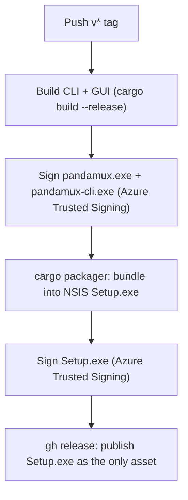

<!-- PAGE_ID: pandamux_14_release -->

Relevant source files

The following files were used as evidence for this page:

- [CLAUDE.md:75-92](../../CLAUDE.md#L75-L92)
- [.github/workflows/release.yml:1-172](../../.github/workflows/release.yml#L1-L172)
- [.github/workflows/winget.yml:1-40](../../.github/workflows/winget.yml#L1-L40)
- [crates/pandamux-app/Cargo.toml:1-73](../../crates/pandamux-app/Cargo.toml#L1-L73)
- [crates/pandamux-app/src/updater.rs:1-262](../../crates/pandamux-app/src/updater.rs#L1-L262)
- [crates/pandamux-app/build.rs:1-29](../../crates/pandamux-app/build.rs#L1-L29)
- [CLAUDE.md:9-9](../../CLAUDE.md#L9)
- [.claude/rules/commit-changelog.md:1-49](../../.claude/rules/commit-changelog.md#L1-L49)

# Release and Packaging

> **Related Pages**: [Getting Started](../GETTING_STARTED.md), [Application Runtime](../core/APP_RUNTIME.md)

---

<!-- BEGIN:AUTOGEN pandamux_14_release_overview -->
## Overview

The release pipeline is a tag-driven GitHub Actions workflow that runs entirely on `windows-latest`; a person never builds or signs a release locally (CLAUDE.md:75-76). Pushing a `v*` tag (or a manual `workflow_dispatch`) triggers `build-sign-release`, which builds both binaries, signs them with Azure Trusted Signing, bundles the signed `pandamux.exe` into a single NSIS `Setup.exe` via `cargo-packager`, signs that installer, and publishes a GitHub Release whose only asset is the installer (.github/workflows/release.yml#L1-L26). There is no Velopack feed or `latest.yml`; the in-app updater discovers new releases directly through the GitHub Releases API instead (.github/workflows/release.yml:1-7).

The workflow triggers on `push` to tags matching `v*` or manual dispatch, and resolves the release version either from the pushed tag, a dispatch input, or the workspace `Cargo.toml` version as a fallback (.github/workflows/release.yml:9-58).

Sources: [CLAUDE.md:75-92](../../CLAUDE.md#L75-L92), [release.yml:1-58](../../.github/workflows/release.yml#L1-L58)
<!-- END:AUTOGEN pandamux_14_release_overview -->

---

<!-- BEGIN:AUTOGEN pandamux_14_release_build -->
## Build and Metadata Embedding

Before signing, the workflow builds both release binaries directly with cargo: `cargo build --release -p pandamux-cli` and `cargo build --release -p pandamux-app --features iced-runtime` (the GUI binary requires the `iced-runtime` feature) (release.yml:61-65).

During the `pandamux-app` build, `build.rs` embeds the Windows icon and version metadata into `pandamux.exe` using `winresource`, setting `ProductName`, `FileDescription`, `CompanyName`, `InternalName`, `OriginalFilename`, and `LegalCopyright` (build.rs:14-27). `FileVersion`/`ProductVersion` are derived automatically from `CARGO_PKG_VERSION`, so the workspace `Cargo.toml` version is the single source driving both the running app's reported version and the embedded exe metadata (build.rs:1-8). A missing resource compiler is non-fatal locally: `res.compile()` failure only emits a `cargo:warning`, since a dev box without the Windows SDK should still build; CI (`windows-latest`) has `rc.exe` and embeds for real (build.rs:10-12, build.rs:25-27).

| Metadata field | Value | Source |
|---|---|---|
| ProductName | `"PandaMUX"` | (build.rs:19) |
| FileDescription | `"PandaMUX"` | (build.rs:20) |
| CompanyName | `"BoardPandas"` | (build.rs:21) |
| InternalName | `"pandamux"` | (build.rs:22) |
| OriginalFilename | `"pandamux.exe"` | (build.rs:23) |
| LegalCopyright | `"Copyright (c) 2026 BoardPandas"` | (build.rs:24) |
| FileVersion / ProductVersion | `CARGO_PKG_VERSION` (implicit) | (build.rs:7-8) |

Sources: [build.rs:1-29](../../crates/pandamux-app/build.rs#L1-L29), [release.yml:60-65](../../.github/workflows/release.yml#L60-L65)
<!-- END:AUTOGEN pandamux_14_release_build -->

---

<!-- BEGIN:AUTOGEN pandamux_14_release_signing -->
## Signing and Packaging

Signing secrets are fetched from Doppler via `dopplerhq/secrets-fetch-action`, gated by the single `DOPPLER_TOKEN` repo secret, and injected as environment variables (release.yml:71-75). Both `pandamux.exe` and `pandamux-cli.exe` are then signed in one pass with `azure/trusted-signing-action`, pointed at every `.exe` in `target\release` (`files-folder-filter: exe`), using SHA256 file and timestamp digests against Microsoft's RFC3161 timestamp authority (release.yml:77-91). The signing account, tenant, client, and certificate profile name all come from the injected Doppler `AZURE_*` variables; the `pandamux-ci-signing` service principal holds the Artifact Signing Certificate Profile Signer role on the `SupportForge` profile (Wellforce `HDBtrustedsigning` account) per CLAUDE.md (CLAUDE.md:87).

Packaging happens only after signing. `cargo packager --release --formats nsis` reads `[package.metadata.packager]` in `crates/pandamux-app/Cargo.toml`, which lists the single `pandamux` binary plus the bundled resources (themes, sounds, icons, shell-integration, the orchestrator plugin, and `pandamux-cli.exe` copied in alongside) (Cargo.toml:50-68). Because there is no `before-packaging-command`, cargo-packager bundles the already-signed `pandamux.exe` unchanged rather than rebuilding it, so the Azure signature on the exe survives packaging intact (Cargo.toml:44-49, release.yml:93-99). The packaging step retries up to 4 times with backoff to absorb transient TLS resets when cargo-packager downloads NSIS and its plugin from GitHub (release.yml:100-121). NSIS is configured for a current-user install with app data under `$LOCALAPPDATA/pandamux` (Cargo.toml:70-72).

After the installer is located and renamed to `PandaMUX-Setup-<version>.exe` (release.yml:122-140), it is signed a second time with the same Azure Trusted Signing action, so signing is the last mutation of any shipped binary before it is uploaded (release.yml:143-155).

| Resource | Target inside install dir | Source |
|---|---|---|
| `resources/themes` | `resources/themes` | (Cargo.toml:62) |
| `resources/sounds` | `resources/sounds` | (Cargo.toml:63) |
| `resources/icons` | `resources/icons` | (Cargo.toml:64) |
| `resources/shell-integration` | `resources/shell-integration` | (Cargo.toml:65) |
| `resources/pandamux-orchestrator` | `resources/pandamux-orchestrator` | (Cargo.toml:66) |
| `target/release/pandamux-cli.exe` | `pandamux-cli.exe` | (Cargo.toml:67) |

Sources: [release.yml:67-155](../../.github/workflows/release.yml#L67-L155), [Cargo.toml:44-73](../../crates/pandamux-app/Cargo.toml#L44-L73)
<!-- END:AUTOGEN pandamux_14_release_signing -->

---

<!-- BEGIN:AUTOGEN pandamux_14_release_updater -->
## In-App Update Discovery

Because the GitHub Release carries only the signed `Setup.exe`, the running app discovers updates itself against the GitHub Releases API rather than a generated feed file (updater.rs:1-7). `RELEASES_LATEST_URL` points at `https://api.github.com/repos/BoardPandas/Pandamux/releases/latest` (updater.rs:18-19), and `parse_latest_release` distills the response into a `ReleaseInfo`, rejecting drafts and prereleases and picking the first asset whose name ends in `.exe` as the installer URL (updater.rs:65-82).

Version comparison ignores any leading `v` and any pre-release/build suffix, comparing only the numeric major/minor/patch triple (`is_newer`, `semver_key`) (updater.rs:88-104). The periodic check additionally enforces a quarantine window (`DEFAULT_QUARANTINE_SECS = 6 * 60 * 60`, i.e. 6 hours) so a just-published release is not offered to everyone immediately; `should_offer` requires both a newer version and that the release's `published_at` timestamp is at least `quarantine_secs` old (updater.rs:21-24, 109-125). The Settings "Check for updates" button instead calls `check_latest`, which ignores the quarantine and returns one of `UpToDate` / `Newer(ReleaseInfo)` / `Failed(String)` (updater.rs:177-207).

On Install, `download_and_launch_installer` downloads the installer URL to `PandaMUX-Setup.exe` in the OS temp directory and spawns it detached before the caller closes the running app so NSIS can replace the files (updater.rs:209-245).

| Function | Purpose |
|---|---|
| `parse_latest_release` | Parse the GitHub API JSON into `ReleaseInfo`, filtering drafts/prereleases ([updater.rs:65-82](../../crates/pandamux-app/src/updater.rs#L65-L82)) |
| `is_newer` | Strict semver compare ignoring pre-release/build suffixes ([updater.rs:91-93](../../crates/pandamux-app/src/updater.rs#L91-L93)) |
| `should_offer` | Newer AND past the quarantine window ([updater.rs:109-125](../../crates/pandamux-app/src/updater.rs#L109-L125)) |
| `check_for_update` | Periodic/background check, quarantine-gated ([updater.rs:166-175](../../crates/pandamux-app/src/updater.rs#L166-L175)) |
| `check_latest` | On-demand check, quarantine-ignored ([updater.rs:196-207](../../crates/pandamux-app/src/updater.rs#L196-L207)) |
| `download_and_launch_installer` | Fetch + spawn the installer ([updater.rs:213-245](../../crates/pandamux-app/src/updater.rs#L213-L245)) |

Sources: [updater.rs:1-262](../../crates/pandamux-app/src/updater.rs#L1-L262)
<!-- END:AUTOGEN pandamux_14_release_updater -->

---

<!-- BEGIN:AUTOGEN pandamux_14_release_distribution -->
## Distribution and winget

A second workflow, `winget`, runs on `release: types: [released]` (or manual dispatch) and publishes each release to the Windows Package Manager for Issue #32's low-friction distribution channel (winget.yml:1-3, 18-24). It is scoped to `BoardPandas/Pandamux` and skips silently (no noisy failure) if `WINGET_TOKEN` has not been configured (winget.yml:26-32). `vedantmgoyal9/winget-releaser` is invoked with `identifier: BoardPandas.PandaMUX` and `installers-regex: 'PandaMUX-Setup-.*\.exe$'`, matching the renamed installer asset produced by the release workflow (winget.yml:33-39).

Because the native app ships a signed NSIS installer rather than the old portable zip, the winget-pkgs package (originally bootstrapped as `InstallerType: zip`) needs a one-time manual re-bootstrap PR with `InstallerType: nsis` before `winget-releaser` can auto-update it going forward; after that one-time PR, every published GitHub Release auto-opens a winget-pkgs update PR (winget.yml:4-17).

Sources: [winget.yml:1-40](../../.github/workflows/winget.yml#L1-L40)
<!-- END:AUTOGEN pandamux_14_release_distribution -->

---

<!-- BEGIN:AUTOGEN pandamux_14_release_checklist -->
## Release Checklist

To cut a release, follow the numbered steps documented in CLAUDE.md's Release Process section (CLAUDE.md:79-83):

1. Update `CHANGELOG.md` and bump `[workspace.package] version` in the root `Cargo.toml` (see `.claude/rules/commit-changelog.md` for the SemVer bump rules) (CLAUDE.md:80).
2. Commit the changes, then tag: `git tag -a v<VERSION> -m "PandaMUX v<VERSION>"` and `git push origin v<VERSION>` (CLAUDE.md:81).
3. The workflow builds, signs, packages, signs the installer, and publishes the Release (CLAUDE.md:82).

The version is a single source of truth: `[workspace.package] version` in the root `Cargo.toml`; every crate inherits it via `version.workspace = true`, and it drives `CARGO_PKG_VERSION` which both the embedded exe metadata (see [Build and Metadata Embedding](#build-and-metadata-embedding)) and the in-app updater's version comparison rely on (CLAUDE.md:9). Every commit bumps at least the Patch segment; Major bumps are never made autonomously and require explicit user sign-off (.claude/rules/commit-changelog.md:24-31).

For local packaging validation without signing (optional, no `gh release`), CLAUDE.md documents building both binaries and running `cargo packager --release --formats nsis --out-dir dist` directly (CLAUDE.md:85-92).

Sources: [CLAUDE.md:75-92](../../CLAUDE.md#L75-L92), [.claude/rules/commit-changelog.md:1-49](../../.claude/rules/commit-changelog.md#L1-L49)
<!-- END:AUTOGEN pandamux_14_release_checklist -->

---
