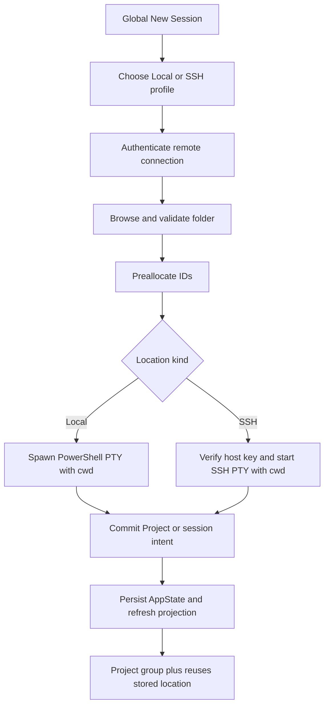

# SSH Project Session Launcher

Date: 2026-07-15
Status: Approved specification
Size: Medium
Phase: Core, followed by Polish

## 1. Overview

Add a project-oriented launcher that saves multiple SSH connections, lets the user choose Local or SSH and then a folder, opens the selected shell in that folder, groups sessions by Project, and provides a Project-level plus button that opens another session in the same location.

### Approved behavior

- One workspace is one Project. One terminal surface is one session in that Project.
- A Project has exactly one location: a local folder, or an SSH profile plus remote folder.
- Selecting a location that already has a Project adds a session to it instead of duplicating it.
- Project names default to the final folder name and remain editable.
- Global New Session and Ctrl+T run the connection, folder, launch flow.
- The Project plus reuses the stored location without reopening the chooser.
- Local Projects use PowerShell 7, falling back to Windows PowerShell.
- SSH Projects use the remote login shell inside tmux, with the existing plain-shell fallback.
- Windows OpenSSH agent is the default SSH authentication provider.
- Key-file and password-prompt authentication remain explicit alternatives.
- There is no 1Password-specific provider, configuration, detection, or UI.
- Passwords and passphrases are never persisted.
- Unknown host keys require confirmation. Changed host keys are blocked.
- ProxyJump remains visibly unsupported.
- Projects restore after restart. Password Projects request credentials again.

### Existing foundations

- `pandamux-core` owns canonical workspace, pane, and surface state.
- `pandamux-term` already provides local PTY, russh remote PTY, tmux reconnect, and SFTP upload.
- `PtyCommand::with_cwd` already supports a local initial directory.
- `SshHostProfile` and SSH profile RPC operations exist, but profiles are memory-only.
- `pandamux-ui` already projects terminal surfaces as sessions and groups them by Project, Type, or Host.
- Current Project grouping is inferred from workspace title, and real native SSH surfaces are inferred incorrectly from the workspace shell string.
- Persistence currently saves only `AppState`. Runtime-only remote configuration is lost on restart.

No new crate is required. Use Iced, Tokio, portable-pty, russh, russh-sftp, serde, serde_json, and UUID from the pinned workspace. If implementation needs another dependency, stop and ask first.

## 2. Architecture

### Canonical Project ownership

Keep `pandamux-app` as the single writer. Extend `WorkspaceState`, which is already canonical and persisted, rather than creating a second mutable Project store.

Add `crates/pandamux-core/src/project.rs` with:

```rust
pub enum ProjectLocation {
    Legacy,
    Local { cwd: String, shell: String },
    Ssh { profile_id: SshProfileId, remote_cwd: String },
}

pub struct ProjectSpec {
    pub location: ProjectLocation,
}

pub struct ProjectKey(String);
```

`WorkspaceState` gains `project: ProjectSpec` with a serde default of `Legacy`. `WorkspaceId` remains the stable Project ID. `ProjectKey` is a derived identity for detecting an existing Project:

- Local key: location kind plus normalized absolute Windows path.
- SSH key: location kind plus stable profile ID plus normalized POSIX path.

Never use editable Project titles or SSH connection names as identity.

### SSH profile ownership

Give every `SshHostProfile` a stable UUID-based `SshProfileId`. Names stay editable presentation values. Projects reference the ID.

Persist secretless profiles separately at:

```text
%APPDATA%/pandamux/config/ssh-profiles.json
```

Use a versioned wrapper and the existing atomic-write pattern. Before migrating an older schema, write a version-stamped backup and immediately save the migrated file. Never persist passwords, passphrases, agent contents, or live handles.

Use the standard `%USERPROFILE%/.ssh/known_hosts` file through russh's `check_known_hosts` and `learn_known_hosts` functions.

### Launch transaction

Failed validation or startup must not create a ghost Project or session:

1. Validate the selected folder and collect any ephemeral credential.
2. Preallocate the required workspace, pane, and surface IDs.
3. Start the local PTY or wait for the SSH PTY to reach ready using the preallocated surface ID.
4. Apply the canonical core mutation only after startup succeeds.
5. If the core mutation fails, terminate the prestarted terminal.
6. Publish the projection and autosave only after commit.

Project plus preallocates a surface ID, starts it with the Project location, and adds it as a tab in the focused pane. It does not change the split layout.

### Folder browser

The runtime owns browser state and asynchronous work. The UI receives a read projection and emits messages only.

- Local listing uses `tokio::fs`.
- Remote listing uses a temporary authenticated SFTP browser session in `pandamux-term`.
- Only directories are returned.
- Typed paths, Go, breadcrumbs, parent navigation, Cancel, and Select Folder work for both location types.
- Successful selection stores a canonical path.
- The last selected local folder and last folder per SSH profile are remembered.

### Data flow



### Primary files

- New `crates/pandamux-core/src/project.rs`: Project types and normalization.
- `crates/pandamux-core/src/state.rs`: Project-aware workspace and session intents.
- `crates/pandamux-core/src/ssh.rs`: stable profile IDs and secretless profile behavior.
- `crates/pandamux-term/src/ssh.rs`: host verification, SFTP browsing, remote cwd, ready handshake.
- `crates/pandamux-app/src/persistence.rs`: versioned profile store and legacy load behavior.
- `crates/pandamux-app/src/backend.rs`: shared launch operations and pipe parity.
- `crates/pandamux-app/src/iced_runtime.rs`: launcher state machine, tasks, transactions, credentials, restore.
- New `crates/pandamux-ui/src/session_launcher.rs`: staged connection and folder UI.
- `crates/pandamux-ui/src/session_panel.rs`: canonical grouping and Project plus.
- `crates/pandamux-ui/src/iced_shell.rs`: messages and overlay composition.
- `crates/pandamux-ui/src/settings.rs`: SSH profile management entry point.
- `crates/pandamux-cli/src/main.rs`: parity for any new public pipe methods.
- Crate `lib.rs` files and Cargo feature declarations as needed.

## 3. Implementation Steps

### Checkpoint 1: Project model and durable profiles

1. Add `ProjectLocation`, `ProjectSpec`, and `ProjectKey` in core.
   - Normalize local Windows paths case-insensitively without damaging drive or UNC roots.
   - Normalize remote paths as POSIX paths.
   - Derive a default title from the final non-empty component.
   - Keep root folders displayable.

2. Extend `WorkspaceState` with a serde-defaulted Project specification.
   - Missing metadata becomes `Legacy` and retains prior startup behavior.
   - Preserve `shell` for wire compatibility and legacy workspaces.
   - Add Project-aware creation and add-session intents without changing old variants.
   - Permit caller-provided IDs for transactional launch.

3. Add stable IDs to SSH profiles.
   - Upsert by ID, not name.
   - Reject duplicate friendly names in the UI.
   - Imported config entries receive IDs on first import.
   - Keep `jump` deserializable and visibly unsupported.

4. Add `SshProfileStore` beside `SessionStore`.
   - Persist schema version, profiles, last local folder, and last folder per profile.
   - Write atomically and back up before migration.
   - Preserve a corrupt file for diagnosis rather than silently replacing it.
   - Keep profile data across app-version session clearing.

5. Test legacy load, Project key normalization, profile rename, profile persistence, migration backup, and absence of secrets.

Potential gotchas:

- `[check-sibling-services-before-parallel-store]`: `WorkspaceState` owns the Project. Do not add a parallel Project database.
- `[transient-cache-without-drift]`: credential and listing caches are temporary and cannot replace canonical metadata.
- `[versioned-config-migration-backup]`: back up old profile schemas and save the migrated form immediately.

### Checkpoint 2: Folder services and terminal startup

6. Add pure folder helpers for breadcrumbs, parent resolution, canonical values, display labels, and sorting.
   - Cover Windows drives, UNC shares, POSIX root, spaces, and non-ASCII names.
   - Never pass a remote path through local path APIs.

7. Add asynchronous local listing in `pandamux-app`.
   - Use `tokio::fs::canonicalize`, `metadata`, and `read_dir`.
   - Return directories only.
   - Reject missing folders, files, access denial, and unusable PTY working directories.
   - Preserve the last valid listing while a request loads.

8. Add a temporary SFTP browser session in `pandamux-term`.
   - Reuse existing SSH authentication conversion.
   - Support canonicalize, directory listing, typed error categories, and clean shutdown.
   - Resolve symlinked directories through server canonicalization.
   - Keep the browser channel separate from the durable terminal channel.

9. Replace accept-all host verification.
   - A missing known-host entry returns the SHA256 fingerprint for explicit confirmation.
   - Confirming calls `learn_known_hosts` before retrying.
   - A changed key blocks SFTP and PTY startup and identifies the known-hosts line.
   - Do not add an in-app changed-key bypass.

10. Add remote cwd to `SshConfig` and remote startup.
    - Use tmux's working-directory option with safely quoted POSIX paths.
    - Give each surface a fresh tmux session name.
    - Reconnect to that surface's tmux session.
    - Start the plain-shell fallback in the selected cwd.
    - Treat a missing selected cwd as failure, not remote-home fallback.

11. Add a remote ready handshake.
    - Track connecting, ready, disconnected, retrying, failed, and closed.
    - Initial launch succeeds only after authentication, PTY request, and remote command acceptance.
    - Apply reconnect behavior only after the first ready state.

12. Wire explicit local Projects through `PtyCommand::with_cwd`.
    - Resolve PowerShell 7 first, Windows PowerShell second.
    - Keep Legacy workspaces on the old no-explicit-cwd path.

Potential gotchas:

- `[blocking-io-on-tokio]`: never enumerate folders with blocking filesystem calls on Tokio or the Iced update path.
- `[gui-subsystem-console-child-window]`: shell discovery must use the repo's no-window spawn pattern.
- Windows escaping is not remote-shell quoting.
- Tmux reattach must not silently change an existing session's cwd.

### Checkpoint 3: Launch coordinator, restore, and pipe parity

13. Add one app-level launch coordinator for GUI and pipe requests.
    - Accept New Project and Add Project Session operations.
    - Detect an existing matching `ProjectKey`.
    - Prestart the terminal, then commit core state.
    - Add Project-plus sessions as tabs in the focused pane, or first leaf when focus is absent.
    - Terminate the terminal if core commit fails.
    - Autosave immediately on success.

14. Add ephemeral credential handling.
    - Agent mode uses Windows OpenSSH and stores no credential.
    - Key mode prompts only when a passphrase is needed.
    - Password mode prompts on first use after app start.
    - Cache credentials in process memory by profile ID until exit or explicit forget.
    - Project plus is immediate when credentials exist; otherwise show only the credential prompt and continue.

15. Reconcile and restore by explicit Project location.
    - Local Projects spawn only local PTYs.
    - SSH Projects spawn only remote sessions.
    - Missing profiles show a disconnected Project with Repair and Remove actions.
    - Never reinterpret an SSH Project as local.
    - Agent and key Projects reconnect automatically.
    - Password Projects restore as waiting for credentials.
    - One failed restore does not block other Projects.

16. Preserve old pipe methods and add explicit project-aware methods rather than changing old meanings.
    - Suggested methods: `project.create`, `project.add_session`, `project.list`, `ssh.profile.list`, `ssh.profile.save`, `ssh.profile.remove`, `ssh.profile.import_config`, and `ssh.folder.list`.
    - GUI and CLI requests use the same coordinator.
    - Errors return stable code, category, message, and retryable fields.

17. Test transaction rollback, existing-Project reuse, plus cloning, restore behavior, missing profiles, and local-versus-remote reconciliation.

Potential gotchas:

- Current `ssh.connect` mutates the tree before asynchronous failure is known. Do not repeat that ordering.
- Current `remote_configs` is runtime-only. Project metadata must be enough to reconstruct it.
- Preserve intent-in, delta-out. UI code cannot mutate canonical state.

### Checkpoint 4: Staged launcher UI

18. Add `session_launcher.rs` with runtime-owned steps:
    - Connection selection.
    - Add or edit SSH connection.
    - Credential prompt when required.
    - Host fingerprint confirmation.
    - Folder selection.
    - Launching.

19. Build connection selection and management.
    - Show Local first, then saved SSH profiles with friendly name and `user@host:port`.
    - Provide Add, Edit, Delete, and Import from SSH config.
    - Disable ProxyJump profiles with an explanation.
    - Preserve keyboard order and visible focus.

20. Build the SSH profile form matching the supplied reference.
    - Fields: Name, SSH Host, SSH Port, Authentication, and Identity File when applicable.
    - Accept `user@hostname` and imported host aliases.
    - Port defaults to 22.
    - Authentication defaults to Windows OpenSSH agent.
    - Explicit alternatives are Identity File and Password Prompt.
    - Do not mention 1Password.
    - Save does not require a connection test.

21. Build the common folder browser matching the supplied reference.
    - Titles: `Select Local Folder` and `Select Remote Folder`.
    - Include path field, Go, breadcrumbs, parent, scrollable directory list, Cancel, and Select Folder.
    - Keep the current list visible during loading.
    - Show empty, access-denied, missing, authentication, connection, and retry states inline.
    - Disable Select Folder until the displayed path is validated.

22. Route `NewSessionRequested` and Ctrl+T into this launcher.
    - Quick launch must not bypass folder selection.
    - Close and focus the terminal only after successful launch.
    - Keep user choices intact after failure.
    - Block duplicate submit while launching.

23. Add message-driven view tests for every step, form validation, folder navigation, trust confirmation, cancel/back behavior, and duplicate-submit prevention.

Potential gotchas:

- Keep choices staged. Do not show the SSH form and folder browser simultaneously.
- Do not clear valid listings during loading.
- All controls need keyboard activation, visible focus, and accessible labels.

### Checkpoint 5: Project grouping and final validation

24. Project sessions from canonical metadata.
    - Stop inferring explicit Project, Host, and Type from title or shell strings.
    - Keep inference only for `Legacy`.
    - Local metadata: `PowerShell · <path>`.
    - Remote metadata: `SSH · <connection name> · <remote path>`.

25. Add the compact Project plus button beside each group heading.
    - Emit `workspace_id`, never the display title.
    - Add a tab to the focused pane with the exact saved location.
    - Focus it after ready.
    - Disable repeated clicks while pending.
    - For Legacy, open folder selection once and upgrade the workspace after success.

26. Run formatting, boundary, workspace, UI, app, and smoke checks. Extend the ignored local PTY and SSH smokes to prove the initial directory. Perform real interactive local, SSH, plus-button, and restart validation.

Potential gotchas:

- The Iced smoke does not prove focus, scrolling, keyboard behavior, or live SSH.
- Project plus keys by workspace ID.
- Same leaf names on different machines remain different Projects.

## 4. Data Model

```text
AppState
  workspaces[]
    id, title, shell
    project.location
      legacy
      local: cwd, shell
      ssh: profileId, remoteCwd
    splitTree, focusedPaneId, zoomedPaneId
```

Profile file shape:

```json
{
  "version": 1,
  "profiles": [
    {
      "id": "uuid",
      "name": "My Server",
      "host": "server.example.com",
      "port": 22,
      "user": "chaz",
      "auth": { "type": "agent" },
      "jump": null
    }
  ],
  "lastSelectedFolderByProfile": { "uuid": "/home/chaz" },
  "lastSelectedLocalFolder": "D:\\Dev\\Repos"
}
```

Migration rules:

- Missing Project metadata becomes `Legacy`.
- Legacy session JSON is rewritten only on the next successful autosave.
- Current native SSH profiles have no durable source to migrate.
- Imported profiles receive stable IDs.
- Future profile migrations require versioned backups.

## 5. API Contract

Internal launch operations:

```text
NewProject { title, location }
AddProjectSession { workspaceId }
```

Success returns workspace, pane, and surface IDs. Failure returns no canonical mutation.

Folder listing result:

```text
FolderListing
  canonicalPath
  parentPath
  breadcrumbs[]
  directories[]: name, canonicalPath
```

Error example:

```json
{
  "code": "ssh_auth_failed",
  "category": "authentication",
  "message": "Windows OpenSSH authentication failed for My Server",
  "retryable": true
}
```

Stable categories: validation, filesystem, connection, host-key-unknown, host-key-changed, authentication, remote-path, pty-start, profile-missing, and unsupported.

Security contract:

- Windows OpenSSH agent is the default.
- Key paths may persist; key contents and passphrases may not.
- Passwords and passphrases stay inside the GUI process and do not use the named-pipe API.
- Host trust writes only after confirmation.

## 6. Acceptance Criteria

- AC-01: At least two SSH profiles persist across restart. Tests T-05 and T-18.
- AC-02: Windows OpenSSH is the default, with no 1Password-specific UI. Tests T-06 and T-20.
- AC-03: A local Project opens PowerShell in the selected folder. Tests T-09 and T-23.
- AC-04: An SSH Project opens the remote shell in the selected folder. Tests T-13 and T-24.
- AC-05: Selecting the same location adds a session to the existing Project. Tests T-03 and T-15.
- AC-06: Project plus reuses and focuses the exact location. Tests T-16 and T-25.
- AC-07: Same-named folders on different machines remain separate. Test T-02.
- AC-08: Passwords and passphrases never persist or appear in logs. Tests T-07 and T-19.
- AC-09: Unknown keys require confirmation; changed keys block. Tests T-11 and T-12.
- AC-10: Invalid folders and failed startup create no ghost state. Tests T-10, T-14, and T-17.
- AC-11: Restart restores local and agent/key SSH Projects. Tests T-18 and T-26.
- AC-12: Password Projects wait for credentials and never become local. Test T-18.
- AC-13: Legacy sessions retain prior behavior. Test T-01.
- AC-14: The complete launcher is keyboard operable with visible focus. Tests T-20 and T-23.
- AC-15: ProxyJump profiles are visibly unsupported. Test T-08.

## 7. Out of Scope

- 1Password-specific SSH support or branding.
- Pageant and ProxyJump dialing.
- Port-forward management or editing OpenSSH config.
- Persisting passwords or passphrases.
- Remote file operations beyond folder listing and existing image upload.
- Creating, renaming, moving, or deleting folders.
- Changing an existing Project's location type.
- Mixed local and SSH sessions in one Project.
- Automatically launching Claude Code.
- Replacing the split-tree model.

Follow-ups may include ProxyJump, Pageant, project templates, relocation, recent Projects, and favorites.

## 8. Assumptions and Open Questions

Confirmed:

- The user accepted all proposed defaults except provider wording.
- Windows OpenSSH is the only named agent provider.
- Key-file and password modes remain alternatives.
- One workspace is one Project; one terminal surface is one session.
- Project plus creates a tab without changing layout.
- Grouping uses the saved Project root, not the shell's later live cwd.
- Titles are presentation, not identity.
- Local and remote use the custom Iced browser.

Verify during implementation:

- Exact Iced focus API for the path field.
- russh SHA256 fingerprint formatting consistent with OpenSSH.
- Reusable SSH connection helpers for SFTP browse and PTY launch.
- Existing no-window shell resolution helper.

These do not need another product decision unless they introduce a dependency or material UX change.

## 9. Test Plan

### Core and persistence

- T-01: Legacy AppState loads and preserves old startup behavior.
- T-02: Project keys distinguish location types, profile IDs, and canonical paths.
- T-03: Existing matching Project is found after title rename.
- T-04: Local and SSH Project metadata round-trip.
- T-05: Multiple profiles save, reload, rename, upsert, and delete by ID.
- T-06: New and imported profiles default to Windows OpenSSH agent without IdentityFile.
- T-07: Serialized fixtures and logs contain no password or passphrase value.
- T-08: ProxyJump profiles retain data but cannot connect.

### Local, SSH, and remote browsing

- T-09: Explicit local Project builds `PtyCommand` with selected cwd.
- T-10: Missing, file, invalid, and denied local paths produce no mutation.
- T-11: Unknown host confirmation learns a key only after approval.
- T-12: Changed host key blocks SFTP and PTY.
- T-13: Remote startup safely handles spaces and shell metacharacters in cwd.
- T-14: SSH auth, connection, permission, and missing-path failures create no state.
- T-21: Folder helpers cover drives, UNC, POSIX root, breadcrumbs, parents, and sorting.

### Runtime and UI

- T-15: Matching location adds a surface to the existing workspace.
- T-16: Project plus clones location and creates fresh surface and tmux IDs.
- T-17: Duplicate launch submit creates at most one session.
- T-18: Restore covers local, agent, key, password-waiting, and missing-profile states.
- T-19: Credential cache clears on runtime drop and never reaches persistence.
- T-20: Message tests cover all launcher steps, validation, navigation, trust, cancel, retry, and loading.
- T-22: Session projection uses canonical metadata and plus emits workspace ID.

### Live validation

- T-23: Ignored ConPTY test verifies `Get-Location` in the selected folder.
- T-24: Opt-in SSH test lists a remote folder and verifies initial `pwd`.
- T-25: Interactive GUI test verifies Project plus creates and focuses a second session.
- T-26: Interactive restart verifies local and SSH Project restoration.

Required standard checks:

```powershell
cargo fmt --all --check
.\scripts\check-rust-boundaries.ps1
cargo test --workspace
cargo test -p pandamux-ui --features iced-runtime --lib
cargo test -p pandamux-app --features iced-runtime --bin pandamux
cargo run -p pandamux-app --features iced-runtime -- --iced-shell-smoke
```

Record the final names and results of the targeted ignored tests in the completion report.

## 10. Error Handling

| Failure | Recovery and user-facing behavior |
|---|---|
| Invalid or duplicate profile fields | Keep values, show inline error, disable Save |
| Unsupported ProxyJump | Disable connection and explain direct-host requirement |
| Windows OpenSSH agent unavailable | Offer Retry and Edit Connection |
| No usable agent identity | Explain how to add an identity or choose key/password |
| Key missing or passphrase required | Show path error or credential prompt |
| Password needed after restart | Show Project as Waiting for credentials |
| Unknown host key | Show fingerprint, Trust and Continue, or Cancel |
| Changed host key | Block with verified remediation instructions, no bypass |
| Local folder missing, denied, or a file | Keep chooser open with typed error |
| Remote folder missing or denied | Keep chooser open with Retry or another path |
| SFTP disconnect | Retry while preserving current path |
| Both PowerShell variants unavailable | No Project, explain shell failure |
| Local or SSH terminal startup fails | No Project, preserve chooser and offer Retry |
| Tmux absent | Use plain shell and show degraded durability |
| Profile removed while referenced | Show disconnected Project with Repair and Remove |
| Profile file corrupt | Preserve it and report repair requirement |
| Legacy snapshot | Load in Legacy mode |
| Autosave fails after successful launch | Keep live session and show persistence warning |
| Project plus clicked repeatedly | Allow one pending launch only |

Errors include operation and connection name, never credential material. Expected failures must not panic or terminate the GUI.

## 11. Rollback Plan

1. Revert the UI entry points to the existing quick-launch overlay.
2. Keep serde-defaulted Project fields so newer session files remain readable.
3. Leave the additive secretless profile file untouched.
4. Restore old local reconciliation only for Legacy workspaces. Never reinterpret explicit SSH Projects as local.
5. Disable new project-aware RPC methods while retaining old workspace and SSH methods.
6. Restore a version-stamped profile backup if migration is faulty.
7. Do not remove entries from the user's standard known-hosts file during rollback.

No database rollback is required.

## 12. Lessons Learned / Gotchas

After implementation:

- [ ] Route general gotchas to LL-G via `/add-lesson`.
- [ ] Route reusable patterns to BP via `/add-practice`.
- [ ] Keep genuinely repo-specific state notes in `.Codex/agent-memory/patterns.md`.
- [ ] Record russh, SFTP, tmux cwd, Iced focus, and Windows path surprises.
- [ ] Record failed approaches and why they failed.
- [ ] Update workflow guidance if the implementation exposes a repeatable improvement.

Review these risks specifically:

- Blocking folder enumeration on Tokio.
- Treating display names as identity.
- Persisting remote identity outside canonical Project state.
- Silently restoring SSH as local.
- Mutating the tree before terminal readiness.
- Unsafe remote-path quoting.
- Trusting a host key without an explicit decision.
- Treating the Iced smoke as interactive proof.
