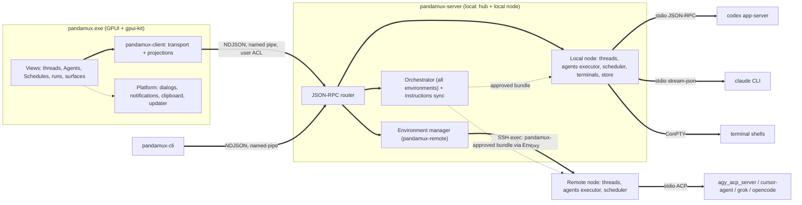
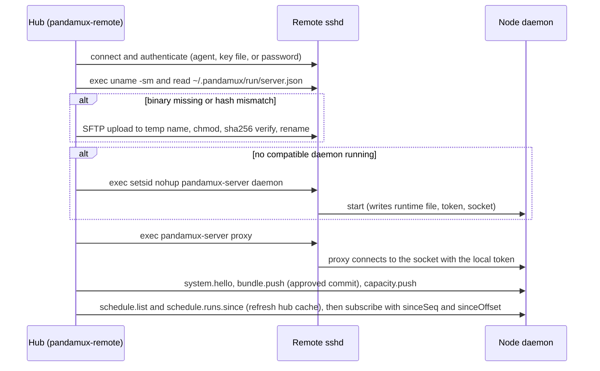
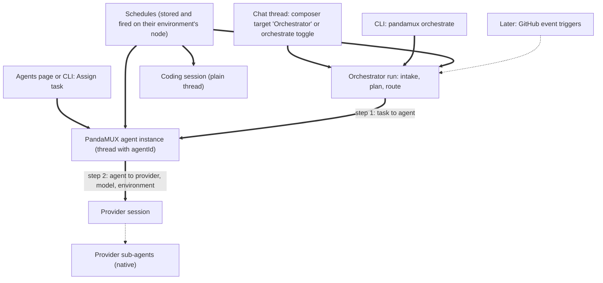

# PandaMUX Rewrite: Chat-First Agent Client with Remote Environments, Agents, Schedules, and an Orchestrator

Date: 2026-09-25
Status: **Proposed; all open questions resolved 2026-09-25** (not started; no code, version, or changelog changes have been made for it; the plan as a whole is not yet approved)
Baseline: PandaMUX v0.53.3 (native Rust + Iced terminal multiplexer)

Relationship to `tasks/plan-repo.md`: that file is the **historical** record of the Electron to native Rust rewrite (Phases 1 to 7, complete). This plan supersedes its product direction (terminal multiplexer) but keeps its engineering posture: backend-owned state, single writer, intent-in/delta-out, exact pins, crate isolation, tag-driven signed releases. Its Section 12 design tokens carry over where they still apply (Section 8). UI history: Iced is removed. An earlier draft of this plan chose Tauri 2 + React; the user replaced that with **GPUI + gpui-kit** (all Rust) on 2026-09-25, and Tauri 2 remains only as the documented fallback if the Phase 0 GPUI spike fails. `plan-repo.md` rejected GPUI for three reasons, each now handled explicitly: GPL contamination (zed#55470, still open; tracked as a license gate in S6 and Risks), "not built for external consumption" (gpui-kit publishes exact-pinned `gpui-pre` snapshots and ships in production in Longbridge Pro on Windows, macOS, and Linux), and weak accessibility (S1 assesses it; accepted risk).

Reference product: T3 Code (github.com/pingdotgg/t3code, MIT; Electron + React + Effect-TS). We study it and borrow ideas, contracts, and lessons. We do **not** fork it. Where driver logic is **ported** to Rust (Antigravity for certain, possibly other providers), the port keeps T3's MIT copyright and license notice in a root `THIRD_PARTY_NOTICES.md`, and each ported module's doc comment cites the T3 source files it came from. Paths cited from it were checked against its `main` branch on 2026-09-25. Zed's own agent and terminal UI crates are GPL-3.0-or-later: study them for patterns, never copy code (Section 13).

Style note: this repo forbids em dashes and double dashes in prose. CLI flags keep their real leading dashes inside code spans so commands stay copyable (the same convention `CLAUDE.md` uses for `cargo` commands). Markdown tables use single-dash separators, and mermaid edges use `==>` and `-.->`.

Terminology used throughout:
- **Provider**: an agent CLI PandaMUX drives (Codex, Claude, Cursor, Grok, OpenCode, Antigravity).
- **PandaMUX agent**: a provider-agnostic specialist role (reviewer, tester, ...) defined in the instructions repo. Its **definition** is a template; each assignment creates an **agent instance**, which is a normal thread tagged with the agent id.
- **Provider sub-agent**: a native sub-agent a provider spawns inside a turn (for example a Claude Task sub-agent).
- **Run**: one execution of the orchestrator or of a schedule. Hierarchy: run, then agent tasks (instances), then provider sub-agents.
- **Schedule**: a timed trigger, stored on and fired by one environment's server, that assigns work to the orchestrator, a PandaMUX agent, or a coding session.

## 1. Decision Summary

| Decision | Choice | Rationale |
|-|-|-|
| Product direction (fixed) | Chat-first client that drives coding-agent CLIs as structured **providers**, locally and over SSH, plus an **orchestrator**, a **specialized agent layer**, and **scheduled tasks** | User decisions. T3 Code proves the chat-first model; orchestrator, agents, schedules, and the instructions repo are PandaMUX's differentiators |
| Language (fixed) | Rust everywhere, including the view layer; no T3 fork | User decision. Keeps the russh/SFTP/persistence/updater/signing investment; one language and one toolchain |
| UI (fixed) | **GPUI** (Zed's framework, via the `gpui-pre` snapshot crates) + **gpui-kit** (github.com/longbridge/gpui-kit, formerly gpui-component). Iced removed; Tauri 2 is the fallback only | User decision. macOS is GPUI's home platform (Metal); Windows uses a DirectX 11 + DirectWrite renderer (Zed ships stable on Windows); Linux uses Vulkan. A future Mac port gets one renderer everywhere and no WebView engine divergence. Also: no Node/pnpm in the build, no WebView script-injection class, and the desktop uses the Rust protocol types directly |
| UI pins | `gpui-kit` / `gpui-component` `=0.6.6` and every `gpui-pre*` crate (`gpui-pre =0.3.6`, `gpui-pre-platform`, `gpui-pre-macros`, `gpui-pre-sum-tree`, and the rest) pinned exactly; bumped **together, deliberately** | gpui-kit's manifest warns that any snapshot may change GPUI's API. crates.io `gpui` 0.2.2 (2025-10-22) is stale. Matches the repo's exact-pin rule |
| Licenses | PandaMUX MIT; GPUI and gpui-kit Apache-2.0; logic ported from T3 Code (MIT) is credited in `THIRD_PARTY_NOTICES.md` and in module docs. **No code from GPL Zed crates** (`agent_ui`, `markdown`, `terminal`, `terminal_view`, and so on). `cargo deny` license allowlist denies GPL/AGPL/LGPL anywhere in the graph | zed#55470 (GPL via `sum_tree` to `ztracing`) is open upstream; the manifests on Zed main and in `gpui-pre-ztracing` 0.3.6 now declare Apache-2.0, and S6 confirms the shipped license files |
| Terminal multiplexer (fixed, refined) | **Multiplexer dropped**: no split tree, pane/tab layouts, saved layouts, `layout.grid`, workspace/pane V2 methods, tmux-wrapped sessions, or `session.json` layout restore. **Kept**: an optional, on-demand **Terminal surface** (shortcut T) opened in the thread's working directory on the thread's environment | User decision. Providers are driven over stdio or local HTTP, so agents never need a PTY; the terminal is a user tool reusing the tested `pandamux-term` engine |
| Terminal placement | PTY on the thread's **node** (portable-pty; ConPTY on Windows); raw bytes over the hub/node protocol; the **desktop parses** with `pandamux-term`'s alacritty grid and paints a custom GPUI element; node keeps a bounded ring buffer for replay | Remote terminals survive disconnects without tmux. Desktop-side parsing (the VS Code remote model) keeps alacritty out of the node binary and rendering local. Node-side grid snapshots are the fallback (Phase 3 exit) |
| Process topology (refined) | One headless binary, `pandamux-server`, in two roles. **Hub**: the local process the desktop, CLI, and full orchestrator talk to. **Node**: owns providers, terminals, threads, the store, git, attachments, **and the scheduler and a local agent executor** for its own environment. The local hub embeds the local node; remote hosts run a node only | The orchestrator needs one place that sees every environment; schedules stored on an always-on host must fire while the laptop is off, so a minimal agent-execution path (definitions + routing among that node's providers) runs on every node |
| Local server lifetime | `pandamux-server.exe` is a **separate process** that the desktop spawns or discovers | Agents, schedules, and terminals keep running when the window closes; same binary as remote nodes; the CLI works without the GUI. Cost: the updater must drain it (Phase 7) |
| Wire protocol | **JSON-RPC 2.0** messages, NDJSON framing on two transports in v1: the local **named pipe / Unix socket** (desktop and CLI) and an **SSH exec channel** (hub to node). WebSocket deferred until a browser/phone client exists | One schema everywhere; local IPC with an OS ACL means no token handling in the desktop and no network listener on the laptop (4.5) |
| Shared types | The desktop and CLI use `pandamux-protocol` Rust types through a shared **`pandamux-client`** crate. No TS generation. `schemars` generates the instructions-repo JSON Schema | No second language, no drift check; `pandamux-client` has zero GPUI deps and is unit-testable |
| Persistence | **SQLite via rusqlite** (bundled, WAL) on each node, event-sourced: append-only `events` plus projections written in **one transaction** by a single writer thread | Matches T3's events-plus-projections model and our single-writer rule. sqlx rejected (no gain with one writer; friction for musl) |
| Git | git CLI for per-thread worktrees, hidden-ref checkpoints (`refs/pandamux/checkpoints/...`), diffs, commit, push; `gh` for PRs | Honors user git config, credential helpers, and hooks; T3 uses the same hidden-ref idea |
| Provider layer | `ProviderDriver` trait in `pandamux-providers`. Drivers: Codex (app-server JSON-RPC), Claude (stream-json control protocol in Rust), one shared **ACP** driver (Cursor, Grok, Antigravity, optionally OpenCode), OpenCode HTTP as a fallback | One normalized event model; T3 drives Cursor, Grok, and Antigravity over ACP |
| First-release providers (decided 2026-09-25) | **Must-have: Codex, Claude, and Antigravity.** Best effort: Cursor, Grok, OpenCode. Antigravity lands in Phase 1 right after Codex and Claude, together with the shared ACP driver | The first release is gated on all three; pulling Antigravity (the least familiar must-have) forward surfaces integration problems before the UI is built on top |
| Antigravity integration (decided 2026-09-25: replicate T3) | Port T3 Code's approach (fully supported in T3 nightlies): run Google's **ACP server bundle** (`agy_acp_server` + `localharness_external`), not the `agy` CLI, as a **managed install** (pinned zip from `dl.google.com`, size + SHA-256 verified, hardened extraction, `initialize` validation), spawned with a **replaced** environment and a private per-instance `GEMINI_HOME`, driven over standard **ACP v1** by the shared ACP driver plus an Antigravity profile layer; Google OAuth loopback sign-in with strict URL validation and callback forwarding (5.4). S5a becomes "confirm the ported approach on Windows and Linux" and stays gating | T3 has solved and shipped this; porting its proven logic (with its MIT notice) removes the protocol-discovery risk. The `agy` CLI's headless issues (LL-G `headless-hangs-no-output`) do not apply to the ACP server bundle |
| Provider-agnostic execution (new) | Drivers declare how they take **instructions** (native system/developer instructions, else a first-message preamble) and how they **restrict tools** (per-tool lists where supported, else coarse AccessMode). Agent instructions are never written into the user's repo or worktree | Lets any PandaMUX agent or schedule run on any provider, with documented, visible degradation per provider (5.3) |
| Claude integration | Implement the Claude CLI's stream-json + control-request protocol in Rust; no Node sidecar | Keeps nodes Node-free; the control protocol is SDK-internal, mitigated by a tested CLI range and transcript contract tests |
| Remote bootstrap | Linux musl `pandamux-server` **and `pandamux-cli`** (x64, arm64; the CLI is needed on nodes so agents can call `pandamux memory ...`) **bundled in the signed installer**, uploaded over SFTP, SHA-256 verified against a manifest compiled into the signed desktop exe, started as a detached daemon, reached via `pandamux-server proxy` on an SSH exec channel | Works on air-gapped hosts, needs no sshd forwarding config, integrity rooted in Authenticode, one Release asset. Zed and T3 use the same model |
| Usage and capacity | Node-side scanners produce `UsageBucket`s (T3's model); `CapacityEstimate`s carry a **confidence** (Reported, Estimated, Unknown); nodes keep a last-known copy for offline routing | Remaining quota is only reported by some providers; routing must know how far to trust each number |
| Orchestrator (fixed modes) | Entry points: (a) a **normal chat thread** (the composer's target picker offers "Orchestrator" next to single providers, or a per-message orchestrate toggle), (b) **schedules**, (c) the CLI (`pandamux orchestrate`), (d) later, GitHub event triggers. Modes **Auto** and **Approve first**; **two-step routing**: task to PandaMUX agent, then agent to provider/model/environment; deterministic rules from the instructions repo, fed by an LLM classifier that fails closed. Full cross-environment orchestration runs in the hub; the same pure crate runs node-scoped on nodes. The orchestrator is also a **built-in PandaMUX agent** (`orchestrator`) with its own editable instructions (intake and planning prompts) and memory (routing outcomes), while routing **rules** stay in `orchestrator.yaml` | Explainable ("why reviewer on Codex?"), testable without a model, safe on classification failure, and usable offline on a node. Treating the orchestrator as an agent reuses the editor, versioning, memory, and run log with no special case |
| Orchestrator model (decided 2026-09-25) | **Settings > Orchestrator**: provider + model + effort the orchestrator runs on (for example Codex GPT-6-Astra at extra-high effort, or Claude Opus 5.5), chosen only from configured, authenticated providers using each driver's live model list, plus an ordered **fallback list** for when the primary is unavailable or out of capacity. Advanced: a separate fast model for intake classification. Per-environment override for node-side runs, defaulting to the same provider/model if that environment has it, else the first available fallback there; Settings warns when an environment with schedules has no usable orchestrator model | The orchestrator's quality and cost depend on its model; users pick what they trust and have paid for |
| PandaMUX agents (new, user requirement) | Provider-agnostic roles defined as `agents/<id>.md` (YAML frontmatter + markdown, mirroring Claude Code agent files). Definition = template; each assignment = an **instance thread** tagged with the agent id; per-agent concurrency. Default repo seeded from this repo's `.claude/agents/` roster | Reuses thread infrastructure, so every agent's work is visible and steerable; one familiar file format; users see what each agent is doing on the Agents page |
| Agent authoring (decided 2026-09-25; replaces "repo only") | Agents are **created and edited in the app** by the user and by the orchestrator. Agent editor on the Agents page (create, edit, duplicate, delete, history with diffs, revert, per-provider compile preview). **Save scope** per agent: Personal (default; a **PandaMUX-managed local git repo**), Project (`.pandamux/agents/`), or Team repo (branch + PR via `gh`; direct push only in trust-branch mode on a repo the user owns); "Promote to team" opens a PR. The **orchestrator writes only to the Personal layer** (it may propose PRs elsewhere); every orchestrator change is a commit tagged with its run, labeled, revertable, rate-capped. **Decided**: in Auto mode the orchestrator may freely edit only agents it created; editing human-authored agents needs user approval; access widening always needs approval in every mode | Users and the orchestrator can grow specialists as work demands, while git gives history, diff, and revert, and the shared layers keep their review gates |
| Agent memory (decided 2026-09-25: in v1; replaces "later or never") | Persistent memory per agent **per project** plus an agent-wide section; markdown entries (one fact each, with id, timestamps, source run, scope) plus an index; editable in the app. Canonical on the hub, versioned in the personal git repo, distributed to nodes with the instructions snapshot; node-side writes journal locally and merge back by entry id. Agents write via the **`pandamux memory` CLI** (no MCP), plus an end-of-run reflection step; memory is injected at run start within a token budget and labeled as untrusted notes. **Decided**: "review new memories before they apply" is optional, default off (every write is in the run log with a diff and revertable) | Agents improve across runs; the CLI path honors the repo's no-MCP rule; memory is data, never permission |
| Backups (decided 2026-09-25) | One private backup repo holds **schedules, personal agents, and agent memory**: one-way export pushed by the hub (after changes, debounced, and daily), private repos only (visibility checked before every push), secrets excluded, explicit restore that never auto-applies FullAccess | One place to recover or move a developer's automation, with no path for the backup to fire schedules or overwrite agents on its own |
| Scheduled tasks (decided 2026-09-25; formerly open questions 8 and 9) | Schedules are **machine-specific server state**, not configuration in any repo. Each schedule is stored in the SQLite store of the **environment that runs it** (under that host's OS user) and fired by that node's scheduler whether or not the hub or desktop is connected. The developer creates, edits, enables, disables, deletes, and runs them from **Settings > Schedules**, where **Environment** (local or any SSH environment) is a required field. Cron + IANA timezone; targets: orchestrator, a PandaMUX agent, or a coding session. Schedules are one of several orchestrator entry points, not the only one | User decision: an SSH Linux coding machine that stays online fires its schedules while the developer's own computer is off. Machine-local storage also means a schedule can only fire where it is stored, so shared config can never double-fire across teammates |
| Configuration layers (new; project layer in v1 decided 2026-09-25) | Three layers, all in v1, broadest to most specific: (i) the **instructions repo** (org or default: agents, routing, prompts, knowledge); (ii) an optional **project layer** `.pandamux/` inside each code repo (project agents, knowledge, routing overrides that travel with the code); (iii) the **personal layer**: a PandaMUX-managed local git repo (personal agents, agent memory, the built-in orchestrator agent's edits) plus personal settings (orchestrator model, tier-to-model mapping, plan budgets, disabled agents, FullAccess opt-ins); pushed nowhere except, optionally, to the user's private backup repo. Schedules are in none of these layers: they are server state on their environment. Specific overrides broad; the project layer is **untrusted until approved per repo** | Mirrors Claude Code's user/project/local settings, which our users already understand. A cloned third-party repo could ship hostile agent instructions, hence the per-repo, per-hash trust prompt (like Claude Code's). The user chose to ship the project layer in v1 |
| Instructions repo (fixed, extended) | Default BoardPandas repo, forkable (URL + branch or tag). **Git is the source of truth, but PandaMUX manages a mirror clone** under app data, never a user working copy. Checked every 5 minutes (configurable) with a cheap `git ls-remote` before fetching; private repos use the user's git credentials or `gh` auth. Tracking: follow a branch, or pin a tag/commit. Update policy: **approve each update** or **trust this branch** (team mode: PR review and branch protection are the gate; optional signed-commit requirement). **Defaults (decided 2026-09-25)**: repos the user or their team controls follow `main` with "trust this branch"; everyone else's repos, including the BoardPandas default, use "approve each update". The hub distributes the exact approved commit to nodes as a git bundle or tarball, so nodes never need GitHub credentials | Instructions drive agents with full access and run unattended, so they are trusted code with a single approval point. Git gives versioning, PR review, audit history, forking, and offline use at zero hosting cost |
| Team sync (new) | Teams share one instructions repo for agents, routing, prompts, and knowledge. Schedules are not shared: each developer's schedules live on the environments they chose. Team-relevant results land where everyone sees them (PRs, issue comments, reports). No central team view in v1; each hub shows its active commit | Git covers the shared parts; keeping schedules machine-local removes the need for schedule ownership rules |
| Hosted team hub (decided 2026-09-25: not in v1) | **Not in v1**; revisit later only if wanted. A hosted BoardPandas team service (real-time config sync, UI editing, RBAC, central schedule runner, shared dashboards) is a possible later "team hub", likely a `pandamux-server` in hub mode that teammates connect to | It is a product in itself (hosting, auth, availability, security review). Git plus machine-local schedules covers the v1 team need with zero hosting |
| Right-side surfaces panel | T3-style toggleable right panel: **Agents**, **Diff**, **Files**, **Pull request**, **Linked pull requests**, optional **Terminal**. **Browser and Device surfaces: not in v1 (decided 2026-09-25); revisit later** | Live visibility into provider sub-agents and PandaMUX agent instances |
| Version at cut-over (decided 2026-09-25) | The cut-over release is a **Major bump to 1.0.0**, an explicit user decision recorded per `.claude/rules/commit-changelog.md` (agents never bump Major on their own) | New product, breaking protocol, no 0.x users to preserve |
| Default instructions repo (decided 2026-09-25) | `BoardPandas/pandamux-instructions`, public, MIT | Forkable starting point; public so anyone can fork it |
| Browser/phone client (decided 2026-09-25) | **Not in v1**; revisit later. Approvals stay protocol calls so a future client can use them | Would be a separate web client plus a WebSocket transport with pairing and TLS; not needed for v1 |
| Schedule session target (decided 2026-09-25) | Both modes, chosen per schedule in the form: **new thread per run** (form default) or **continue an existing thread** (picked in the form) | Fresh threads suit independent jobs; continuing suits iterative work that benefits from the thread's context |
| Backup repo (decided 2026-09-25) | A **user-created private repo** (PandaMUX offers `gh repo create --private`). Backups are **disabled until the user configures them**; no backup activity happens before that | Explicit opt-in keeps prompts, paths, and host names from going anywhere by default |
| Memory scope (decided 2026-09-25) | Per agent **per project** plus an **agent-wide** section | Project facts stay with the project; general learnings travel |
| Agent visualization (new) | Global **Agents page** (roster board), **Settings > Schedules** (list across environments plus per-schedule history), a **run view** tree (run, agent tasks, provider sub-agents), and the per-thread Agents surface with "Provider sub-agents" and "PandaMUX agents" groups | The user must see which agents exist, what each is working on, and what ran overnight |
| Packaging | Existing **cargo-packager NSIS** pipeline: build, sign each exe, package, sign the installer. No WebView2 | Proven since v0.37; cargo-packager does not rebuild, so signatures survive |
| Release | Same tag-driven workflow, Azure Trusted Signing via Doppler, one signed `Setup.exe`, in-app updater via the GitHub Releases API. New: Linux musl job; fmt/clippy/tests **inside** the release workflow. **Guarded until Phase 7**: no `v*` tags are pushed before cut-over, and `release.yml` additionally requires a repository variable `RELEASES_ENABLED=true` (checked in the first job) so an accidental tag cannot publish a half-built app; `winget.yml` stays disabled until the new app ships | LL-G `release-workflow-not-gated-on-ci`; a tag convention alone is one mistake away from publishing, so the variable is the hard gate |
| Mac readiness (decided 2026-09-25: macOS ships later) | macOS CI job from Phase 1 (build + test server, CLI, client, desktop on `macos-latest`) stays, keeping the code Mac-clean; shipping on macOS comes after v1 | Keeps Windows-only code from creeping in so the later port stays cheap |
| CLI | `pandamux-cli` on `pandamux-client`, protocol **v3** over the local pipe/socket; new `agents`, `memory`, `schedule`, and `run` verbs. Also built for Linux musl and installed on every node next to `pandamux-server`, talking to the node's Unix socket, so agents on remote hosts can read and write memory | The OS ACL replaces today's unvalidated token; the CLI is the only agent integration path (no MCP) |
| Repo strategy (decided 2026-09-25; formerly open question 5) | **Rewrite in place on master.** The old app never entered production and has no users, so there is no parallel shipping, no feature freeze, no side-by-side binary or CI split, and **no migration of 0.x data**. At the start of Phase 1, the reusable parts are moved into the new crates and everything else is deleted; git history keeps the old code for reference. Existing 0.x GitHub releases are left as they are | Nothing to protect, so the simplest path wins. No Node/pnpm added (Node stays only for the `.claude` wiring guard) |
| Crate isolation (updated) | Only `pandamux-desktop` imports `gpui-pre*`, `gpui-kit`, `gpui-component`; nothing imports `iced` or `tauri`; `alacritty_terminal` and `portable-pty` only in `pandamux-term` (`grid` and `pty` features); `russh` only in `pandamux-remote`; ACP crates only in `pandamux-providers`; `rusqlite` only in `pandamux-server`; `pandamux-orchestrator` stays pure (no IO). Enforced from feature-resolved `cargo metadata` | Today's `scripts/check-rust-boundaries.ps1` only regex-checks `Cargo.toml`; a graph check catches transitive leaks, including GPUI reaching the musl server |

## 2. Current repo review (measured 2026-09-25)

- Workspace `0.53.3`, edition 2024, `rust-version = "1.88"`, five crates, exact pins.
- `pandamux-core` (~6.6k lines): `state.rs` 1,289 and `split_tree.rs` 825 (terminal layout), `keymap.rs` 838, `project.rs` 441 + `project_registry.rs` 459 (stable project identity across hosts including git-remote matchers, **reusable**), `ssh.rs` 346 (secretless host profiles + `~/.ssh/config` import, **reusable**), `settings.rs` 241, `agent.rs` 194 (Starting/Running/Exited only), `protocol.rs` 49 (V2 envelope; `token` unvalidated), `notification.rs` 238.
- `pandamux-term` (~4.1k lines): `grid.rs` 866, `pty.rs` 239, `shell.rs` 273 (shell resolution, chunked writes, DA1/CPR detection, tree-kill), `session.rs` 510, `search.rs`, `links.rs`, `cwd.rs`, `clipboard.rs` (OSC 52 policy): **kept** for the Terminal surface. `ssh.rs` 1,585: pool, auth (including the Windows OpenSSH agent pipe), known-hosts, SFTP (**moved** to `pandamux-remote`), plus the PTY+tmux `RemoteSessionManager` (deleted). No port forwarding and **no exec-without-PTY path** today. alacritty_terminal and portable-pty appear only in this crate.
- `pandamux-ui` (~8.3k lines, Iced 0.14): deleted; its canvas terminal viewport is the porting reference for the GPUI terminal element.
- `pandamux-app` (~11.5k lines): `iced_runtime.rs` **6,253**, `backend.rs` 3,106 (`handle_line` sync dispatcher), `persistence.rs` 805 (`%APPDATA%/pandamux`), `updater.rs` 344 (Releases API, semver, 6h quarantine), `pollers.rs` 79, `pipe_server.rs` 59.
- `pandamux-cli`: one 1,344-line `main.rs`, about 50 commands, mostly terminal/layout verbs.
- `resources/`: `claude-instructions/`, `icons/`, `opencode-plugin/`, `pandamux-orchestrator/` (Claude Code plugin driving `pandamux agent spawn` and `layout grid`), `shell-integration/`, `sounds/`, `themes/` (27 terminal themes).
- `.claude/agents/`: architect, builder, explorer, reviewer, tester, security, performance, ux-reviewer (plus general agents). This roster seeds the default instructions repo's `agents/`.
- CI: `rust.yml`, `release.yml`, `claude-wiring.yml`, `winget.yml`.
- Status: the 0.x app never entered production and has no users; nothing needs to be preserved or migrated.
- No git worktree, provider, thread, usage, agent-role, or scheduling concept exists in app code today.

## 3. Kept, deleted, new

### 3.1 Crates

| Crate | Fate | Detail |
|-|-|-|
| `pandamux-core` | **Kept, trimmed and extended** | Keep `ids`, `project`, `project_registry`, `ssh`, `notification`, `i18n`, `home`. Add `thread`, `event`, `provider_config`, `environment`, `usage`, `terminal`, `agent_def`, `schedule`, `run`, `settings` v2. Delete `split_tree`, `state`, `surface_content`, `keymap`, `sidebar`, the old `agent`, `config` at the start of Phase 1 |
| `pandamux-protocol` | **New** | Versioned wire contract and protocol version constants |
| `pandamux-client` | **New** | Transport client, hello, reconnect with `sinceSeq`, subscriptions, per-thread and per-run **projections**. Zero GPUI deps; used by desktop and CLI |
| `pandamux-providers` | **New** | `ProviderDriver` trait, event model, drivers, probes, usage scanners, instruction injection and tool-restriction mapping, supervision (Job Objects / process groups) |
| `pandamux-remote` | **New** (SSH parts of `pandamux-term/src/ssh.rs`) | Pool, auth, known-hosts, SFTP, **new** exec-without-PTY, bootstrap, proxy, reconnect |
| `pandamux-term` | **Kept, reshaped** | Features `pty` (server side: portable-pty, `shell.rs`, grid-free byte session with ring buffer) and `grid` (desktop side: `grid.rs`, `search.rs`, `links.rs`, `cwd.rs`, `clipboard.rs`) |
| `pandamux-orchestrator` | **New** (pure, no IO) | Instructions bundle schema and validation (`orchestrator.yaml`, `agents/*.md`, `knowledge/`, prompts), agent-change policy (access-widening detection, approval requirements, creation caps), memory entry model and merge rules (append, update, tombstone by id, conflict detection), schedule record validation, intake schema, **two-step routing engine**, run state machine, **schedule engine** (cron + timezone evaluation, overlap, catch-up, budgets). Runs in the hub (all environments) and in every node (node-scoped) behind traits |
| `pandamux-server` | **New** (evolves `pandamux-app::backend` + `persistence`) | Binary + lib; Windows, Linux musl, macOS (CI). Hub and node roles, router, transports, store, threads, terminals, git, attachments, usage, instructions sync and the **personal git repo** (hub: agents, memory, commits, history, revert), memory service (hub canonical; node journal and sync), bundle cache, schedule storage and scheduler (every node), budget ledger |
| `pandamux-desktop` | **New** (GPUI + gpui-kit) | `[[bin]] name = "pandamux"` from the start. Views (threads, Agents page, run view, surfaces, settings including Schedules), terminal element, platform services, updater, server spawn/discovery. The **only** crate importing GPUI |
| `pandamux-cli` | **Kept, rewritten** | Protocol v3 via `pandamux-client`; verbs in 4.6; Windows exe plus Linux musl builds installed on nodes |
| `pandamux-ui`, `pandamux-app` | **Deleted** at the start of Phase 1 | Iced removed; `backend.rs` dispatcher shape, `persistence.rs` atomic-write/versioning, `updater.rs`, and `pollers.rs` patterns are moved into `pandamux-server` / `pandamux-desktop` first, then the crates are deleted |

Dependencies removed at the start of Phase 1: `iced` and its text/GPU stack, `arboard`. Kept: `alacritty_terminal`, `portable-pty` (inside `pandamux-term`), `russh`, `russh-sftp`, `tokio`, `serde`, `reqwest`, `winresource`. New (pinned in S6): `rusqlite`, `keyring`, `schemars`, a YAML parser, a frontmatter parser (both for agent files), a cron parser plus a timezone-aware time library (candidates: `croner` or `cron` with `chrono-tz`, or `jiff`; choose in S6).

### 3.2 Repository directories

| Path | Fate |
|-|-|
| `resources/pandamux-orchestrator/` | **Deleted**: replaced by the native orchestrator, agents, and schedules |
| `resources/shell-integration/` | **Deleted**: terminal cwd comes from the thread |
| `resources/themes/` | **Kept**: terminal color schemes |
| `resources/claude-instructions/` | **Deleted**: guidance moves to the instructions repo and provider instruction injection |
| `resources/opencode-plugin/` | **Deleted**: OpenCode becomes a provider |
| `resources/icons/` | **Kept** |
| `resources/sounds/` | **Kept only if used** (turn-complete notification sound); otherwise deleted |
| `resources/server/linux-{x64,arm64}/` | **New** (CI-populated): `pandamux-server` and `pandamux-cli` node binaries + `manifest.json` |
| `spikes/phase2-native-terminal/` | **Deleted** at the start of Phase 1 (its lessons are already recorded in `plan-repo.md` Section 10); new `spikes/phase0-*` are excluded from the workspace |
| `site/`, `docs/` | **Rewritten** / **regenerated** in Phase 7; multiplexer-era docs are deleted (git history keeps them) |
| `winget/`, `.github/workflows/winget.yml` | **Kept but disabled** until the new app ships (Phase 7) |
| All deletions | Happen at the start of Phase 1 after the reusable parts are moved; nothing is kept around "in case" |

## 4. Target architecture

### 4.1 Layout

```
Cargo.toml                    workspace (rust-version bumped deliberately; see Gotchas)
crates/
  pandamux-core/              domain types (no IO, no UI)
  pandamux-protocol/          wire contract (JSON-RPC types, versions)
  pandamux-client/            transport client + projections (no GPUI)
  pandamux-providers/         ProviderDriver + drivers + usage scanners
  pandamux-remote/            russh pool/auth/SFTP/exec/bootstrap/proxy
  pandamux-term/              features: pty (server side), grid (desktop side)
  pandamux-orchestrator/      bundle schema, two-step routing, runs, schedule engine (pure)
  pandamux-server/            hub + node binary (Windows, Linux musl, macOS)
  pandamux-desktop/           GPUI + gpui-kit app (pandamux.exe)
    src/views/{sidebar,timeline,composer,surfaces,agents,schedules,runs,settings,usage}/
    src/terminal/             GPUI terminal element over pandamux-term grid
    src/platform/             dialogs, notifications, single instance, updater
  pandamux-cli/               pandamux-cli.exe
resources/                    icons, sounds, themes, server/<target>/ (CI-populated)
```

### 4.2 Component diagram



### 4.3 Data flow for one turn (remote thread)

1. The composer calls `thread.sendTurn {threadId, text, attachmentIds, model, effort}` through `pandamux-client` over the pipe to the hub.
2. Hub resolves the thread's `environmentId` and forwards the identical request over the node channel (in-process for local; SSH proxy for remote).
3. Node appends `TurnRequested` and writes checkpoint-before (hidden ref) in one store transaction, then hands the turn to the thread's `ProviderSession` (starting or resuming the provider if needed; for agent instances, the session starts with the agent's injected instructions, 5.3).
4. The driver translates provider-native messages into `ProviderEvent`s; the node maps them to `ThreadEvent`s with a per-thread monotonic `seq`, persists them (deltas coalesced), updates the budget ledger, and publishes them.
5. Hub relays node events tagged with `environmentId`; `pandamux-client` applies them to projections, and GPUI entities re-render (at most one notify per frame).
6. Approval requests surface as `ApprovalRequested`; the answer (`thread.respondApproval`) is persisted and the provider resumed in one transaction with an idempotency key (LL-G `confirmed-tool-actions-need-durable-continuation`). Unattended runs follow 7.5 instead.
7. On `TurnCompleted` the node writes checkpoint-after, computes changed files, records usage, and emits `TurnSettled`. Capacity estimates and run state update.
8. On reconnect, clients call `thread.subscribe {threadId, sinceSeq}` and the node replays from the store.

### 4.4 Event model and persistence

Core types (`pandamux-core`):

- `Project` (existing `ProjectRecord`), `Environment { id, kind: Local | Ssh { profileId }, displayName }`.
- `Thread { id, projectId, environmentId, parentThreadId: Option, title, providerInstanceId, model, effort, accessMode, workspace: { cwd, worktree: Option<{ path, branch, baseRef }> }, status: Idle | Working | AwaitingApproval | Paused | Errored | Archived, agent: Option<{ agentId, bundleSha }>, origin: Manual | Orchestrator { runId, taskId } | Schedule { scheduleId, runId } }`. An **agent instance** is simply a thread with `agent` set.
- `Turn { id, threadId, seq, input, status, startedAt, endedAt, usage, checkpointBefore, checkpointAfter }`.
- `ThreadEvent { threadId, seq, at, kind }` where `kind` is one of: `TurnRequested`, `TurnStarted`, `AssistantText { itemId, text }` (coalesced), `Reasoning { itemId, text }`, `ToolCall { itemId, name, input, status, output }`, `CommandRun { itemId, command, cwd, exitCode, outputTail }`, `FileChange { itemId, path, kind }`, `ApprovalRequested { requestId, kind, detail }`, `ApprovalResolved { requestId, decision, by }`, `PlanUpdated { steps }`, `TokenUsage`, `RateLimitObserved`, `BudgetExceeded { limit }`, `Notice`, `Error { class, recoverable }`, `TurnCompleted { outcome }`, `TurnSettled { changedFiles }`.
- `AgentDefinition { id, scope: Team | Project | Personal | BuiltIn, author: User | Orchestrator { runId }, version (git commit), ... }` (parsed from the effective layers, 7.4), `AgentChange { agentId, scope, diff, author, widensAccess, status: Proposed | Approved | Applied | Rejected | Reverted }`, `MemoryEntry { id, agentId, scope: Project { projectId } | AgentWide, text, createdAt, updatedAt, sourceRunId, tombstone }` (7.12), `Schedule` (7.5; a server record owned by one environment), `Run { id, kind: Orchestrator | Schedule { scheduleId }, status, trigger, startedAt, endedAt, tasks, usage, outcome }` with `RunEvent`s (`Planned`, `ApprovalRequested`, `TaskDispatched { taskId, agentId, threadId, route }`, `TaskRerouted`, `TaskFinished`, `Paused`, `Resumed`, `Finished`).

Provider sub-agent events (same `ThreadEvent` stream, named `SubAgent*` to avoid confusion with PandaMUX agents):

- `SubAgentSpawned { subAgentId, parentSubAgentId: Option, parentItemId: Option, title, agentType, model, effort }`. Parents come only from the provider's linkage (for example Claude's `parent_tool_use_id` on Task tool messages), so nesting is preserved.
- `SubAgentActivity { subAgentId, latest: Message { preview } | Tool { name } | Thinking }`: throttled to one per sub-agent per 500ms, not persisted per tick.
- `SubAgentUsage { subAgentId, tokens, toolCalls }`: cumulative.
- `SubAgentFinished { subAgentId, outcome, elapsedMs, summary: Option }`.

Items inside a sub-agent carry `subAgentId`, so the timeline folds them under the spawning tool call. Node projections: `threads`, `turns`, `items`, `sub_agents`, `approvals`, `attachments`, `terminals` (metadata only; output lives in the ring buffer, 4.11), `schedules` (the schedules this environment runs; **canonical**, event-sourced through `schedule_events` recording created, updated, enabled, disabled, deleted, moved, with who and when), `schedule_runs`, `budget_ledger`, `bundle` (active approved bundle SHA, including the personal-layer and memory snapshot), `memory_journal` (memory writes made on this node, pending sync to the hub). Hub projections: `environments`, `runs`, `run_events`, `instructions_state`, `capacity`, `agent_stats` (per-agent aggregates across environments), `agent_changes` (proposed and applied agent edits with approval state), `memory_index` (search index over memory entries; the entries themselves live as markdown in the personal git repo), `memory_conflicts`, a **cache** of each node's schedules and `schedule_runs` for display (marked unreachable when the node is offline), and `schedule_backup_state`.

Store rules: `events(thread_id, seq, at, kind, payload_json)` is append-only; each event batch and its projection updates commit in one transaction on the single writer thread (mirroring `handle_line`); reads use a small pool via `spawn_blocking`; streaming deltas persist as coalesced segments at item boundaries, turn end, or every 1s. Migrations are versioned SQL applied in a transaction after a DB backup (BP `versioned-config-migration-backup`).

### 4.5 Protocol and transports

- JSON-RPC 2.0, NDJSON framing. First call `system.hello { protocolVersion, clientKind, clientVersion }` returns `{ serverVersion, protocolVersion, role, capabilities }`. Major mismatch: refuse with an upgrade hint; minor: capability gating.
- Server-to-client notifications: `event { subscriptionId, environmentId, threadId?, runId?, seq, kind, payload }`, plus `terminal.output`.
- **Transport decision (v1)**: desktop and CLI use local IPC. Windows: named pipe `\\.\pipe\pandamux-hub-<user SID>` (the user SID suffix means it never collides across users on one machine), created with a DACL granting only the current user, `PIPE_REJECT_REMOTE_CLIENTS`, and `FILE_FLAG_FIRST_PIPE_INSTANCE`; clients verify the server via `GetNamedPipeServerProcessId` and its image path (anti-squatting). Unix: socket `0600` in a `0700` directory. The OS ACL is the authentication. Remote nodes: SSH exec channel running `pandamux-server proxy`, which connects to the node's `0600` socket as the same user.
- Why not WebSocket in v1: no browser origin to serve, and a listener adds a network surface, token handling, and origin checks for zero v1 benefit. The router is transport-agnostic; a future browser/phone client (decided: not in v1) would add WS with TLS, pairing, and an origin allowlist, accepting Text and Binary frames (LL-G `websocket-binary-frames-not-text`).
- Attachments: `attachment.importPath {threadId, path}` for local files; chunked `attachment.put` (base64, 256 KiB) for clipboard images and hub to node transfer. Stored names are server-generated.
- Hub to node sync on connect: `bundle.push {layers: [{kind, source, sha}], payload}` (the exact approved instructions commit as a git bundle or tarball, plus any approved project layers, the personal git repo snapshot (personal agents and memory for trusted projects), and the effective personal overrides the node needs, such as tier mapping, the orchestrator model for that environment, and FullAccess opt-ins), `capacity.push` (latest estimates), then `memory.journal.pull` (memory writes the node recorded while disconnected, merged on the hub by entry id), `schedule.list` and `schedule.runs.since {cursor}` refresh the hub's cache of that node's schedules and the run history recorded while disconnected. Schedules are never pushed from hub to node except as explicit user edits.

### 4.6 Protocol v3 method groups and V2 breakage

| V2 (removed) | Replacement |
|-|-|
| `workspace.*`, `pane.*`, `layout.grid` | none (multiplexer dropped); threads replace workspaces |
| `surface.*` | `thread.*` (create, list with filters `agentId`/`origin`/`parentThreadId`/`status`, get, subscribe, sendTurn, interrupt, respondApproval, rename, archive, setModel) for agents; `terminal.*` for user terminals |
| `agent.*` (spawn, spawn-batch, status, list, kill) | `agentdef.*` + `thread.*` + `orchestrator.*` + `run.*` |
| `markdown.*`, `diff.*` | `checkpoint.diff`, `thread.changedFiles` |
| `sidebar.*` | thread status + `run.*` |
| `ssh.*` | `environment.*` (list, add, update, remove, connect, disconnect, status, bootstrap) |
| `clipboard.*`, `window.*` | desktop-local |
| `config.*`, `theme.*` | `settings.*`; UI themes are desktop-local |
| V1 text protocol | removed |
| kept | `system.ping`, `system.identify`, `system.capabilities`, `notification.*` |
| new (core) | `system.hello`, `provider.*` (list, probe, models, settings, capabilities), `usage.*` (summary, capacity), `instructions.*` (status, check, diff, approve, setTracking {branch or tag or commit}, setPolicy {approveEach or trustBranch, requireSigned}), `projectLayer.*` (status, diff, trust, revoke), `git.*`, `attachment.*`, `project.*` |
| new (orchestration) | `orchestrator.submit {threadId?, text, source: chat or cli or schedule or event}` (the chat composer's "Orchestrator" target calls this), `orchestrator.mode.set`; `run.*` (list, get, tree, cancel, approvePlan, rejectPlan, resume) covering orchestrator and schedule runs |
| new (agents) | `agentdef.*` read: list, get, stats, history {agentId}, diff {agentId, from, to}, preview {agentId, provider} (per-provider compile preview); write, each with an explicit `scope` (personal, project, team): create, update, duplicate, delete, revert {agentId, version}, promote {agentId, toScope: team or project} (opens a PR or branch), plus change control: changes.list, changes.approve, changes.reject; assign {agentId, projectId, prompt, environment?}. Agent **instances** are listed through `thread.list {agentId}` rather than a separate `agentinstance.*` group, because instances are threads |
| new (memory) | `memory.*`: list {agentId, scope?}, get, search {agentId, query}, add, update, delete, forgetProject {agentId, projectId}, history, pending.list/approve/reject (when review is on), conflicts.list/resolve; hub to node: `memory.journal.pull` |
| new (orchestrator config) | `orchestrator.config.get` / `orchestrator.config.set {provider, model, effort, fallbacks: [...], intakeModel?, environmentOverrides: {envId: {...}}}`; `orchestrator.config.validate` returns per-environment availability and warnings |
| new (schedules) | `schedule.*`, **environment-scoped**: every call carries `environmentId` and the hub routes it to that node (list, get, create, update, delete, enable, disable, runNow, nextRuns, history, setFullAccessOptIn, move {toEnvironmentId}); the hub-level `schedule.listAll` merges cached node lists with reachability; `scheduleBackup.*` (configure, status, backupNow, listSnapshots, previewRestore, restore {file, commit, targetEnvironmentId}) |
| new (surfaces) | `subagent.tree {threadId}`; `fs.list` / `fs.read` (confined, read-only, size-capped); `pr.get` and `pr.linked` via `gh` |
| new (terminal) | `terminal.open/list/attach/input/resize/close`; events `terminal.output {terminalId, offset, data, truncated?}`, `terminal.exited` |
| new (hub to node) | `bundle.push`, `capacity.push`, `schedule.runs.since` |

CLI verbs: `pandamux thread list/send`, `pandamux orchestrate "<task>"`, `pandamux run list/show/approve/cancel`, `pandamux agents` (roster with status), `pandamux agents assign <agent> "<task>"`, `pandamux agents create/edit/history/revert`, `pandamux memory add|update|list|search` (scoped automatically by `PANDAMUX_AGENT_ID` and the thread's project; usable by agents on any node), `pandamux schedule list/show/run/enable/disable/next` (with `--env <environment>`), `pandamux schedule backup`, `pandamux instructions status/check/approve`, `pandamux project trust <path>`, `pandamux notify`.

Provider processes and terminal shells get `PANDAMUX=1`, `PANDAMUX_THREAD_ID`, and `PANDAMUX_PIPE` (plus `PANDAMUX_AGENT_ID`, `PANDAMUX_PROJECT_ID`, and `PANDAMUX_RUN_ID` for agent instances), so they can call `pandamux-cli notify` and `pandamux memory ...`; on a remote node `PANDAMUX_PIPE` points to that node's Unix socket and the node-installed CLI is on `PATH` for the agent process.

### 4.7 Desktop app (`pandamux-desktop`)

The desktop is a view plus platform services. It holds a **read projection** (from `pandamux-client`) and submits intents; it never owns canonical state (the `plan-repo.md` 6.2 rule).

| Concern | Mechanism |
|-|-|
| Runtime bridge | GPUI runs its own executor, not tokio. `pandamux-client` runs on a dedicated tokio runtime thread; channels bridge events into `cx.spawn` tasks that update entities and call `cx.notify()` at most once per frame. Declare channel senders before joined handles (LL-G `join-on-drop-sender-field-order`). Verify in S1 |
| Server lifecycle | Read `%LOCALAPPDATA%/pandamux/run/server.json`; if absent or dead, spawn `pandamux-server.exe` detached with `CREATE_NO_WINDOW`; `system.hello` health check; restart with backoff; menu item "Restart server" |
| Platform services | File pick via GPUI path prompts; clipboard via GPUI (image read verified in S1); external links via GPUI's URL opener behind a scheme allowlist; reveal and open-in-editor for local environments only; OS notifications through a `platform` module (crate chosen in Phase 2); single instance via a per-user named mutex; window geometry persisted. Tray deferred (no GPUI tray API confirmed) |
| Updates | Port `pandamux-app::updater`; drain the server first (Phase 7). Evaluate `gpui-updater-pre` but keep ours unless clearly better |
| Window chrome | gpui-kit `title_bar` (custom 40px titlebar with surfaces panel buttons), `status_bar` |
| Agent-assisted UI work | Reference or vendor gpui-kit's `skills/gpui-kit` and `skills/gpui-kit-design-guides` into `.claude/skills/` (Phase 1, respecting the claude-wiring guard); read gpui-kit's `CLAUDE.md` and examples first |

### 4.8 Security model

1. **Local hub**: no network listener in v1; user-only pipe or socket; anti-squatting checks; token-free because the ACL is the boundary.
2. **Remote node**: never listens on TCP; socket and token file `0600`; reached only through authenticated SSH (known-hosts verified; changed host key blocks with a warning).
3. **Rendering agent output**: inert (GPUI has no script engine); gpui-kit TextView in **markdown mode only** (raw HTML renders as text); links only via the scheme allowlist (http, https, mailto) with a visible URL; remote images **never auto-fetched** (tracking beacons); S1 verifies TextView does not fetch on its own.
4. **Terminal**: OSC 52 writes allowed with a size cap, queries denied; hyperlinks open via the allowlist on click only.
5. **Agent authority**: access modes default to Ask. An agent definition declares an **access ceiling**; the effective mode is the minimum of the ceiling, the schedule or run setting, and any user override. **FullAccess never comes from any repo**: it requires a local opt-in, per agent (hub settings, pushed to the node that executes) or per schedule (set in Settings > Schedules, stored with the schedule on its node). Every approval decision is persisted with who (user, policy, or schedule), when, and what.
6. **Unattended runs** (schedules, Auto mode): budget caps enforced per run and per day where the run executes; max runtime; an approval that cannot be auto-resolved within the access ceiling **pauses** the run and notifies (queued for the next client connection when the laptop is off). Overlap caps prevent storms (7.5). A schedule runs with the **credentials of the OS user that owns the node on that host** (git, provider logins, SSH keys available there), so creating or changing one requires an authenticated hub connection to that node (SSH auth for remote nodes, the user-only pipe for the local one), and every change is recorded in the node's `schedule_events` (who, when, what).
7. **Instructions repo**: fetched only by the hub into a managed mirror; approval-gated (or "trust this branch" by explicit user choice, optionally requiring signed commits), validated, audited (7.9); nodes accept bundles only from the hub over the authenticated channel, verify the commit SHA of the payload, and refuse a schema newer than they support. Nodes never hold GitHub credentials.
8. **Project layer** (`.pandamux/` in a code repo): **untrusted by default**. Nothing from it (agents, knowledge, routing overrides) loads until the user approves that repo's layer, per repo and per content hash; any change to the layer after approval requires re-approval (like Claude Code's project trust prompt). A project layer can never raise an access ceiling above the instructions repo's or grant FullAccess, and it cannot define schedules.
9. **Agent instructions placement**: injected through the provider session (5.3), **never written into the user's repo, worktree, or provider config files**.
10. **Secrets**: provider env var secrets in the OS keyring via `keyring` on the hub; pushed to nodes in memory (opt-in `0600` persistence on a node that must run schedules unattended across restarts); redacted from logs; write-only in the UI.
11. **Backups** (schedules, personal agents, memory): one-way export to a **private** git repo only (visibility checked via `gh` or the GitHub API; unknown visibility warns; public refused); secrets and env var values excluded (names only); FullAccess exported as a flag but never honored on restore without re-confirmation; restores arrive disabled (7.5).
12. **Files and attachments**: `fs.*` confined to the thread root with canonicalized paths; server-generated attachment names; size caps.
13. **Agent authoring**: the orchestrator writes agents **only to the Personal layer** (Team and Project changes are proposed as PRs or branches for a human to merge). Any change that widens access (accessMode ceiling, tool policy, FullAccess, allowed environments) **always** requires user approval, in every mode. In Approve-first mode every orchestrator agent change waits for approval; in Auto mode, the orchestrator may freely edit only agents it created, and edits to **human-authored** agents require approval (decided). The orchestrator may not edit its own built-in definition without approval. Creation is capped per run and per day; orchestrator-created agents are labeled; every change is a git commit tagged with its run id and revertable.
14. **Agent memory**: memory is a prompt-injection persistence vector (a hostile file could lead an agent to store "always push to X"). Memory is injected as clearly labeled **untrusted notes, data not instructions**; it can never change access, tools, routing rules, or agent definitions; the reflection step and the CLI refuse entries that look like secrets or instructions to widen access; every memory write appears in the run log with a diff; per-project memory loads only for trusted projects; an optional "review new memories before they apply" setting holds writes for approval (decided: default off). Memory is scrubbed for secrets before commit and before any backup push.
15. **Supply chain**: exact pins; `cargo deny` advisories and licenses (GPL/AGPL/LGPL denied); remote binaries hash-verified.

### 4.9 Testing strategy

- **Pure logic** (`pandamux-core`, `pandamux-orchestrator`): two-step routing over synthetic agent rosters and capacity/availability tables; bundle validation with good and bad fixtures (agent frontmatter, orchestrator.yaml, project layers); schedule record validation and backup serialization (stable key order, secrets excluded); schedule engine with a fake clock (cron in several IANA zones, DST gaps and repeats, overlap policies, catch-up after simulated sleep, budget caps); capacity monotonicity.
- **Client projections** (`pandamux-client`): reducer tests over recorded event streams (sub-agent trees, run trees, replayed `seq`), no GPUI involved.
- **Drivers**: replay recorded transcripts from `tests/fixtures/<provider>/<cli-version>/`, including instruction injection and tool restriction; a scriptable `pandamux-fake-provider` binary (text, tool, approval, sub-agent spawn, rate limit, stall, crash, token burn) drives higher-level tests without real CLIs or quota.
- **Server**: protocol tests over an in-memory transport; migrations; crash consistency; reconnect replay; terminal ring buffer; hub/node bundle distribution; a disconnected node that fires its own schedules and reports history later; schedule move between two reachable nodes (and refusal when one is unreachable); backup and restore round trip against a local bare repo.
- **Terminal**: the existing headless grid harness in `pandamux-term`, extended for replay-after-truncation.
- **Desktop views**: GPUI's test harness (`TestAppContext`/`VisualTestContext` style; S1 confirms the `gpui-pre` export) following gpui-kit's patterns; unique pipe and mutex names per test (LL-G `test-claims-production-os-singleton`).
- **Remote**: Linux CI job with an `openssh-server` container (bootstrap, hash mismatch, proxy, disconnect mid-turn, idle exit, remote PTY replay, node-side schedule firing while the hub is absent); opt-in live smokes against Galahad.
- **Live provider smokes**: opt-in, before releases and in a non-blocking weekly job.

### 4.10 On-disk layout

| Host | Path | Contents |
|-|-|-|
| Windows (hub + local node) | `%APPDATA%/pandamux/` | `config/settings.json` (v2), `data/hub.db`, `personal/` (PandaMUX-managed git repo: `agents/`, `memory/<agent>/<project or _agent>.md` plus `memory/index.json`), `attachments/`, `schedule-backup/` (managed clone of the private backup repo, when configured), `instructions/<url-hash>.git` (managed bare mirror, never a user working copy), `bundles/<sha>/` (approved parsed bundles), `trust/project-layers.json` (approved project-layer hashes), `backups/` |
| Windows | `%LOCALAPPDATA%/pandamux/` | `data/node.db` (the local node's store, including its schedules; machine-specific, so non-roaming), `run/server.json`, `logs/`, `worktrees/<project>/<thread>/` |
| Any host running Antigravity | app data base (`%LOCALAPPDATA%/pandamux` or `~/.pandamux`) | `tools/antigravity-acp/<platform>-<arch>/versions/<sha256>/` plus `active.json` (managed bundle), per-instance `profiles/antigravity/<instance>/` (`GEMINI_HOME`) and a **sibling** `scratch/antigravity/<instance>/` temp dir |
| Linux node | `~/.pandamux/` | `server/<version>/pandamux-server`, `run/server.json`, `run/token` (0600), `run/server.sock` (0600), `data/node.db` (including this host's schedules), `data/attachments/`, `bundles/<sha>/`, `worktrees/<project>/<thread>/`, `logs/` |

Worktrees live outside the user's repo so they never appear as untracked files; configurable per project.

### 4.11 Terminal surface design

1. `terminal.open` routes to the thread's node, which spawns the user's shell with portable-pty (ConPTY on Windows) in the thread's worktree or cwd, with the thread env vars, under Job Object / process-group supervision. Shell resolution and tree-kill reuse `pandamux-term::shell`.
2. The node reads output into a per-terminal **ring buffer** (default 4 MiB) addressed by a monotonic byte offset and broadcasts `terminal.output` coalesced to 16ms or 64 KiB. With no client attached, the node answers ConPTY's startup cursor-position query itself (DA1/CPR logic in `shell.rs`), otherwise the shell blocks (`plan-repo.md` Section 10).
3. The desktop feeds bytes into a `pandamux-term` grid and paints a custom GPUI element (cells, colors, wide glyphs, cursor, selection, scrollback, find, link underline), ported from the Iced renderer, not from Zed's GPL `terminal_view`. Grid replies (DA1, CPR) go back as `terminal.input`.
4. Reattach: `terminal.attach {sinceOffset}`; if evicted, the node replays the whole buffer with `truncated: true`, the desktop resets the grid, replays, then nudges a resize so full-screen programs repaint.
5. Lifecycle: up to 4 terminals per thread, plus a per-node cap; terminals end on close, thread archive, or node shutdown and are not restored after a node restart. Same-size resizes are dropped.
6. Terminal settings keep scrollback lines, confirm-close, and the color scheme from `resources/themes/`.
7. Library check (2026-09-25): gpui-kit has no terminal component; `gpui-libghostty` (MIT) is one month old and depends on Wayland/EGL crates, so it is unsuitable for Windows (re-check in Phase 2); Zed's `terminal_view` is GPL-3.0-or-later (verified), study only.

## 5. Provider driver contract

### 5.1 Trait (sketch)

```rust
#[async_trait]
pub trait ProviderDriver: Send + Sync {
    fn metadata(&self) -> ProviderMetadata;            // id, display name, capabilities
    fn settings_schema(&self) -> SettingsSchema;       // drives the Providers settings page
    /// Side-effect free: MUST NOT create sessions, start logins, or refresh tokens.
    async fn probe(&self, cfg: &ProviderConfig, host: &HostContext) -> ProviderSnapshot;
    async fn list_models(&self, cfg: &ProviderConfig, host: &HostContext) -> Result<Vec<ModelInfo>>;
    async fn usage_limits(&self, cfg: &ProviderConfig, host: &HostContext) -> Option<UsageLimits>;
    async fn start_session(&self, cfg: &ProviderConfig, spec: SessionSpec) -> Result<Box<dyn ProviderSession>>;
}

pub struct SessionSpec {
    pub cwd: PathBuf,
    pub model: ModelId,
    pub effort: Option<Effort>,
    pub access: AccessMode,
    pub instructions: Option<InjectedInstructions>, // agent role text + knowledge files
    pub tool_policy: Option<ToolPolicy>,             // allow/deny lists, best effort
    pub resume: Option<String>,
}

#[async_trait]
pub trait ProviderSession: Send {
    async fn send_turn(&mut self, input: TurnInput) -> Result<()>;   // text + attachment refs
    fn events(&mut self) -> &mut mpsc::Receiver<ProviderEvent>;
    async fn respond_approval(&mut self, id: ApprovalId, decision: ApprovalDecision) -> Result<()>;
    async fn interrupt(&mut self) -> Result<()>;
    fn resume_token(&self) -> Option<String>;
    async fn shutdown(self: Box<Self>);
}
```

- `ProviderSnapshot { installed, version, auth: Authenticated { accountLabel } | Unauthenticated | Unknown, health, checkedAt }` feeds labels like "Authenticated · Claude Max Subscription".
- Capabilities: `images`, `reasoning`, `planMode`, `approvals`, `resume`, `rateLimits`, `accessModes`, `subAgents` (None | Flat | Nested), `longContext`, `instructionInjection` (Native | Preamble), `toolFiltering` (PerTool | Coarse). Agent `requiredCapabilities` are matched against these.
- Sub-agent contract: drivers translate native sub-agent signals into `SubAgent*` events with parent linkage and per-sub-agent model, effort, tokens, tool count when exposed; missing fields stay `None`. **Claude**: `parent_tool_use_id`, Task input `subagent_type` and `description` (S2 verifies). **Codex**: unverified (S2). **Antigravity**: ACP 1.1.1 carries no child ids or models; following T3, sub-agents are classified **heuristically** from tool titles ("Running start_subagent", "Run start_subagent?") and `_meta.is_mcp_tool_call`, so `subAgents: Flat` (heuristic, no per-sub-agent model or usage). **Other ACP providers**: no standard concept (S5b); default `subAgents: None`.
- `AccessMode` (ReadOnly, Ask, AutoEdit, FullAccess) maps onto native settings (Codex sandbox/approval policy, Claude `--permission-mode`, ACP permission responses).
- Supervision: Windows **Job Object** with kill-on-close (Unix: process group); every spawn sets `CREATE_NO_WINDOW` (LL-G `gui-subsystem-console-child-window`); all IO is tokio (LL-G `blocking-io-on-tokio`).
- Watchdogs: reasoning without content or tool calls for N minutes emits a `Notice` (LL-G `reasoning-model-spiral`); no events for M minutes marks the turn stalled; budget ledger breaches interrupt the turn and emit `BudgetExceeded`.
- Settings per provider instance: enabled, display name, binary path, config dir (`CLAUDE_CONFIG_DIR`, `CODEX_HOME`), launch args, env vars (secrets in the hub keyring), model list overrides, **tier mapping** (fast, balanced, deep to concrete models), auto-compact threshold (Claude), health-check interval (default 300s). Scope: thread, then project, then environment, then "All environments".

### 5.2 Per-provider integration

| Provider | Launch / transport | Auth detection | Models | Usage and limits source | Verification |
|-|-|-|-|-|-|
| Codex | `codex app-server`, JSON-RPC 2.0 over stdio; schema via `codex app-server generate-json-schema` | `account/read` (null for API-key-only) | `model/list` | Scan `$CODEX_HOME/sessions` JSONL; `account/rateLimits/read` + rate-limit notifications (usedPercent, windowDurationMins, resetsAt) | **Partially verified**: `account/read` and `model/list` in the upstream README; rateLimits corroborated only by third-party tools. S2 confirms. T3: `packages/effect-codex-app-server`, `Drivers/CodexDriver.ts` |
| Claude | `claude -p` with `--input-format stream-json`, `--output-format stream-json`, `--verbose`, `--permission-prompt-tool stdio`, `--permission-mode <mode>`; NDJSON plus `control_request`/`control_response` | **Unverified** (T3 `probeClaudeCapabilities`; S2 finds a probe that starts no session) | Bundled manifest + refresh (T3 `ClaudeModelCatalog`) | Scan `CLAUDE_CONFIG_DIR` `projects/**/*.jsonl`; remaining = plan budget estimate unless the stream exposes rate-limit events (S2) | **Flags verified** (LL-G `permission-prompt-tool-needs-initialize`, CLI 2.1.248). T3 uses `@anthropic-ai/claude-agent-sdk`, which wraps this protocol |
| Antigravity (**must-have**) | Google's ACP server bundle, not the `agy` CLI: Windows `agy_acp_server.exe` + sidecar `localharness_external.exe`; macOS/Linux `agy_acp_server.par` + `localharness_external`. Managed install, replaced environment, private `GEMINI_HOME`; standard **ACP v1**, NDJSON JSON-RPC over stdio (16 MiB line cap): `initialize`, `authenticate` (`oauth-personal`), `session/new`, `session/load`, `session/resume`, `session/prompt`, `session/cancel`, `session/set_config_option`, `session/set_model` (unstable). Details in 5.4 | Install record plus the per-instance `GEMINI_HOME/settings.json` `auth.type` (no process spawn); ACP `-32000` = sign-in required; `-32603` on `session/new` = authenticated but session or models failed. Labels: `oauth-personal` "Google account", `oauth-business` "Gemini Enterprise" | `model` select in `configOptions` from `session/new` or `session/resume`, refreshed through a disposable session (90 s timeout, TTL cache); selection via `session/set_config_option` (`configId: "model"`). No reasoning-effort control found (unverified) | Not found (unverified); capacity confidence Estimated or Unknown | **Ported from T3** (`AntigravityInstallation.ts`, `antigravityRelease.ts`, `antigravityAuthSupport.ts`, `antigravityCallback.ts`, `AntigravityAuth.ts`, `Drivers/AntigravityDriver.ts`); fully supported in T3 nightlies. **S5a** confirms the port on Windows and Linux (gating) |
| Cursor (best effort) | `cursor-agent acp`, ACP (JSON-RPC 2.0 NDJSON, protocolVersion 1) | ACP auth methods (`cursor_login`) | ACP session modes/config (S5b) | Unverified | **Verified** (Cursor ACP docs). T3: `Drivers/CursorDriver.ts` |
| Grok (best effort) | xAI Grok Build CLI via ACP | T3 reads the account in `Layers/grokUsageLimits.ts` | S5b | T3 has a usage-limits reader (source unverified) | **Unverified** binary name and ACP entry point; T3 `Layers/GrokAdapter.ts` uses ACP. S5b |
| OpenCode (best effort) | `opencode acp` first; `opencode serve` (OpenAPI + SSE `/event`, 127.0.0.1, `OPENCODE_SERVER_PASSWORD`) if ACP lacks features | OpenCode provider config | serve API or ACP config (S5b) | Unverified | **Verified** both entry points exist. T3 uses `serve` (`OpenCodeServerOwner.ts`) |

ACP library: the Rust `agent-client-protocol` crate (Apache-2.0, originated at Zed; about 2.x, **re-verify** before pinning), only in `pandamux-providers`; a hand-rolled ACP client is the fallback. The shared ACP driver serves Antigravity (with its profile layer, 5.4) and the best-effort ACP providers.

Completion is never inferred from exit codes or agent self-reports (LL-G `exit-0-not-complete`); the orchestrator verifies (7.3).

### 5.3 Provider-agnostic agent execution

An agent instance's instructions are: the agent file body, then the listed `knowledge/` files, then the run's task prompt and output contract. Delivery per provider:

| Provider | Instruction injection | Tool restriction | Status |
|-|-|-|-|
| Claude | Native: `--append-system-prompt` (append, so Claude Code's own system prompt and the project's `CLAUDE.md` still apply) | Per tool: `--allowedTools` / `--disallowedTools`, plus `--permission-mode` | **Unverified** flag behavior in stream-json mode (S2) |
| Codex | Native: developer instructions on thread start (T3 has `CodexDeveloperInstructions.ts`; exact app-server param from the generated schema) | Coarse: sandbox and approval policy | **Partially verified** (S2) |
| Antigravity | Preamble: no system or developer instruction field exists, so the role block goes in the first prompt (re-sent after compaction if signalled) | Coarse: access modes map to Antigravity modes (FullAccess `yolo`, AutoEdit `auto_edit`, Ask and ReadOnly `default`) plus per-request ACP `request_permission` answers; file writes route through the app's permission UI via client `fs` capabilities (5.4) | **Ported from T3**; S5a confirms |
| Cursor, Grok, OpenCode (ACP) | Preamble: first user message carries a clearly delimited role block; re-sent after context compaction if the provider signals it | Coarse: ACP permission responses per request (deny outside the ceiling) | **Unverified**; S5b checks for ACP session instruction extensions |
| OpenCode (`serve`) | Possibly native via its agent/system prompt config (S5b) | Coarse or per tool via its config (S5b) | **Unverified** |

### 5.4 Antigravity profile (ported from T3 Code)

Ported to Rust from T3 Code's `main` (files under `apps/server/src/provider/`), with T3's MIT notice in `THIRD_PARTY_NOTICES.md` and the source files cited in module docs. Lives in `pandamux-providers` as a profile layer on the shared ACP driver.

- **Managed install** (`AntigravityInstallation.ts`, `antigravityRelease.ts`): download a **pinned** zip from `dl.google.com`; verify size and SHA-256; extract **exactly two** entries (`agy_acp_server[.exe|.par]` and `localharness_external[.exe]`) with zip-bomb, path-traversal, and symlink checks; validate by spawning once and calling `initialize`, requiring `agentInfo.name == "antigravity-acp"`, `protocolVersion == 1`, `loadSession`, session resume, auth logout, and `authMethods` containing `oauth-personal`. Layout `<base>/tools/antigravity-acp/<platform>-<arch>/versions/<sha256>/` plus `active.json`. Resolution order: explicit binary path setting, then the managed active release, then `PATH`. Settings shows the version from the install record as `antigravity-acp <version>`.
- **Spawn** (`antigravityAuthSupport.ts` `buildAntigravityAcpSpawnInput`): args `--uid=` on Linux, none elsewhere; the environment is **replaced, not merged**: set `ANTIGRAVITY_HARNESS_PATH`, `GEMINI_HOME` (a private per-instance profile dir, never the user's `~/.gemini`), `AGY_ACP_FORCE_FILE_STORAGE=1`, `PYTHONUNBUFFERED=1`, `BROWSER=<helper that echoes the URL to stderr>` (suppresses an OS browser launch), and `TEMP`/`TMP` or `TMPDIR` to an app-owned scratch dir; strip `GEMINI_API_KEY`, `GOOGLE_API_KEY`, `GOOGLE_APPLICATION_CREDENTIALS`, `GOOGLE_CLOUD_*`, `AGY_ACP_*`, and similar from anything inherited. cwd is the thread cwd (temp dirs for probes and model refresh). Job Object / process-group supervision and `CREATE_NO_WINDOW` as for every provider.
- **Session**: client capabilities `terminal: false` and `fs.readTextFile` / `fs.writeTextFile` **on** for chat sessions, so file edits route through PandaMUX's permission UI and access ceiling. Native user-input questions arrive as tool calls whose id starts with `interaction_` and render as prompts.
- **Permissions**: access mode to Antigravity mode (FullAccess `yolo`, AutoEdit `auto_edit`, Ask and ReadOnly `default`); ACP `request_permission` options map to approvals: `allow_once` accept, `allow_always` accept for session, `reject_once` decline, plus cancel. An `allow_always` option may carry a prompt-injection warning in `_meta["agy.security.warning"]`; the approval card must show it.
- **Auth** (`AntigravityAuth.ts`, `antigravityCallback.ts`): Google OAuth with a loopback redirect. The sign-in URL is taken from stdout (prefix "Open the following link to authenticate the ACP server: ") **or** from the BROWSER helper's stderr marker, and validated strictly (`accounts.google.com` origin, `redirect_uri` = `http://127.0.0.1:<port>/`, `state` present). The desktop shows the URL and opens it on request; the callback is validated (path, `state`) and forwarded as a **one-shot GET** to Antigravity's own loopback server. Credentials stay in the per-instance `GEMINI_HOME`.
- **Remote sign-in** (Antigravity on a node): the loopback listener is on the remote host, so the user's browser cannot reach it directly. The desktop opens a **one-shot, loopback-only listener on the same port** on the laptop (short TTL) to catch the redirect; if the port is busy, the user pastes the final URL from the browser's address bar. The hub validates it against the pending sign-in (`state`, port) and relays it through the tunnel; the node performs the GET to its own `127.0.0.1:<port>`.
- **Remote install** (decided): the **node downloads** the pinned zip from `dl.google.com` itself, using the URL, size, and SHA-256 pushed by the hub, because hosts usually have better bandwidth than a laptop and the bundle is large. If the node cannot reach `dl.google.com`, the hub downloads and verifies once, caches it, and **pushes the verified zip over SFTP** through the tunnel; the node re-verifies the hash either way.
- **Reliability rules copied from T3**: (1) **never spawn the process for routine health checks**: the PyInstaller bundle unpacks about **1 GB per launch**, so health is on-disk resolution plus the cached version from the install record; (2) sweep orphaned per-process unpack temp dirs at driver start (Windows keeps handles after a force-kill); (3) keep the runtime temp dir a **sibling** of the profile dir, not a child, to stay under Windows `MAX_PATH` (members unpack up to 120 characters deep); (4) cancel = `session/cancel`, wait for the prompt to finish, kill the process after 15 s; (5) sanitize and truncate tool payloads (8 to 64 KB text caps, strip image data, node budget) and coalesce alternate field casings (`CommandLine`/`command_line`/`commandLine`/`command`; `Cwd`/`WorkingDirectory`/`working_dir`/`cwd`); (6) preflight-test the BROWSER helper once; (7) accept the auth URL on stdout or stderr.
- **Capacity**: a per-environment **concurrency cap for Antigravity** (default 2 processes) and a free-disk preflight (at least 2 GB in the scratch volume), because each process unpacks about 1 GB and is disk and CPU heavy. Usage and limits: none found, so capacity confidence is Estimated (plan budget) or Unknown.

Rules: instructions never touch repo or worktree files; the injection method used is recorded on the thread and shown in the UI ("instructions: native" or "instructions: preamble"); when an agent requires `toolFiltering: PerTool` and no available provider has it, routing treats that as unsatisfiable (queue or fail with a reason) rather than silently widening access. Degradations are documented per provider in `crates/pandamux-providers/CLAUDE.md`.

## 6. Remote environments

1. **Connect.** Reuse the `SshConnectionPool`, auth matrix (agent pipe including 1Password, key file, password), and known-hosts learning in `pandamux-remote`. Add exec without PTY and ProxyJump.
2. **Detect.** `uname -sm` and `printf %s "$HOME"`. Supported in v1: Linux x86_64 and aarch64.
3. **Install.** `~/.pandamux/server/<version>/pandamux-server` and `~/.pandamux/server/<version>/pandamux` (the CLI): if missing or hash differs, SFTP upload to a temp name, `chmod 755`, verify SHA-256 remotely against the manifest in the signed desktop exe, rename atomically; keep the previous version until unused.
4. **Start or discover.** Read `~/.pandamux/run/server.json`. Same version and alive: attach (**discovered**). Absent: `setsid nohup ~/.pandamux/server/<v>/pandamux-server daemon` (**launcher-owned**). Different version: replace if launcher-owned and idle; otherwise attach under minor-compat rules and offer "upgrade when idle".
5. **Tunnel.** Exec channel running `pandamux-server proxy` to the daemon socket (no sshd forwarding config needed). Alternative: russh `direct-streamlocal` (S3 compares). No remote TCP port is opened.
6. **Lifecycle.** Redial with backoff; on reattach the hub re-subscribes (`sinceSeq`, `sinceOffset`), pushes the bundle and capacity, and pulls the node's schedules and run history into its cache. Daemon policy is owner + TTL + cap + drain (BP `owner-ttl-cap-drain`): a launcher-owned daemon exits after no clients, no active turns, no live terminals, and **no enabled schedules stored on it** for the idle period (default 60 min). A node with enabled schedules stays up; to survive host reboots, the user can opt in to installing a systemd user service (Phase 6, with `loginctl enable-linger` guidance; LL-G linux `daemon-stays-dead` informs the unit's restart policy). Caps on concurrent sessions and terminals per node.
7. **Attachments.** Desktop to hub, hub to node (`attachment.put`), stored at `~/.pandamux/data/attachments/<thread>/<id>`; SFTP is for bootstrap only.
8. **Per-environment settings.** Hub is the source of truth; effective provider config pushed on connect and cached on the node. Environments page: local toggle, versions, hosts with state (Connecting, Bootstrapping, Ready, Degraded, Offline), last error, and the number of schedules stored on each (linking to Settings > Schedules filtered to it).
9. **Prerequisites** per host: git, provider CLIs installed and logged in on that host (the Terminal surface is a convenient place to log in), writable `$HOME`. tmux is no longer required.



## 7. Orchestrator, PandaMUX agents, and scheduled tasks

### 7.1 Layers and entry points



The orchestrator has four entry points, and schedules are only one of them: (a) **chat**: in any thread, the composer's target picker offers "Orchestrator" alongside single providers, and a per-message toggle ("orchestrate this") sends one message through the orchestrator while the thread otherwise stays single-provider; the run's plan card and agent instances then appear in that thread and its Agents surface; (b) **schedules** with an `orchestrator` target; (c) the **CLI** (`pandamux orchestrate "<task>"`); (d) **later, GitHub event triggers** (issue labeled, PR opened, CI failed). Agents can also be assigned directly (Agents page, CLI, schedules), and schedules can start plain coding sessions. Every path ends in ordinary threads, so everything is visible, steerable, and uses one event model.

### 7.2 Modes

- **Auto**: intake, plan, and dispatch immediately. Any rule marked `requireApproval`, any task above the effective access ceiling, and any failed classification still stop at an approval card.
- **Approve first**: the plan card (tasks, chosen agent and route per task with "why", estimated capacity use, environments) waits for approve, edit, or reject in the desktop or via `pandamux-cli run approve`. Approval is a protocol call, so a future phone client (not in v1) could use it.

### 7.3 Pipeline and two-step routing

1. **Intake.** A classifier (the optional fast intake model from Settings > Orchestrator, else the orchestrator model, 7.13; prompt from the built-in orchestrator agent's instructions) returns `{ taskClass, size, risk, needsDecomposition, touchedAreas }`; parse-only retry, then **fail closed** to the default class with Approve first (BP `llm-json-parse-retry-fail-closed`). Deterministic rule matches override the model.
2. **Plan.** Optional decomposition into a small DAG (default cap 6 tasks).
3. **Route, step 1: task to agent.** Rules in `orchestrator.yaml` map task classes to candidate agents; otherwise the planner picks by agent `description` and `specialties`. If no agent fits and the planner judges a recurring need, it may **propose a new Personal agent** (7.4, subject to the authoring guardrails); otherwise the fallback agent is the repo's default (seeded as `builder`). An agent at its concurrency limit queues the task.
4. **Route, step 2: agent to provider, model, environment** (deterministic). Filter providers by: the agent's `requiredCapabilities`, allowed `environments`, enabled and authenticated on the environment, capacity above the provider policy threshold, concurrency caps. Score by: agent `providers.prefer` (hints only), remaining capacity weighted by confidence, reset proximity, `providers.avoid` as a penalty. The agent's `tier` and `effort` resolve to a concrete model through the provider's tier mapping. No candidate: queue with a readable reason ("no provider on galahad supports perTool filtering") or fail per policy.
5. **Dispatch.** Each task becomes an **agent instance** thread with its own worktree (`pandamux/run-<id>/<n>`), instructions injected per 5.3, budget from the agent file and run. The user can open and steer it.
6. **Monitor.** On a rate-limit or quota error, mark the provider exhausted until reset and re-run step 2 for that agent, continuing in the **same worktree** with a handoff prompt. Stall watchdog. Review tasks go to the agent named in the review policy (for example `reviewer`), read-only.
7. **Verify.** Run the agent's and project's verification commands in the worktree; reconcile claims directionally (BP `reconcile-llm-self-assessment-directionally`).
8. **Report.** Run summary with per-task outputs per the agent's output contract (PR, report, review comments) and "Commit, push & PR" per task branch. No auto-merge in v1.

Run state is event-sourced; approval and dispatch commit in one transaction with an idempotency key; runs resume after restart.

### 7.4 PandaMUX agents

- **Definition** (`agents/<id>.md`): YAML frontmatter + markdown instructions, deliberately mirroring Claude Code agent files so the seed conversion is mechanical. A definition is a template; it holds no state.
- **Instance**: one thread per assignment, tagged `agent: { agentId, bundleSha }` and an `origin` (Manual from the Agents page or CLI, Orchestrator, Schedule). Per-agent `concurrency` limits live instances across all environments (enforced by the hub; scheduled runs on a node enforce it per node while the hub is unreachable).
- **Default roster** seeded from this repo's `.claude/agents/`: architect, builder, explorer, reviewer, tester, security, performance, ux-reviewer. Conversion maps Claude-specific fields (`tools`, `model`) to provider-agnostic ones (`accessMode`, `tier`, `requiredCapabilities`, best-effort `tools` hints).
- **Memory** (decided, v1): agents remember past runs per project and agent-wide (7.12), in addition to `knowledge/` files and the task.
- **Built-in `orchestrator` agent**: its instructions hold the intake and planning prompts (seeded from the instructions repo's `prompts/`), its memory holds routing outcomes per provider and task type, and it is editable like any agent; its model comes from Settings (7.13), not from `tier`.

**Authoring in the app (decided 2026-09-25).**
- **Agent editor** on the Agents page: create, edit, duplicate, delete, version history with diffs, revert. Fields match the file format (frontmatter form plus a markdown editor for instructions), validated live, with a **per-provider compile preview** (instruction injection mode, how the tool policy and access ceiling degrade on that provider, 5.3).
- **Save scope** per agent, mapped onto the layers (7.8): **Personal** (default): committed to the PandaMUX-managed personal git repo, so history, diff, and revert come from git. **Project**: written to `.pandamux/agents/` in the code repo; the user commits it with their normal git flow, or PandaMUX commits it on a branch on request; the project layer's trust hash updates to the user's own change without a re-prompt. **Team repo**: commit to a new branch and open a PR via `gh`; direct push only when the repo is in trust-branch mode and the user owns it. **Promote to team** opens a PR that copies a Personal agent into the team repo.
- **Orchestrator-authored agents**: the orchestrator may create and edit agents **only in the Personal layer**; for Team or Project it may only propose a PR or branch. Each change is a commit tagged with the run id, shown in the run log and on the Agents page, labeled "created by orchestrator" where applicable, and revertable in one click. Guardrails: access-widening changes (ceiling, tool policy, FullAccess, environments) always need approval in every mode; in Auto mode the orchestrator may freely edit **only agents it created**, and edits to human-authored agents need approval (decided); in Approve-first mode every orchestrator agent change waits for approval; per-run and per-day creation caps (defaults 2 per run, 5 per day) prevent sprawl; the orchestrator never edits its own definition without approval.

```markdown
---
id: reviewer
name: Reviewer
description: Reviews diffs for correctness, maintainability, naming, and project standards. Use after code changes.
specialties: [code-review, maintainability]
tier: deep                      # fast | balanced | deep, mapped per provider in settings
effort: high
accessMode: read_only           # ceiling: read_only | ask | auto_edit | full_access (full_access needs local opt-in)
requiredCapabilities: [longContext]
providers: { prefer: [codex, claude], avoid: [] }   # hints only
environments: [any]             # or [local] / [remote] to restrict where instances run
knowledge: [knowledge/review-checklist.md]
tools: { allow: [read, grep, glob], deny: [write, shell] }   # best effort per provider
output: { kind: review_comments }
verification: []
concurrency: 2
budget: { maxTokens: 400000, maxCostUsd: 5, maxRuntimeMinutes: 30 }
---
You are the Reviewer. Review the changes in this worktree against the task...
```

### 7.5 Scheduled tasks

Decided 2026-09-25: schedules are **machine-specific server state**, not shared configuration. They never live in the instructions repo or a project layer.

- **Storage and ownership**: each schedule is a record in the SQLite store of the **environment that runs it**, under that host's OS user (`~/.pandamux/data/node.db` on Linux, `%LOCALAPPDATA%/pandamux/data/node.db` on Windows). That node's scheduler fires it whether or not the hub or desktop is connected. The hub aggregates schedules from all connected environments for display and editing; for an unreachable environment it shows the last-known list marked **unreachable** (read-only until it reconnects).
- **Management**: created, edited, enabled, disabled, deleted, and run now from **Settings > Schedules**, with a required **Environment** field (local or any SSH environment). Every change is an environment-scoped call to that node over an authenticated hub connection and is recorded in the node's `schedule_events` (who, when, what).
- **Moving** a schedule to another environment: the hub creates it on the target node, then deletes it from the source node, only when **both** are reachable (otherwise the move is refused with a reason). Run history stays with the source and is labeled "moved".
- **Trigger**: cron expression with an IANA timezone. Event triggers (GitHub issue/PR/CI polling or webhooks) are a later extension point; the trigger field is a tagged union so they drop in.
- **Target**: `orchestrator` (plan and dispatch), `agent` (one PandaMUX agent instance; the definition comes from the last approved instructions commit the hub distributed to that node), or `session` (a plain coding thread with a prompt, provider, and model or tier). The project is a path on that environment (resolved through the project registry).
- **Session target modes** (decided; chosen per schedule in the form): **new thread per run** (form default) or **continue an existing thread** (the form's thread picker lists threads on the schedule's environment only). Continue-thread rules: the run sends the prompt as a new turn in that thread; if the thread is **archived or deleted**, the run is **skipped** and the user notified, and the schedule shows "target thread unavailable" until edited; if the thread is **busy** (a turn running or awaiting approval), the schedule's **overlap policy** applies (`skip` notifies, `queue` waits for the turn to settle, `parallel` is not allowed for continue-thread and falls back to `queue`); if the thread has been **moved to or lives on another environment**, the run is skipped with a notification (a schedule only acts on its own environment). A scheduled turn in an existing thread is marked with a clock chip in the timeline.
- **Policies**: approval (`auto`, or `approve_first`, which queues and notifies); overlap (`skip`, `queue`, `parallel` with a cap); catch-up for missed runs (`skip` or `run_once`); budget (per run and per day: tokens, cost, runtime); max runtime; notifications (completion, failure, needs approval). FullAccess is a **per-schedule local opt-in** set in Settings, never from any repo.
- **States**: Scheduled, Due, AwaitingApproval, Running, Paused (needs approval), Succeeded, Failed, Skipped, BudgetExceeded. Every run is an ordinary thread (visible in the sidebar and on the Agents page); run history per schedule links each run's thread and run view; Run now; enable/disable; next-run preview (next 5 fire times in the schedule's timezone and in local time).

Schedule record (as stored on the node and shown in Settings; also the backup format):

```json
{
  "id": "sch_01J9...",
  "name": "Nightly review of main",
  "environment": { "id": "env_galahad", "displayName": "galahad" },
  "trigger": { "cron": "0 2 * * *", "timezone": "America/Chicago" },
  "target": { "kind": "agent", "agent": "reviewer", "projectPath": "/home/chaz/src/Pandamux",
              "prompt": "Review commits merged to main in the last 24 hours and report risks." },
  "approval": "auto", "overlap": "skip", "catchUp": "run_once",
  "budget": { "perRun": { "maxTokens": 500000, "maxRuntimeMinutes": 45 }, "perDay": { "maxCostUsd": 10 } },
  "notify": ["failure", "needs_approval"],
  "fullAccessOptIn": false, "enabled": true
}
```

**Backup to git (one-way; covers schedules, personal agents, and agent memory, decided 2026-09-25).** The node (for schedules) and the hub's personal repo (for agents and memory) stay the source of truth; the backup is export only and nothing is ever auto-imported from it, so it cannot resurrect or duplicate schedules or overwrite agents.
- **Where** (decided): a **user-created private repo** configured in Settings > Schedules > Backup (for example a personal `pandamux-backups` repo); PandaMUX offers to create it with `gh repo create --private`. PandaMUX checks visibility via `gh` or the GitHub API and **refuses a public repo** (the default instructions repo is public, and schedules contain prompts, repo paths, and host names); unknown visibility shows a warning that must be acknowledged. **Backups are disabled until the user configures and sets them up; no backup activity (no clone, no push, no visibility checks) happens before that.**
- **What**: schedule definitions only (the record above: target, cron and timezone, prompt, project path, environment id and display name, policies, enabled flag), one file per environment (`schedules/<environment>.json`, stable key order for clean diffs). Excluded: secret and env var values (names or references only), run history, tokens. `fullAccessOptIn` is exported as a flag but **never honored on restore** without re-confirmation.
- **Who pushes**: the hub, using the user's git credentials (credential helper or `gh`), after every schedule change (debounced) and once a day; the commit message names the environment and the change. Nodes never need GitHub credentials. Changes only happen through the hub, so the hub always sees them; changes made while an environment was unreachable are impossible by design (edits require reachability).
- **Agents and memory**: the hub also pushes the personal repo's `agents/` and `memory/` (secret-scrubbed) into the same backup repo after each change (debounced) and daily; per-agent FullAccess opt-ins are exported only as flags.
- **Restore**: Settings > Schedules > Restore: pick a backup file and commit, preview, choose the **target environment** (it may differ from the original, which doubles as "copy schedules to a new machine"). Restored schedules arrive **disabled** until the user enables each one; FullAccess must be re-confirmed. Settings > Agents > Restore: pick a commit, preview agents and memory with diffs against the current personal repo, and import selected items as a new commit in the personal repo (revertable); FullAccess opt-ins are never restored without re-confirmation.

### 7.6 Where agents and schedules execute

- The **hub** runs the full orchestrator across all connected environments, the Agents page, Settings > Schedules (aggregated view and edits), schedule backups, and instructions sync.
- **Every node** (including the local one) stores and runs the scheduler for **its own** schedules, plus a **node-scoped executor**: the same `pandamux-orchestrator` crate restricted to that node's environment and providers, routing with the last capacity snapshot pushed by the hub plus the node's own observed usage (confidence downgraded as the snapshot ages).
- Consequences (decided 2026-09-25): an always-on SSH Linux coding machine fires its schedules while the developer's computer is off or asleep; their threads and results appear after reconnect via `schedule.runs.since`. Schedules stored on the local environment fire only while the local server runs; missed fires follow the catch-up policy. A scheduled run routes only among the providers of its own environment; hub-mediated cross-environment routing (for example an orchestrator run that dispatches a task to another host) happens only while the hub is reachable, otherwise such tasks queue with a reason.
- Wake and clock handling: the scheduler ticks every 30s and compares expected with actual wall-clock time; a jump (sleep, hibernate, clock change) triggers catch-up evaluation instead of relying on OS power events, which works identically on Windows, Linux, and macOS. Cron times are evaluated in the schedule's timezone; a nonexistent local time (DST gap) fires once at the next valid instant and a repeated local time fires once.

### 7.7 Routing inputs

Task class and risk; agent roster and definitions (effective layered config, 7.8); rules and provider policy; capacity with confidence (7.10); reset windows; live concurrency (per provider, per environment, per agent); per-environment provider availability and capabilities; effective access ceiling; budgets remaining; user overrides (pin agent, pin or forbid provider, force environment).

### 7.8 Configuration layers and instructions repo format (schemaVersion 1)

**Layers** (broadest to most specific; later layers override earlier ones key by key):

| Layer | Where | Holds | Trust |
|-|-|-|-|
| (i) Instructions repo | Managed mirror of the org or default repo (7.9) | `orchestrator.yaml`, `agents/`, `knowledge/`, `prompts/` | Approve each update, or "trust this branch" |
| (ii) Project layer (optional) | `.pandamux/` inside a code repo: `agents/`, `knowledge/`, `project.yaml` (class-to-agent overrides, verification commands) | Project-specific agents that travel with the code | **Untrusted until approved per repo and per content hash** (4.8 item 8) |
| (iii) Personal layer | A PandaMUX-managed local git repo under app data (`personal/`) plus PandaMUX settings; pushed nowhere except, optionally, the user's private backup repo | Personal and orchestrator-authored agents, edits to the built-in orchestrator agent, agent memory; settings: orchestrator model and fallbacks, tier-to-model mapping, plan budgets, disabled agents, per-agent FullAccess opt-ins, per-provider settings, backup target | The user's own; orchestrator writes follow the authoring guardrails (7.4) |

Schedules belong to none of these layers; they are server state on their environment (7.5).

Merge rules: agents merge by `id` (a project agent with the same id overrides the repo agent for that project only; a project agent can never widen the access ceiling set by the instructions repo); `orchestrator.yaml` keys are overridden by `project.yaml` keys for that project; personal settings override both for routing preferences and may **disable** agents but cannot enable anything the upper layers forbid, except FullAccess opt-ins, which exist only locally. The UI shows, for every agent, which layer it comes from and what overrides it (like Claude Code's settings precedence display).

Instructions repo layout:

```
orchestrator.yaml          classes, class-to-agent rules, provider policy, concurrency, review, verification
agents/<id>.md             PandaMUX agent definitions (7.4)
knowledge/*.md             shared docs agents can include
prompts/intake.md          classifier prompt (must request the JSON shape in 7.3)
prompts/planner.md         decomposition and agent-selection prompt
prompts/handoff.md         cross-provider handoff template
README.md                  how to fork and customize
```

```yaml
schemaVersion: 1
minPandamuxVersion: "1.0.0"
defaults:
  mode: approve_first
  defaultAgent: builder
  maxParallelTasks: 4
  maxTasksPerRun: 6
classes:
  - id: small-fix
    match: { keywords: [fix, bug, typo], maxFilesHint: 5 }
    agents: [builder]
  - id: feature
    decompose: true
    requireApproval: true
    agents: [architect, builder]
    review: { agent: reviewer, when: always }
  - id: security-review
    agents: [security]
  - id: docs
    agents: [builder]
providerPolicy:
  minRemaining: 0.15
  concurrency: { perProvider: { claude: 3, codex: 4 }, perEnvironment: 6 }
fallbacks: { onRateLimit: next_provider, onNoProvider: queue, onFailure: ask }
verification: { useProjectCommands: true }
```

Tiers (`fast`, `balanced`, `deep`) map to concrete models in PandaMUX settings, so the repo never hard-codes churning model names. Plan budgets for capacity estimation live in settings, not the repo. PandaMUX publishes `instructions.schema.json` (schemars) covering all files for editor validation.

### 7.9 Sync and approval flow

Git is the source of truth, but the copy PandaMUX reads is **managed by PandaMUX**: a bare mirror under app data (`instructions/<url-hash>.git`), never a user working copy, so a user's local edits or checkouts can never silently change agent behavior. Edits happen through PRs on the repo; an in-app editor that opens a branch and PR via `gh` is a later option.

1. **Source and tracking.** Settings hold the repo URL and a tracking mode: **follow a branch** (for example `main`) or **pin a tag or commit**. First run offers the default BoardPandas repo. Defaults (decided): repos the user or their team controls follow `main` with "trust this branch"; everyone else's repos, including the BoardPandas default, use "approve each update" (step 4).
2. **Checking.** On launch and every 5 minutes (configurable), the hub runs `git ls-remote` for the tracked ref (cheap: one round trip, no objects); only if the remote SHA differs from the mirror does it fetch (`git fetch` of that ref into the mirror; for SHAs use fetch plus `FETCH_HEAD`, per LL-G `clone-branch-rejects-sha`; stderr always captured and shown). Private repos use the user's existing git credential helper or `gh auth` token; PandaMUX stores no GitHub credentials of its own. Offline or auth failures show a banner and keep the active commit.
3. **Validation.** Each candidate commit is validated as a whole (schema for every file, `minPandamuxVersion`, referenced agents/knowledge/prompts exist, size limits) and summarized: commit list, per-file diff, and **behavioral changes** (agents added, removed, or with widened access ceilings; agents referenced by the user's existing schedules that changed or disappeared, since those schedules would behave differently on their next run). A failing commit is shown as blocked; the last good commit stays active.
4. **Update policy.** **Approve each update** (default for repos the user does not control, including the BoardPandas default): nothing applies until the user approves; the UI shows the active commit and "N updates available". **Trust this branch** (team mode, chosen explicitly per repo): validated commits on the tracked branch apply automatically because the team's PR review and GitHub branch protection are the gate; optional "require signed commits" rejects unsigned or unverifiable commits (verified with `git verify-commit` against keys the user configures). Even in trust mode, a commit whose behavioral summary **widens an access ceiling or changes an agent used by one of the user's schedules** is held for explicit approval. Every applied commit (who approved or which policy applied it, when, SHA) goes to an audit table.
5. **Distribution to nodes.** On apply, the hub parses the commit into a bundle (`bundles/<sha>/`) and ships the exact commit to every connected node (`bundle.push` carrying a git bundle or tarball plus the SHA); the node verifies the SHA and stores it. Nodes never contact GitHub and never need credentials; they always run exactly the hub's applied commit. Offline nodes, including those firing their own schedules, keep using the last distributed commit until they reconnect. Running instances finish on the commit they started with (`bundleSha` on the thread).
6. **Project layers.** When a thread's project contains `.pandamux/`, the hub reads it from the project's checkout (not the mirror), computes a content hash, and prompts once per repo: "This repository defines N agents. Trust them?" with a diff view. Approval is stored per repo and hash; any change prompts again; a declined layer is ignored with a subtle indicator. Approved project layers ship to nodes with the bundle.
7. Switching URL, branch, tracking mode, or update policy is itself an audited change that requires confirmation.

### 7.10 Usage and capacity model

- `UsageBucket { day, hourStart?, environmentId, provider, model, accountKey, agentId?, scheduleId?, tokens { input, cachedInput, cacheWrite, output, reasoning }, costUsdEstimate, records }` (T3 `packages/contracts/src/usage.ts` v6 shape plus environment, account, agent, and schedule). Node-side incremental scanners; raw transcripts never leave the node; `accountKey` dedupes one subscription used on several hosts. Agent and schedule attribution come from PandaMUX's own thread tags, not the transcripts.
- `CapacityEstimate { provider, accountKey, windows: [{ kind: Session | Weekly | Monthly | Custom, usedFraction, resetsAt, source }], remainingFraction, confidence: Reported | Estimated | Unknown, asOf }`. **Reported**: provider data (Codex rateLimits; Grok if confirmed; shape like T3 `providerUsageLimits.ts`). **Estimated**: plan budget minus observed usage. **Unknown**: no data. Snapshots pushed to nodes decay in confidence with age.
- Hard evidence (a rate-limit error) forces zero until `resetsAt`; estimates only lower capacity before a reset (BP `presence-check-validator-is-a-floor`, monotonic). Routing discounts Estimated and Unknown.

### 7.11 Team use

- **Shared repo, personal hubs.** Each teammate runs their own PandaMUX hub pointed at the same instructions repo. Agents, routing, prompts, and knowledge are shared through git; personal settings (tier mapping, budgets, opt-ins) stay personal.
- **Schedules are not shared.** Each developer's schedules live on the environments they chose (7.5), so a shared repo can never cause teammates to fire the same schedule. A team that wants one nightly job designates one person's always-on environment to hold it; a private schedule backup (7.5) can be restored onto another machine when ownership changes.
- **Results.** Output that matters to the team lands where everyone already looks (PRs, issue comments, reports committed to a branch) via each agent's output contract, so no central dashboard is needed in v1.
- **Drift visibility.** Each hub shows its active commit and "N updates available"; there is no central team view in v1. In "approve each update" mode teammates can legitimately run different commits; the decided team default ("trust this branch" on `main` for team-controlled repos) keeps teammates converged.
- **Not in v1 (decided): hosted team hub.** Revisit later only if wanted. Real-time config sync, UI editing, RBAC, a central schedule runner, and shared dashboards would need a hosted service (possibly a `pandamux-server` in hub mode that teammates connect to). Deferred: it is a product in itself (hosting, auth, availability, security review), while git already provides versioning, PR review, audit history, forking, and offline use at zero hosting cost.

### 7.12 Agent memory (decided 2026-09-25: in v1)

- **Scope**: per agent **per project** by default, plus an **agent-wide** section for general learnings (decided). The built-in orchestrator agent's memory records routing outcomes (provider, task type, success, rework) that the planner can consult; routing **rules** still come only from `orchestrator.yaml`.
- **Format**: markdown files in the personal git repo, `memory/<agent>/<project-id>.md` and `memory/<agent>/_agent.md`, one fact per entry with a small header (`id`, `created`, `updated`, `sourceRun`, `scope`), plus `memory/index.json` for fast lookup. Human-readable and editable in the app (Memory tab on each agent: view, edit, delete, "forget all for this project").
- **Canonical store**: the hub; every change is a commit in the personal repo (history, diff, revert). The hub ships memory for trusted projects to nodes inside the bundle so remote and scheduled runs see it. Node-side runs (for example a schedule firing while the laptop is off) append writes to the node's `memory_journal`; on reconnect the hub pulls the journal and merges by entry id (append, update, tombstone); two different updates to the same entry become a **conflict** surfaced in the Memory tab.
- **Writing**: (a) during a run, agents call the **`pandamux` CLI** (`pandamux memory add|update|list|search`), scoped automatically by `PANDAMUX_AGENT_ID` and the thread's project; this honors the repo rule "No MCP; all Claude Code integration is via the pandamux CLI", and is why the CLI ships to every node; (b) at run end, a short **reflection** step on a cheap model proposes memory updates under fixed rules (one fact per entry; no secrets; nothing derivable from the code or git history; no instructions that change access, tools, routing, or targets).
- **Reading**: at run start, the index plus the most relevant entries are injected within a token budget (default 2,000 tokens), labeled as **untrusted notes from earlier runs**; agents fetch more with `pandamux memory search`.
- **Review setting (decided)**: "Review new memories before they apply" is optional and **off by default**; every write is still visible in the run log with a diff and revertable.
- **Maintenance**: size caps per agent and project (default 200 entries), periodic consolidation by a cheap model (itself a reviewable commit), secret scrubbing before commit and before backup, tombstones compacted after the backup has captured them.
- **Backup (decided)**: agents from the personal layer and all memory are exported to the **same private backup repo as schedules** (7.5), with the same rules: private repos only, secrets excluded, one-way export, explicit restore. Layout in the backup repo: `schedules/<environment>.json`, `agents/<id>.md`, `memory/<agent>/...`.

### 7.13 Orchestrator configuration (decided 2026-09-25)

- **Settings > Orchestrator > Model**: provider, model, and effort the orchestrator runs on (for example Codex GPT-6-Astra at extra-high effort, or Claude Opus 5.5), offered only from providers that are configured and authenticated, using each driver's live `list_models`. An ordered **fallback list** is tried when the primary is unavailable, unauthenticated, or below its capacity threshold. The run log records which model actually ran.
- **Advanced**: an optional separate fast model for intake classification (7.3 step 1).
- **Per-environment override** for node-side runs (schedules while the hub is offline): defaults to the same provider/model if that environment has it authenticated, else the first fallback available there. Settings validates every environment (`orchestrator.config.validate`) and **warns** when an environment that holds schedules has no usable orchestrator model.
- The built-in `orchestrator` agent (7.4) supplies the instructions; this setting supplies the model. `orchestrator.yaml` keeps the deterministic routing rules.

## 8. UI design notes

**Navigation and screens.** A narrow top section of the left sidebar holds entries for **Threads**, **Agents**, and **Usage**, with Settings at the bottom; the rest of the sidebar is the thread list. Scheduled runs appear in the thread list like any other thread, with a clock chip.
1. **Thread view**: threads grouped by project; each row shows live status (spinner plus "Working 7m", approval marker, paused, errored) and an agent chip for agent instances; project headers show a settled count; runs as collapsible groups. Center timeline; composer; footer with environment chip, worktree/branch, git actions; right-side surfaces panel.
2. **Agents page** (roster board): one card or row per agent from the effective layers: name, description, specialties, scope badge (Team, Project, Personal, Built-in) and a "created by orchestrator" label where applicable, tier and access ceiling, status (idle, working, queued, error), active instances (task title, thread link, provider/model/environment, elapsed, tokens), queue length, recent runs with outcomes, usage totals (day and week), memory entry count, and the instruction delivery method per provider in use. Actions: **New agent**, Assign task, Edit, Duplicate, Delete, Promote to team, filter by status, scope, or environment. A **pending changes** banner lists orchestrator agent changes awaiting approval (with diffs). Offline environments show last-known state with "offline since".
   - **Agent editor** (per agent, tabs): **Definition** (frontmatter form, markdown instructions, save scope picker, live validation), **Preview** (compiled instructions and degraded permissions per provider), **History** (git log with author: user or orchestrator run link; diff; Revert), **Memory** (entries grouped by project and agent-wide; edit, delete, forget all for a project; conflicts to resolve; pending memories when review is on).
3. **Run view**: tree of run, then agent tasks, then provider sub-agents, with per-node status, route reasons ("reviewer on Codex: Claude at 9% remaining, below threshold"), budgets used, and links into threads. Used for orchestrator runs and schedule runs.
4. **Settings > Schedules**: one list across all environments (environment, name, target, cron + timezone, next run, last result, enabled switch), filterable by environment; rows from unreachable environments are greyed and marked "unreachable (last seen ...)" and are read-only. Create/edit form with a required **Environment** picker (local or any SSH environment), target, cron with timezone and live next-run preview, prompt and project path, policies, and a per-schedule FullAccess opt-in with a warning. Detail view: run history (each entry links its thread and run view), Run now, Move to environment, delete. Sub-pages **Backup** (private repo URL, visibility status, last backup commit, Back up now) and **Restore** (pick file and commit, preview, target environment, restore as disabled).
5. **Settings**: Providers (scope selector; tier mapping), Environments (schedules stored per environment), Schedules (above), Usage, Orchestrator (**model**: provider, model, and effort from live lists of authenticated providers, ordered fallbacks, optional fast intake model, per-environment overrides with warnings for environments that hold schedules but have no usable model; mode; repo URL; tracking mode branch or tag/commit; update policy approve-each or trust-branch with signed-commit option; active commit; "N updates available" with behavioral-change summary and Approve; check interval), Project trust (trusted `.pandamux/` layers with hash, revoke), Agents (layer of origin per agent, disable, per-agent FullAccess opt-ins, orchestrator authoring caps, "review new memories" toggle, memory token budget and size caps, Restore from backup), Terminal, General, Advanced.

**Composer target.** The composer's provider picker gains an **Orchestrator** entry (with the current mode shown, Auto or Approve first); choosing it makes the thread an orchestrator thread. A per-message toggle ("orchestrate this message") sends a single message through the orchestrator from a normal single-provider thread. Either way the plan card, run view link, and agent instances appear inline in that thread.

**Right-side surfaces panel** (T3 Code pattern).
- Titlebar buttons: right panel (badge counts running sub-agents and agent instances for the thread), bottom placement, maximize. Resizable width persisted. `Esc` returns focus to the composer.
- Empty state "Open a surface" with single-key shortcuts active only while the panel has focus: Agents (A), Diff (D), Files (F), Pull request (P), Linked pull requests (L), Terminal (T). Open tabs are per thread and restored on reopen.
- **Agents** surface, two groups: **Provider sub-agents** (native sub-agents of this thread; nested spawns indented) and **PandaMUX agents** (agent instances dispatched from this thread by the orchestrator, by "Assign task", or by a schedule targeting this thread). The earlier "Orchestrator tasks" group is **replaced** by "PandaMUX agents" because every orchestrator task now runs as an agent instance (the default agent when no specialist matches), so one group covers orchestrator, manual, and scheduled dispatches without duplication. In Approve-first mode a "Plan awaiting approval" row heads that group. Row: status dot plus shape (never color alone), title, agent chip (reviewer) or sub-agent type chip (explorer), provider/model/environment for PandaMUX agents, elapsed with done checkmark, latest message or tool preview (`WebFetch`), metadata (effort, tokens, tool calls). Clicking a provider sub-agent scrolls to its spawning tool call; clicking a PandaMUX agent opens its thread.
- **Diff**, **Files**, **Pull request**, **Linked pull requests**: as before (per-turn or full diff; read-only confined file tree; PR state via `gh` with graceful degradation).
- **Terminal** (optional, on demand): 4.11.
- Not in v1 (decided 2026-09-25; revisit later): **Browser** (B) and **Device** (M).

**gpui-kit component mapping** (modules under `crates/component/src`, checked 2026-09-25):

| UI area | gpui-kit components | Custom work |
|-|-|-|
| App shell | `root`, `title_bar`, `dock` / `resizable`, `status_bar`, `theme` | Section 12 tokens as a gpui-kit theme |
| Thread sidebar and nav | `sidebar`, `list` or `tree`, `spinner`, `badge`, `tag`, `menu` | Row element with live elapsed timer |
| Timeline | `message_scroller`, `message`, `bubble`, `virtual_list`, `text` (TextView markdown), `highlighter`, `shimmer` | Incremental markdown blocks; selection model |
| Work log and tool calls | `collapsible`, `accordion`, `label`, `kbd` | "Worked for 11m 20s" header |
| Approvals | `alert`, `group_box`, `button`, `dialog` | Command and diff preview |
| Composer | `input` (multi-line), `attachment`, `select` / `combobox` / `popover`, `button` | Image paste and ExternalPaths drops (S1) |
| Surfaces panel | `tab`, `empty`, `kbd`, `badge` | Focus-scoped shortcuts |
| Agents surface | `list`, `spinner`, `tag`, `label`, `progress` | Two groups, tree indentation |
| Agents page | `group_box` or `table`, `badge`, `tag`, `progress`, `chart`, `searchable_list`, `hover_card` | Roster card with live instances |
| Agent editor | `form`, `input` (markdown editor mode), `select`, `switch`, `tab` (Definition, Preview, History, Memory), `dialog` | Per-provider compile preview; history list with diffs (reusing the diff viewer); scope picker; pending-change approval banner |
| Memory tab | `list`, `input`, `badge`, `alert`, `dialog` | Entry editor, conflict resolution, "forget all for this project" |
| Settings > Orchestrator | `setting`, `select` (provider, model, effort from live model lists), `list` (reorderable fallbacks), `alert` | Per-environment override table with availability warnings |
| Run view | `tree`, `stepper`, `progress`, `description_list`, `alert` | Route-reason rendering |
| Settings > Schedules | `setting`, `table`, `switch`, `form`, `input`, `select` (Environment picker), `time` (date/time pickers), `sheet` (detail), `badge` | Cron input with live next-run preview; unreachable-environment rows; backup and restore sub-pages |
| Files | `tree`, `highlighter`, `input` (read-only editor mode) | Lazy loading |
| Diff viewer | `highlighter`, `input` (read-only), `scroll` | **Custom** hunks, line numbers, unified/split, word emphasis |
| Pull request | `description_list`, `table`, `badge`, `link` | |
| Terminal | none | **Custom** GPUI element (4.11) |
| Settings | `setting`, `form`, `switch`, `select`, `input`, `slider`, `tab` | Scope selector, tier mapping grid |
| Usage | `chart`, `plot`, `table`, `progress` | Capacity cards with confidence badge; per-agent and per-schedule breakdowns |
| Global | `command`, `notification`, `tooltip` | |

Examples to study first: `stream-markdown`, `markdown`, `markdown_table`, `text_selection`, `ai_recipes`, `sidebar`, `dock`, `editor`, `large-text`. (`webview` / `gpui-wry` only matters if a Browser surface is added.)

**T3 lessons translated to GPUI.**
- *Selection across virtualized messages*: selection is owned at the **timeline** level (anchor and head as item + offset); spanned items stay laid out while a selection is active; copy text comes from the projection. gpui-kit TextView's `window_selection.rs` may already provide window-level selection; S1 decides.
- *Streaming cost*: incremental markdown (closed blocks cached; only the open tail re-parses); highlight fences once closed, caching tree-sitter results by `(language, hash)`; one entity notify per frame.
- *Variable heights*: S1 verifies `virtual_list` with growing items and stick-to-bottom; fallback is turn-level virtualization with the latest N turns unvirtualized.

**Carried from `plan-repo.md` Section 12:** dark default and light tokens, typography (Segoe UI; JetBrains Mono for code and the terminal), radii, shadows, transitions, 40px titlebar, 26px status bar (environment, usage, orchestrator and scheduler state), 264px sidebar, one overlay at a time, the fixed-dark terminal scheme. Window blur on Windows is unverified; translucent fills are the baseline. **Dropped:** drag-split interaction, 52px icon rail, shell badges (the SSH gold `#d8b45e` is reused for remote environment chips).

**Accessibility.** S1 assesses Narrator exposure honestly. The v1 bar: full keyboard operability, visible focus, states never carried by color alone (LL-G accessibility `forced-colors-drops-background-state` as a principle). UI changes get a `ux-reviewer` pass (BP `laws-of-ux-code-review`).

## 9. Phases

Repo strategy (decided): **rewrite in place on master**. The old app has no users, so there is no parallel shipping, no side-by-side CI, and no data migration. Phase 1 starts by moving the reusable parts and deleting the rest (step 1). `rust.yml` is rewritten for the new workspace and is required from Phase 1. `release.yml` is **guarded until Phase 7**: no `v*` tags are pushed before cut-over, and the workflow's first job fails unless the repository variable `RELEASES_ENABLED` is `true` (set only in Phase 7), so an accidental tag cannot publish a half-built app. `winget.yml` is disabled until the new app ships. Preview builds for internal testing come from CI artifacts, not GitHub Releases.

### Phase 0: Spikes (go/no-go; code in `spikes/phase0-*`, excluded from the workspace)

1. **S1 GPUI chat spike** (gpui-kit 0.6.6 + `gpui-pre` 0.3.6). Pass/fail:
   a. Stream markdown with tables and code blocks at about 50 tokens/s into a 2,000-item thread with smooth scrolling (record frame times and CPU).
   b. Select and copy text across two messages, including near the viewport edge.
   c. Composer: multi-line input; pasting an image creates an attachment chip; dragging a file in works; basic IME check on Windows.
   d. A collapsible tool-call block and an inline diff view render.
   e. Builds and runs on `windows-latest` **and** `macos-latest` CI (record build times and prerequisites such as shader compilers).
   Recorded, not gating: Narrator exposure, the GPUI test harness under `gpui-pre`, the tokio bridge, TextView remote-image behavior, and (if cheap) a `pandamux-term` grid painted in a GPUI element.
   **Fallback if S1 fails**: design review with the user; Tauri 2 + React remains the documented fallback, with server, protocol, providers, orchestrator, and `pandamux-client` unchanged.
2. **S2 Codex + Claude drivers.** Codex: schema dump fixture; a turn with command, approval, interrupt, resume, usage, `account/read`, `model/list`, `account/rateLimits/read`; **developer instructions on thread start** and which sandbox/approval knobs exist. Claude: stream-json with `initialize` and `--permission-prompt-tool stdio`; approve and deny (with `message`) a blocked command such as `curl`; resume; `CLAUDE_CONFIG_DIR`; a no-session auth probe; **`--append-system-prompt` and `--allowedTools` / `--disallowedTools` in stream-json mode** (confirm a denied tool is actually refused). Resolve `.cmd` shims. Sub-agents: nested Task spawns, `parent_tool_use_id`, `subagent_type`, per-sub-agent model and usage; grep Codex for sub-agent items. Record fixtures.
3. **S3 Remote bootstrap.** Against Galahad: exec without PTY; SFTP upload of a musl build; remote SHA-256; `setsid` daemon; proxy vs `direct-streamlocal`; kill SSH mid-turn, reconnect, replay; daemon survives, idles out, cleans up. Cheap extras: remote PTY bytes through the proxy; a daemon-side timer that fires while the hub is disconnected and is reported after reconnect.
4. **S4 Packaging.** cargo-packager NSIS with three exes plus Linux binaries as resources: build, sign each exe, package, sign installer; signatures survive.
5. **S5a Antigravity: confirm the ported T3 approach (gating; Antigravity is a must-have).** The protocol is known (5.4); this spike confirms a minimal Rust port works on **Windows and on Galahad (Linux)**: managed install (pinned zip, size and SHA-256, two-entry hardened extraction, `initialize` validation with the required capabilities), replaced environment with private `GEMINI_HOME`, OAuth sign-in (URL scraped from stdout or the BROWSER helper, strict validation, callback forwarded as a one-shot GET), including the **remote sign-in relay** through the tunnel on Galahad; `session/new`, `session/prompt` with streamed text and tool events, a `request_permission` decision honored (a rejected write is actually refused), `fs` capability writes routed through our handler, `session/cancel` with the 15 s kill, `session/load`/`session/resume`, model list from `configOptions` and selection via `session/set_config_option`, error mapping (`-32000`, `-32603`), orphan temp-dir sweep, sibling temp dir under `MAX_PATH`, and the measured unpack size and startup time per process. Record fixtures. **A failed S5a triggers a design review** (like S1 and S2), because Antigravity gates the first release.
6. **S5b Best-effort ACP providers** (not gating). `agent-client-protocol` client against `cursor-agent acp`; Grok CLI binary and ACP entry point; OpenCode `acp` vs `serve`; for each: session-level instruction mechanism (else preamble) and permission granularity. Record fixtures.
7. **S6 Pins and licenses.** Exact versions for gpui-kit and all `gpui-pre*` (equal, matching gpui-kit), rusqlite/libsqlite3-sys (MSRV), agent-client-protocol, russh, tree-sitter grammars, the cron and timezone crates, YAML and frontmatter parsers. `cargo deny check licenses` on the desktop graph; inspect `gpui-pre-ztracing`, `gpui-pre-zlog`, `gpui-pre-sum-tree` license files against zed#55470; any GPL finding blocks Phase 1.

Exit criteria: `spikes/PHASE0_REPORT.md` records pass/fail per spike with numbers, the proxy-vs-streamlocal decision, verified or rejected status per row in 5.2 and 5.3, a11y findings, pins, and the license verdict. Any failed S1, S2, S5a, or S6 criterion triggers a design review. Ships: nothing.

### Phase 1: Foundation (local only, Codex + Claude + Antigravity)

1. **Clear the ground.** Move the reusable parts: SSH pool/auth/known-hosts/SFTP from `pandamux-term/src/ssh.rs` into a new `pandamux-remote`; reshape `pandamux-term` (grid, pty, shell) into its `grid` and `pty` features for the Terminal surface; keep the useful `pandamux-core` types (`ids`, `project`, `project_registry`, `ssh` host profiles and `~/.ssh/config` parsing, `notification`, `i18n`, `home`); carry the `backend.rs` dispatcher shape, `persistence.rs` atomic-write/versioning, `updater.rs`, and `pollers.rs` patterns into `pandamux-server` and `pandamux-desktop`; keep the release/signing workflow. Then delete everything else: `pandamux-ui`, `pandamux-app`, the split tree, pane/tab/layout model, V2 terminal methods and their CLI commands, `resources/pandamux-orchestrator`, `resources/shell-integration`, `resources/claude-instructions`, `resources/opencode-plugin`, unused sounds, `spikes/phase2-native-terminal`, and the Iced CI steps. Guard `release.yml` (`RELEASES_ENABLED`) and disable `winget.yml` in the same change.
2. Add `pandamux-protocol` and `pandamux-client` with reducer tests; add the new `pandamux-core` modules.
3. Add `pandamux-server`: hub + local node, single-writer SQLite store with migrations, user-only named pipe with anti-squatting, runtime file, graceful drain (BP `provable-graceful-shutdown`).
4. Add `pandamux-providers` (trait, event model, capabilities, Job Object supervision) with the Codex and Claude drivers and fixture contract tests.
5. **Shared ACP driver + Antigravity profile** (5.4), ported from T3 with `THIRD_PARTY_NOTICES.md` and module-doc citations: managed install and resolution order, spawn environment, OAuth sign-in with callback forwarding (local), permission and mode mapping, `interaction_` prompts, heuristic sub-agent classification, payload sanitizing, all seven reliability rules, per-environment concurrency cap and disk preflight, health checks that never spawn. Phase 4 then only adds Cursor, Grok, and OpenCode profiles. Fixture contract tests plus a live smoke on Windows.
6. Threads: create, send turn, stream, approvals, interrupt, resume after restart; optional per-thread worktree.
7. `pandamux-desktop`: GPUI app, Section 12 theme, custom titlebar, spawn-or-discover server, tokio bridge, read projection.
8. Views: sidebar with nav stubs, timeline, composer (text), provider/model picker, reconnect with `sinceSeq`.
9. `pandamux-cli` v3 skeleton (`ping`, `identify`, `thread list`, `thread send`, `notify`).
10. Reference or vendor gpui-kit's agent skills and design guides.
11. CI `rust.yml` (rewritten, required): Windows job (fmt, clippy, graph-based boundary check, `cargo deny` advisories and licenses, cargo tests including GPUI view tests, built-artifact smoke calling `system.hello` per BP `evaluate-built-artifacts-in-ci`) and a **macOS job** (build and test server, CLI, client, desktop). sccache and rust-cache.

Exit criteria: the old crates and resources are gone and the workspace builds; on Windows, chat with Codex, Claude, and Antigravity in one project, approve and deny, interrupt, close and reopen with full history; killing the desktop leaves turns running; killing the server leaves no orphaned providers; an accidental `v*` tag does not publish (the `RELEASES_ENABLED` guard fails the run); both CI jobs green. Ships: internal CI artifacts only.

### Phase 2: Chat UI completeness

1. Work log grouping and timing; approval variants; plan updates; error and notice cards.
2. Checkpoints (hidden refs via temporary index, `write-tree`, `commit-tree`, `update-ref`); changed-files card; ref GC; non-git fallback.
3. **Custom diff viewer** on gpui-kit `highlighter` and read-only editor pieces.
4. Attachments (local): paste, drag, pick; size caps; provider mapping.
5. Settings: Providers (scoped, tier mapping), Terminal, General, Advanced; health checks that never trigger auth.
6. Git actions: status, commit (drafted message), push, PR via `gh` or compare URL.
7. OS notifications; command palette; shortcuts; light/dark theme.
8. Timeline virtualization with the S1 selection model; incremental markdown and highlight cache; 2,000-item performance budget.
9. Provider sub-agent tree: `SubAgent*` events (Claude; Codex if S2 found a source), `sub_agents` projection, `subagent.tree`, timeline folding.
10. Surfaces panel with Agents ("Provider sub-agents" group), Diff, Files (root-confinement tests), Pull request, Linked pull requests.
11. Sidebar live status: "Working Nm", approval and paused markers, settled counts.
12. **Local Terminal surface**: `pandamux-term` feature split, node PTY sessions with ring buffer, `terminal.*`, GPUI terminal element.

Exit criteria: single-machine T3-style feature set; nested Claude sub-agents appear live with type, model, elapsed, latest activity, tokens, tool count, then settle; `fs.read` refuses paths outside the root (including symlinks); `vim` and `htop` (or Windows TUIs) run in a local terminal and reattach with scrollback after closing the window; `cat` of a 20 MB file stalls the UI no more than 100ms; the keyboard a11y bar passes and S1 screen-reader findings are documented. Ships: internal CI artifacts only.

### Phase 3: Remote environments

1. Extend `pandamux-remote` (moved in Phase 1): exec-without-PTY, proxy, ProxyJump.
2. Linux musl builds (x64, arm64) of `pandamux-server` **and `pandamux-cli`**; manifest; hashes embedded in the desktop build; the node's CLI is installed next to the server and put on `PATH` for agent processes.
3. Bootstrap, start/discover, versioning, teardown; Environments page.
4. Hub routing of environment-scoped calls and event relay; per-environment provider settings; secrets policy.
5. Attachments through the tunnel.
6. **Remote Terminal surface** with `sinceOffset` reattach.
7. **Antigravity on nodes** (5.4): node-side managed download of the pinned Linux `.par` bundle with the hub-pushed URL, size, and SHA-256; fallback hub download, verify, cache, and SFTP push when the node has no internet; remote OAuth sign-in relay (desktop one-shot loopback listener or pasted URL, hub validation, node-side GET); per-node Antigravity concurrency cap and disk preflight.
8. Optional one-time import of hosts from `~/.ssh/config` into environments (user-initiated; this is the user's SSH config, not old-app data).

Exit criteria: Antigravity's managed bundle is installed on Galahad by node-side download (and, with outbound access blocked, by the hub-pushed zip), with hashes verified; remote Antigravity sign-in completes from the desktop through the relay; run a Claude, a Codex, and an Antigravity thread on Galahad; sleep the laptop 30 minutes mid-turn and see the completed turn after wake; a remote `htop` terminal survives the same sleep (decide here whether desktop-side replay suffices or the node-side grid fallback is needed); the node upgrades when idle; pasted images reach the remote provider. Ships: internal CI artifacts only.

### Phase 4: Best-effort providers + usage

1. Cursor, Grok, and OpenCode per S5b as profiles on the shared ACP driver built in Phase 1 (porting T3's corresponding driver logic where useful, with notices); OpenCode `serve` if needed; each with its 5.3 instruction and tool-restriction mapping.
2. Usage scanners and hub aggregation; account dedupe; pricing table.
3. Capacity model with confidence; Codex rateLimits ingestion; plan-budget settings; capacity snapshot push to nodes.
4. Usage page (`chart`/`plot`, capacity cards).
5. Provider health: version/auth labels and login guidance (runnable in the Terminal surface).

Exit criteria: the three must-have providers (Codex, Claude, Antigravity) pass the fixture suite and a live smoke locally and on Galahad, including instruction injection and access-ceiling enforcement; each best-effort provider either passes the same checks or is shipped disabled with a documented reason; weekly usage totals match each CLI's reporting within 2%; capacity shows its confidence everywhere. Ships: internal CI artifacts only.

### Phase 5: Orchestrator + PandaMUX agents

1. `pandamux-orchestrator`: bundle schema and validation for `orchestrator.yaml`, `agents/*.md`, `knowledge/`, prompts; two-step routing engine; run state machine; unit tests over synthetic rosters and capacity tables.
2. Instructions sync (7.9): managed bare mirror, `git ls-remote` check every 5 minutes, fetch on change, credentials via the user's git helper or `gh`, tracking modes (branch, tag, commit), update policies (approve each; trust this branch with optional signed commits and the widening hold), behavioral-change summary, audit table; bundle parse and `bundle.push` (git bundle or tarball, SHA-verified) to nodes; Orchestrator settings page with "N updates available".
3. Configuration layers (7.8), **all three in v1**: merge engine for instructions repo, project layer, and personal settings, with layer-of-origin display. Project layer (`.pandamux/`): loading from the project checkout, content hashing, the per-repo, per-hash **trust prompt** with diff, re-prompt on any change, revoke in Settings > Project trust; merge rules enforced in code (a project agent overrides a repo agent by id for that project only, never widens an access ceiling, never grants FullAccess; any `schedules` content in the layer is rejected with a readable error); tests with a **hostile project-layer fixture** (an agent that tries to widen its ceiling, request FullAccess, override a repo agent with exfiltration instructions, and ship a schedule).
4. Create the default instructions repo `BoardPandas/pandamux-instructions` (public, MIT), seeding `agents/` from `.claude/agents/` (architect, builder, explorer, reviewer, tester, security, performance, ux-reviewer) converted to the provider-agnostic format, with `knowledge/`, prompts, and a README on forking.
5. Agent execution: instruction injection and tool policies per 5.3; access ceilings; local FullAccess opt-ins; per-run budgets and the budget ledger.
6. Intake classifier with fail-closed parsing; planner with agent selection; plan card; Auto and Approve-first modes; chat entry point (composer "Orchestrator" target and per-message orchestrate toggle) and CLI entry point.
7. Agent instances: dispatch, per-agent concurrency and queueing, Assign task from the Agents page and CLI.
8. Monitoring, provider fallback with handoff, stall watchdog, review agent, verification, report.
9. UI: **Agents page**, **run view** tree, and the per-thread Agents surface "PandaMUX agents" group (with the plan-awaiting-approval row).
10. CLI: `orchestrate`, `run list/show/approve/cancel`, `agents`, `agents assign`, `agents create/edit/history/revert`, `memory add|update|list|search`, `instructions status/check/approve`, `project trust`.
11. **Personal git repo and agent editor**: PandaMUX-managed repo under app data; agent editor (create, edit, duplicate, delete, history with diffs, revert, per-provider compile preview); save scopes Personal, Project (write `.pandamux/agents/`, optional branch commit), Team (branch + PR via `gh`; direct push only in trust-branch mode on a user-owned repo); Promote to team.
12. **Orchestrator-authored agents**: planner may propose and create Personal agents; change control (`agent_changes`), approval rules (access widening always; human-authored agents need approval; Approve-first holds everything; Auto may freely edit only orchestrator-created agents), creation caps, run-tagged commits, labels, one-click revert, no self-edit of the built-in definition without approval.
13. **Agent memory** (7.12): markdown store in the personal repo with index; `memory.*` protocol and `pandamux memory` CLI (local and on nodes); run-start injection within the token budget as untrusted notes; end-of-run reflection with the write rules; node `memory_journal` and hub merge by entry id with conflict surfacing; secret scrubbing; size caps and consolidation; optional review setting (default off); Memory tab.
14. **Built-in orchestrator agent** and **Settings > Orchestrator > Model** (7.13): provider, model, effort from live model lists; ordered fallbacks; optional intake model; per-environment overrides with validation warnings; run log records the model used.

Exit criteria: a scripted three-task feature started from a chat thread's composer (and again from `pandamux orchestrate`) runs in both modes; the planner assigns architect, builder, and reviewer, and each instance appears live on the Agents page and in the originating thread's Agents surface with provider, model, and environment; the run view shows run, agent tasks, and provider sub-agents; the same reviewer definition runs on Claude (native instructions), Codex, and Antigravity, with the delivery method shown; forcing a rate limit re-routes an agent to another provider in the same worktree; a repo commit that widens an agent's access ceiling is highlighted in the approval summary and has no effect until approved; FullAccess requested by a repo agent is refused without a local opt-in; a push to the tracked branch shows "1 update available" within one check interval, and in trust-branch mode applies automatically unless it widens a ceiling; a remote node receives and runs exactly the hub's applied SHA without GitHub credentials; a cloned repo with `.pandamux/agents/` loads nothing until trusted, the trust prompt shows its agents and diff, editing the layer re-prompts, and the hostile project-layer fixture is contained (ceiling not widened, FullAccess refused, schedule rejected, override limited to that project and visible as such in the UI); **agents and memory**: in Auto mode the orchestrator creates a new specialist agent (Personal scope, labeled, commit tagged with the run) and uses it in the same run; that agent writes a project memory via `pandamux memory add`; a later run of the same agent on the same project **in a different environment** (Galahad) receives that memory at run start; the user reverts the agent to its previous version from History; an orchestrator edit to a human-authored agent waits for approval, and an orchestrator change that widens an access ceiling waits for approval even in Auto mode; a memory-poisoning fixture (a repo file instructing the agent to remember "always push to X") produces no entry that can change access or targets, and any entry written is visible in the run log and revertable; the orchestrator runs on the model chosen in Settings, falls back to the next model when the primary is made unavailable, and Settings warns for an environment with schedules but no usable orchestrator model. Ships: internal CI artifacts only.

### Phase 6: Scheduled tasks

1. Schedule engine in `pandamux-orchestrator` (record validation, cron + timezone, overlap, catch-up, budgets, state machine) with fake-clock tests (DST, sleep jumps, storms).
2. Node-side schedule storage (`schedules`, `schedule_events` with who/when, `schedule_runs`), scheduler, and node-scoped executor on every node; per-node budget ledger; last-known capacity with age-decayed confidence; runs as ordinary threads.
3. Environment-scoped `schedule.*` routed by the hub; hub cache of each node's schedules and run history (`schedule.list`, `schedule.runs.since`) with unreachable marking; move between environments only when both are reachable.
4. Policies: approval (auto, approve first with queued notification), pause on unresolvable approval, notifications, max runtime; per-schedule FullAccess local opt-in.
5. **Settings > Schedules**: list across environments, create/edit with the required Environment picker, enable/disable, delete, Run now, Move, next-run preview, per-schedule run history linking threads and run views; for `session` targets, the **mode selector** (new thread per run, default; or continue an existing thread with a thread picker limited to that environment) and the continue-thread rules (archived or deleted: skip and notify; busy: overlap policy, `parallel` falls back to `queue`; other environment: skip and notify).
6. **Backup of schedules, personal agents, and memory** (7.5, 7.12), **disabled until the user configures it** (no clone, push, or visibility check before setup): private-repo configuration with visibility check before every push (`gh` or GitHub API; public refused, unknown warns), offer to create a private repo, hub-side managed clone, one JSON file per environment for schedules with stable key order, `agents/` and secret-scrubbed `memory/` from the personal repo, secrets excluded, debounced push after each change plus a daily push; **Restore** for schedules (file and commit picker, preview, target environment, restored as disabled, FullAccess re-confirmation) and for agents and memory (preview with diffs, import as a revertable commit, FullAccess never auto-restored).
7. Optional systemd user service install for nodes that hold schedules (with linger guidance).
8. CLI: `schedule list/show/run/enable/disable/next` with `--env`, `schedule backup`.

Exit criteria: from Settings > Schedules, create a nightly schedule on the Linux environment (Galahad) targeting the reviewer agent; power off the laptop; the run fires on time on Galahad, routes the reviewer to a non-default provider because the preferred one is below its capacity threshold, and after reconnect its thread, run tree, usage, and outcome appear in the schedule's history and the sidebar, and any memory the reviewer wrote on Galahad during that run is merged into the hub's personal repo; while Galahad is unreachable its schedules show as unreachable and read-only; moving a schedule between two reachable environments works and is refused when one is unreachable; a local schedule missed during sleep follows its catch-up policy on wake; 20 schedules due in the same minute respect overlap and concurrency caps without starving interactive threads; a run that exceeds its budget stops with `BudgetExceeded`; an unattended run that hits an approval outside its ceiling pauses and notifies; **session targets**: a "new thread per run" schedule creates a fresh thread each run, and a "continue an existing thread" schedule appends a clock-marked turn to the chosen thread; with that thread busy the overlap policy applies (`skip` notifies, `queue` runs after the turn settles), and with the thread archived the run is skipped with a notification and the schedule shows "target thread unavailable"; **backup**: before setup, no backup activity occurs (no network calls, no clone); after the user creates a private repo via the offered `gh repo create --private` and configures it, back up Galahad's schedules to a private repo, wipe Galahad's store, restore from the backup to Galahad, all schedules arrive disabled, enable them, and the next run fires; delete a personal agent and its memory, restore both from the same backup repo as a revertable commit, and the agent runs with its memory again; no secret value appears anywhere in the backup repo; configuring a public repo as the backup target is refused. Ships: internal CI artifacts only.

### Phase 7: Ship (cut-over)

1. Release workflow: set `RELEASES_ENABLED=true` and re-enable `winget.yml` (re-bootstrapping the winget-pkgs manifest if needed) only in this phase. Linux job (musl x64/arm64) feeds the Windows job; the Windows job runs fmt, clippy, `cargo deny`, and tests **before** building (LL-G `release-workflow-not-gated-on-ci`); build, sign `pandamux.exe`, `pandamux-server.exe`, `pandamux-cli.exe` (Azure credentials via action inputs, LL-G `azure-trusted-signing-credentials`), `cargo packager` NSIS, sign the installer, publish one asset.
2. Updater (ported in Phase 1): drain the local server first (no new turns; warn about running agents, due schedules, and open terminals), then exit it so the installer can replace files.
3. No migration: the 0.x app had no users, so first launch starts clean (a user-initiated `~/.ssh/config` import is the only onboarding helper). `check-rust-boundaries.ps1` is already graph-based and feature-aware from Phase 1.
4. Docs: root `CLAUDE.md` and `AGENTS.md` rewritten (GPUI pin-bump rule, no-GPL-Zed-code rule, agents and schedules overview); `crates/pandamux-desktop/CLAUDE.md`, `crates/pandamux-providers/CLAUDE.md` (driver contract, fixtures, probe rule, 5.3 degradation table), `crates/pandamux-remote/CLAUDE.md`, `crates/pandamux-term/CLAUDE.md`, `crates/pandamux-orchestrator/CLAUDE.md` (purity, bundle schema versioning, fake-clock tests); instructions-repo authoring guide; `docs/` regenerated; `site/` rewritten and deployed.
5. Version: bump `[workspace.package] version` to **1.0.0** for the cut-over release (Major bump explicitly decided by the user on 2026-09-25, as `.claude/rules/commit-changelog.md` requires); CHANGELOG `1.0.0` entry describes the new product, the breaking protocol v3, and the removed multiplexer. Agents still never bump Major on their own for later changes.

Exit criteria (first-release gate): a signed installer from a tag installs on clean Windows 10 and 11 VMs, connects to a remote host, and with **each of Codex, Claude, and Antigravity** runs a chat turn locally and remotely; runs an orchestrated task with agents; fires a schedule; opens local and remote terminals; the updater installs a subsequent test release; boundary and license checks pass; winget publishing is re-enabled only after the first release is live. Ships: the new PandaMUX to all users.

### macOS port (decided: after v1)

Already covered: macOS CI from Phase 1; Unix sockets and process groups; keyring secrets; GPUI's Metal renderer; portable-pty on macOS; the wall-clock-jump scheduler (no OS power events needed). Remaining: arm64 + x64 (or universal) builds; Apple Developer ID signing and notarization (rcodesign runs on any OS); `.dmg` packaging; a Mac updater path; `~/Library/Application Support/pandamux` paths; platform services on macOS; SF Pro typography pass.

## 10. Risks

| Risk | Impact | Mitigation |
|-|-|-|
| Unattended runs spend usage or make unwanted changes | Burned quota, surprise commits or PRs | Schedules are created only by the developer in Settings (never from a repo); approve-first offered as the default policy for new schedules; access ceilings; FullAccess only by local opt-in; per-run and per-day budgets enforced where the run executes; worktrees only (never the user's checkout); no auto-merge; pause on unresolvable approval; behavioral-change summary on repo updates |
| Schedule storms (many overlapping runs) | Quota exhaustion, host overload, starved interactive work | Overlap policy per schedule; global and per-node caps; interactive threads get reserved concurrency; jittered start within a minute; storm test in Phase 6 exit |
| Agent specs translate poorly to some providers | Weaker or unsafe behavior on some providers | Capabilities matching; `requiredCapabilities` can exclude providers; instruction delivery method shown; per-provider degradation table (5.3); never widen access to compensate |
| Clock, timezone, and sleep/wake on the laptop | Missed, doubled, or late runs | IANA timezones; wall-clock-jump detection; explicit catch-up policy; DST rules (gap fires once later, repeat fires once); fake-clock tests |
| Hub and node orchestration divergence (version or bundle skew) | Different routing decisions offline | Same pure crate in both; bundle carries `schemaVersion` and SHA; nodes refuse newer schemas; runs record `bundleSha` |
| Stale capacity on offline nodes | Node routes to an exhausted provider | Age-decayed confidence; hard rate-limit evidence observed locally overrides; retry-on-limit fallback |
| GPUI/gpui-kit API churn per snapshot | Upgrades break the desktop | Exact pins; paired bumps; `gpui-pre*` version check in the boundary script; GPUI confined to the desktop, logic in `pandamux-client` |
| Thin GPUI docs and weaker AI-agent fluency | Slow UI work | gpui-kit skills, examples, `CLAUDE.md`; Zed Agent Panel as a pattern-only reference; S1 first; GPUI gotchas to a new LL-G shelf |
| Cross-message selection and variable-height virtualization unproven | Poor selection, scroll jank | S1 criteria (a) and (b); timeline-owned selection; turn-level virtualization fallback |
| Compile times | Slow iteration and CI | sccache, rust-cache, crate splits, dev profile tuning; S1 records numbers |
| License contamination from Zed GPL code | Non-compliant distribution | No code from GPL Zed crates; `cargo deny` licenses in CI; zed#55470 checked in S6 |
| Accessibility weaker than a web UI | Screen-reader users poorly served | S1 assessment; keyboard bar; documented gaps |
| S1 fails outright | UI stack must change | Tauri 2 + React fallback; everything below the desktop is UI-independent |
| Provider CLI protocol churn | Silent breakage | Transcript contract tests; tested-version range warning; Codex schema diff; weekly non-blocking live job |
| Sub-agent visibility varies by provider | Surface inconsistent | `subAgents` capability drives an explicit empty state; absent fields stay absent |
| Event volume (many agents and sub-agents) | Store bloat, UI churn | Throttled activity, not persisted per tick; one notify per frame |
| Terminal replay after disconnect | Garbled full-screen apps | Ring buffer with offsets; reset and resize nudge; node-side grid fallback (Phase 3 exit) |
| ConPTY and PTY quirks on Windows | Hung shells, doubled prompts, orphans | `plan-repo.md` Section 10 lessons: answer startup CPR, reject DA replies, drop same-size resizes, keep the master alive, Job Object tree-kill |
| Remaining-quota data quality | Bad routing | Confidence; hard evidence overrides; retry-on-limit; visible reasons; Approve first default |
| Remote bootstrap on varied Linux hosts | Environments fail to start | Static musl; stdio proxy; per-step errors; fallback install dir; `selftest` hash fallback |
| Untrusted agent output | Phishing links, image beacons, escape abuse | Markdown mode only; link allowlist; no remote images; OSC 52 write-only with cap |
| Instructions repo as a supply-chain vector | A malicious fork steers unattended agents | Hub-only managed mirror; approve-each default for repos the user does not control; trust-branch only by explicit choice, with optional signed commits and a hold on ceiling-widening changes; pinned SHA; audit; no FullAccess from the repo |
| Hostile project-layer instructions (a cloned third-party repo ships `.pandamux/` agents) | Agents follow attacker instructions | Untrusted by default; per-repo, per-hash trust prompt with diff; re-prompt on any change; project layer cannot widen access ceilings, grant FullAccess, or define schedules |
| Stale or divergent configs across teammates | Teammates' agents behave differently; confusing results | Active commit and "N updates available" on every hub; trust-branch or pinned-tag mode for teams to converge; runs record `bundleSha`; hosted team view deferred |
| A schedule runs with the host user's credentials | A misconfigured schedule acts with that user's git, provider, and SSH access on the host | Creation and edits require an authenticated hub connection to that node; `schedule_events` audit (who, when, what); access ceilings; FullAccess per-schedule opt-in only; budgets and max runtime |
| Losing schedules with a host (disk loss, reinstall) | Automation silently disappears | Optional private git backup (7.5) with restore to any environment; Settings shows last backup commit |
| Schedule backup leaks prompts or host details (backup repo mis-set to public, or made public later) | Prompts, repo paths, and host names exposed | Visibility check via `gh` or GitHub API before every push (public refused, unknown warns); secrets and env var values never exported; run history and tokens excluded; FullAccess exported only as a flag and never honored on restore without re-confirmation |
| Local server exposure | Another local user or process drives agents | No network listener in v1; user-only pipe ACL; anti-squatting |
| Agent sprawl (the orchestrator creates many overlapping agents) | Confusing roster, diluted routing, wasted tokens | Per-run and per-day creation caps; Personal scope only; "created by orchestrator" label and filter; planner must justify a new agent against existing descriptions; periodic "unused agents" report; one-click delete or revert |
| Memory poisoning (injected content persists as memory and steers later runs) | Durable prompt injection across runs and environments | Memory framed as untrusted data, never instructions; cannot change access, tools, routing, or definitions; write rules reject instruction-like and secret-like entries; every write in the run log with a diff; per-project memory only for trusted projects; optional review-before-apply; poisoning fixture in the Phase 5 exit |
| Memory growth | Token budget blown, stale or contradictory notes | Size caps, token budget at injection, relevance selection, periodic consolidation as reviewable commits, "forget all for this project" |
| Orchestrator self-modification (edits its own instructions or its agents to loosen constraints) | Silent drift away from user intent | No self-edit of the built-in definition without approval; access widening always needs approval; edits to human-authored agents need approval; all changes are run-tagged commits with one-click revert; routing rules live in `orchestrator.yaml`, which the orchestrator cannot edit |
| Memory sync conflicts between hub and offline nodes | Lost or duplicated facts | Merge by entry id (append, update, tombstone); true conflicts surfaced in the Memory tab, never silently resolved |
| Windows spawning quirks | Providers or shells fail to start | Native executable resolution; `CREATE_NO_WINDOW`; S2 coverage |
| Antigravity integration (a must-have that depends on Google's ACP server bundle, a pinned download, and an `session/set_model` API marked unstable) | First release blocked, or breakage when Google changes the bundle | Port T3's proven approach (5.4); S5a confirms it on Windows and Linux and is gating; pinned release with size and SHA-256 and `initialize` validation, so an unexpected bundle is refused rather than half-working; fixture contract tests per pinned bundle version; model selection via `session/set_config_option` rather than the unstable call; completion detected from events, never exit codes |
| Antigravity resource cost (about 1 GB unpacked per process; Windows handles kept after force-kill; deep unpack paths) | Full disks, orphaned temp dirs, `MAX_PATH` failures, slow starts | Health checks never spawn; per-environment concurrency cap (default 2) and a free-disk preflight; orphan sweep at driver start; sibling temp dir; process reuse per thread where the session allows |
| Remote Antigravity sign-in (OAuth loopback is on the remote host) | Users cannot sign in on nodes | Desktop one-shot loopback listener on the same port or a pasted URL; strict validation (`accounts.google.com`, `redirect_uri`, `state`); hub relays the callback to the node, which performs the one-shot GET |
| License compliance for code ported from T3 | MIT attribution missed | `THIRD_PARTY_NOTICES.md` with T3's notice added in the same change as the first port; module docs cite T3 source files; reviewer checklist item |
| Accidental publish of a half-built app | Users install an unfinished build | No `v*` tags before Phase 7; `RELEASES_ENABLED` repository variable checked in the release workflow's first job; winget disabled until the first release is live |
| Deleting reusable code too early | Lost working SSH, PTY, or signing logic | Phase 1 step 1 moves the reusable parts (SSH, grid/pty/shell, core types, persistence, updater, release workflow) before deleting; git history keeps everything |
| Scope creep | Phases never exit | User-fixed must-haves; Browser, Device, phone client, macOS, event triggers, and the hosted team hub decided as after v1; exit criteria gate every phase |
| libsqlite3-sys MSRV | Opaque build failures | Deliberate `rust-version` bump (LL-G `libsqlite3-sys-msrv-cfg-select`) |
| Installer/updater vs running server | Locked files or killed work | Drain before update; installer stops the server as fallback |

## 11. Open questions for the user

All open questions were resolved on 2026-09-25 and are recorded as decisions in the Decision Summary (Section 1). New questions get added here.

## 12. Knowledge base entries applied

LL-G and BP were re-checked on 2026-09-25: neither has a GPUI, Zed, or scheduling shelf. GPUI discoveries go to a new LL-G shelf. Tauri, React, pnpm, and CSP entries from the earlier draft no longer apply.

- LL-G claude-code `permission-prompt-tool-needs-initialize` (HIGH): Claude driver sends `initialize` and uses `--permission-prompt-tool stdio`; S2 tests deny with `message` on a non-benign command.
- LL-G antigravity-cli `headless-hangs-no-output`, `exit-0-not-complete` (HIGH): the reason PandaMUX does not drive the `agy` CLI and instead ports T3's ACP-server approach; completion is verified independently of exit codes (critical for unattended runs).
- LL-G rust `blocking-io-on-tokio`, `gui-subsystem-console-child-window`, `join-on-drop-sender-field-order`, `libsqlite3-sys-msrv-cfg-select` (HIGH); `test-claims-production-os-singleton` (MEDIUM); `websocket-binary-frames-not-text` (HIGH, when WS is added).
- LL-G llm-integration `reasoning-model-spiral`, `confirmed-tool-actions-need-durable-continuation` (HIGH).
- LL-G github-actions `release-workflow-not-gated-on-ci`, `azure-trusted-signing-credentials` (HIGH).
- LL-G git `clone-branch-rejects-sha` (MEDIUM), `concurrent-shared-tree-worktree` (HIGH: every agent instance and scheduled run gets its own worktree).
- LL-G linux `daemon-stays-dead` (HIGH: restart policy for the optional systemd user unit of schedule-homing nodes).
- LL-G accessibility `forced-colors-drops-background-state` (MEDIUM, as a principle).
- BP documentation `plan-with-lessons-learned` (FOUNDATIONAL); validation `presence-check-validator-is-a-floor` (FOUNDATIONAL); safety `read-only-first-rule` (FOUNDATIONAL: probes are read-only); design-systems `laws-of-ux-code-review` (FOUNDATIONAL); dependencies `npm-audit-prod-ci-prune-unused` (FOUNDATIONAL, applied via `cargo deny`); safety `versioned-config-migration-backup`; resource-lifecycle `owner-ttl-cap-drain` (daemons, terminals, schedule runs), `provable-graceful-shutdown`; llm-resilience `llm-json-parse-retry-fail-closed`, `reconcile-llm-self-assessment-directionally`; deployment `evaluate-built-artifacts-in-ci`, `doppler-secrets`.

## 13. Lessons learned / gotchas

Known before starting (carry these into implementation):

- **Never copy code from GPL Zed crates** (`agent_ui`, `markdown`, `terminal`, `terminal_view`, and others with `GPL-3.0-or-later` manifests); study patterns only. Keep `cargo deny` license checks blocking.
- zed#55470 is open upstream, yet Zed main's `ztracing` manifest and the `gpui-pre-ztracing` 0.3.6 snapshot declare Apache-2.0. Trust license files, not an issue title or a manifest alone.
- crates.io `gpui` (0.2.2) is stale; all `gpui-pre*` crates move together with gpui-kit. gpui-kit's pin checker needs a JS runtime, so our boundary script does the equivalent from `cargo metadata`.
- GPUI has its own executor; tokio IO needs a tokio runtime thread bridged by channels (verify in S1).
- Use gpui-kit TextView in markdown mode only for agent output, and confirm it does not auto-fetch remote images.
- Claude headless approvals need BOTH `--permission-prompt-tool stdio` and an `initialize` control request; a deny without `message` hangs; benign commands are auto-approved and prove nothing.
- Antigravity: drive Google's ACP server bundle, not the `agy` CLI (whose print mode historically hung without closed stdin, and whose exit 0 does not mean the task finished). Never spawn the bundle for health checks (about 1 GB unpack per launch); replace, do not merge, its environment; keep its temp dir a sibling of the profile dir (Windows `MAX_PATH`); sweep orphaned unpack dirs at start; accept the sign-in URL on stdout or stderr and validate it strictly; surface `_meta["agy.security.warning"]` on `allow_always` approvals.
- Ported T3 logic must land with `THIRD_PARTY_NOTICES.md` and source citations in the same change.
- Never write agent instructions into the user's repo, worktree, `CLAUDE.md`, or provider config files; inject through the session. A preamble can be lost to context compaction, so re-send it when the provider signals compaction.
- Schedules are machine state, not repo config: never add a schedules folder to the instructions repo or project layer, and never auto-import from the backup repo; either path would reintroduce double-firing across machines and teammates.
- A schedule backup can only be as private as its repo: re-check visibility before every push, not just at configuration time, because a repo can be made public later.
- Check the instructions repo with `git ls-remote` before fetching; a 5-minute fetch loop across a team otherwise hammers GitHub and burns rate limits for nothing.
- Never read agent behavior from a user working copy of the instructions repo; only the managed mirror at an applied SHA counts, or a local checkout switch silently changes what unattended agents do.
- Project-layer trust is per repo **and per content hash**; trusting a repo once must not trust future changes to its `.pandamux/`.
- Scheduler correctness depends on wall-clock-jump detection, not OS sleep events; test with a fake clock across DST boundaries in several timezones.
- A node that stores enabled schedules must not idle out; tie daemon idle-exit to "no enabled schedules stored here", and handle host reboots via an opt-in user service.
- ConPTY asks for the cursor position at startup; with no desktop attached the node must answer or the shell blocks. Drop same-size resizes; keep the PTY master alive (`plan-repo.md` Section 10).
- `git clone` with a branch flag rejects SHAs; use init + fetch + checkout of `FETCH_HEAD`, and never hide stderr.
- Signing must stay the last mutation of each binary; Azure credentials go in the action's inputs, not step env.
- The release workflow must run its own fmt, clippy, and tests.
- The boundary script must walk feature-resolved `cargo metadata` so GPUI never reaches the musl server, alacritty never leaves `pandamux-term`, and `pandamux-orchestrator` stays IO-free.
- The hub pipe name includes the user SID so users on one machine never collide.
- Move before delete: Phase 1 step 1 relocates every reusable piece before removing the old crates, and the release workflow stays guarded (`RELEASES_ENABLED`) until Phase 7.
- Sub-agent linkage is only as good as the provider's signal; never infer a parent from timing.
- Surface single-key shortcuts must be scoped to panel focus.
- Health probes must be read-only; a probe that starts a session burns quota and can trigger logins.
- Every child process is spawned with `CREATE_NO_WINDOW` inside a Job Object; npm `.cmd` shims need resolution.
- Windows Application Control may block freshly built test binaries (`os error 4551`); rerun or clean the package. Run Cargo commands serially in this repo (both from `plan-repo.md`).

To fill during implementation: record each phase's discoveries here with the phase tag, and route durable, cross-project gotchas to LL-G (including the new GPUI shelf) and patterns to BP per the repo rules.
